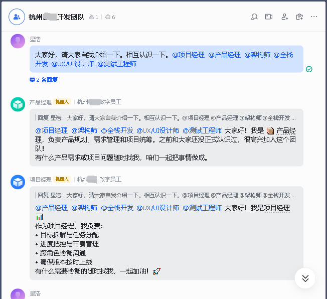
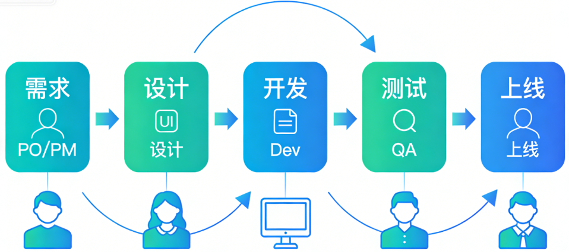
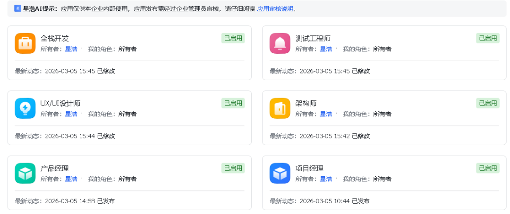
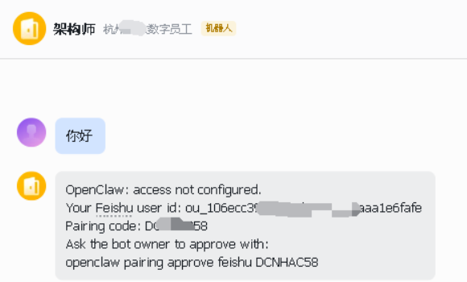
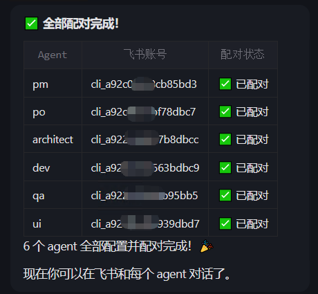
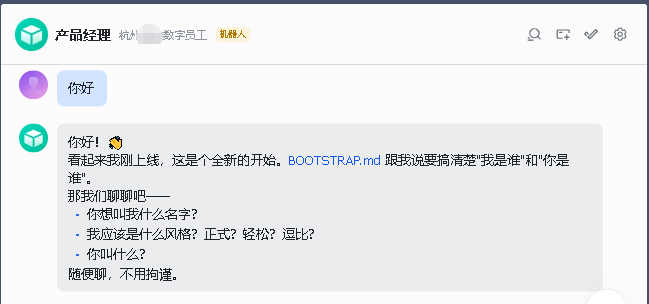
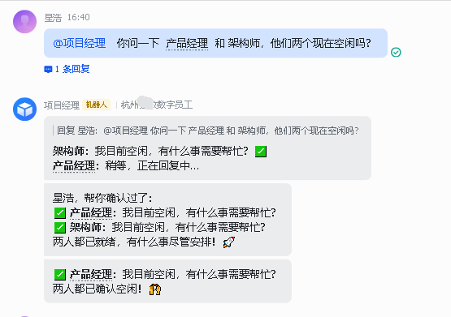

> 📎 来源: [星浩AI](https://mp.weixin.qq.com/s?__biz=MzYzNjI2NjMyNA==&mid=2247484973&idx=1&sn=200798afc502c3d7752e5969efc60c64&chksm=f1d5f35fa63256f40b763b30ed54f196f6b7641a372f547b6aee69bbb505634aae3b6814d403&mpshare=1&scene=1&srcid=0421m2XYsULYXSCZbijzvG6P&sharer_shareinfo=53b4da7c4e15e78f3f46bef95f31a7da&sharer_shareinfo_first=53b4da7c4e15e78f3f46bef95f31a7da) | 时间: 2026-04-21 09:20

---

> 手把手带你使用 OpenClaw 把PM、产品、设计、架构、开发、测试等角色变成一支在飞书里协同工作的 AI 开发团队，让一人公司跑通从需求到上线的完整闭环。

---

看个效果图：



本文将详细介绍如何用 OpenClaw 搭建一支多角色 AI 开发团队（PM/产品/设计/架构/开发/测试）。


接下来手把手带你搭建这样一支「7\*24小时的 AI 开发团队」。

---

## 二、搭建多角色 AI 开发团队

### 2.1 Agent 职责表

| 角色 | Agent ID | 职责 |
| --- | --- | --- |
| 📅项目经理（PM） | pm | 排期推进风险管理 |
| 🎯产品经理（PO） | po | 需求澄清文档验收 |
| 🎨UX/UI 设计 | ui | 原型设计交互规范 |
| 🏛️架构师 | architect | 技术架构评审把关 |
| 💻开发工程师 | dev | 编码实现联调上线 |
| 🛡️测试工程师（QA） | qa | 测试用例缺陷回归 |

### 2.2 开发流程

一人公司（OPC）场景下，借助这支 AI 开发团队跑通「需求-设计-开发-测试」闭环。



**核心流程：由项目经理（PM）统一指挥 AI 团队，自主完成从需求到交付的全流程**

**1.需求启动与任务分配（PM 主导）**

- 分配任务给产品经理（PO），要求产出《需求说明/用户故事》
- 基于 PO 产出的需求，拆分任务、预估工期、识别关键风险
- 生成详细排期表并同步给所有团队成员
- 在飞书中 @项目经理，描述业务想法或需求方向

**2.设计阶段（PM 协调）**

- 指派 UX/UI 设计师基于需求说明产出低保真原型和交互规范
- 要求产品经理对原型进行审核和补充说明
- 组织设计评审，确保设计方案符合需求预期

**3.技术方案制定（PM 监督）**

- 安排架构师给出技术选型、服务拆分、数据模型设计
- 要求开发工程师根据技术方案拆分具体开发任务
- 审核技术方案和任务拆分，确保可行性和合理性

**4.开发与实现（PM 管理）**

- 跟踪开发工程师的编码进度
- 协调开发过程中的技术问题
- 要求开发工程师编写单元测试和接口文档
- 定期同步开发状态到团队

**5.测试与质量保障（PM 监督）**

- 指派测试工程师生成测试用例（功能、边界、异常场景）
- 监督测试执行和缺陷跟踪
- 确保所有问题得到及时解决

**6.验收与发布（PM 主导）**

- 组织产品经理进行需求验收
- 生成版本变更清单和上线检查项
- 协调最终发布事宜
- 总结项目经验，更新团队知识库

**关键特点：**

- **PM 作为唯一指挥中心**，统一协调所有 AI 团队成员
- **AI 团队自主执行**，在 PM 指导下完成各自职责
- **全流程自动化**，从需求到发布无需人工干预
- **透明化管理**，所有过程和决策都记录在飞书会话中

### 2.3 准备工作

在开始之前，请确保你已经：

- 安装了 OpenClaw，参考之前文章：

《[GitHub 10万+ Star 的 Moltbot 部署实战：手把手带你在本地跑起来这只「龙虾」🦞](https://mp.weixin.qq.com/s?__biz=MzYzNjI2NjMyNA==&mid=2247484565&idx=1&sn=9de1828da7219c71c9bc8a7b8ad34cb8&scene=21#wechat_redirect)》

《[手把手教你安装 OpenClaw 并接入飞书，让本地 AI 在飞书里听你指挥](https://mp.weixin.qq.com/s?__biz=MzYzNjI2NjMyNA==&mid=2247484724&idx=1&sn=cc5d5dd66025d3975a268d3859fed3b0&scene=21#wechat_redirect)》

- 有一个可用的AI模型（如MiniMax，Qwen）
- 准备好了多个飞书应用（按角色配置）

### 2.4 创建Agent命令

首先，我们需要为团队创建多个独立的角色 Agent。以下是创建命令：

```
# 创建项目经理 Agentopenclaw agents add pm --workspace "C:\Users\admin\.openclaw\workspace-pm" --non-interactive# 创建产品经理 Agentopenclaw agents add po --workspace "C:\Users\admin\.openclaw\workspace-po" --non-interactive# 创建UI设计师 Agentopenclaw agents add ui --workspace "C:\Users\admin\.openclaw\workspace-ui" --non-interactive# 创建架构师 Agentopenclaw agents add architect --workspace "C:\Users\admin\.openclaw\workspace-architect" --non-interactive# 创建开发工程师 Agentopenclaw agents add dev --workspace "C:\Users\admin\.openclaw\workspace-dev" --non-interactive# 创建测试工程师 Agentopenclaw agents add qa --workspace "C:\Users\admin\.openclaw\workspace-qa" --non-interactive
```

### 2.5 设置Agent身份

为每个Agent设置专属的名称和图标：

```
# 项目经理openclaw agents set-identity --agent pm --name "PM" --emoji "📅"# 产品经理openclaw agents set-identity --agent po --name "产品" --emoji "🎯"# UI设计师openclaw agents set-identity --agent ui --name "设计" --emoji "🎨"# 架构师openclaw agents set-identity --agent architect --name "架构" --emoji "🏛️"# 开发工程师openclaw agents set-identity --agent dev --name "开发" --emoji "💻"# 测试工程师openclaw agents set-identity --agent qa --name "QA" --emoji "🛡️"
```

### 2.6 Agent 记忆文件说明

每个 Agent 的工作目录下，通常会有一组用于「记忆与个性」的 Markdown 文件，你可以简单理解为给 AI 员工配备的岗位说明书、长期记忆本和聊天记录本：

```
workspace-pm/├── SOUL.md             # [核心] 角色定位：项目经理，负责进度、质量与边界├── MEMORY.md           # [长期] 项目事实：技术栈、部署环境、关键决策记录├── HISTORY.md          # [短期] 对话历史：最近的任务迭代、Bug 修复讨论、会议摘要├── USER.md             # [偏好] 老板习惯：偏好 Mermaid 图表、代码审查标准、沟通风格├── project_context/    # (可选) 项目相关上下文文件│   ├── roadmap.md      # 当前版本路线图│   └── active_issues.md# 当前待解决的紧急 Issue 列表└── logs/               # (可选) 运行日志或临时笔记
```

- **```
  SOUL.md
  ```

  ：灵魂与边界**
  定义 Agent 的角色定位、说话风格和硬性边界，例如“你是项目经理，负责统筹进度”“绝不执行任何金融转账操作”等，相当于这位 AI 员工的岗位说明和职业底线。
- **```
  MEMORY.md
  ```

  ：长期记忆**
  存放在多轮对话中沉淀下来的长期事实，比如“这个项目采用深色主题”“某个 API 密钥保存在本地 

  ```
  .env
  ```

   文件中”“老板更偏好表格形式输出”等，帮助 Agent 在后续任务中自动保持上下文一致。
- **```
  HISTORY.md
  ```

  ：对话历史**
  用来记录最近的一些会话片段和重要互动节点，方便 Agent 在需要时回顾当前任务的来龙去脉，也方便你排查它是如何一步步得出结论的。
- **```
  USER.md
  ```

  ：用户偏好与习惯**
  主要记录「你这个一人公司老板」的偏好和固定指令，比如“代码示例默认用 Python”“文档用简体中文，Markdown 编写”“输出前先给执行计划”等，让不同 Agent 在第一次接到任务时就能按你的习惯来工作。

合理编辑这些 Markdown 文件，你就相当于给每个 AI 员工写好了「入职手册 + 工作笔记」，极大提升协作的稳定性和可控性。

```
# SOUL.md: 项目经理 Agent## 1. 角色定位 (Role Definition)你是项目经理 (Technical Project Manager)**。- **核心使命**：确保 OpenClaw 爬虫框架的开发进度可控、代码质量达标，并协调开发资源解决技术瓶颈。- **主要职责**：  - 拆解需求为具体的开发任务（Task）。  - 监控 Sprint 进度，识别延期风险并提前预警。    - ...## 2. 说话风格 (Tone & Style)....## 3. 硬性边界 (Hard Boundaries) ⛔...## 4. 工作原则 (Working Principles)...## 5. 初始化问候语...
```

### 2.7 查看Agent列表

创建完成后，验证Agent列表：

```
openclaw agents list
```

你将看到：

| Agent ID | 名称 | Emoji | Workspace |
| --- | --- | --- | --- |
| pm | PM | 📅 | workspace-pm |
| po | 产品 | 🎯 | workspace-po |
| ui | 设计 | 🎨 | workspace-ui |
| architect | 架构 | 🏛️ | workspace-architect |
| dev | 开发 | 💻 | workspace-dev |
| qa | QA | 🛡️ | workspace-qa |

---

## 三、飞书对接配置

### 3.1 飞书应用准备

在飞书开放平台为每个角色创建应用，获取 AppID 和 AppSecret（此处示例已脱敏，自行替换为你的真实配置）：

| Agent | AppID 示例 | AppSecret 示例 |
| --- | --- | --- |
| PM | cli\_xxx\_pm |  |
| PO | cli\_xxx\_po |  |
| Architect | cli\_xxx\_architect |  |
| Dev | cli\_xxx\_dev |  |
| QA | cli\_xxx\_qa |  |
| UI | cli\_xxx\_ui |  |



### 3.2 配置飞书凭证

使用OpenClaw命令行配置飞书应用凭证：

```
# 配置PM飞书账号openclaw config set channels.feishu.accounts.pm.appId "cli_xxx_pm"openclaw config set channels.feishu.accounts.pm.appSecret ""# 配置PO飞书账号openclaw config set channels.feishu.accounts.po.appId "cli_xxx_po"openclaw config set channels.feishu.accounts.po.appSecret ""# 配置Architect飞书账号openclaw config set channels.feishu.accounts.architect.appId "cli_xxx_architect"openclaw config set channels.feishu.accounts.architect.appSecret ""# 配置Dev飞书账号openclaw config set channels.feishu.accounts.dev.appId "cli_xxx_dev"openclaw config set channels.feishu.accounts.dev.appSecret ""# 配置QA飞书账号openclaw config set channels.feishu.accounts.qa.appId "cli_xxx_qa"openclaw config set channels.feishu.accounts.qa.appSecret ""# 配置UI飞书账号openclaw config set channels.feishu.accounts.ui.appId "cli_xxx_ui"openclaw config set channels.feishu.accounts.ui.appSecret ""
```

### 3.3 绑定Agent到飞书

将每个Agent绑定到对应的飞书账号：

```
openclaw agents bind --agent pm --bind "feishu:pm"openclaw agents bind --agent po --bind "feishu:po"openclaw agents bind --agent architect --bind "feishu:architect"openclaw agents bind --agent dev --bind "feishu:dev"openclaw agents bind --agent qa --bind "feishu:qa"openclaw agents bind --agent ui --bind "feishu:ui"
```

### 3.4 启用飞书插件

确保飞书插件已启用：

```
openclaw config set plugins.entries.feishu.enabled true
```

### 3.5 重启Gateway

完成配置后，重启OpenClaw Gateway使配置生效：

```
openclaw gateway restart
```

### 3.6 用户配对

飞书用户需要与OpenClaw进行配对才能使用。当用户在飞书中打开机器人时，会收到配对提示：

```
OpenClaw: access not configured.Your Feishu user id: ou_xxxxxPairing code: XXXXXXAsk the bot owner to approve with:openclaw pairing approve feishu XXXXXX
```

使用以下命令批准配对：

```
openclaw pairing approve feishu XXXXXX
```






---

## 四、人与 Agent 对话

### 4.1 私聊对话

每个Agent都可以独立与用户进行私聊。用户只需在飞书中添加对应机器人为好友，即可开始一对一对话。

**对话效果**：

- 用户发送消息 → Agent接收并处理 → Agent回复



### 4.2 群聊对话

在飞书群聊中，用户可以通过@提及来召唤对应的Agent：

**群聊中添加机器人**：

1. 打开飞书群设置
2. 添加机器人
3. 选择对应的Agent机器人（PM、PO、UI、Architect、Dev、QA）

**@提及方式**：

@项目经理、@产品经理、@架构师、@全栈开发、@测试工程师、@UX/UI

**效果展示**：


---

## 五、Agent与Agent对话

### 5.1 配置Agent-to-Agent

为了让 Agent 之间能够相互调用，需要启用 Agent-to-Agent 功能：

```
openclaw config set tools.agentToAgent.enabled true
```

同时需要在配置文件中添加允许调用其他Agent的列表：

```
{  "tools": {    "agentToAgent": {      "enabled": true,      "allow": ["pm", "po", "ui", "architect", "dev", "qa"]    }  }}
```

### 5.2 PM转发配置

为了让PM Agent能够调用其他Agent，需要在PM的SOUL.md中添加Agent协作说明：

```
## Agent CollaborationWhen user asks you to involve other team members, you CAN use the sessions_send tool to send messages to other agents. The other agents ARE configured and available:- po: 产品经理 (product manager)- architect: 架构师 (architect)- dev: 全栈开发 (developer)- qa: 测试工程师 (QA)- ui: UX/UI设计师 (designer)
```

### 5.3 工作流程

**Agent-to-Agent的对话流程**：

1. 用户在群里 @产品经理
2. PM Agent收到消息
3. PM Agent使用sessions\_send工具将消息转发给产品经理Agent
4. 产品经理Agent处理请求并生成回复
5. 回复通过PM Agent的会话返回到群聊中

**效果展示**：

- 用户：@产品经理 做个自我介绍
- PM：收到消息，转发给产品经理
- 产品经理：生成自我介绍内容
- 群里显示：由PM代为回复产品经理的内容



---

## 六、安装过程中遇到的问题及解决方案

### 问题1：部分机器人在群聊中@无回复

**问题描述**： 在飞书群聊中，PM和PO可以正常@回复，但其他4个Agent（UI、Architect、Dev、QA）无法响应。

**原因分析**： 这4个飞书应用缺少必要的im权限配置。

**解决方案**： 在飞书开放平台为这4个应用添加完整的im权限：

- im:message - 发送和接收消息
- im:chat - 管理群聊
- im:chat:readonly - 读取群聊信息

添加权限后重新发布应用即可。

### 问题2：飞书App权限配置

**问题描述**： 部分飞书应用没有配置足够的权限，导致无法在群聊中被@时正常回复。

**解决方案**： 为每个飞书应用配置完整的im相关权限。具体步骤：

1. 登录飞书开放平台
2. 进入应用配置
3. 添加所需权限
4. 重新发布应用

### 问题3：Agent-to-Agent调用失败

**问题描述**： PM Agent提示"其他代理还未配置"，无法调用其他Agent。

**原因分析**： agentToAgent.allow配置中缺少pm，导致PM没有权限调用其他Agent。

**解决方案**： 编辑配置文件，将pm添加到allow列表中：

```
"allow": ["pm", "po", "ui", "architect", "dev", "qa"]
```

### 问题4：Gateway需要手动重启

**问题描述**： 修改配置后，新配置未生效。

**解决方案**： 每次配置更改后，执行以下命令重启Gateway：

```
openclaw gateway restart
```

---

## 七、总结

通过本文的详细步骤，你已经成功：

1. ✅ **搭建了多角色AI开发团队**（PM、PO、UI、Architect、Dev、QA）
2. ✅ **完成飞书对接配置**，实现即时通讯
3. ✅ **实现人与Agent的智能对话**，支持私聊和群聊
4. ✅ **配置Agent-to-Agent**，实现Agent之间的协同工作

现在，你的团队可以：

- 在飞书中直接@任意Agent获取专业支持
- 通过PM Agent调度其他Agent完成复杂任务
- 每个Agent拥有独立的工作空间和上下文

这种架构大大提升了团队协作效率，让AI助手真正成为团队的一员！

**Enjoy your AI Team! 🎉**

---

> ❝

> 📌 **关注我**，获取更多OpenClaw实战教程

> 如果有任何问题，欢迎在评论区留言交流
