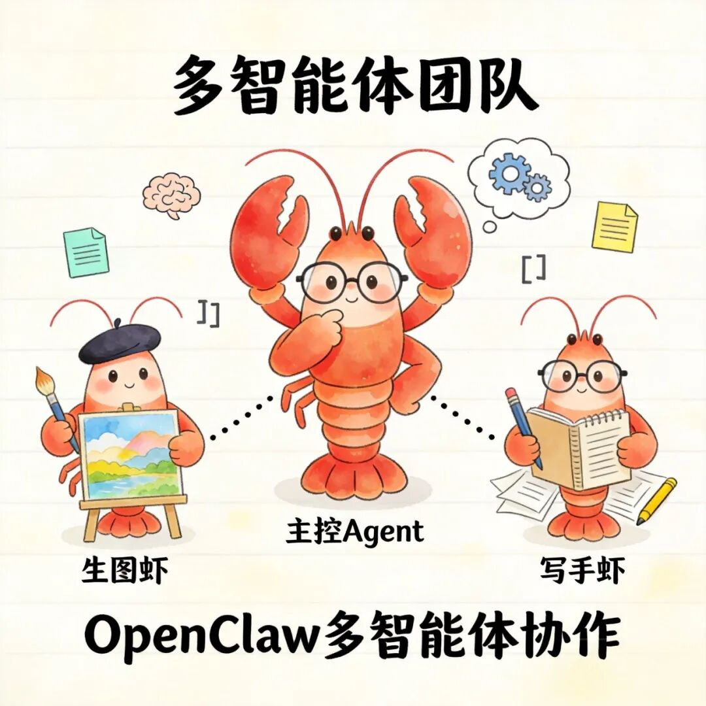
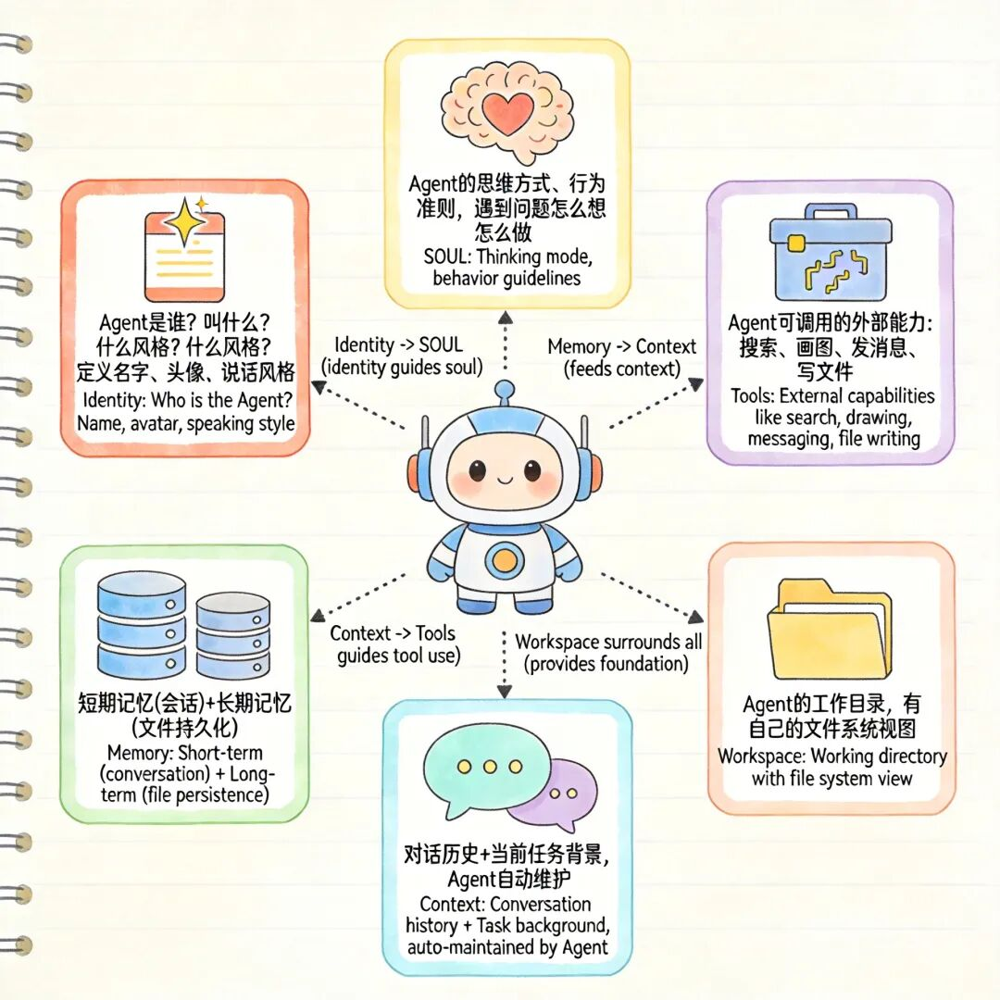
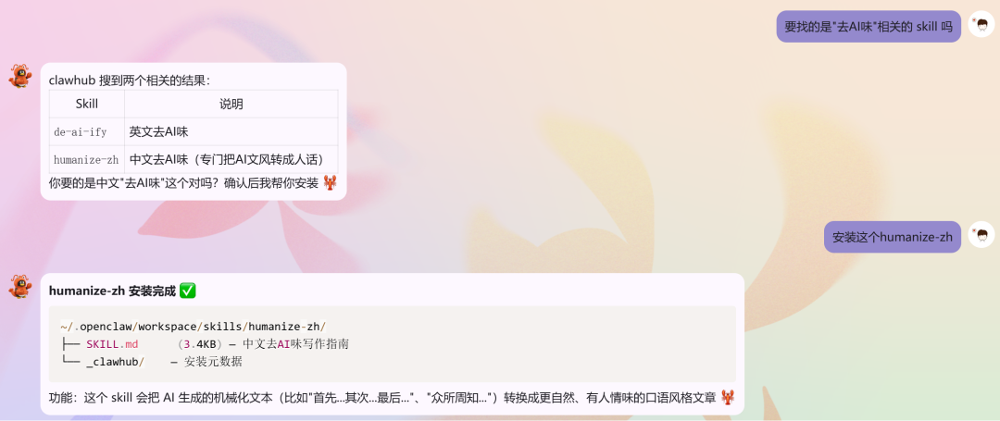
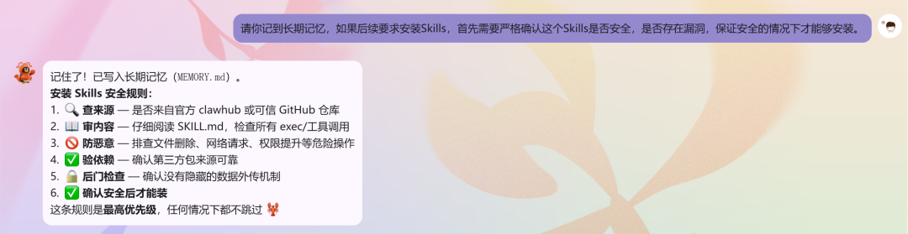
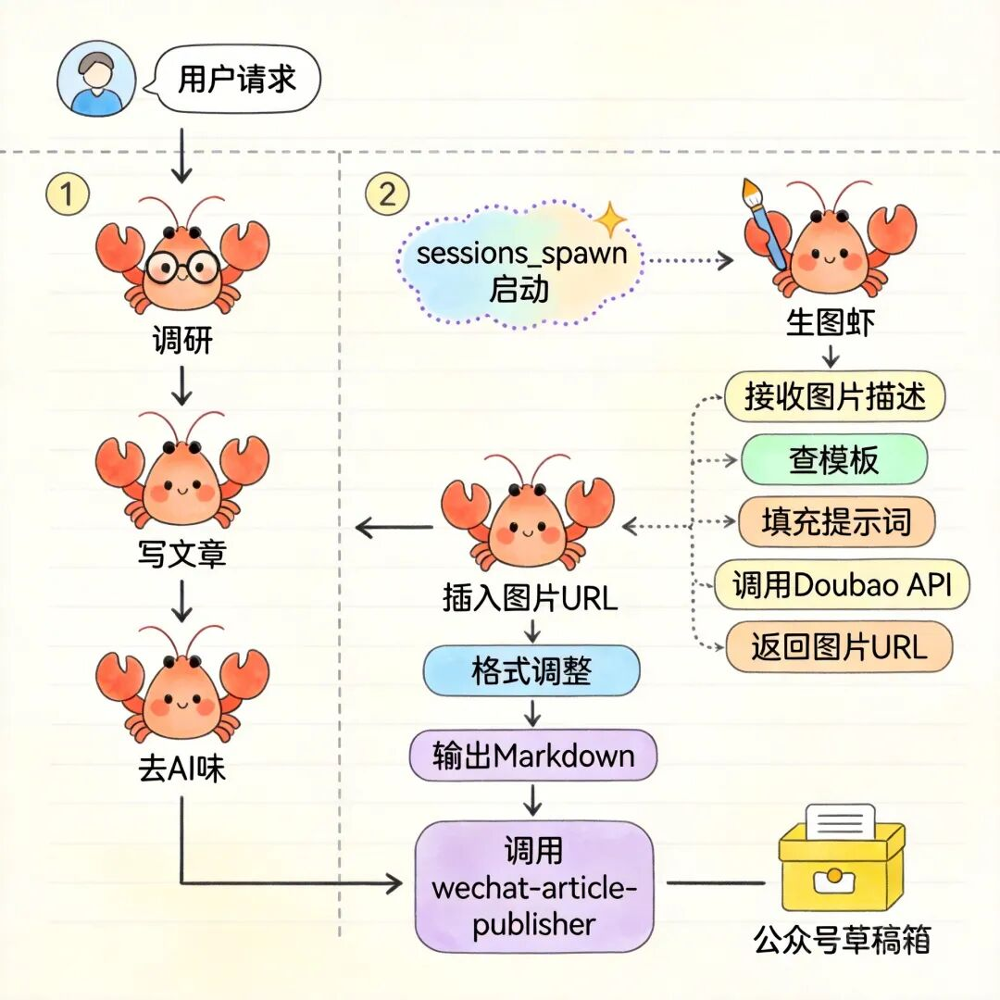

> 📎 来源: [数智札记](https://mp.weixin.qq.com/s?__biz=Mzg5Mjc1MDg4Ng==&mid=2247483979&idx=1&sn=e49a301a7a6725007b303a7f59877376&chksm=c19946ebfe7e2f8f9d063008d90746b8aa0b68d6ccf68a322ae22f59bc5b089a3e78abd54bbd&mpshare=1&scene=1&srcid=0420N8kD8GAiWxG3IV5WuZKM&sharer_shareinfo=78cf2d26cec52350558158c6effd8bff&sharer_shareinfo_first=78cf2d26cec52350558158c6effd8bff) | 时间: 2026-04-20 19:16

---



当我让一个 Agent 帮我写文章，它悄悄调动了另外一个 Agent 帮我画图——这就是我今天用 OpenClaw 搭建的多智能体团队。

01

一个 Agent 包含哪些核心要素？

在实操 OpenClaw 创建 Agent 之前，先搞清楚一个问题：一个 AI Agent 到底由什么组件？



1. 身份（Identity）

Agent 是谁？叫什么？什么风格说话？这部分对应 OpenClaw 中的 `IDENTITY.md`。

2. 灵魂（SOUL）

Agent 的思维方式、行为准则、专业能力范围。`SOUL.md` 定义了它"遇到问题怎么想、怎么做"。

3. 工具（Tools）

Agent 能调用哪些工具？搜索、画图、发消息、写文件……对应 OpenClaw 中的 Skills（技能）。

4. 记忆（Memory）

Agent 需要记住什么？短期靠会话，长期靠文件。对应 `MEMORY.md` 和 `memory/` 目录。

5. 上下文（Context）

每次对话的历史、当前任务的背景信息。OpenClaw 会自动维护会话上下文。

6. 执行环境（Workspace）

Agent 的工作目录，有自己的文件系统视图。

03

OpenClaw 中 Agent 的具体构成

OpenClaw 的 Agent 结构非常清晰。每个 Agent 就是一个目录，以我创建的\*\*生图虾\*\*（`draw`）为例：

```
~/.openclaw/agents/draw/
```

关键文件的作用：

|  |  |
| --- | --- |
| 文件 | 作用 |
| IDENTITY.md | 定义 Agent 的名字、头像、说话风格 |
| SOUL.md | 定义 Agent 的专业能力、工作流程、行为规范 |
| AGENTS.md | 工作区的 AI 团队宪章 |
| skills/ | 技能目录，存放可复用的工具包 |

全局配置文件：

`~/.openclaw/openclaw.json` 也很重要，里面定义了：

- Agent 列表

- 工具配置（web search、QQ channel 等）

- 插件和扩展

- Gateway 配置

03

OpenClaw Skills 安装方式

在搭建 Agent 之前，先说说怎么安装 Skill（技能）。OpenClaw 的 Skill 可以理解为 Agent 的"工具箱"，让 Agent 具备特定能力。

- 方式一：从 ClawHub 安装（推荐）

[ClawHub](https://clawhub.ai/) 是 OpenClaw 的官方技能市场，找到想要的 Skill 后，一行命令就能安装：

```
npx clawhub@latest install
```

比如安装"中文去AI味"技能：

```
npx clawhub@latest install humanize-zh
```

安装完成后，Skill 会放到 `~/.openclaw/workspace/skills/` 目录下。

- 方式二：手动安装

有时候 ClawHub 访问受限，或者找不到现成的 Skill，可以手动创建：

1. 在 `~/.openclaw/workspace/skills/` 下创建目录

2. 编写 `SKILL.md`，定义技能的功能和使用方式

3. 在 Agent 的 `workspace/skills/` 目录创建链接指向它

比如我的"写手虾"需要访问"去AI味"技能，就在自己的 skills 目录下创建了符号链接：

```
~/.openclaw/agents/article-writer/workspace/skills/
```

- 方式三：龙虾自动安装

除了上面两种方式之外，还可以直接通过对话方式，让龙虾直接安装Skills，比如：



### 安装 Skill 前的安全检查 ⚠️

非常重要：安装任何 Skill 之前，务必先审查它的内容：

1. 查看 `SKILL.md` 里有没有可疑的 exec/shell 命令

2. 确认 Skill 不包含隐藏的数据外传机制

3. 检查依赖声明是否正常（不引入未知第三方包）

4. 确认安全后再安装，切勿盲目安装来源不明的 Skill

你可以直接告诉龙虾，在安装Skills之前，检查Skills的安全性：



04

OpenClaw 如何构建 Agent？

创建 Agent 有三种方式：

- 方式一：命令行（适合快速创建）

```
openclaw agents add <agent-id>\
```

这会在 `openclaw.json` 里注册一个新 Agent，并创建目录结构。

- 方式二：手动配置（适合深度定制）

1. 创建工作目录

```
C:\\Users\\username\\.openclaw\\agents\\draw\\
```

2. 编写 `IDENTITY.md` 和 `SOUL.md`

3. 在 `~/.openclaw/openclaw.json` 的 `agents` 节点注册

```
"agents": {
```

- 方式三：对话创建（最简单，推荐！）

这是最简单的方式——不用记命令，直接用中文告诉小龙虾你想创建什么样的 Agent，它会帮你完成一切。

比如我对它说：

```
"帮我创建一个叫'生图虾'的 Agent，专门负责生成图片，风格包括插画和学术图表"
```

小龙虾就会自动：

1. 创建 Agent 目录结构

2. 编写 `IDENTITY.md`（定义名字、风格）

3. 编写 `SOUL.md`（定义工作流程）

4. 配置好技能目录和链接

5. 告诉你创建完成，可以直接使用

整个过程你只需要说一句话。

这就是我创建"写手虾"的方式——直接告诉主 Agent 我的需求，剩下的全部由它搞定。

05

实战一：创建"生图虾"（图片生成 Agent）

需求：我需要一个专门负责画图的 Agent，输入描述就能生成图片。支持的风格包括：

- 插画风格（二次元）

- 严谨学术三线表风

- 模块化信息卡片流风

步骤 1：创建 Agent

```
openclawagentsadddraw\
```

步骤 2：编写 IDENTITY.md

```
# IDENTITY.md - Who Am I?
```

步骤 3：编写 SOUL.md

核心流程：\*\*先查 prompt-templates 技能 → 填充内容 → 调用 Doubao API 生成图片\*\*

```
## 工作流程
```

步骤 4：配置技能

为了支持多种风格，我创建了一个 `prompt-templates` 技能：

```
~/.openclaw/agents/draw/workspace/skills/prompt-templates/
```

SKILL.md 里定义了三种风格的提示词模板。

以\*\*插画风格\*\*为例：

```
### 1. 插画风格（illustration）
```

当用户说"画一只穿汉服的猫娘，插画风格"，生图虾就把"穿汉服的猫娘"填入 `{A}`，生成完整提示词后调用 API。

步骤 5：配置 Doubao API

在 Agent 工作区创建 `.env` 文件：

```
ARK_API_KEY=你的API密钥
```

06

实战二：创建"写作虾"（文章撰写 Agent）

需求：写作虾要能完成完整的技术文章撰写流水线：

```
需求确认 → 调研(Tavily) → 大纲确认 → 逐节撰写
```

步骤 1：创建 Agent

```
openclaw agents add article-writer\
```

步骤 2：编写 SOUL.md

写作虾的 SOUL.md 是整篇文章的核心。它定义了：

```
**人设**：程序员出身，技术深厚，文笔流畅。
```

步骤 3：配置子 Agent 调用

在~/.openclaw/openclaw.json文件中找到 `article-writer` agent 注册位置，添加 `subagents`：

```
"agents": {
```

写作虾在需要配图时，会通过 `sessions\_spawn` 启动生图虾：

```
```python
```

这就是多 Agent 协作的核心机制。

步骤 4：配置技能链接

写作虾的工作区需要能访问其他技能和 Agent，通过\*\*目录链接\*\*实现：

```
~/.openclaw/agents/article-writer/workspace/skills/
```

07

多 Agent 协作：写作虾是如何调动生图虾的？

这是最有趣的部分。

当你对写作虾说："帮我写一篇 RAG 技术科普文，配几张插图"

写作虾的内部执行流程是这样的：

```
用户请求
```

整个过程无需人工干预。



技术实现上，这种协作依赖 OpenClaw 的几个机制：

1.sessions\_spawn — 在独立 session 中启动子 Agent

2.共享 skills 目录 — 子 Agent 能访问父 Agent 的技能

3.Workspace 文件系统 — 图片 URL 通过文件传递

关注我的公众号：数智札记，一个分享AI/大数据/云原生等技术干货的博客。


