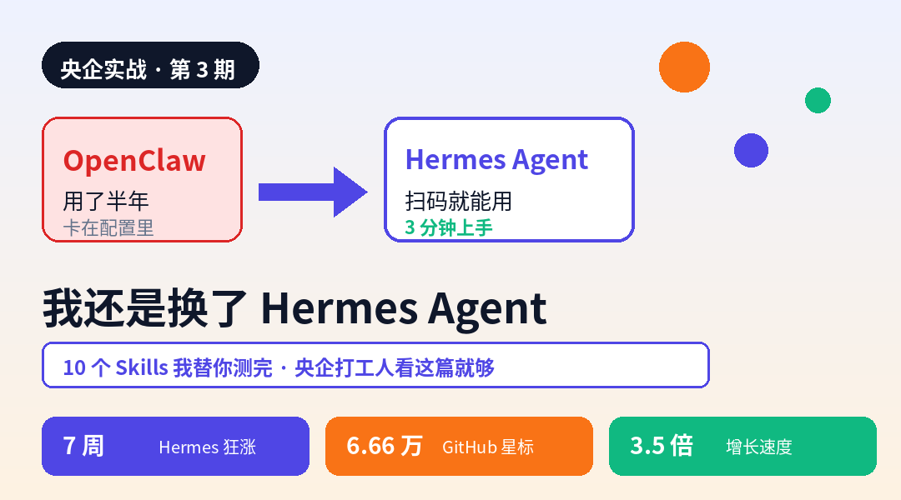
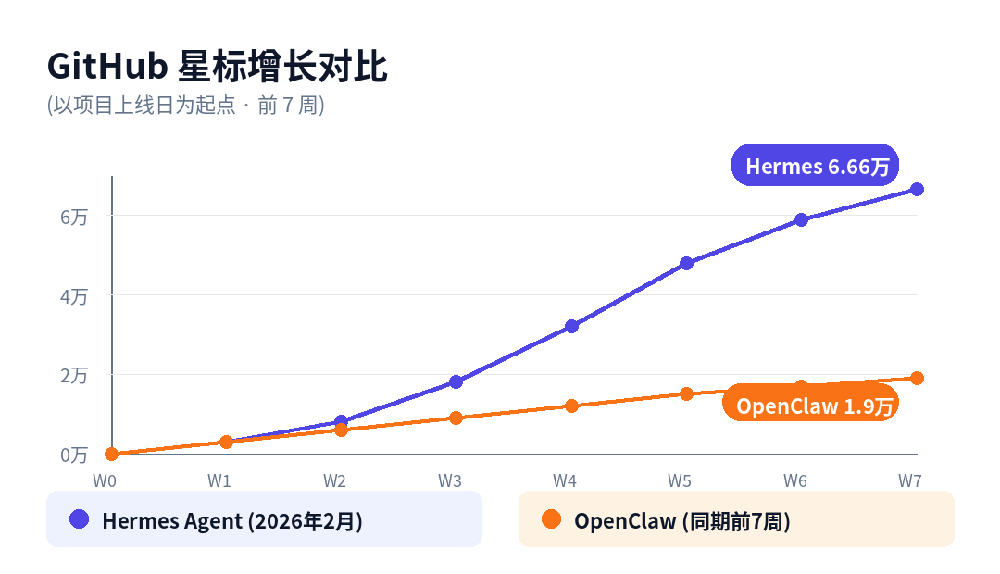
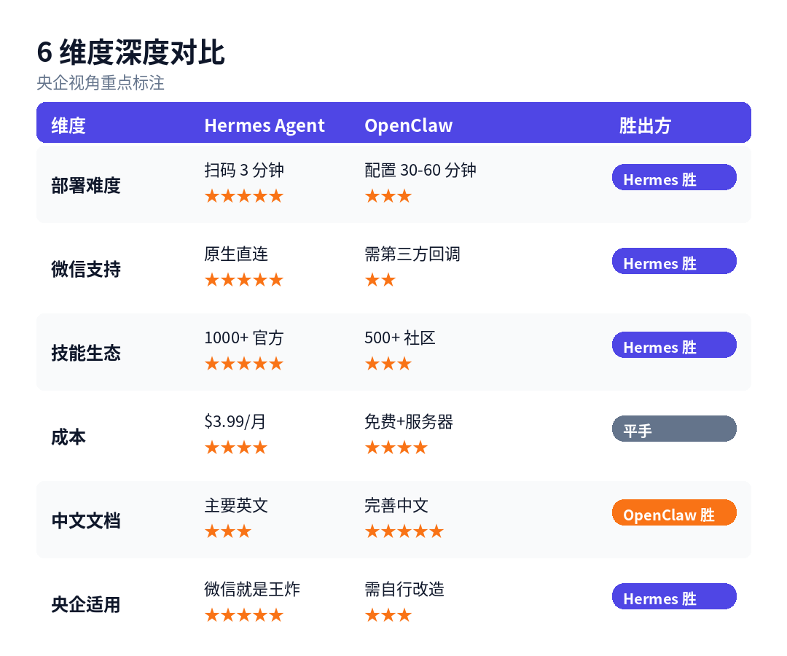
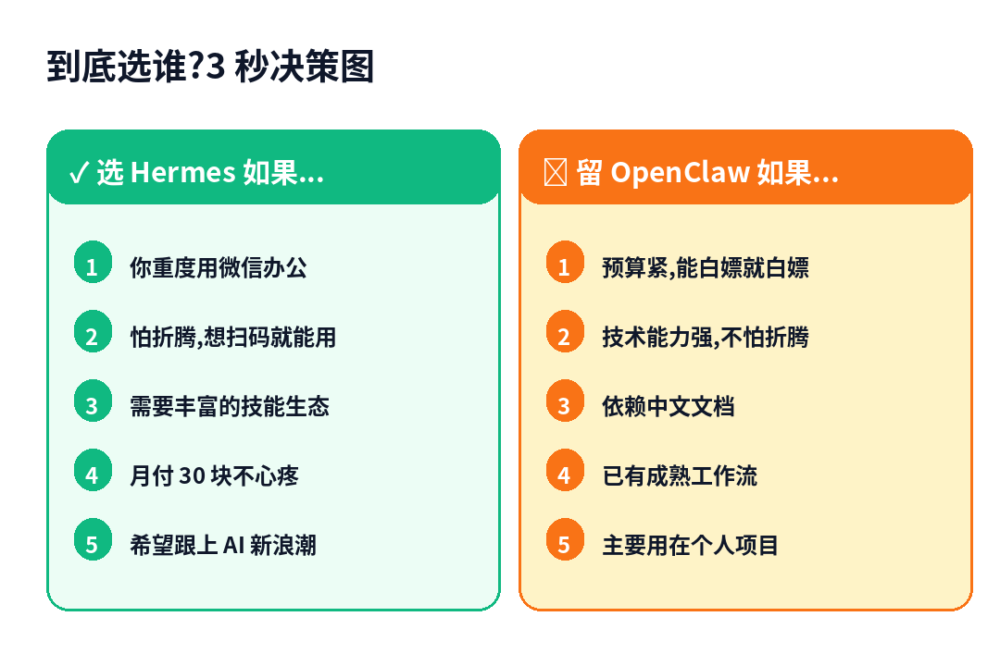

> 📎 来源: [央企AI实验室](https://mp.weixin.qq.com/s?__biz=MzY4OTI0Mzk2MQ==&mid=2247483813&idx=1&sn=fd4555e1f39b4a2762f584544beef7b3&chksm=f2d6f5a16292b72530a7301585e994245cd1685dbb4a50254bc1243dc82607d117d300434903&mpshare=1&scene=1&srcid=0421ChfeuCYwFmuOA6c1g6pz&sharer_shareinfo=cd04f519063470aaa7f7c4d7de47d0d7&sharer_shareinfo_first=cd04f519063470aaa7f7c4d7de47d0d7) | 时间: 2026-04-21 12:02

---

 

Steve 在用 AI  ·  央企人的 AI 实战笔记  

 

先说结论:

|  |
| --- |
| 如果你是央企打工人,以微信办公为核心,建议直接上 Hermes Agent。 |

我从去年开始用 OpenClaw,折腾了半年多,上个月彻底换成了 Hermes Agent。

不是因为 OpenClaw 不好,而是在央企这个场景下,Hermes 实在太顺手。

这篇文章我把 10 个最关键的 Skills 全测了一遍,央企打工人直接照着选就行。

 

|  |
| --- |
| 7 周  Hermes 上线到登顶用时 |

 

|  |
| --- |
| 6.66 万  GitHub 星标数 |

 

|  |
| --- |
| 3.5 倍  Hermes 比 OpenClaw 同期涨得快 |

 

 

 

01 · Hermes 凭什么 7 周就火了?

Hermes Agent 是 2026 年 2 月刚上线的开源项目。

上线 7 周,GitHub 星标 6.66 万,日活用户破 10 万——这个速度在开源圈里属于现象级。

 

|  |
| --- |
| 在中国你能把微信搞定,你就起飞了。  ── X 网友 |

这句话精准说中了 Hermes 的杀手锏。

OpenClaw 要接微信,得折腾半天回调、改第三方接口;

Hermes 扫个码就能用——对央企打工人来说,这就是王炸。

 

|  |
| --- |
| 💡 关键认知  Hermes 是 OpenClaw 原班团队基于反馈做的"本土化特化版",协议 100% 兼容 MCP 标准,现有的 Skills 基本都能平滑迁移。 |

 

 

02 · 6 维度深度对比(央企视角)

我把 6 个关键维度列出来,每个都标了央企场景下的胜出方:

 

重点说 3 点让央企人决策最关键的差异:

 

|  |
| --- |
| ① 微信支持  ·  这是最大的分水岭  央企日常办公,70% 的沟通在微信/企业微信。  Hermes 原生直连,扫码绑定即可自动处理消息。  OpenClaw 必须通过第三方回调,合规上还有隐患。 |

 

|  |
| --- |
| ② 部署难度  ·  别小看这个  Hermes 扫码 3 分钟即用,不需要服务器不需要命令行。  OpenClaw 需要自己配 Python、装依赖、跑命令——央企人未必能搞定。  省下的 30-60 分钟,你可以去写个汇报材料。 |

 

|  |
| --- |
| ③ 成本  ·  别被月付吓到  Hermes  $3.99/月 ≈ 29 元  OpenClaw  免费,但需要自备服务器(50-100 元/月起)  算下来基本一样,Hermes 反而更省心。 |

 

 

03 · 央企必装的 10 大 Skills(我替你测完了)

这 10 个 Skills 是我实测后选出来的,按央企使用频率排序。

每一个都是在真实工作里跑过至少 3 遍才纳入清单的。

 

|  |
| --- |
| 01  微信直连   央企王炸   场景  自动回复微信消息、群聊管理、朋友圈互动  安装  hermes install skill-wechat-connector  效果  扫码绑定后,Agent 直接读取和发送消息,支持群聊 @ 提醒。 |

 

|  |
| --- |
| 02  Gmail / Outlook 一键集成  场景  自动分类邮件、智能回复、日程提取  安装  hermes install skill-gmail-auto  效果  OAuth 授权后自动读邮件,AI 生成回复草稿;Outlook 央企版本兼容。 |

 

|  |
| --- |
| 03  日历同步大师  场景  多平台日历同步、会议自动安排、提醒推送  安装  hermes install skill-calendar-sync  效果  央企人的会议一天 5 场,这个能救命。 |

 

|  |
| --- |
| 04  Notion / 语雀 双向同步  场景  知识库管理、笔记自动整理、数据库更新  安装  hermes install skill-notion-bridge  效果  央企多用语雀,Skill 的国产化支持到位。 |

 

|  |
| --- |
| 05  Obsidian 图谱联动  场景  知识网络可视化、双向链接管理  安装  hermes install skill-obsidian-graph  效果  配合上一篇讲的 MCP,Obsidian 就是你的私人知识库。 |

 

|  |
| --- |
| 06  浏览器自动化  场景  网页数据抓取、自动化操作、信息监控  安装  hermes install skill-browser-automation  效果  政策监控、行业资讯抓取,解放双手。 |

 

|  |
| --- |
| 07  代码执行器  场景  代码调试、数据处理、自动化脚本  安装  hermes install skill-code-runner  效果  央企人用来处理 Excel 数据批量操作,一次省 2 小时。 |

 

|  |
| --- |
| 08  文件管理系统  场景  本地文件操作、云端存储同步  安装  hermes install skill-file-manager  效果  配合 MCP 使用,形成完整的"AI 协作区"。 |

 

|  |
| --- |
| 09  多模型切换器  场景  按需切换 DeepSeek / 豆包 / Kimi / 通义千问  安装  hermes install skill-model-switcher  效果  国产模型全兼容,央企合规要求的自主可控一步到位。 |

 

|  |
| --- |
| 10  GUI 图形界面  场景  可视化操作、拖拽式配置  安装  hermes install skill-gui-desktop  效果  不喜欢命令行的央企人必装,点点鼠标就能搞定一切。 |

 

 

04 · OpenClaw 用户 5 步无痛迁移

如果你是 OpenClaw 老用户,跟我一样想迁过来——

5 步搞定,数据 0 丢失。

 

|  |
| --- |
| 迁移前准备  ·  5 分钟搞定  1. 备份 OpenClaw 配置(~/.openclaw/config.json)  2. 导出已安装的 Skills 清单  3. 记录关键参数(API Key、回调地址)  4. 注册 Hermes 账号(7 天免费试用,不用先付费) |

 

▍ Step 1:注册 Hermes 账号

访问 hermes-agent.dev,用 GitHub 或邮箱注册。

央企邮箱可以直接注册,不需要翻墙。

▍ Step 2:导入 OpenClaw 配置

官方提供了一键迁移工具:

|  |
| --- |
| git clone https://github.com/hermes-agent/migration-tool.git  cd migration-tool  python migrate.py --from openclaw --to hermes |

跑完会自动生成 Hermes 版配置文件,Skills 会自动匹配对应版本。

▍ Step 3:批量装核心 Skills

一条命令装完上面列表里的前 5 个:

|  |
| --- |
| hermes skills bulk-install \    skill-wechat-connector \    skill-gmail-auto \    skill-calendar-sync \    skill-notion-bridge \    skill-code-runner |

▍ Step 4:微信绑定测试

在 Hermes 桌面客户端点击"绑定微信",扫码登录。

发一条测试消息,看 Agent 能否正确响应。

▍ Step 5:双跑 1 周,再完全切换

不建议直接砍掉 OpenClaw。

双跑 1 周:重点工作流都在 Hermes 跑,OpenClaw 保留作为备份,1 周后再做决定。

 

|  |
| --- |
| 常见疑问 FAQ  Q  数据会丢吗?  A  不会,迁移脚本完整导出导入。     Q  微信绑定复杂吗?  A  扫码 30 秒搞定,不需要企业认证。     Q  多花的 $3.99 值吗?  A  按你每月多出的时间算,几块钱买不亏。 |

 

 

05 · 到底选谁?3 秒决策

如果你只看一张图决定——看下面这张。

 

▍ 我的真实建议:双修方案

|  |
| --- |
| 央企打工人的最佳实践  主力  Hermes Agent  →  微信办公、日常自动化、周报月报  备用  OpenClaw  →  特定 Skills(中文文档深度需求)、测试环境     这样做的好处:  · 享受 Hermes 的扫码即用  · 保留 OpenClaw 的中文生态  · 两边都不用完全放弃 |

 

 

06 · 央企人装 Hermes 必守的 3 条红线

Hermes 好用,但央企场景下有 3 条红线不能碰:

 

|  |
| --- |
| 红线 1  ·  涉密业务不上云  Hermes 是 SaaS 模式,核心数据走境外服务器。  任何涉密业务坚决不用 Hermes,该用内网就用内网。 |

 

|  |
| --- |
| 红线 2  ·  微信绑定只用个人号  千万别绑工作微信,尤其是对客户/领导的那个号。  建议专门开一个"AI 助手号",只处理非敏感任务。 |

 

|  |
| --- |
| 红线 3  ·  付费前确认单位报销政策  $3.99/月 看起来不多,但央企报销流程你懂的。  建议自费试用,等跑出效果后再申请报销。 |

 

 

07 · 总结:一张图记住关键决策

整篇文章浓缩成 3 句话:

 

01  微信重度用户  ──  直接上 Hermes,扫码就能用

02  预算敏感 + 技术强  ──  留 OpenClaw,自建也不错

03  央企打工人最优解  ──  双修方案,Hermes 主打 + OpenClaw 备用

 

看完对比,下一步你会想:

|  |
| --- |
| 2026 年有哪些 AI Skills 真的能让效率翻倍?不要概念,只要实测数据。 |

你在哪一步?留言告诉我

读到这里,告诉我你是哪一种,我会优先解答你的问题:

 

A  还在观望  ──  两个都没用过

B  OpenClaw 用户  ──  在考虑要不要迁

C  Hermes 新手  ──  装了但没跑通

D  双修党  ──  两个都用,想交流

 

评论区扣字母,我会挑高频问题重点回答。

 

|  |
| --- |
| Steve 在用 AI  ·  央企人的 AI 实战笔记  海外硕士  ·  央企在职  ·  只写亲自跑过的方法  不追热点  ·  不卖焦虑  ·  不推没用过的工具  关注我,把你的 AI 提效之路,缩短 6 个月。 |

 

#Hermes Agent  #OpenClaw  #AI Agent对比  #MCP  #央企AI  #DeepSeek  #央企打工人  #AI工具测评  #微信AI  #Skills
