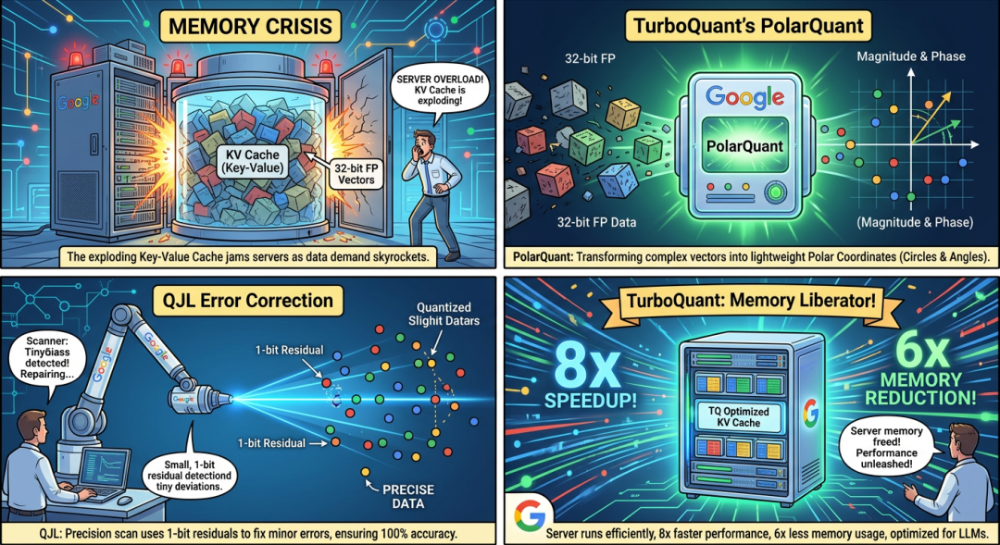

> 📎 来源: [克拉克说](https://mp.weixin.qq.com/s?__biz=MzI4MTAzOTQ5OQ==&mid=2648246501&idx=1&sn=4c80fdea0595b128a616e63da589835c&chksm=f25fa038bc02691e52ac3a611f5643de2856d58b1338daf49e27be66841e825af64a1b4a46d4&mpshare=1&scene=1&srcid=0420fxqFxKPZTO8Lg2kAylzQ&sharer_shareinfo=f67b22af82a02d24a5a1fe4841b5ad00&sharer_shareinfo_first=f67b22af82a02d24a5a1fe4841b5ad00) | 时间: 2026-04-20 19:39

---

随着 2026 年 3 月 22 日 OpenClaw V2026.3.22 版本的发布，小龙虾的服务框架正式进入了模块化时代。其实，相当于传统的Coze、ADP、Dify来对比，如何进一步让OpenClaw来创建、连接和使用本地/云端的RAG，成为小龙虾是否进一步用户的关键。今天，我试着对比分析基于 OpenClaw 加载本地知识库的三种主流方法，至于优劣，留给各位看官评说。

# 方法一：轻量化之王——QMD插件模式

QMD （Quick Memory Database）是目前 OpenClaw 生态中最受欢迎的本地知识加载方式。它不要求你安装沉重的数据库软件，而是通过 WASM 技术直接在本地运行。它采用了“双重检索”机制：先用 BM25（关键词匹配） 抓准术语，再用 语义向量（Embedding） 理解语境。

1. 无需配置服务器，SDK 级集成，即插即用。端侧友好
2. 对于搜索特定的代码函数名或专业术语，关键词匹配比纯向量搜索更准。
3. 配合最新的 TurboQuant 压缩算法，即便在 16GB 内存的笔记本上也能流畅检索百万字文档。你还别说，Google的TurboQuant有点东西，读不懂，反正看起来很强大。

QMD优点突出的同时缺点也会突出：当文档量突破千万级（别问我怎么知道的，有Technical Report）时，检索性能会有明显抖动。

# 方法二：OldFasion：主流向量数据库（如 Chroma/Milvus等各种Vector DB或者ES向量化插件）

企业级应用的首选，老套的向量数据库，说实话。因为向量数据库还是有些贵了！通过 OpenClaw 的 storage-v2 接口，将本地文档全量向量化后存入专门的向量数据库中。可以达到1024维甚至更高的维度，当然这里不同的Embedding技术效果也不是一样。

1. 支撑千万级甚至亿级数据量毫无压力。多维过滤
2. 支持复杂的元数据过滤（例如：只查“2025年以后”且“标签为技术类”的文档）。

贵不是它的缺点，是我的！相对QMD而言维护成本高。

1. 需要额外运行数据库（云）服务，对硬件资源有一定要求。语义偏移
2. 如果 Embedding 模型选得不好，可能会搜出一些“神似形不似”的废话。中文推荐BGE- M3

# 方法三：智慧之网——Mem0g（Graph RAG）知识图谱模式

Mem0是2026 年最前沿的玩法，不再把文档看作一段段文字，而是提取其中的实体（人名、项目名、技术点）及其关系（属于、开发了、依赖于）。它将 RAG 从“搜答案”提升到了“推逻辑”的高度。

优势分析：逻辑推理强

1. 能回答“A 项目的技术选型是如何影响 B 项目进度的？”这种跨文档的复杂问题。长效一致性
2. 知识点之间有连线，不容易出现幻觉。

劣势分析：构建极慢（所谓知易行难）

1. 将文档转化为图谱需要消耗大量 Token 进行预处理。使用门槛高
2. 需要对知识建模有一定理解。

总结：

如果你是个人开发者或学生，想让 OpenClaw 帮你看论文、写周报，QMD 是不二之选。它轻巧、免费且足够聪明。

如果你正在构建企业知识中台，面对的是 TB 级的 PDF 和扫描件，请果断拥抱 VectorDB(欢迎使用腾讯云向量数据库或者ES），稳定性才是第一生产力。

如果你需要智能体扮演 “首席架构师”或“战略顾问”，需要它在复杂的因果关系中抽丝剥茧，那么请尝试 Mem0，尽管它贵且慢，但它提供的逻辑深度是前两者无法企及的。

结语：

随着 TurboQuant 等压缩技术的普及，未来的趋势是“混合 RAG”\*——用 QMD 做本地快速召回，用 Mem0g 做深度逻辑关联。OpenClaw 的这只“龙虾”正变得越来越有深度，也越来越懂你的本地数据。
