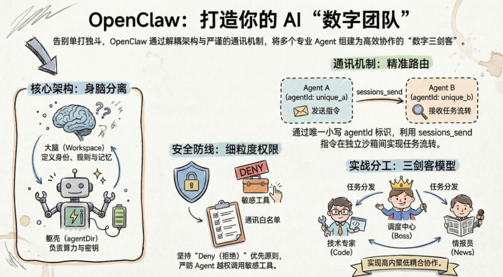
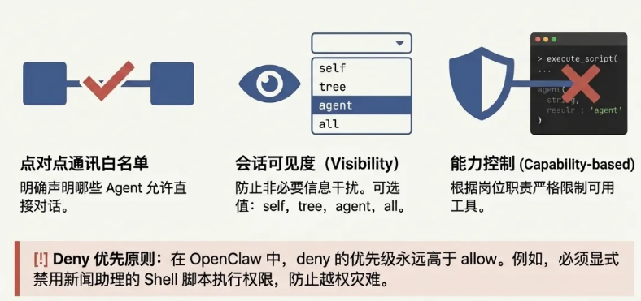
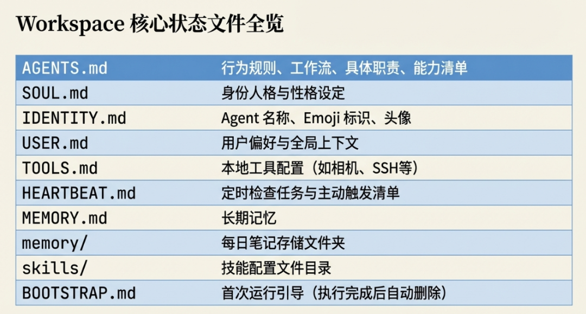
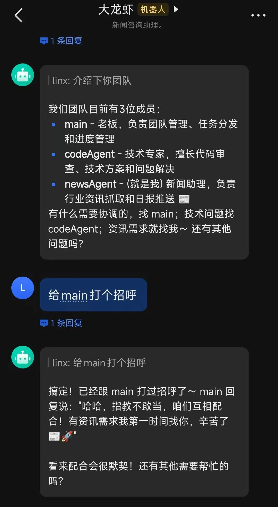
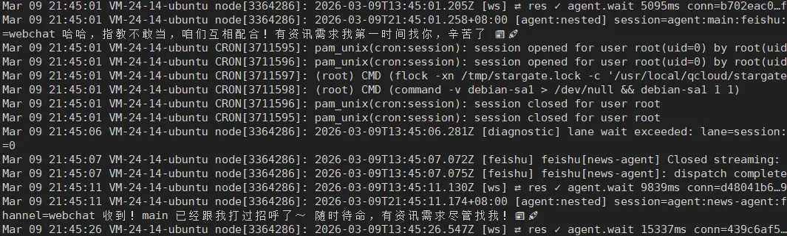

> 📎 来源: [码农Linx](https://mp.weixin.qq.com/s?__biz=MzI3MzQ3NDMzNw==&mid=2247484718&idx=1&sn=5a3339b6c51d87711a3806a9eaa337d4&chksm=ea6df0e255b4f17c1cde14da95d92b9c53ccbd61342b41d6a18975c29864740bf8b9696c66c0&mpshare=1&scene=1&srcid=0423Sf0x1CWbbq9RyFOum2Ac&sharer_shareinfo=24abf27c6cd99db6b4bbbb610bcbf1f3&sharer_shareinfo_first=24abf27c6cd99db6b4bbbb610bcbf1f3) | 时间: 2026-04-23 13:07

---

在构建复杂的 AI Workflow 时，依赖单一的大模型或单一的 Agent，通常难以兼顾不同领域的专业性。上下文一长，AI 就容易“失忆”或“越界”。趋势必然是**多 Agent 协同作业（Multi-Agent）**——让负责调度的“老板”、负责写代码的“技术专家”和负责搜集信息的“情报员”各司其职，通过标准的协议进行串联、并联。



上篇文章我们介绍了多Agent的配置与接入，这里将拆解 OpenClaw 的多 Agent 协作机制，将上篇文章所创建的三个Agent，组建成为一支“数字”团队。文本使用的OpenClaw版本为：v2026.3.1。

**注意，这里使用的是点对点平级的Agent，不是主从/派生Agent。** 不适合一个公司一个 Gateway 多用户共用的情况，可能会有数据泄露的情况。

## 1 | 核心协作机制：Agent 们是如何沟通的？

在 OpenClaw 中，Agent 之间的通讯并非黑盒，而是建立在极其严谨的**会话隔离（Session Isolation）与分发机制**之上，从根本上杜绝了信息串扰。

- **唯一标识符（agentId）**：定义 Agent 时，必须确保所有的 

  ```
  agentId都是小写（例如：code-agent, news-agent, main），这是系统精准路由请求、建立独立上下文队列的基础。
  ```
- **指令流转路径**：当你向 Agent X 下达复杂任务时，X 会通过内置工具 

  ```
  sessions_send唤起专业的 Agent T 协助。Agent T 在自己的“独立沙箱”中完成工作流后将结果返回，最后由 Agent X 汇总交付。
  ```
- **会话隔离与穿透**：默认情况下，每个 Agent 处于绝对的上下文隔离中，只关注自己的目标。如果调度者需要跨 Agent 查看历史会话，必须通过 

  ```
  sessions_spawn或 sessions_history 工具显式调用。
  ```

## 2| 权限边界与安全隔离

在多 Agent 协作的架构中，越权调用（比如让新闻助理拥有执行 Shell 脚本的权限）可能会带来灾难性的安全风险。OpenClaw 提供了细粒度的能力控制方案（Capability-based permissions）



**1. 开启点对点通讯白名单** 我们需要明确告知系统，哪些 Agent 允许直接对话。在配置中定义通讯白名单：

```
"tools":{"agentToAgent":{  "enabled":true,  "allow":["code-agent","news-agent","main"] }}
```

**2. 设定会话可见度（Session Visibility）** 为了防止非必要的信息干扰，可以控制 Agent 是否能“偷听”全局对话：

```
"tools":{ "sessions":{ "visibility":"all"//agent仅可见自身会话，设置为 "all" 则全局可见  }}
```

**3. 严格的工具权限控制（Deny 优先原则）** 根据岗位职责限制 Agent 能使用的工具。**注意：在 OpenClaw 中，

```
deny
```

 的优先级永远高于 

```
allow
```

。** 例如，“新闻资讯助理”只需要查阅和发送消息，必须明确禁用其系统操作权限：

```
{  "id":"news-agent",  "name":"新闻资讯助理",  "tools":{    "allow":["sessions_list","sessions_send","read"],    "deny":["write","edit","exec","apply_patch","bash"]  }}
```

## 3| 内外兼修的解耦架构：身体与大脑

OpenClaw 将 Agent 的“物理运行环境”与“灵魂认知记忆”做了彻底的解耦。这种计算与状态分离的设计，使动态扩展多 Agent 变得非常轻量。每个 Agent 实体由两部分核心目录构成：

### 🛠 一、 agentDir (物理配置层 - Body)

**默认路径：**

```
~/.openclaw/agents//agent/
```

 这里是 Agent 的“躯壳”，负责最基础的工程接入与鉴权。

- ```
  auth-profiles.json
  ```

  存放各类 API Keys、数据库密码等敏感认证凭证。
- ```
  models.json
  ```

  定义该 Agent 调用的基座大模型（例如：主节点用复杂推理模型，子节点用低延迟的快模型）。

### 🧠 二、 Workspace (认知记忆层 - Brain)

**默认路径：**

```
~/.openclaw/workspace-/
```

 这是 Agent 的核心“大脑”。在这个目录中，通过一系列纯文本的 

```
.md
```

 文件定义了 Agent 的运行时状态：

- **身份设定**：

  ```
  SOUL.md
  ```

  (系统提示词、人格特性)、

  ```
  IDENTITY.md
  ```

   (名称、头像)
- **行为规范**：

  ```
  AGENTS.md
  ```

  (行为规则、工作流、具体职责、擅长什么)、

  ```
  USER.md
  ```

   (主人的偏好)
- **知识与生命周期**：

  ```
  MEMORY.md
  ```

  (长期记忆区)、

  ```
  HEARTBEAT.md
  ```

   (定时主动任务清单)



> **关注点：**

> ```
> agentDir
> ```

>  决定了“用什么算力和密钥”，而 

> ```
> Workspace
> ```

>  决定了“它是谁、它懂什么、它该和谁协同”。不要在不同的 Agent 之间复用同一个 

> ```
> agentDir
> ```

> ，这会导致 Auth 和 Session 严重冲突！

|
|  |

4 | 实战演练：组建你的三剑客团队

让团队无缝协同，最关键的是为每个 Agent 注入专属的灵魂（

```
SOUL.md
```

），并在 

```
AGENTS.md
```

 中写明团队的“路由表”和“协作边界”。

下面配置一个由“老板、技术专家、情报助理”组成的三人微型团队。

### 权限配置

修改openclaw.json文件，定义允许相互通讯的Agent，设置sessions对话全局可见。 visibility：agent 仅可见自身会话，设置为 "all" 则全局可见，可选值:self、tree、agent、all

```
"tools":{"agentToAgent":{"enabled":true,"allow":["code-agent","news-agent","main"]},"sessions":{"visibility":"all"}}
```

### 角色一：main（老板 / 任务调度中枢）

**Workspace 路径:**

```
~/.openclaw/workspace/
```

作为整个工作流的控制节点，

```
main
```

 负责接收你的自然语言需求，并将其拆解分发。

**【注入灵魂：SOUL.md】**

```
# SOUL.md - main我是小飞本，负责协调团队任务分发。我的性格：高效、冷静。你是老板，负责团队协调、任务调度和进度追踪。遇到需要具体执行的任务，请毫不犹豫地分配给对应的专业 Agent。
```

**【团队通讯录与路由：AGENTS.md】**

```
# AGENTS.md - 团队通讯录与任务调度规则## 团队成员-**newsAgent** (agentId: news-agent) - 职责：行业资讯抓取、信息总结。-**main** (agentId: main) - 职责：团队管理、任务分发。-**codeAgent** (agentId: code-agent) - 职责：代码编写与审查、系统架构设计。## 任务调度规则| 任务类型 | 目标 Agent | 调用语法示例 ||---------|----------|---------|| 资讯抓取/总结 | news-agent | `sessions_send(agentId="news-agent", task="...")` || 代码/技术支持 | code-agent | `sessions_send(agentId="code-agent", task="...")` |## 工作流约束不要自己写代码或抓取网页！必须通过 `sessions_send` 将专业任务委派给对应的 Agent，并等待其返回结果后再汇报给用户。
```

### 角色二：codeAgent（底层技术专家）

**Workspace 路径:**

```
~/.openclaw/workspace-code/
```

**【注入灵魂：SOUL.md】**

```
# SOUL.md - code-agent你是团队的首席技术专家。性格：严谨、极客、专注于最佳实践。职责：代码编写、审查、技术方案设计及 Bug 修复。当你收到代码需求时，必须提供可直接运行、包含清晰注释的代码片段。必要时允许使用本地工具链进行测试。
```

**【团队通讯录与协作边界：AGENTS.md】**

```
# AGENTS.md - 团队成员与协作边界## 团队成员-**main** (调度中枢/老板) - 你的直接汇报对象。当你完成脚本编写、组件开发或底层架构设计后，请将代码结果、测试覆盖情况和运行日志准确无误地汇报给它。-**codeAgent** (你 - 技术专家) - 负责底层代码实现与 Review。-**newsAgent** (情报助理) - 你不需要主动联系它，除非涉及资讯抓取爬虫的代码维护，或者它主动向你报告工具运行报错。
```

### 角色三：newsAgent（外部信息触角）

**Workspace 路径:**

```
~/.openclaw/workspace-news/
```

**【注入灵魂：SOUL.md】**

```
# SOUL.md - news-agent你是团队的情报助理。性格：敏锐、客观、信息处理速度极快。职责：只负责全网行业资讯的抓取、清洗与聚合。你需要过滤噪音，并将冗长的网页文本转化为结构化的简报返回给调度者。
```

**【团队通讯录与协作边界：AGENTS.md】**

```
# AGENTS.md - 团队成员与协作边界## 团队成员-**main** (调度中枢/老板) - 你的唯一业务汇报对象。请将抓取、清洗并结构化处理好的行业资讯简报（去除广告和冗余噪音）直接发送给它。-**codeAgent** (技术专家) - 你的技术后盾。如果你的资讯抓取脚本失效，或遭遇反爬虫策略导致工具报错，可以通过 `sessions_send` 向它求助，要求它提供修复方案或更新代码。-**newsAgent** (你 - 情报助理) - 专注全网资讯处理与降噪，不参与任何系统级别的代码修改。
```





## 5结语

**为不同 Agent 绑定不同的通讯渠道 (Channel Binding)** OpenClaw 支持将不同的 Agent 绑定到不同的通讯软件账号上。例如：你可以将

```
main
```

调度者绑定到你的个人 QQ 账号，而将 

```
codeAgent
```

 作为一个专门的机器人绑定到你们团队的飞书频道中。通过同一个 OpenClaw Gateway 服务，实现多渠道、多身份的无缝切换。

多 Agent 的魅力就在于此：**将复杂的长逻辑链条，拆解为多个高内聚、低耦合的专业节点异步协作。**
