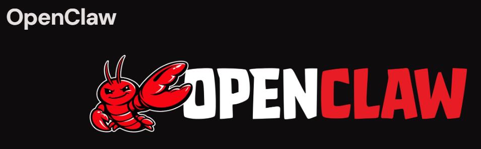

> 📎 来源: [Ryan在CQ](https://mp.weixin.qq.com/s?__biz=MzYyNTQ3MTUyOA==&mid=2247483721&idx=1&sn=0cadd2deb0a354b53d91a67fac271aa2&chksm=f13b49ff9ea29522adffe7cc32c1fd2d82963b59ac4b5209c19e4c8f451271b398cfe7bd1c31&mpshare=1&scene=1&srcid=0422a8qvUfq0oxcIvKd1YAHj&sharer_shareinfo=dc8f47cc3d963190cf62788ec72a8518&sharer_shareinfo_first=dc8f47cc3d963190cf62788ec72a8518) | 时间: 2026-04-22 17:39

---

3天，从OpenClaw+Ollama，到OpenClaw+飞书+阿里云Coding Plan，终于把OpenClaw+飞书打通了。对于个人来说，网上有很多教程，也有类似一键部署和安装的软件和云服务器。但个人在本机上部署，很曲折。

1、安装问题：

问题：Ubuntu系统和win系统都可以按照官方的文档：https://clawcn.net/install/ 使用其中的指导进行搭建。

解决：但我更建议访问这个https://cloud.tencent.com/developer/article/2626160指导文章来搭建。

这个方法一，当然也可以在各大平台上租用云服务器来进行部署，比喻如百度云，阿里云，腾讯云等产品。一键就可以部署好。价格为39.9元/月，次月100元/月（原价200元/月）。

2、Token数量问题：

问题：如果是本地安装，搭好了，会有一个问题，多问两个问题，就会说服务器无响应，稍后再试。这个就是免费的用户。

解决：后来直接使用了阿里云的Coding Plan（7.99元/月，自动续费次月5折，20元/月（原价40元/月））。

3、无法安装飞书插件

问题：安装飞书插件时，会出现Downloading @openclaw/feishu… Error: spawn EINVAL 。

解决：我找千问Qwen3-Plus一起讨论，结论是由于node的版本过高引起。需要降级，降到18左右。但问题来了，OpenClaw需要Node20版本以上。所以这两个比较冲突。有一个方法。手动下载插件。并在CMD或Powershell中进行安装，运行Openclaw Doctor来修复。然后有一个关键点。运行OpenClaw channels add来配置插件，输入飞书的APPID等信息就可以了。也就是安装问题里第二个链接里的指导。

好了，今天先写到这里，后面运行起来再把问题陆续发到这里来。
