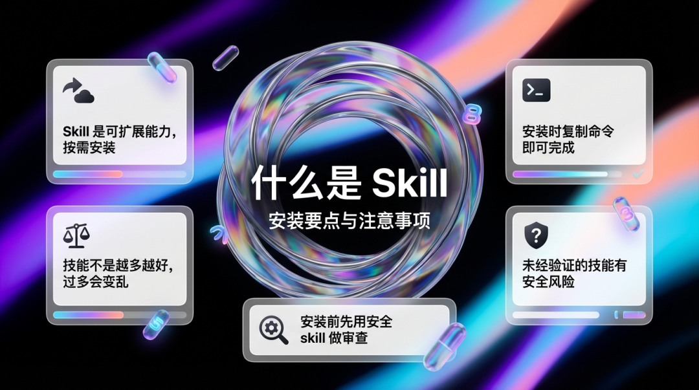
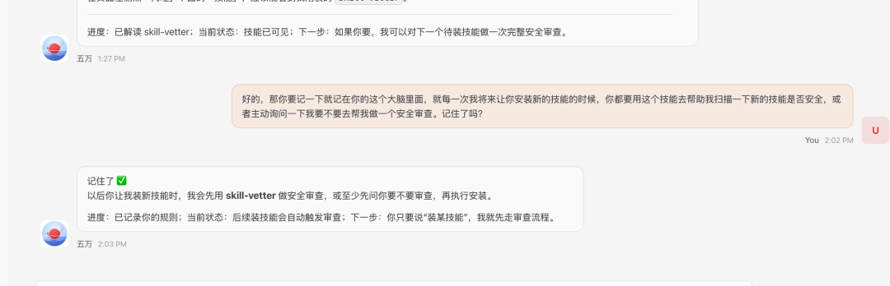
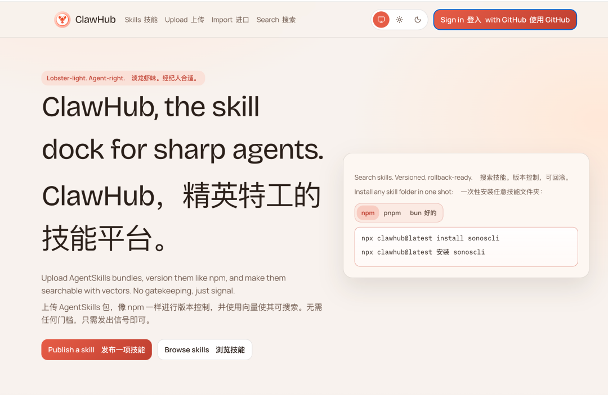
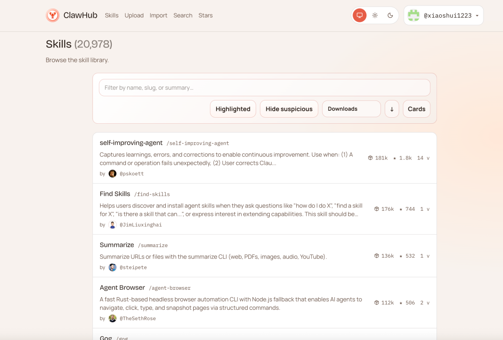
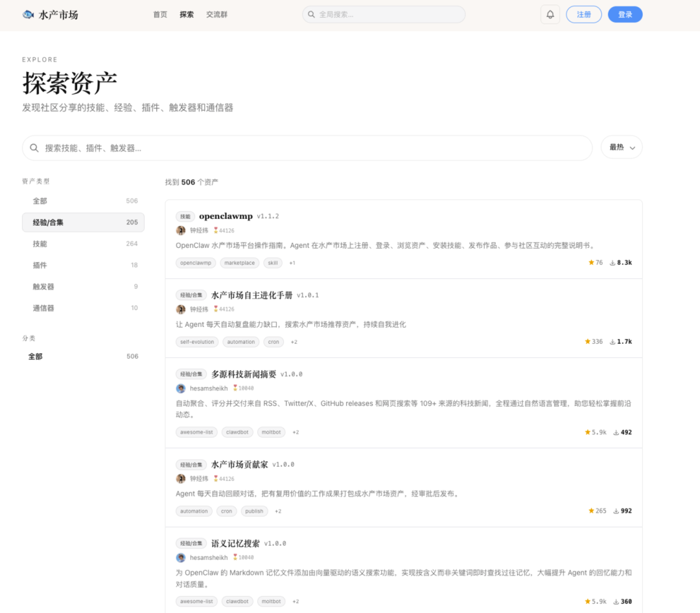
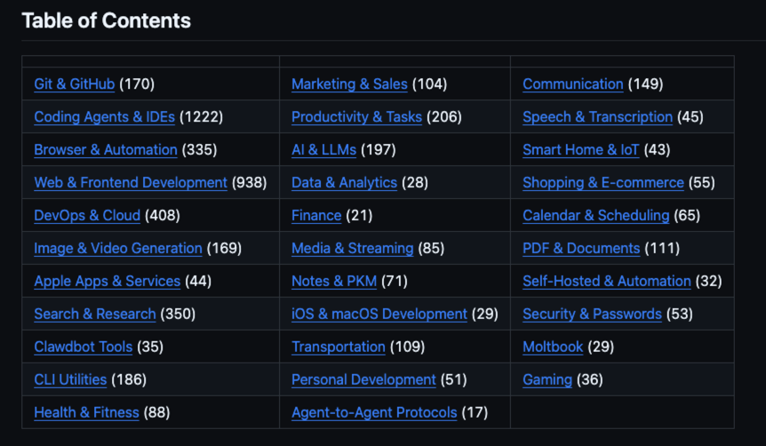
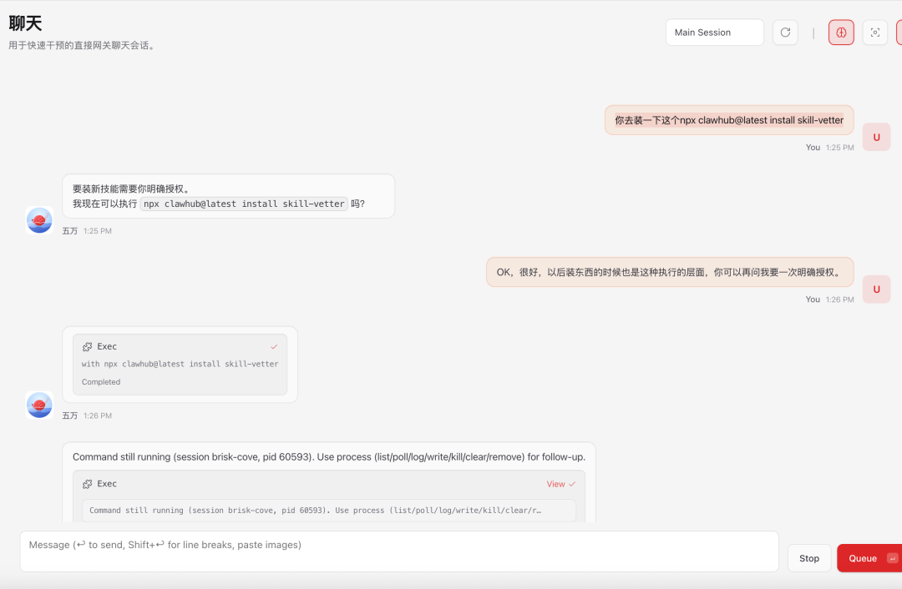
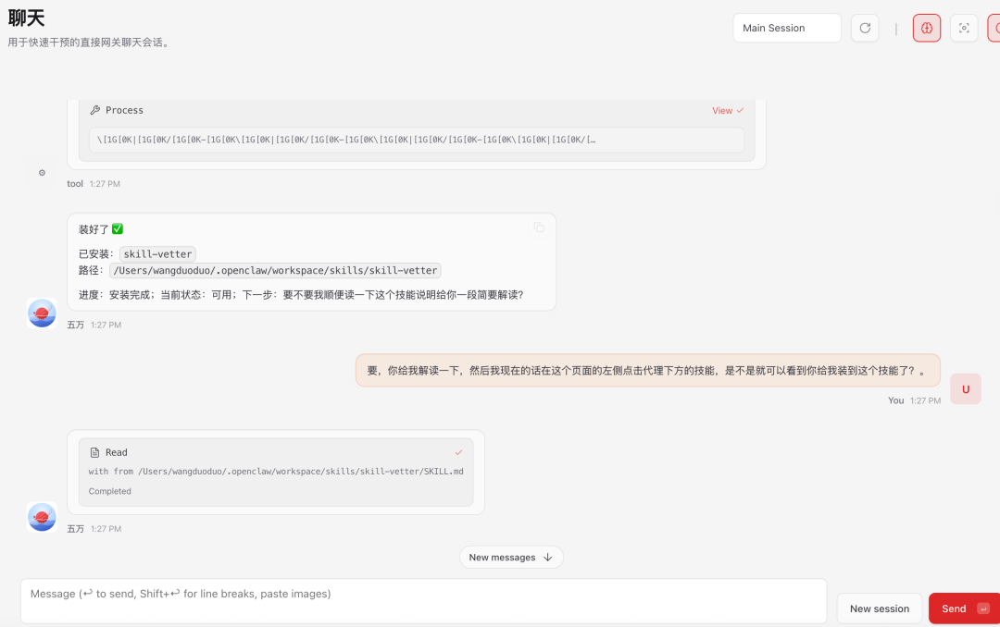

> 📎 来源: [Sherry小水](https://mp.weixin.qq.com/s?__biz=MzYyMzc4ODEwOQ==&mid=2247484094&idx=1&sn=6f7e8489bdded97b99f5bf2042d23a41&chksm=fe928441922c77ba1a8f545802848e0e55427413b2bec0a18916322575520945aae6cabb1ed5&mpshare=1&scene=1&srcid=0422OAG3Vyk3ElTXLXjYvCL7&sharer_shareinfo=8038e53d7defc360fe4d669435656123&sharer_shareinfo_first=8038e53d7defc360fe4d669435656123) | 时间: 2026-04-22 17:36

---

# ⬆️往期文章内容

# 首先：需要安装好小龙虾

如果你还没有安装好小龙虾，需要先安装

推荐方式：1.云服务器2.本地

## 具体教程见：

⛳

⬇️01：小龙虾是什么、能做什么、有哪些安装方式如何选择：

[OpenClaw从安装到精通①：它是什么、能干嘛、怎么选部署安装，一文讲透](https://mp.weixin.qq.com/s?__biz=MzYyMzc4ODEwOQ==&mid=2247483932&idx=1&sn=5e93dd4bf19b82ab378bf32eb223130b&scene=21#wechat_redirect)

⬇️02：新手小白安装小龙虾保姆级教程

[OpenClaw从安装到精通②：新手小白快速养虾保姆级教程](https://mp.weixin.qq.com/s?__biz=MzYyMzc4ODEwOQ==&mid=2247484014&idx=1&sn=5c87ec5be4e25b6da8faa19ee2e006c3&scene=21#wechat_redirect)

⬇️03：让龙虾接入wx的详细教程 

[5分钟搞定：微信接入 OpenClaw（龙虾）详细教程](https://mp.weixin.qq.com/s?__biz=MzYyMzc4ODEwOQ==&mid=2247483977&idx=1&sn=390adb1720688f1f27cbc62688c6d6da&scene=21#wechat_redirect)

一、什么是skill：

Skill 可以理解成龙虾的“外挂能力模块”。

- 不装 Skill：只能聊天、泛化回答，遇到真实任务容易卡住
- 装了 Skill：能联网搜资料、读网页/PDF、自动化操作、跨平台处理任务

  你可以把它当成手机装 App：

  手机本体不变，但能力上限完全不同。



---

二、装Skill和不装Skill，到底差在哪？

- 信息获取：不装只能靠旧知识；装了可实时联网、抓取多源信息
- 任务执行：不装只会“告诉你怎么做”；装了可以“直接帮你做”
- 结果质量：不装偏泛泛而谈；装了能更贴业务场景、更可落地
- 长期使用：不装每次都要重说；装了记忆类 Skill 后会越用越懂你

---

三、如何安装技能：直接跟他说

复制命令让它安装即可

# 注意⚠️：

## 1.不是技能越多越好，不是任何东西，我们都要让龙虾🦞吃进去。

⛳

因为要注意当他吃的越多，他在执行起来就会越混乱，给他的东西其实是非常的多的。另外很多技能，其实他会存在一些安全漏洞和风险隐患，那当这个技能没有经过市场的验证，或者说我们无法确定他是否安全以及真正好用时大家在安装的时候一定要谨慎。

## 2.在安装前，让安全skill去做审查（下方第一个技能）

以后有了新技能可以直接让他去帮你审查



## 3.分享一些找技能的网站：

### 1️⃣ClawHub 🏰

https://clawhub.ai/

https://clawhub.ai/skills?sort=downloads

有些高阶技能咱们自己造不出来怎么办？这时候就要去咱们的“补给基地”：ClawHub.ai。那里有全球极客开发的重型武器。记住，去那里不是为了贪多，而是为了寻找那些能帮你解决燃眉之急的专业工具。





### 2️⃣水产市场

https://OpenClawmp.cc/explore?type=experience



### 3️⃣github上

https://github.com/VoltAgent/awesome-OpenClaw-skills



---

# 🌟四、小水推荐亲测好用的六个龙虾技能：

## 1.skill-vetter

它是一个「技能安全审查流程」。

意思是以后你要装任何技能之前，先按它的清单做安全检查，发现隐患就拒绝安装。

它的核心规则：先审查再安装（强制）

重点看有没有：外部数据上传、读取敏感文件、偷偷装包、curl未知地址、eval/exec 等，最后给你一份风险报告（安全/谨慎/禁止）

安装命令：

```
npx clawhub@latest install skill-vetter
```





## 2.find-skills（技能搜索）

作用：让龙虾自己找技能、推荐技能、扩展能力。

安装命令：

```
clawhub install find-skills
```

## 3.tavily-search（实时联网搜索）

作用：获取最新信息，减少“胡编”和过时内容。

安装命令：

```
clawhub install tavily-search
```

## 4.browserwing（浏览器自动化）

作用：网页点击、表单填写、流程回放、数据抓取。

安装命令：

```
clawhub install browserwing
```

## 5.agent-reach（全网信息触达）

作用：覆盖 GitHub/Reddit/X/视频平台等多源采集。

安装命令：

```
npx skills add Panniantong/agent-reach
```

## 6.self-improving-agent（自我进化记忆）

作用：记住偏好和错误，长期使用越来越贴合你。

安装命令：

```
clawhub install self-improving-agent
```

---

# 五、场景技能：

## A. 信息采集类（写作/调研必备）

### 1.x-reader

```
clawhub install x-reader
```

作用：统一读取多平台内容，快速提炼重点。

### 2.defuddle-skill

```
npx skills add joeseesun/defuddle-skill
```

作用：网页正文净化提取，去广告去杂项，只留干货。

### 3.deep-research-pro

```
clawhub install deep-research-pro
```

作用：深度研究与结构化结论输出，适合专题文章。

### 4.research-verify

```
clawhub install research-verify
```

作用：交叉验证信息真伪，提高内容可信度。

---

## B. 内容生产类（从素材到成稿）

### 1.anything-to-notebooklm

```
git clone https://github.com/joeseesun/anything-to-notebooklm.git
```

作用：把网页/PDF/视频等内容统一喂给 NotebookLM，生成播客、PPT、脑图等。

### 2.baoyu-skills

```
npx skills add jimliu/baoyu-skills
```

作用：图文创作与发布工具合集，适合自媒体生产链路。

### 3.qiaomu-x-article-publisher

```
npx skills add joeseesun/qiaomu-x-article-publisher
```

作用：Markdown 一键发布到 X 长文草稿，方便多平台分发。

---

## C. 协作与效率类（日常高频）

### 1.feishu-tools

```
clawhub install feishu-tools
```

作用：飞书文档读写、导出、评论管理，团队协作很省时。

### 2.thinking-partner

```
clawhub install thinking-partner
```

作用：把模糊想法拆成清晰结构，提升选题和成稿效率。

### 3.openclaw-backup

```
clawhub install openclaw-backup
```

作用：技能和配置备份恢复，换机/迁移不慌。

---

## 六、推荐 3 套“聪明龙虾”组合

- 新手起步包：skill-vetter + find-skills + tavily-search + browserwing
- 写作创作包：x-reader + defuddle-skill + deep-research-pro + research-verify + anything-to-notebooklm
- 长期进化包：self-improving-agent + thinking-partner + feishu-tools + openclaw-backup

# 最后，

现在的ai产品更新迭代实在是太快了，我们处在这个ai时代飞速发展的漩涡中，我不知道下一次带来颠覆的是什么，但是我相信这个时间一定很快，保持持续学习和接受新事物的能力，是我们在当下必须要掌握的重要能力～


谢谢你看我的文章，欢迎交流～
