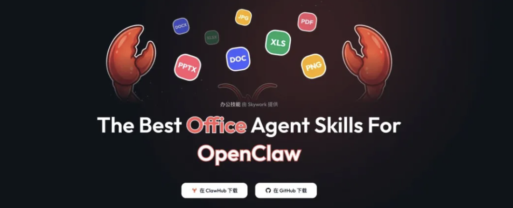
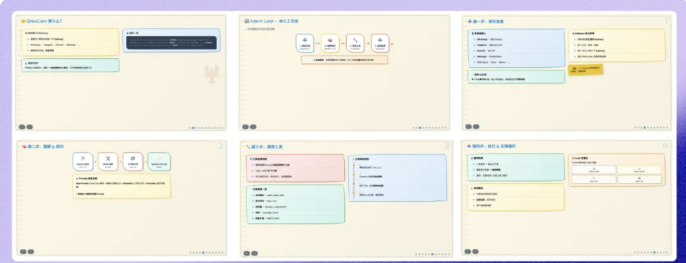
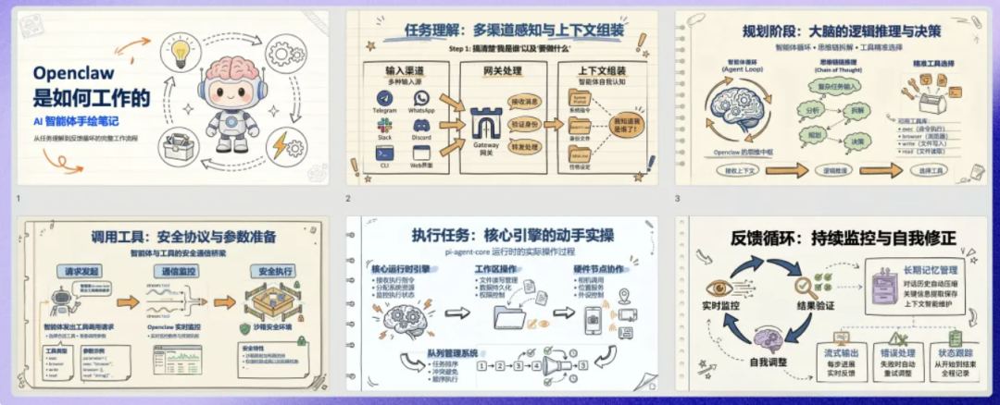

> 📎 来源: [米核Ai元智](https://mp.weixin.qq.com/s?__biz=MzIxMDU0NDQ3MA==&mid=2247483755&idx=1&sn=cdcac7a09d18f226b8ef0d7347a62aab&chksm=96fe42ee0f728c87b331d2d17599bb6c9f0fc32144c1e209df7f3c544d3ccc58fae1ebb99708&mpshare=1&scene=1&srcid=0413rHD9R1nKrKviT6Wvh2wk&sharer_shareinfo=a3784d95de0d6d17df73bf3217710044&sharer_shareinfo_first=a3784d95de0d6d17df73bf3217710044) | 时间: 2026-04-13 15:34

---

# OpenClaw做PPT总翻车？装上这个Skill，输出质量直追麦肯锡顾问！

## 开场白：

说出来你可能不信，我差点因为一份AI做的PPT，在公司丢了大人。

三周前，老板一个急活甩过来：给技术团队做个关于AIAgent架构演进的分享，15页，明天就要。

我心说，这不正是AI大显身手的时候吗？赶紧把需求丢给了我的OpenClaw，提示词写得那叫一个详细：

> “

> 生成一份Sketchnote风格的PPT，主题《AI Agent技术架构演进》，要包含手绘图标、流程图解和对比表格，讲清楚从单Agent到多Agent协作的技术变迁，风格得像技术手绘笔记，信息密度高但层次分明，让非技术也能听懂。

然后，我就满怀期待地等来了这个——

我沉默了。这玩意儿要是拿进会议室，我的技术信誉怕是直接归零。 你是不是也遇到过这种AI“智障”瞬间？评论区握个手！

问题很直白：**逻辑全对，审美报废。** 这其实是当下AI生成内容的通病——它能跑通代码，但搞不定审美。

## 一、认知颠覆：Skill不是外挂，是给AI植入“设计基因”

就在我几乎要放弃用AI做PPT时，我系统测试了一圈，最终锁定了**天工（Skywork）的办公套件**。同样是那个让我翻车的主题和要求，在SkyClaw环境里跑了一遍。

结果，我收到了这个

毫不夸张地说，这不是改良，是**质变**！而且，这仅仅是启用了**Skywork PPT这一个Skill**，用同一条提示词得到的结果。

为啥差距这么大？你想啊，裸模型生成PPT，就像让一个没学过设计的实习生做提案——活儿能干，但成品辣眼睛。它能给你堆满内容，但配色、排版、视觉语言？看运气。

**而一个专业的Skill，本质是一本沉淀了无数优秀设计范式的“设计基因库”。** 它给AI植入的不是功能，是审美。同一个大脑，有没有经过专业训练，产出就是天壤之别。

今天，我就手把手带你，怎么在SkyClaw里用这套办公套件，做出能直接进会议室的咨询级PPT。全程**不用写一行代码，更不需要你有设计背景**。

## 二、方法论：3个约束，让你的Prompt从“求求了”变成“设计brief”

很多人觉得AI出图看运气，其实是你没把需求说清楚。**（这里划重点！）** 高质量的输出，靠的是结构化的Prompt工程。只需要在Prompt里嵌入下面这三个维度，效果立竿见影。

### 1. 风格锚定：给AI一个明确的“参考案例”

不指定风格，AI的输出就跟开盲盒一样。你得告诉它：“**我要麦肯锡咨询报告那种风格，主色深蓝，辅色白和浅灰。**” “麦肯锡风”、“Apple极简风”、“TED演讲风”……这些关键词，能瞬间激活AI在海量资料中学到的成熟设计模式。**（行业黑话：这就叫给AI“喂参考图”）**

### 2. 数据保真：告别“听起来对”的虚构数字

让AI写市场趋势，它最擅长编造一些“看似合理”的数据，汇报时被老板一问出处就傻眼。怎么破？**强制它启动“研究模式”**。 在Prompt里加上：“**请先用Deep Research技能检索最新的行业数据和财报，所有关键数字必须标注具体来源。**” 这样，AI就会从“脑补生成”模式，切换到“证据驱动”模式，给你的PPT注入真实骨血。

### 3. 排版约束：把“文字堆砌”逼成“视觉表达”

大模型的本能是生成文字，但PPT的核心是控制信息密度。**你得用硬性参数，逼它做视觉化。**比如：“**每页不超过5个要点，标题28pt，正文16pt，每页必须配图或图表，留白比例控制在30%-50%。**” 这套组合拳下去，AI就会自动进入“图示优先”模式——用图标替代段落，用时间轴替代列表，用架构图讲清逻辑。

**把这三个维度组合起来，就是一个能出活的“设计需求文档”（Design Brief）：**

> “

> 帮我做一份关于[你的主题]的PPT，共[N]页。 风格参考[例如：McKinsey咨询报告]，配色使用[主色+辅色+点缀色]。 请先用Deep Research检索最新行业数据，并标注数字来源。 每页不超过5个要点，标题28pt，正文16pt，每页必须配图或数据可视化，留白比例30%-50%。

**Prompt不是玄学，是工程。** 需求越清晰，翻车概率就越低。这套方法，同样适用于做海报、写报告。

## 三、实战：5分钟，在SkyClaw里搭好你的自动化流水线

道理懂了，怎么操作？**（这里举个“栗子”）** 打开 SkyClaw，一切都变简单了。它是天工提供的云端OpenClaw方案，最大好处是：**开箱即用，不用配置。**访问 https://skywork.ai/home\_agent/skyclaw，新用户有**5小时免费额度**，足够你玩到爽。

进去你会发现，PPT、Design、Excel、Document、Search这些办公核心Skill已经预装好了。**这意味着，你无需处理任何复杂的环境依赖和安装命令，就像打开一个线上版的Photoshop，工具都给你摆好了。**

它的操作界面是可视化的，AI每一步在干嘛（比如打开网页搜索、拖拽文件、执行命令）你都能实时看到，不是黑盒，随时可以人工接管，安全感满满。

接下来就简单了：**复制上面那个结构化Prompt模板，把[ ]里的内容换成你的实际需求，粘贴，发送。**然后，你就泡杯咖啡，看着你的AI“数字员工”开始忙碌：调用Search Skill查资料、用Design Skill生成配图、用Excel Skill处理数据图表，最后用PPT Skill把所有素材组装成一份风格统一、数据详实、排版专业的演示文稿。

完成后，它会直接给你一个 **.pptx源文件**，用PowerPoint、WPS都能打开编辑，不是图片，不是PDF！

## 四、召唤行动与价值升维：从“做一次”到“自动每周做”

用上这套组合拳，你的工作流会被彻底重构。对我而言，PPT只是开始。Skywork的整个办公套件，让我搭建起了一条**自动化内容流水线**：

- **周一早晨**，SkyClaw自动拉取数据，更新图表，生成周报PPT，我只需要点开确认。
- **Excel Skill** 每天自动监控业务指标，异常了才弹窗提醒我。
- **Document + Search Skill** 每周自动为我扫描5个核心竞品动态，输出竞品监控周报。

**（成本反差对比）** 原本需要一个初级分析师每周花大半天干的活儿，现在AI“夜班经理”默默就搞定了。这才是管理者该有的状态——常态无需关注，异常才需介入。

最后，聊聊成本。开源Skill在ClawHub都能免费下载。但对于我们这种重度用户，我算过一笔账： 之前我用着OpenClaw API、Claude、各种生图工具，每月杂七杂八加起来小3000块。现在，一个SkyClaw Ultra会员（约合人民币1800元/月）全包了，还能调用Opus、GPT-5等顶级模型。**（植入转化钩子）** 这相当于**花1块钱，办了5块钱的事**。**（读者可以想想，你现在的AI工具“全家桶”，每月烧掉多少钱？评论区可以聊聊。）**

**你以为学会用AI是省时间，其实，教会AI为你搭建自动化流程，才是真正的解放生产力。**

---

## **—— 立即行动 ——**

**资源直达：**

- **SkyClaw（5小时免费体验）**：https://skywork.ai/home\_agent/skyclaw
- **Skywork PPT Skill（开源地址）**：https://clawhub.ai/gxcun17/skywork-ppt
- **其他办公Skill（Design/Excel/Document等）**：在ClawHub搜索“skywork”即可找到。

**给你的行动建议：**现在就打开SkyClaw，用文中的Prompt模板生成一份你的PPT。

1. **你以为AI做PPT不行，其实，是你没学会给AI下“设计任务书”。**
2. **工具从不创造美，但正确的工具，能让你的专业想法不被拙劣的表达所拖累。**
3. **这不仅仅是一个Skill，这是一次工作流的“工业革命”。当别人还在手动调格式，你的周报已经自动生成了。**

