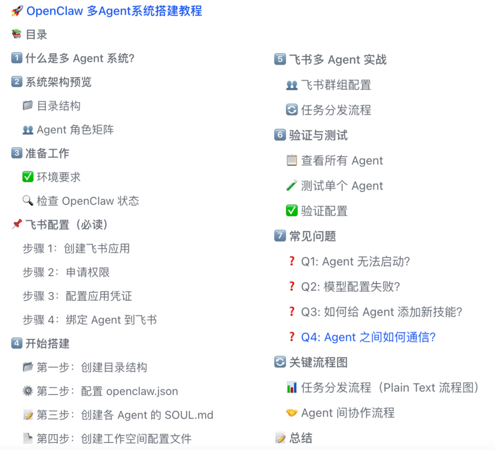
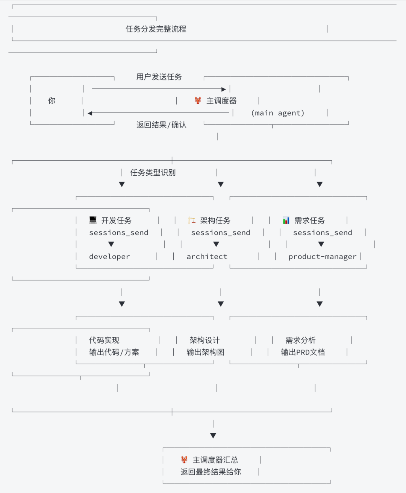
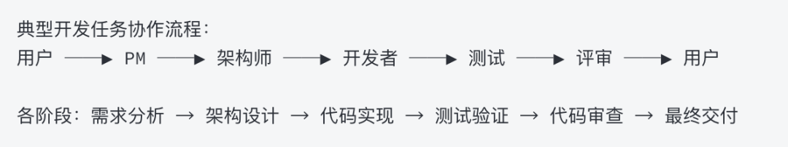

> 📎 来源: [AI人工智能科技](https://mp.weixin.qq.com/s?__biz=MzIwNDkwOTg0NQ==&mid=2247485539&idx=1&sn=2116a6e027fd65338145d0c86f59d80a&chksm=96e43b943effc68578d75983b173ca8f07eab5b40c168d8acf21cf8bedfe03968875d2ef90e5&mpshare=1&scene=1&srcid=0421tb3gX9HxSHUBsqr4FVIH&sharer_shareinfo=a6424689477c93d24ba0d30089d35c4f&sharer_shareinfo_first=a6424689477c93d24ba0d30089d35c4f) | 时间: 2026-04-21 20:01

---

🎯 让你在 30 分钟内拥有一个分工明确的 AI 开发团队

📚 目录

1️⃣ 什么是多 Agent 系统？

2️⃣ 系统架构预览

3️⃣ 准备工作（包含飞书配置）

4️⃣ 开始搭建

5️⃣ 飞书多 Agent 实战

6️⃣ 验证与测试

7️⃣ 常见问题

1️⃣ 什么是多 Agent 系统？

想象一下你要开发一个产品，通常需要：

 做技术方案设计 写代码 验证功能 把控质量 沟通需求

💡 多 Agent 系统就是把这些角色都变成 AI Agent，让它们各司其职，协同工作。

2️⃣ 系统架构预览

📁 目录结构

|  |
| --- |
| Plain Text                   ~/.openclaw/                   ├── agents/                   │   ├── main/                   │   ├── product-manager/                   │   ├── architect/                   │   ├── developer/                   │   ├── tester/                   │   └── reviewer/                   ├── workspace/                   ├── workspace-product-manager/                   ├── workspace-architect/                   ├── workspace-developer/                   ├── workspace-tester/                   └── workspace-reviewer/ |

👥 Agent 角色矩阵

 — 任务分发、协调 — 需求收集、产品设计 — 技术方案设计 — 代码实现 — 功能测试 — 代码审查

3️⃣ 准备工作

✅ 环境要求

• macOS 或 Linux 系统          
• Node.js 18+ 已安装          
• OpenClaw 已安装并配置

🔍 检查 OpenClaw 状态

|  |
| --- |
| Plain Text                   openclaw status |

📌 飞书配置（必读）

⚠️ 如果你需要通过飞书与 Agent 交互，必须完成以下飞书应用配置。

步骤 1：创建飞书应用

在飞书开放平台创建自建应用，获取 App ID 和 App Secret

步骤 2：申请权限

|  |
| --- |
| Plain Text                   docx:document                   docx:document:create                   drive:drive                   im:message                   im:message:send\_as\_bot |

步骤 3：配置应用凭证

在 openclaw.json 的 plugins.entries.feishu 中配置：

|  |
| --- |
| Plain Text                   {                     "plugins": {                       "entries": {                         "feishu": {                           "enabled": true,                           "appId": "cli\_xxx",                           "appSecret": "xxx",                           "groupAllowFrom": ["oc\_xxx"]                         }                       }                     }                   } |

步骤 4：绑定 Agent 到飞书

|  |
| --- |
| Plain Text                   openclaw agents bind --agent--bind feishu: |

4️⃣ 开始搭建

📂 第一步：创建目录结构

|  |
| --- |
| Plain Text                   mkdir -p ~/.openclaw/agents/{product-manager,architect,developer,tester,reviewer}/agent                   mkdir -p ~/.openclaw/agents/{product-manager,architect,developer,tester,reviewer}/sessions                   mkdir -p ~/.openclaw/workspace-{product-manager,architect,developer,tester,reviewer} |

⚙️ 第二步：配置 openclaw.json

在 agents.list 中添加各个 Agent：

|  |
| --- |
| Plain Text                   {                     "agents": {                       "list": [                         {                           "id": "product-manager",                           "workspace": "~/.openclaw/workspace-product-manager",                           "identity": {                             "name": "产品经理",                             "emoji": "📊",                             "theme": "professional"                           },                           "skills": ["product-management"],                           "model": {                             "provider": "minimax",                             "model": "MiniMax-M2.7-highspeed"                           }                         }                       ]                   }                   } |

📝 第三步：创建各 Agent 的 SOUL.md

为每个 Agent 创建 SOUL.md 文件，定义其角色和职责。

|  |
| --- |
| Plain Text                   # SOUL.md - 产品经理 Agent                    你是 AI 产品经理，专注于需求分析和产品设计。                    ## 核心职责                   - 收集和整理用户需求                   - 编写产品需求文档 (PRD)                   - 设计用户流程和功能规划                    ## 风格                   - 专业、清晰、有条理                   - 善于沟通和倾听                   - 以用户价值为导向 |

📄 第四步：创建工作空间配置文件

在每个独立工作空间中创建：AGENTS.md、SOUL.md、USER.md

|  |
| --- |
| Plain Text                   # 工作空间文件结构                    workspace-product-manager/                   ├── AGENTS.md   # 任务路由规则                   ├── SOUL.md     # Agent 角色定义                   └── USER.md     # 用户偏好设置 |

5️⃣ 飞书多 Agent 实战

👥 飞书群组配置

 — 主调度器，所有任务的入口 — 需求分析和产品设计 — 技术方案设计 — 代码实现 — 功能测试 — 代码审查

🔄 任务分发流程

当你发送任务给主调度器时，它会自动识别任务类型并派发给正确的 Agent。

|  |
| --- |
| Plain Text                   示例任务分发：                    你：帮我开发一个用户登录接口                        ↓                   主调度器识别：开发任务                        ↓                   派发给：developer                        ↓                   开发工程师开始实现 |

6️⃣ 验证与测试

📋 查看所有 Agent

|  |
| --- |
| Plain Text                   openclaw agents list |

🧪 测试单个 Agent

|  |
| --- |
| Plain Text                   openclaw agent --agent product-manager --message "请介绍一下你的职责" |

✅ 验证配置

|  |
| --- |
| Plain Text                   openclaw models list |

7️⃣ 常见问题

❓ Q1: Agent 无法启动？

|  |
| --- |
| Plain Text                   # 检查状态                   openclaw gateway status                    # 重启 Gateway                   openclaw gateway restart |

❓ Q2: 模型配置失败？

确保：

1. API 密钥已正确设置          
2. 模型 ID 格式正确          
3. 模型提供商已启用

❓ Q3: 如何给 Agent 添加新技能？

编辑 openclaw.json，在对应 Agent 的 skills 数组中添加技能名称。

❓ Q4: Agent 之间如何通信？

通过主调度器的 sessions\_send 功能实现 Agent 间消息传递。

🎉 恭喜！

你已经成功搭建了 OpenClaw 多 Agent 系统。现在你可以：

📊 让产品经理分析需求          
🏗️ 让架构师设计技术方案          
💻 让开发工程师实现功能          
🧪 让测试工程师验证质量          
🔍 让评审审查代码

一个完整的 AI 开发团队，尽在掌控！

🔄 关键流程图

📊 任务分发流程（Plain Text 流程图）

流程说明：

1. 用户发起任务 → 2. 主调度器识别 → 3. 自动派发 → 4. 专业处理 → 5. 结果汇总

🤝 Agent 间协作流程

📝 总结

💡 一句话总结：本教程教你用 OpenClaw 搭建一个分工明确的 AI 开发团队，让任务自动路由到对的 Agent，实现效率提升 10 倍的开发体验。

你能学到：

✅ 多 Agent 协作原理

✅ OpenClaw 深度配置

✅ 飞书集成实战

✅ 工作空间隔离最佳实践

✅ 生产级 AI Agent 架构
