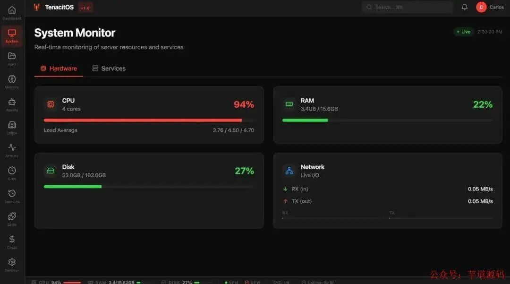
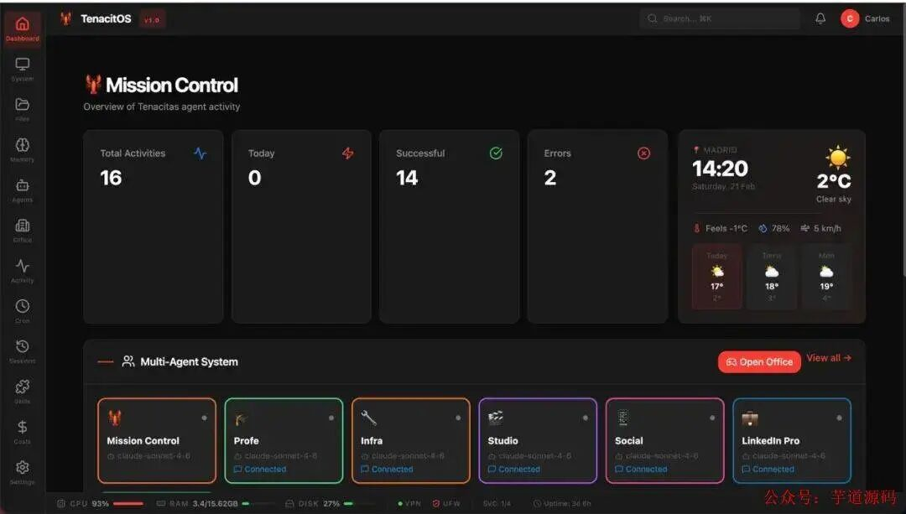
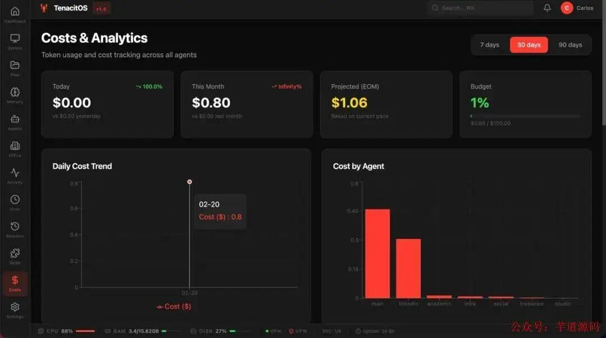
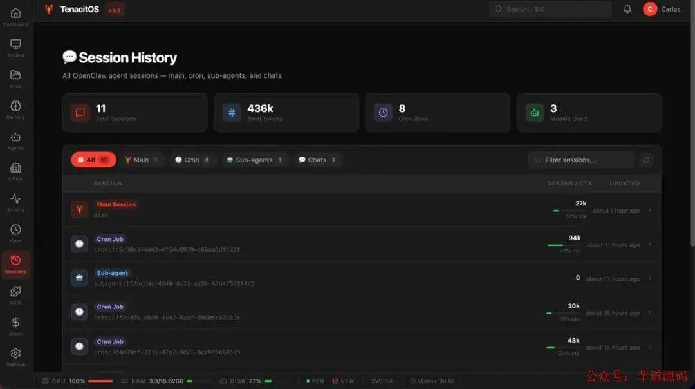
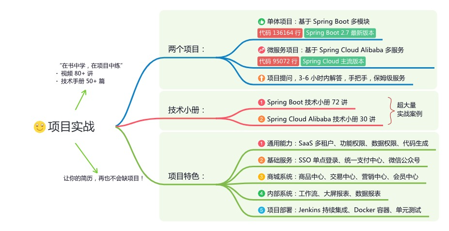
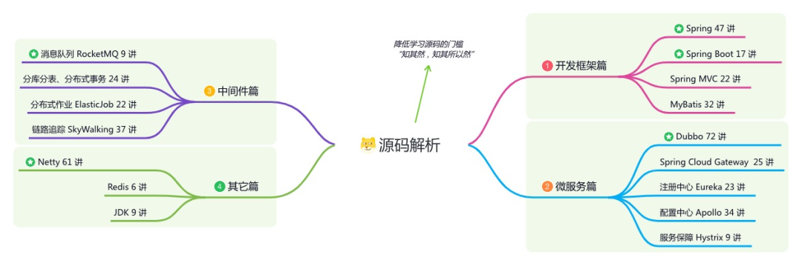

> 📎 来源: [芋道源码](https://mp.weixin.qq.com/s?__biz=MzUzMTA2NTU2Ng==&mid=2247619313&idx=1&sn=4dedb5e747ddcd172de83f25b6599c76&chksm=fbc4694a43f3426161623caa1cec035dd68eecd19572facc971d3aca1069c5b814fd4538944b&mpshare=1&scene=1&srcid=040890Ip2CJxgud64Tv8OaaT&sharer_shareinfo=9de4fdc9df4b2cd01ff481ae55aedd15&sharer_shareinfo_first=9de4fdc9df4b2cd01ff481ae55aedd15) | 时间: 2026-04-13 16:15

---

> 👉 **这是一个或许对你有用****的社群**

> 🐱 一对一交流/面试小册/简历优化/求职解惑，欢迎加入「**[芋道快速开发平台](http://mp.weixin.qq.com/s?__biz=MzUzMTA2NTU2Ng==&mid=2247576728&idx=1&sn=1298645b025eb51d9078e8c3de7b3c17&chksm=fa4bd329cd3c5a3fd63e455cf39507d3611a7b040be1381fd5ecfc0a7ce3867575fda4b7313d&scene=21#wechat_redirect)**」知识星球。下面是星球提供的部分资料： 

> - [《项目实战（视频）》](http://mp.weixin.qq.com/s?__biz=MzUzMTA2NTU2Ng==&mid=2247576728&idx=1&sn=1298645b025eb51d9078e8c3de7b3c17&chksm=fa4bd329cd3c5a3fd63e455cf39507d3611a7b040be1381fd5ecfc0a7ce3867575fda4b7313d&scene=21#wechat_redirect)：从书中学，往事上**“练”**
> - [《互联网高频面试题》](http://mp.weixin.qq.com/s?__biz=MzUzMTA2NTU2Ng==&mid=2247576728&idx=1&sn=1298645b025eb51d9078e8c3de7b3c17&chksm=fa4bd329cd3c5a3fd63e455cf39507d3611a7b040be1381fd5ecfc0a7ce3867575fda4b7313d&scene=21#wechat_redirect)：面朝简历学习，春暖花开
> - [《架构 x 系统设计》](http://mp.weixin.qq.com/s?__biz=MzUzMTA2NTU2Ng==&mid=2247576728&idx=1&sn=1298645b025eb51d9078e8c3de7b3c17&chksm=fa4bd329cd3c5a3fd63e455cf39507d3611a7b040be1381fd5ecfc0a7ce3867575fda4b7313d&scene=21#wechat_redirect)：摧枯拉朽，掌控面试高频场景题
> - [《精进 Java 学习指南》](http://mp.weixin.qq.com/s?__biz=MzUzMTA2NTU2Ng==&mid=2247576728&idx=1&sn=1298645b025eb51d9078e8c3de7b3c17&chksm=fa4bd329cd3c5a3fd63e455cf39507d3611a7b040be1381fd5ecfc0a7ce3867575fda4b7313d&scene=21#wechat_redirect)：系统学习，互联网主流技术栈
> - [《必读 Java 源码专栏》](http://mp.weixin.qq.com/s?__biz=MzUzMTA2NTU2Ng==&mid=2247576728&idx=1&sn=1298645b025eb51d9078e8c3de7b3c17&chksm=fa4bd329cd3c5a3fd63e455cf39507d3611a7b040be1381fd5ecfc0a7ce3867575fda4b7313d&scene=21#wechat_redirect)：知其然，知其所以然


> 👉**这是一个或许对你有用的开源项目**

> 国产Star破10w的开源项目，前端包括管理后台、微信小程序，后端支持单体、微服务架构

> RBAC权限、数据权限、SaaS多租户、**商城**、支付、工作流、大屏报表、**ERP、CRM**、**AI大模型、IoT物联网**等功能：

> - 多模块：https://gitee.com/zhijiantianya/ruoyi-vue-pro
> - 微服务：https://gitee.com/zhijiantianya/yudao-cloud
> - 视频教程：https://doc.iocoder.cn

> 【国内首批】支持 JDK17/21+SpringBoot3、JDK8/11+Spring Boot2双版本

[来源：](https://mp.weixin.qq.com/s?__biz=MzUzMTA2NTU2Ng==&mid=2247487551&idx=1&sn=18f64ba49f3f0f9d8be9d1fdef8857d9&scene=21#wechat_redirect)[极客之家](https://mp.weixin.qq.com/s?__biz=MzUzMTA2NTU2Ng==&mid=2247487551&idx=1&sn=18f64ba49f3f0f9d8be9d1fdef8857d9&scene=21#wechat_redirect)

- [简介](https://mp.weixin.qq.com/s?__biz=MzUzMTA2NTU2Ng==&mid=2247487551&idx=1&sn=18f64ba49f3f0f9d8be9d1fdef8857d9&chksm=fa496f8ecd3ee698f4954c00efb80fe955ec9198fff3ef4011e331aa37f55a6a17bc8c0335a8&scene=21&token=899450012&lang=zh_CN#wechat_redirect)
- [优势亮点](https://mp.weixin.qq.com/s?__biz=MzUzMTA2NTU2Ng==&mid=2247487551&idx=1&sn=18f64ba49f3f0f9d8be9d1fdef8857d9&chksm=fa496f8ecd3ee698f4954c00efb80fe955ec9198fff3ef4011e331aa37f55a6a17bc8c0335a8&scene=21&token=899450012&lang=zh_CN#wechat_redirect)
- [核心功能](https://mp.weixin.qq.com/s?__biz=MzUzMTA2NTU2Ng==&mid=2247487551&idx=1&sn=18f64ba49f3f0f9d8be9d1fdef8857d9&chksm=fa496f8ecd3ee698f4954c00efb80fe955ec9198fff3ef4011e331aa37f55a6a17bc8c0335a8&scene=21&token=899450012&lang=zh_CN#wechat_redirect)

- [1.全景系统监视器](https://mp.weixin.qq.com/s?__biz=MzUzMTA2NTU2Ng==&mid=2247487551&idx=1&sn=18f64ba49f3f0f9d8be9d1fdef8857d9&chksm=fa496f8ecd3ee698f4954c00efb80fe955ec9198fff3ef4011e331aa37f55a6a17bc8c0335a8&scene=21&token=899450012&lang=zh_CN#wechat_redirect)
- [2.智能代理仪表盘](https://mp.weixin.qq.com/s?__biz=MzUzMTA2NTU2Ng==&mid=2247487551&idx=1&sn=18f64ba49f3f0f9d8be9d1fdef8857d9&chksm=fa496f8ecd3ee698f4954c00efb80fe955ec9198fff3ef4011e331aa37f55a6a17bc8c0335a8&scene=21&token=899450012&lang=zh_CN#wechat_redirect)
- [3.精细化成本追踪\*](https://mp.weixin.qq.com/s?__biz=MzUzMTA2NTU2Ng==&mid=2247487551&idx=1&sn=18f64ba49f3f0f9d8be9d1fdef8857d9&chksm=fa496f8ecd3ee698f4954c00efb80fe955ec9198fff3ef4011e331aa37f55a6a17bc8c0335a8&scene=21&token=899450012&lang=zh_CN#wechat_redirect)
- [4.可视化Cron管理器](https://mp.weixin.qq.com/s?__biz=MzUzMTA2NTU2Ng==&mid=2247487551&idx=1&sn=18f64ba49f3f0f9d8be9d1fdef8857d9&chksm=fa496f8ecd3ee698f4954c00efb80fe955ec9198fff3ef4011e331aa37f55a6a17bc8c0335a8&scene=21&token=899450012&lang=zh_CN#wechat_redirect)
- [5.记忆与文件浏览器](https://mp.weixin.qq.com/s?__biz=MzUzMTA2NTU2Ng==&mid=2247487551&idx=1&sn=18f64ba49f3f0f9d8be9d1fdef8857d9&chksm=fa496f8ecd3ee698f4954c00efb80fe955ec9198fff3ef4011e331aa37f55a6a17bc8c0335a8&scene=21&token=899450012&lang=zh_CN#wechat_redirect)
- [6.沉浸式3D办公室（标志性特性）](https://mp.weixin.qq.com/s?__biz=MzUzMTA2NTU2Ng==&mid=2247487551&idx=1&sn=18f64ba49f3f0f9d8be9d1fdef8857d9&chksm=fa496f8ecd3ee698f4954c00efb80fe955ec9198fff3ef4011e331aa37f55a6a17bc8c0335a8&scene=21&token=899450012&lang=zh_CN#wechat_redirect)
- [7.企业级安全防护](https://mp.weixin.qq.com/s?__biz=MzUzMTA2NTU2Ng==&mid=2247487551&idx=1&sn=18f64ba49f3f0f9d8be9d1fdef8857d9&chksm=fa496f8ecd3ee698f4954c00efb80fe955ec9198fff3ef4011e331aa37f55a6a17bc8c0335a8&scene=21&token=899450012&lang=zh_CN#wechat_redirect)

- [安装部署](https://mp.weixin.qq.com/s?__biz=MzUzMTA2NTU2Ng==&mid=2247487551&idx=1&sn=18f64ba49f3f0f9d8be9d1fdef8857d9&chksm=fa496f8ecd3ee698f4954c00efb80fe955ec9198fff3ef4011e331aa37f55a6a17bc8c0335a8&scene=21&token=899450012&lang=zh_CN#wechat_redirect)

- [部署前置](https://mp.weixin.qq.com/s?__biz=MzUzMTA2NTU2Ng==&mid=2247487551&idx=1&sn=18f64ba49f3f0f9d8be9d1fdef8857d9&chksm=fa496f8ecd3ee698f4954c00efb80fe955ec9198fff3ef4011e331aa37f55a6a17bc8c0335a8&scene=21&token=899450012&lang=zh_CN#wechat_redirect)
- [开始安装](https://mp.weixin.qq.com/s?__biz=MzUzMTA2NTU2Ng==&mid=2247487551&idx=1&sn=18f64ba49f3f0f9d8be9d1fdef8857d9&chksm=fa496f8ecd3ee698f4954c00efb80fe955ec9198fff3ef4011e331aa37f55a6a17bc8c0335a8&scene=21&token=899450012&lang=zh_CN#wechat_redirect)
- [网络与访问配置](https://mp.weixin.qq.com/s?__biz=MzUzMTA2NTU2Ng==&mid=2247487551&idx=1&sn=18f64ba49f3f0f9d8be9d1fdef8857d9&chksm=fa496f8ecd3ee698f4954c00efb80fe955ec9198fff3ef4011e331aa37f55a6a17bc8c0335a8&scene=21&token=899450012&lang=zh_CN#wechat_redirect)

- [开源地址](https://mp.weixin.qq.com/s?__biz=MzUzMTA2NTU2Ng==&mid=2247487551&idx=1&sn=18f64ba49f3f0f9d8be9d1fdef8857d9&chksm=fa496f8ecd3ee698f4954c00efb80fe955ec9198fff3ef4011e331aa37f55a6a17bc8c0335a8&scene=21&token=899450012&lang=zh_CN#wechat_redirect)

---

在2026年的今天，OpenClaw 作为领先的自托管AI代理框架，已成为个人效率提升和企业数字化转型的核心引擎。

然而，随着多Agent协同作战成为常态，一个显著的“成长烦恼”也随之而来：**十几个甚至几十个AI代理同时运行，资源消耗、成本流向、任务状态、记忆文件……** 一切都变得难以掌控。

你是否曾有过Agent莫名“失联”、Token成本悄然飙升却无从查起的困扰？这正是开源社区诞生TenacitOS的初衷——一个专为OpenClaw打造的、无额外后端依赖的、真正的“任务控制中心”。

## [简介](https://mp.weixin.qq.com/s?__biz=MzUzMTA2NTU2Ng==&mid=2247576728&idx=1&sn=1298645b025eb51d9078e8c3de7b3c17&scene=21#wechat_redirect)

TenacitOS 是一个用于OpenClaw AI 代理实例的实时仪表盘和控制中心。采用 Next.js、React 19 和 Tailwind CSS v4 构建。

核心设计理念旗帜鲜明：“

```
无额外后端依赖
```

”。这并非一个独立的、需要复杂配置的监控系统。相反，它将自己直接嵌入到你的OpenClaw工作区内，成为OpenClaw身体的一部分。它通过读取宿主的配置、Agent列表、会话日志和内存文件，直接构建起整个管理界面。

> 基于 Spring Boot + MyBatis Plus + Vue & Element 实现的后台管理系统 + 用户小程序，支持 RBAC 动态权限、多租户、数据权限、工作流、三方登录、支付、短信、商城等功能

> - 项目地址：https://github.com/YunaiV/ruoyi-vue-pro
> - 视频教程：https://doc.iocoder.cn/video/

## [优势亮点](https://mp.weixin.qq.com/s?__biz=MzUzMTA2NTU2Ng==&mid=2247576728&idx=1&sn=1298645b025eb51d9078e8c3de7b3c17&scene=21#wechat_redirect)

- **零配置管理：** 无需额外配置数据库或复杂的后端服务，OpenClaw本身就是其后端。安装即用，Agent列表自动同步。
- **数据一致性：** 所有监控数据都是实时、第一手的，避免了传统独立监控系统可能存在的同步延迟或数据不一致问题。
- **资源开销极低：** 它本身不产生数据存储负担，其现代前端技术栈确保了交互的流畅，而不会给OpenClaw核心运行时带来显著压力。

> 基于 Spring Cloud Alibaba + Gateway + Nacos + RocketMQ + Vue & Element 实现的后台管理系统 + 用户小程序，支持 RBAC 动态权限、多租户、数据权限、工作流、三方登录、支付、短信、商城等功能

> - 项目地址：https://github.com/YunaiV/yudao-cloud
> - 视频教程：https://doc.iocoder.cn/video/

## [核心功能](https://mp.weixin.qq.com/s?__biz=MzUzMTA2NTU2Ng==&mid=2247576728&idx=1&sn=1298645b025eb51d9078e8c3de7b3c17&scene=21#wechat_redirect)

### [1.全景系统监视器](https://mp.weixin.qq.com/s?__biz=MzUzMTA2NTU2Ng==&mid=2247576728&idx=1&sn=1298645b025eb51d9078e8c3de7b3c17&scene=21#wechat_redirect)

**告别复杂的命令行。** TenacitOS提供了服务器级别的实时监控面板，CPU负载、内存占用、磁盘I/O、网络流量一目了然。

更关键的是，它能直接监控OpenClaw的运行载体，如PM2进程状态或Docker容器健康度，让你第一时间发现基础设施层面的异常。



### [2.智能代理仪表盘](https://mp.weixin.qq.com/s?__biz=MzUzMTA2NTU2Ng==&mid=2247576728&idx=1&sn=1298645b025eb51d9078e8c3de7b3c17&scene=21#wechat_redirect)

**这是指挥中心的核心。** 所有Agent被集中展示，你可以清晰地看到每个Agent的活跃状态、正在处理的会话、消耗的Token总量以及其绑定的模型类型。多Agent协同作战时，谁在忙碌、谁在待命，全局态势尽在掌握。



### [3.精细化成本追踪\*](https://mp.weixin.qq.com/s?__biz=MzUzMTA2NTU2Ng==&mid=2247576728&idx=1&sn=1298645b025eb51d9078e8c3de7b3c17&scene=21#wechat_redirect)

基于OpenClaw本地SQLite数据库中的真实调用记录，TenacitOS能进行细致的成本分析。你可以按Agent、按时间、按模型类型查看支出趋势图。这项功能对于企业级部署和追求成本优化的个人开发者来说至关重要，它能精准定位“烧钱”的环节，让每一分Token都花在刀刃上。



### [4.可视化Cron管理器](https://mp.weixin.qq.com/s?__biz=MzUzMTA2NTU2Ng==&mid=2247576728&idx=1&sn=1298645b025eb51d9078e8c3de7b3c17&scene=21#wechat_redirect)

**定时任务是AI自动化的重要一环。** TenacitOS将枯燥的Cron表达式转化为直观的图形界面。你可以以周度时间线的方式查看任务排期，查询历史执行记录，甚至可以手动触发任务进行测试，极大提升了定时任务配置和调试的效率。

### [5.记忆与文件浏览器](https://mp.weixin.qq.com/s?__biz=MzUzMTA2NTU2Ng==&mid=2247576728&idx=1&sn=1298645b025eb51d9078e8c3de7b3c17&scene=21#wechat_redirect)

**Agent的记忆（Memory）是其“经验”的载体。** TenacitOS内置的记忆浏览器允许你像查阅档案一样，浏览、搜索甚至编辑Agent的记忆文件，精准管理上下文，防止“记忆污染”。

同时，内置的文件浏览器让你可以直接在线导航工作区目录，预览和编辑文件，无需在终端和编辑器间反复切换。



### [6.沉浸式3D办公室（标志性特性）](https://mp.weixin.qq.com/s?__biz=MzUzMTA2NTU2Ng==&mid=2247576728&idx=1&sn=1298645b025eb51d9078e8c3de7b3c17&scene=21#wechat_redirect)

**这是TenacitOS最具创新性和辨识度的功能。** 它构建了一个交互式的3D虚拟办公室，每个AI Agent都拥有自己独立的“工位”。工位的状态（如灯光、屏幕内容）实时反映对应Agent的运行状态。

这种高度可视化的方式，让抽象的“多Agent协同”变得无比直观，你仿佛置身于一个真实的AI团队办公室中，一眼就能感知整个系统的协同韵律。这也正是其被归类为“3D沉浸式监控”和“颜值党首选”之一的原因。


### [7.企业级安全防护](https://mp.weixin.qq.com/s?__biz=MzUzMTA2NTU2Ng==&mid=2247576728&idx=1&sn=1298645b025eb51d9078e8c3de7b3c17&scene=21#wechat_redirect)

考虑到管理面板可能涉及敏感信息，TenacitOS内置了密码保护、访问速率限制和安全Cookie机制，确保你的指挥中心大门只对授权人员开放。

## [安装部署](https://mp.weixin.qq.com/s?__biz=MzUzMTA2NTU2Ng==&mid=2247576728&idx=1&sn=1298645b025eb51d9078e8c3de7b3c17&scene=21#wechat_redirect)

### [部署前置](https://mp.weixin.qq.com/s?__biz=MzUzMTA2NTU2Ng==&mid=2247576728&idx=1&sn=1298645b025eb51d9078e8c3de7b3c17&scene=21#wechat_redirect)

在安装TenacitOS之前，请确保已拥有一个正常运行的开源版OpenClaw环境。这是TenacitOS运行的基础。同时，系统应满足以下条件：

- **Node.js:** 版本需在22.0.0及以上。这是运行OpenClaw及其生态组件的核心依赖。
- **硬件资源:** 建议为OpenClaw及其监控面板预留充足资源。对于计划部署多个AI代理并进行长期监控的场景，推荐配置为4核CPU、8GB内存及40GB存储空间。

### [开始安装](https://mp.weixin.qq.com/s?__biz=MzUzMTA2NTU2Ng==&mid=2247576728&idx=1&sn=1298645b025eb51d9078e8c3de7b3c17&scene=21#wechat_redirect)

目前，最主流且稳定的部署方式是通过OpenClaw的官方安装命令，将TenacitOS作为“技能”（Skill）或服务直接集成到现有的工作区中。

一键安装命令：

```
openclaw install carlosazaustre/tenacitOS
```

运行这条命令会自动从GitHub仓库拉取最新版本的TenacitOS，并完成在当前OpenClaw环境内的所有配置和集成工作，安装过程只需几分钟。

#### [替代安装方法（如需）](https://mp.weixin.qq.com/s?__biz=MzUzMTA2NTU2Ng==&mid=2247576728&idx=1&sn=1298645b025eb51d9078e8c3de7b3c17&scene=21#wechat_redirect)

如果希望通过传统Git方式克隆并运行，也可以参考项目仓库的README说明。通常步骤为克隆仓库、安装依赖并启动开发服务器。但官方推荐的

```
openclaw install
```

方式是更直接、更少出错的选择。

### [网络与访问配置](https://mp.weixin.qq.com/s?__biz=MzUzMTA2NTU2Ng==&mid=2247576728&idx=1&sn=1298645b025eb51d9078e8c3de7b3c17&scene=21#wechat_redirect)

TenacitOS安装后，会作为一个独立的Web服务运行。为确保能够正常访问，需要进行简单的网络配置。

**端口放行：** TenacitOS默认会监听一个端口（例如3000）。您需要在服务器或本地主机的防火墙规则中放行此端口。

- 在Linux服务器上，可以使用以下命令（以3000端口为例）：

```
firewall-cmd --add-port=3000/tcp --permanentfirewall-cmd --reload
```

如果是在**阿里云** 等云服务商部署，还需在云服务器的安全组规则中添加入站规则，允许TCP协议访问此端口。

**服务启动与验证：** 安装完成后，TenacitOS服务通常会随OpenClaw启动，或可通过项目内的脚本启动。之后可以通过查看进程或访问日志来确认服务已成功运行。

随后，在浏览器中访问 

```
http://服务器IP或域名:3000
```

（端口号请以实际运行为准），即可进入TenacitOS的登录界面。

## [开源地址](https://mp.weixin.qq.com/s?__biz=MzUzMTA2NTU2Ng==&mid=2247576728&idx=1&sn=1298645b025eb51d9078e8c3de7b3c17&scene=21#wechat_redirect)

> https://github.com/carlosazaustre/tenacitOS

---

欢迎加入我的知识星球，全面提升技术能力。

👉 加入方式，**“**长按**”或“**扫描**”下方二维码噢**：


星球的**内容包括**：项目实战、面试招聘、源码解析、学习路线。







```
文章有帮助的话，在看，转发吧。谢谢支持哟 (*^__^*）
```
