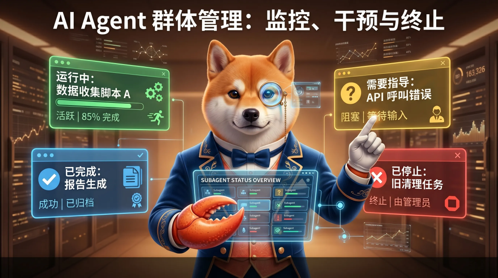
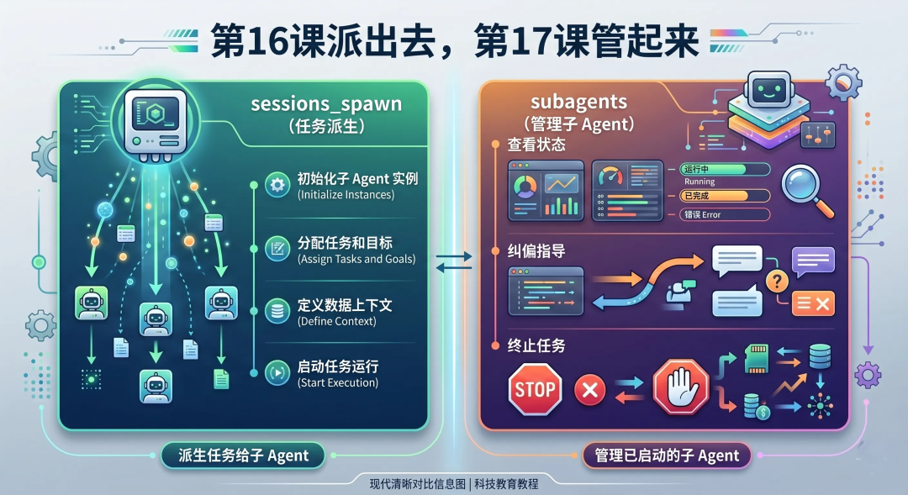
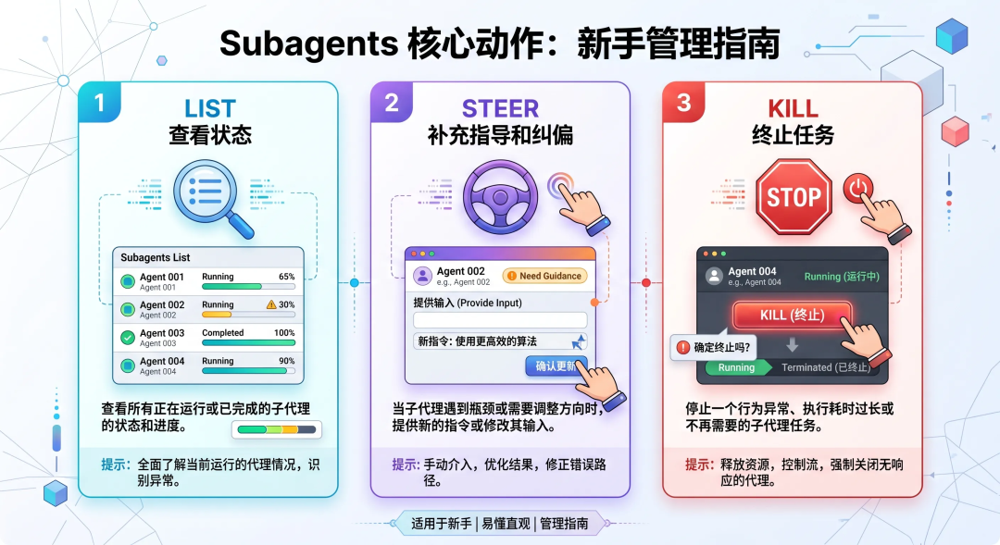
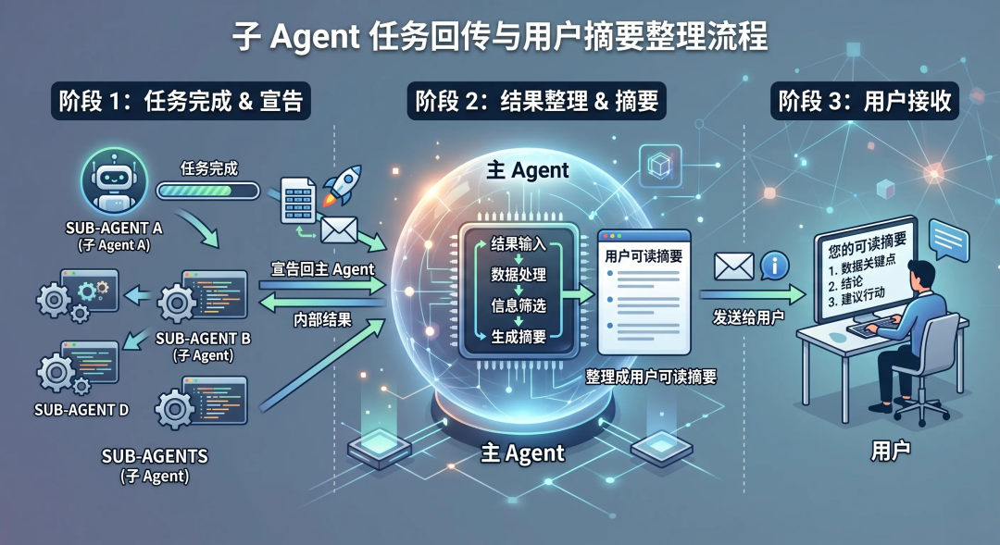
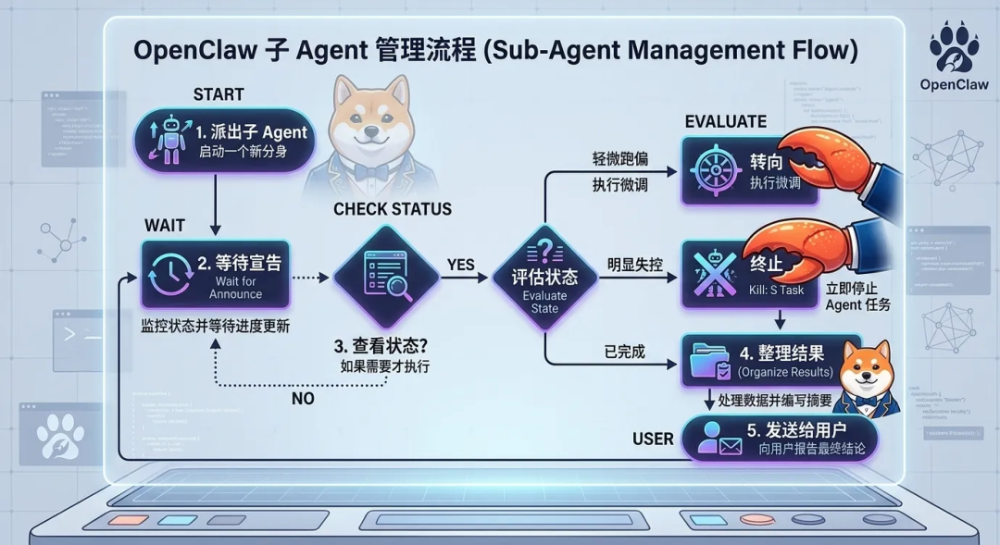

> 📎 来源: [龙虾八条](https://mp.weixin.qq.com/s?__biz=MzY5NzI1NTQ1Mw==&mid=2247483820&idx=1&sn=03fe3ec75a683de2cc81b0b154a843e4&chksm=f5e8611c2726cc0a456bd7f099c848334cee8dc07244c730b1b9f882d478f68781fa3bc369a0&mpshare=1&scene=1&srcid=0511VyvZquzeBTZY89ZVLccd&sharer_shareinfo=1669a48364f0ec821c54ee4e5cc160c9&sharer_shareinfo_first=1669a48364f0ec821c54ee4e5cc160c9) | 时间: 2026-05-11 15:41

---

> 这是「OpenClaw 教程课程」第 17 课。 第 16 课我们讲了 `sessions_spawn`：怎么把任务派给子 Agent。今天这节课接着讲：**任务派出去了，后面怎么管？**



*图：第 16 课解决“怎么派出去”，第 17 课解决“派出去以后怎么管”。subagents 就是管理后台子 Agent 的工具。*

很多人第一次用子 Agent，会有一种错觉：

> “我把任务派出去了，剩下就等结果吧。”

大多数时候，这没错。

OpenClaw 的子 Agent 完成后，会主动把结果 announce 回来。

但真实使用中，你一定会遇到这些情况：

- 子 Agent 跑得太久
- 子 Agent 查错方向
- 子 Agent 的任务已经不需要了
- 你派了好几个子 Agent，不知道谁在干什么
- 子 Agent 完成后返回了一堆内部信息，需要整理成人话

所以，多 Agent 不是“派出去就完事”。

真正好用的多 Agent，需要管理能力。

这一课只讲一个主题：

> **subagents：怎么管理已经派出去的子 Agent。**

## 一、先把关系理清楚：sessions\_spawn 和 subagents

第 16 课已经讲过 `sessions_spawn`，这里快速复习一句。

### sessions\_spawn 负责启动

`sessions_spawn` 的作用是：

> **创建一个新的子 Agent 任务。**

它关注的是：

- 任务是什么
- 交给哪个 Agent
- 用什么模型
- 用 isolated 还是 fork
- 是否设置超时
- 是否要求 sandbox

也就是“派出去”。

### subagents 负责管理

`subagents` 的作用是：

> **管理已经启动的子 Agent。**

它关注的是：

- 当前有哪些子 Agent
- 哪个还在跑
- 哪个需要补充指导
- 哪个应该停掉

也就是“管起来”。

所以这两节课连起来就是：

> **第 16 课：怎么派生子 Agent。第 17 课：怎么管理子 Agent。**



*图：sessions\_spawn 负责启动子 Agent；subagents 负责管理已经启动的子 Agent。两者是一前一后的关系。*

## 二、subagents 管理的核心动作

OpenClaw 文档里，`subagents` 这个管理工具主要支持三类核心动作：

- `list`
- `steer`
- `kill`

你可以先这样理解：

| 动作 | 作用 | 什么时候用 |
| --- | --- | --- |
| `list` | 查看子 Agent 状态 | 想知道谁在跑、是否还活着 |
| `steer` | 给子 Agent 补充指导 | 方向偏了，但任务还能继续 |
| `kill` | 终止子 Agent | 任务不需要、跑偏严重或风险变高 |

对应到用户可用的 slash command，常见是：

```
/subagents list/subagents steer  /subagents kill
```

文档里还列了更多命令，例如：

```
/subagents info /subagents log  [limit] [tools]/subagents send  /subagents spawn   [--model ] [--thinking ]
```

不过新手先掌握 `list / steer / kill` 就够了。

它们分别对应：

> **看状态、纠方向、踩刹车。**



*图：subagents 管理最核心的三个动作：list 查看状态，steer 补充指导，kill 终止任务。*

## 三、list：按需查看状态，不要拿来轮询

`list` 是最基础的动作。

它用来查看当前会话派出去的子 Agent。

比如：

```
/subagents list
```

你可能会在这些时候用它：

- 忘了刚才派了几个子 Agent
- 想确认某个子 Agent 是否还在运行
- 想知道哪个编号对应哪个任务
- 准备 steer 或 kill 之前，先确认目标

但是这里有个非常重要的点：

> **list 是按需查看，不是轮询等待。**

OpenClaw 文档明确说，子 Agent 的完成是 push-based completion。

也就是说：

> 子 Agent 完成后，会主动 announce 回来。  

你不需要每隔几秒 `/subagents list` 一次。

那样会带来几个问题：

- 浪费工具调用
- 增加上下文噪音
- 打扰用户
- 把主对话变成“状态刷新器”

正确方式是：

1. 派出子 Agent
2. 主对话继续处理别的事，或安静等待
3. 子 Agent 完成后主动回报
4. 只有怀疑卡住、跑偏、需要干预时，才 list

这和第 12 课讲 `exec` 后台任务很像。

后台任务不要靠 sleep 循环等。

子 Agent 也不要靠 list 循环等。

## 四、为什么“不要轮询”等于专业用法？

很多新手会觉得：

> “我多查几次状态不是更保险吗？”

其实不是。

多 Agent 系统里，轮询通常是坏习惯。

### 1）它会消耗上下文

每一次 list、log、history 都会把一些状态信息带回对话。

如果只是为了等完成，这些信息大多没价值。

### 2）它会干扰主 Agent 判断

主 Agent 本来应该关注用户任务。

如果对话里塞满“子任务还没完成”，反而会分散注意力。

### 3）OpenClaw 本来就有完成回传

既然子 Agent 完成后会 announce，轮询就是重复造轮子。

所以你可以把原则写进任务要求里：

```
派出子 Agent 后不要循环检查状态；等它完成后主动汇报。只有需要干预时再查看。
```

这是很实用的一句。

## 五、steer：子 Agent 没错完，只是需要纠偏

`steer` 是我很喜欢的一个动作。

它不是终止任务，而是给子 Agent 补充指导。

你可以把它理解成：

> **你在远程提醒后台同事：方向稍微收一下。**

比如你派了一个子 Agent：

```
去整理 OpenClaw 的 TTS 文档。
```

但它开始扩展到通用语音合成行业介绍。

这时不用马上 kill。

可以 steer：

```
/subagents steer 1 请只基于 OpenClaw 本地文档总结，不要扩展到通用 TTS 行业内容。
```

这样子 Agent 还能继续利用已经做的工作，只是把方向拉回来。

### steer 适合什么情况？

适合这些情况：

- 任务还在运行
- 方向有点偏，但还能救
- 需要补充输出格式
- 需要增加限制条件
- 需要让它收敛范围
- 需要提醒它不要做某类动作

例如：

```
/subagents steer 2 后续只做只读分析，不要修改文件。
```

或者：

```
/subagents steer 1 输出控制在 5 条以内，优先给结论，不要展开背景介绍。
```

### steer 不适合什么情况？

不适合把任务完全换掉。

比如原来让它“查文档”，中途改成“帮我重构代码”。

这种任务已经不是纠偏，而是换任务。

更好的做法是：

1. kill 旧子 Agent
2. 重新 spawn 一个任务说明清楚的新子 Agent

## 六、kill：任务没价值了，就及时止损

`kill` 是终止子 Agent。

常见命令：

```
/subagents kill 1
```

终止所有当前请求方的子 Agent：

```
/subagents kill all
```

它适合这些情况。

### 1）任务已经不需要了

比如主对话里已经解决了问题，后台子 Agent 继续跑就浪费。

### 2）明显跑偏

如果 steer 后仍然偏，或者方向完全错了，就没必要继续。

### 3）风险变高

比如你发现子 Agent 可能要执行不该执行的写入、删除、外部发送。

要及时 kill。

### 4）成本不值得

子 Agent 是独立模型调用，有自己的 token 使用。

如果任务太大、太慢、产出不确定，就该停。

### 5）原始 task 写坏了

有时不是子 Agent 的问题，而是你最开始给的 task 太模糊。

这种情况下，与其不断 steer，不如 kill 后重写 task。

记住：

> **kill 不是失败，而是止损。**

多 Agent 系统里，及时停止错误方向，是很重要的能力。

## 七、/stop 和 /subagents kill 有什么区别？

这两个都像“停止”，但范围不同。

### /subagents kill

它针对子 Agent。

比如：

```
/subagents kill 1
```

意思是停掉某个子 Agent。

```
/subagents kill all
```

意思是停掉当前请求方派出的所有子 Agent。

### /stop

`/stop` 是更大的刹车。

文档里提到，在 requester chat 里发送 `/stop`，会 abort 当前 requester session，并停止它派生出的活跃子 Agent，嵌套子 Agent 也会级联停止。

你可以这样理解：

> **kill 是停子任务，/stop 是停当前这一轮大任务。**

如果只是某个子 Agent 不需要了，用 kill。

如果整个当前请求都要停，用 /stop。

## 八、info 和 log：排错时再看细节

除了 list / steer / kill，还有两个常用排错命令：

```
/subagents info /subagents log  [limit] [tools]
```

### info 看运行元信息

`info` 适合查看：

- 子 Agent 状态
- session id
- 时间戳
- transcript path
- cleanup 设置

它更像“任务档案”。

### log 看过程

`log` 适合查看子 Agent 运行过程。

但不要滥用。

如果只是等待完成，不需要一直看 log。

如果子 Agent：

- 失败了
- 超时了
- 输出不完整
- 你怀疑它卡住了

这时再看 log 比较合适。

### 更推荐 sessions\_history 做安全回看

文档里还提到，`sessions_history` 是更安全的回看方式。

它不是原始 transcript dump。

它会做一些处理，例如：

- 去掉部分工具调用脚手架
- 去掉一些模型控制标记
- 对疑似凭据文本做脱敏
- 截断超长内容

所以如果只是想“了解子 Agent 做了什么”，优先用 bounded、过滤后的 history。

只有真的需要完整原始记录时，再去看磁盘 transcript。

## 九、send 和 steer 有什么区别？

文档里 slash command 有：

```
/subagents send  /subagents steer
```

新手可能会问：这俩有什么区别？

你可以先这样理解：

- `steer`：用于运行中的任务纠偏，更像“指导它怎么继续”
- `send`：更像给子 Agent 会话发一条消息，适合更一般的交互

在大多数“正在跑的子任务需要补充约束”的场景里，优先说 steer。

比如：

```
/subagents steer 1 请停止扩展资料范围，只输出已找到内容的结论。
```

这比 send 更明确。

## 十、子 Agent 完成后，主 Agent 要做什么？

子 Agent 完成后，会 announce 回请求方。

announce 里可能包含：

- Result
- Status
- runtime
- token usage
- sessionKey
- transcript path

这些信息对系统有用。

但用户不一定需要原样看到。

主 Agent 应该做的是：

> **把子 Agent 的结果整理成用户可读的最终回复。**

比如不要这样发：

```
Status: completed successfullyResult: ...runtime 2m11s tokens 8930 sessionKey agent:...
```

更好的方式是：

```
子任务完成了。我把结果整理成 4 点：1. ...2. ...3. ...4. ...
```

也就是说：

> **内部元数据用于编排，用户回复要像正常人话。**



*图：子 Agent 完成后会 announce 回请求方；主 Agent 应该提炼结果，而不是原样转发内部元数据。*

## 十一、管理子 Agent 的推荐流程

日常使用时，可以记这套流程。

### 第一步：spawn 时写清楚任务

虽然这是第 16 课内容，但它直接影响第 17 课。

任务越清楚，后面越少需要管理。

### 第二步：派出后不要轮询

等待完成回传。

主对话可以继续做别的事。

### 第三步：必要时 list

如果怀疑卡住、忘了编号、需要干预，再 list。

### 第四步：轻微跑偏用 steer

补充限制、收敛范围、调整输出格式。

### 第五步：明显失控用 kill

任务不需要、风险变高、方向完全错了，就停。

### 第六步：完成后整理结果

把 announce 内容变成用户可读的结论。

这套流程可以概括成一句：

> **少查状态，及时纠偏，必要止损，结果重写。**



*图：子 Agent 管理流程：派出任务后等待完成；需要时查看状态；轻微跑偏就 steer；明显失控就 kill；完成后整理结果。*

## 十二、一个实战例子：子 Agent 查资料跑偏了

假设你派了一个子 Agent：

```
请整理 OpenClaw TTS 文档里的 /tts 命令和 auto-TTS 规则。
```

过了一会儿，你发现它可能开始讲通用 TTS 行业背景。

这时候可以这样处理。

### 1）先查看当前子 Agent

```
/subagents list
```

找到对应编号，比如是 `1`。

### 2）用 steer 收敛范围

```
/subagents steer 1 请只基于 OpenClaw 本地文档总结，不要扩展到通用 TTS 行业背景。最终输出控制在 6 条以内。
```

### 3）不要继续轮询

等它完成后 announce。

### 4）如果还是跑偏，再 kill

```
/subagents kill 1
```

然后重新派一个更清楚的任务。

这个例子说明：

> **steer 是纠偏，kill 是止损。**

## 十三、另一个实战例子：子 Agent 太慢了

假设你派了一个子 Agent 去查资料。

它跑了很久还没回来。

你可以这样判断。

### 情况 1：任务本来就大

比如查多个目录、多份文档。

那可以继续等。

### 情况 2：范围太大

可以 steer：

```
/subagents steer 1 请停止继续扩展搜索范围，只基于已经找到的资料输出当前结论。
```

### 情况 3：已经没价值

直接 kill：

```
/subagents kill 1
```

然后在主对话里重新规划。

这里的关键是：

> **慢不一定要杀，先判断它是正常复杂，还是范围失控。**

## 十四、第三个实战例子：同时派了多个子 Agent

多 Agent 并行时，管理更重要。

比如你派了两个：

- 子 Agent A：查官方文档
- 子 Agent B：整理已有文章风格

这时你可以先 list：

```
/subagents list
```

确认编号。

如果 A 查偏了，就 steer A。

如果 B 已经不需要了，就 kill B。

不要对所有子 Agent 发同一条模糊指令。

更好的做法是：

```
/subagents steer 1 请只看官方文档，不要看文章目录。/subagents steer 2 请只总结写作风格，不要改任何文件。
```

多 Agent 管理时，一定要逐个明确。

否则你会把并行协作变成并行混乱。

## 十五、子 Agent 的成本意识

OpenClaw 文档提醒过：

> 每个子 Agent 默认都有自己的上下文和 token 使用。

也就是说，它不是免费的后台线程。

每派一个子 Agent，都可能带来：

- 模型调用成本
- 工具调用成本
- 时间成本
- 浏览器或 exec 等资源占用
- 后续管理复杂度

所以不要这样做：

```
派 10 个子 Agent，把所有方向都查一遍。
```

更好的方式是：

```
先派 2 个子 Agent：一个查官方文档，一个查已有文章。完成后再决定是否继续。
```

多 Agent 的核心不是“数量多”。

而是：

> **边界清楚、分工明确、结果能汇总。**

## 十六、子 Agent 的权限边界

子 Agent 不是一个无限权限的复制体。

文档里有几个关键点：

- 子 Agent 默认不拿 session tools
- leaf 子 Agent 通常不能继续 spawn 子 Agent
- 当 `maxSpawnDepth >= 2` 时，深度 1 的 orchestrator 才可能拿到编排工具
- 深度 2 的 leaf worker 仍然不能继续 spawn
- 子 Agent 仍然受工具 profile、allow/deny、sandbox 等策略影响

这很重要。

如果子 Agent 做不到某件事，不一定是失败。

可能是权限设计不允许。

比如：

- 它没有 browser 工具
- 它没有 session tools
- 它在 sandbox 里看不到某些路径
- 它不能继续派生更多子 Agent

这些都是为了防止多 Agent 失控。

所以你要记住：

> **子 Agent 是受控后台任务，不是无限递归分身。**

## 十七、适合新手的 subagents 管理模板

下面这些句式可以直接复制。

### 1）查看当前子 Agent

```
/subagents list
```

### 2）查看某个子 Agent 信息

```
/subagents info 1
```

### 3）查看某个子 Agent 日志

```
/subagents log 1 100
```

### 4）给子 Agent 纠偏

```
/subagents steer 1 请收敛范围，只输出和 OpenClaw 官方文档相关的结论。
```

### 5）要求只读

```
/subagents steer 1 后续只做只读分析，不要写文件，不要执行破坏性命令，不要发送外部消息。
```

### 6）要求尽快收尾

```
/subagents steer 1 请停止扩展搜索范围，基于已经完成的内容输出当前结论。
```

### 7）终止一个子 Agent

```
/subagents kill 1
```

### 8）终止全部子 Agent

```
/subagents kill all
```

### 9）告诉主 Agent 不要轮询

```
子 Agent 派出后不要循环查询状态；等它完成后主动回报。只有需要干预时再检查。
```

### 10）要求整理结果

```
子 Agent 完成后，请把结果整理成用户可读的摘要，不要原样转发 sessionKey、token 统计或 transcript path。
```

这些模板背后的共同点是：

> **管理动作要具体，不要模糊催促。**

## 十八、常见坑

### 坑 1：把 list 当进度条

`/subagents list` 不是进度条。

它是按需查看状态的工具。

正确做法：

> 不轮询，等完成回传。

### 坑 2：子 Agent 跑偏了，只会等

如果发现方向偏了，要 steer。

不要等它把错误方向跑完。

### 坑 3：该 kill 时不 kill

如果任务明显无价值、风险变高、成本失控，就停。

及时 kill 是管理能力，不是失败。

### 坑 4：一个 steer 指令太含糊

比如：

```
继续优化一下。
```

这对子 Agent 没帮助。

要写成：

```
请只保留和 OpenClaw docs 有关的结论，输出 5 条以内。
```

### 坑 5：派太多子 Agent 后不知道谁是谁

多 Agent 并行时，最好让任务 label 清楚。

比如：

- `docs-research`
- `style-review`
- `test-runner`

这样 list 时更容易管理。

### 坑 6：把内部元数据直接发给用户

用户通常不需要 sessionKey、transcript path、token 统计。

需要的是结论、风险、下一步。

### 坑 7：忘了子 Agent 也有权限限制

如果子 Agent 无法执行某个工具，先检查工具策略和 sandbox。

不要默认认为它应该什么都能做。

## 十九、subagents 管理的安全原则

我建议你记住这 6 条。

1. **派出前任务要清楚**：管理成本从 task 开始。
2. **完成靠 announce，不靠轮询**：不要制造状态噪音。
3. **轻微跑偏用 steer**：能救就纠偏。
4. **明显失控用 kill**：及时止损。
5. **并行要少量明确**：不要无脑堆子 Agent。
6. **结果要整理成人话**：内部元数据不要原样给用户。

## 二十、这一课最值得记住的一句话

如果今天只记一句话，我建议你记这句：

> **subagents 不是用来等待子 Agent 的，而是用来在必要时管理子 Agent 的。**

再补一句操作原则：

> **平时等 announce，跑偏用 steer，失控用 kill。**

## 二十一、总结

今天这节课，我们把 OpenClaw 的 `subagents` 管理讲清楚了：

1. **sessions\_spawn 负责派生子 Agent，subagents 负责管理子 Agent。**
2. **subagents 的核心动作是 list、steer、kill。**
3. **list 用来按需查看状态，不应该用来轮询等待。**
4. **steer 用来给运行中的子 Agent 补充指导和纠偏。**
5. **kill 用来终止无价值、跑偏严重或风险变高的子 Agent。**
6. **/stop 是更大的刹车，会停止当前运行并级联停止相关子 Agent。**
7. **info 和 log 主要用于排错，不是日常等待机制。**
8. **子 Agent 完成后会 announce，主 Agent 应该把结果整理成人话。**
9. **子 Agent 有成本和权限边界，不是无限分身。**
10. **好的多 Agent 管理，是少量、明确、可控。**

学完这一课，你就完成了多 Agent 的第二块拼图：

- 第 16 课：怎么派出去
- 第 17 课：怎么管起来

下一步，我们就可以进入“自动定时工作”了。

## 下一课预告

下一课我们会讲：

**第 18 课：Cron 定时任务——让 AI 自动定时工作**

也就是：

- OpenClaw 里的 cron 是什么
- 怎么让 Agent 定时运行
- cron 和 heartbeat 有什么区别
- 定时任务适合做什么
- 怎么避免自动任务打扰用户

---

> 🦞 本文由八条撰写，持续更新中。
