> 📎 来源: [研磨架构](https://mp.weixin.qq.com/s?__biz=MzUzOTE3OTc5MQ==&mid=2247484277&idx=1&sn=34d8f37b1aaa26c34f952d12902b2b49&chksm=fb60a4aafa91d4192de904a9e9fcee56668ebfb797210fac6d9a1191d53b8c2c3fe49dd128a5&mpshare=1&scene=1&srcid=0423GPSvdEEeHZCH0p8tr0tX&sharer_shareinfo=5adafccc4e5b517bb373dc52db71d003&sharer_shareinfo_first=5adafccc4e5b517bb373dc52db71d003) | 时间: 2026-04-23 23:59

---

内容创作者最头疼的事是什么？

不是写，是找选题。

每天刷微博、刷知乎、刷抖音、刷头条……刷了一圈下来，时间花了不少，脑子里还是一片空白。等终于憋出一个选题，热点早就凉透了。

有没有一种工具，能把这些平台的热点自动聚合起来，再主动推给我？

有。这个工具叫 TrendRadar，GitHub 上 50.7K Star，开箱即用，我部署完到现在跑了小半个月，体验很稳。

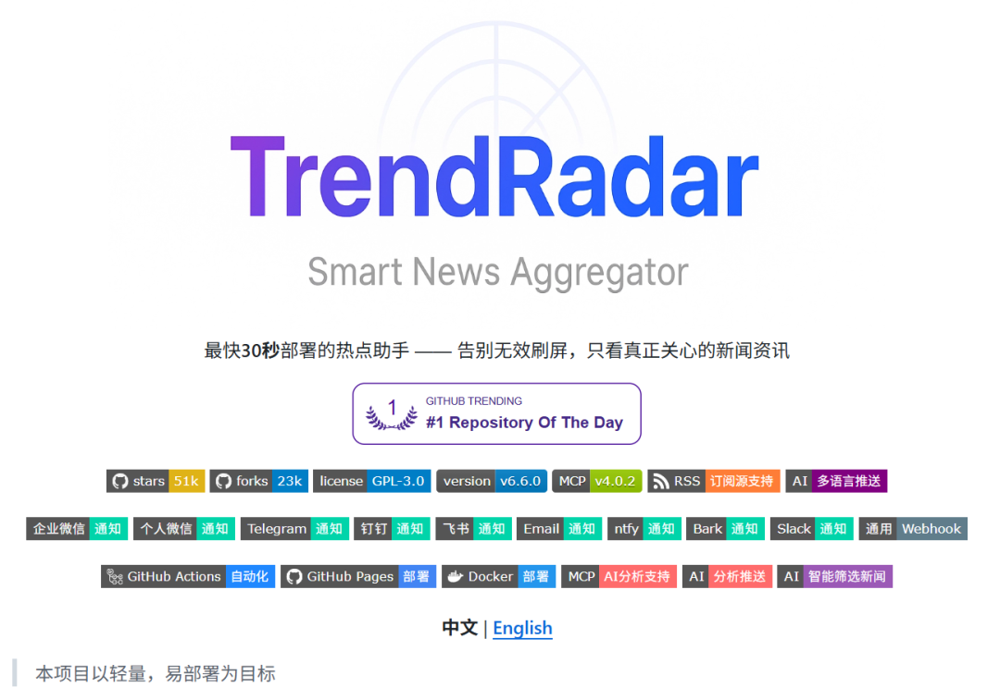

项目热度急剧爬升：

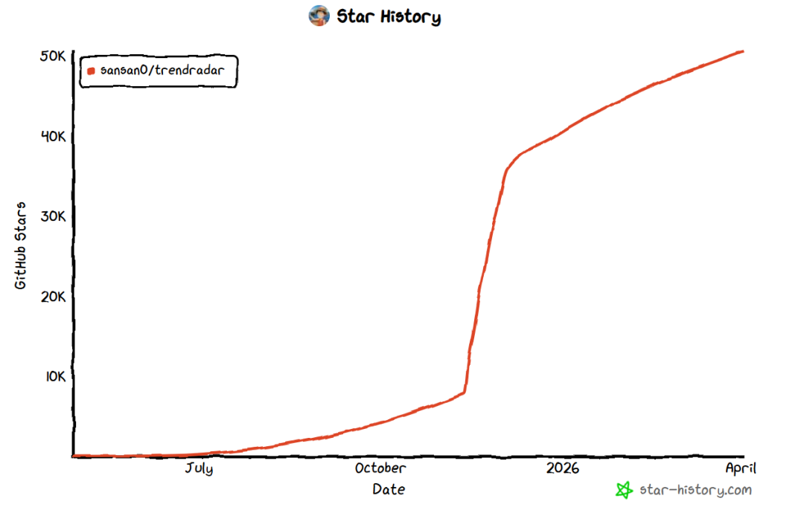

## 这个工具能干什么

简单说，它是一个多平台热点聚合器，核心功能有几块：

**第一，多平台热点抓取。** 支持微博、知乎、抖音、B站、今日头条、百度、微博热门话题等平台的内容同步。

**第二，RSS 订阅源支持。** 如果你有固定的信息源，可以在配置里直接加 RSS 地址，支持 Hacker News、V2EX 等技术社区。

**第三，关键词 + AI 双轮筛选。** 既可以按关键词过滤，也可以让 AI 判断"这条内容跟我的方向是否相关"，后者对于选题探索阶段特别有用。

**第四，AI 翻译。** 抓到的海外内容可以直接翻译成中文，不用专门开梯子。

**第五，多渠道推送。** 支持飞书、钉钉、企业微信、telegram电报，配置完 webhook 之后定时推送到你的设备上，全程不需要人工介入。

**第六，Docker 一键部署。** 不污染本机环境，一行命令跑起来。

这些功能点单独拎出来都不稀奇，但拼在一起而且做到开箱即用，就比较实在了。

飞书推送效果：

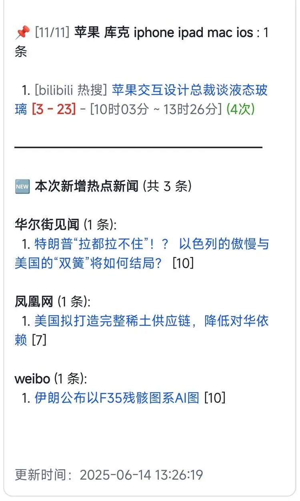

同时也支持网页形式，查看抓取的热点新闻：

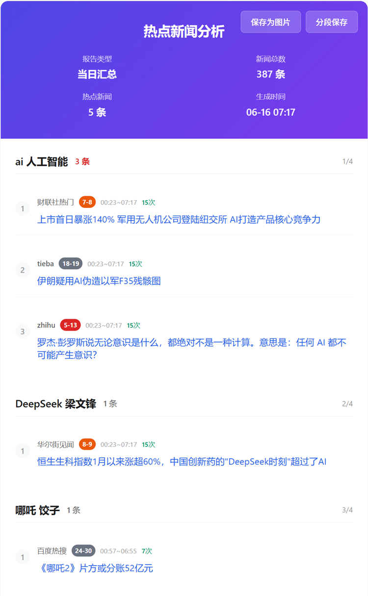

## 怎么部署？两种部署方案

**方案一：本地 Docker 部署（适合个人博主、小团队试水）**

在你的电脑上跑，不依赖服务器，断电即停。定时抓取推送，适合前期验证阶段。

**方案二：服务器部署（适合长期稳定运行、团队共用）**

部署在云服务器上，24小时运行，不依赖本地开机，可以接入飞书群或作为内部情报系统使用。

这篇文章以「本地 Docker + 飞书推送 + 电报」这个组合来讲，适合个人博主快速上手。

## Win11 安装 Docker Desktop

### 第一步：装 WSL 2

注：如果你是windows 10系统，Win + R 打开命令窗口，输入winver查看系统版本，确保内部版本高于19041。如果是你windows 11，直接装。

Docker Desktop 依赖 WSL 2 这个 Linux 子系统，先把它装好。

打开 PowerShell（管理员模式），执行：

`wsl --install`


装完需要重启电脑。

重启后验证是否成功，打开 PowerShell 输入：

`wsl --list --verbose`


看到 WSL 2 版本号正常返回就行了。

### 第二步：装 Docker Desktop

去 Docker 官网https://www.docker.com下载 Docker Desktop for Windows 安装包，双击运行，按提示一步步装完，再次重启电脑。

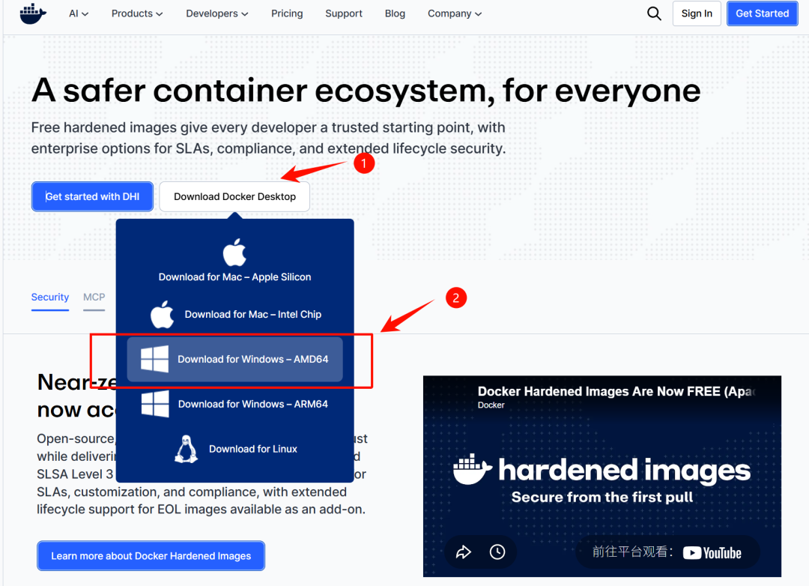

### 第三步：配镜像加速器（可选但推荐）

国内拉 Docker 镜像速度感人，建议配一个镜像源，下载镜像嗖嗖地快了。

打开 Docker Desktop → Settings → Docker Engine，把下面这段粘进去，改完点 Apply：

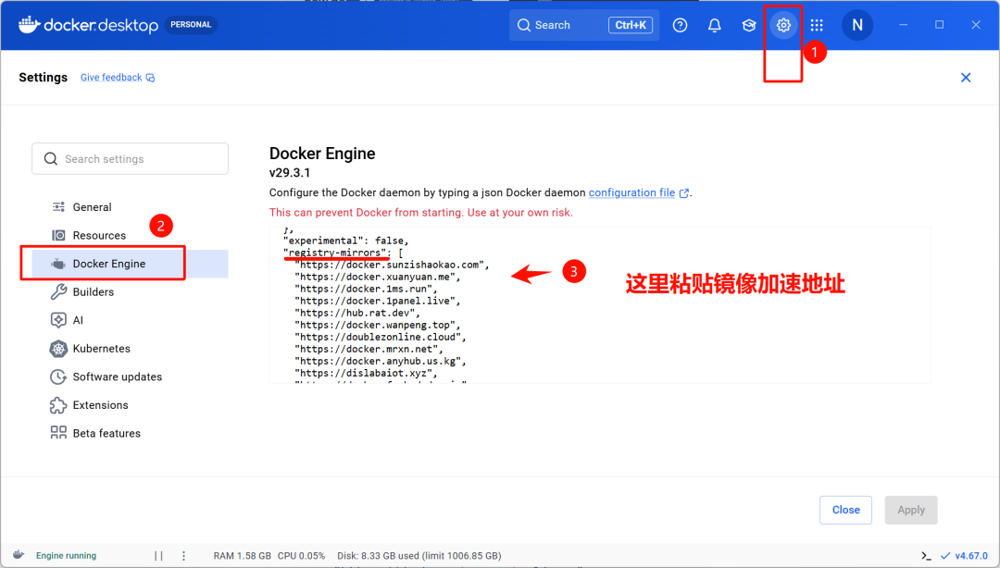

`{
  "registry-mirrors": [
    "https://docker.sunzishaokao.com",
    "https://docker.xuanyuan.me",
    "https://docker.1ms.run",
    "https://docker.1panel.live",
    "https://hub.rat.dev",
    "https://docker.wanpeng.top",
    "https://doublezonline.cloud",
    "https://docker.mrxn.net",
    "https://docker.anyhub.us.kg",
    "https://dislabaiot.xyz",
    "https://docker.fxxk.dedyn.io",
    "https://docker-mirror.aigc2d.com",
    "https://lst9tbfr.mirror.aliyuncs.com"
  ]
}`


## 部署 TrendRadar：三处配置搞定

打开 GitHub 仓库：https://github.com/sansan0/TrendRadar

点击 Code → Download ZIP，下载完解压到本地任意目录，我放在了 F 盘。

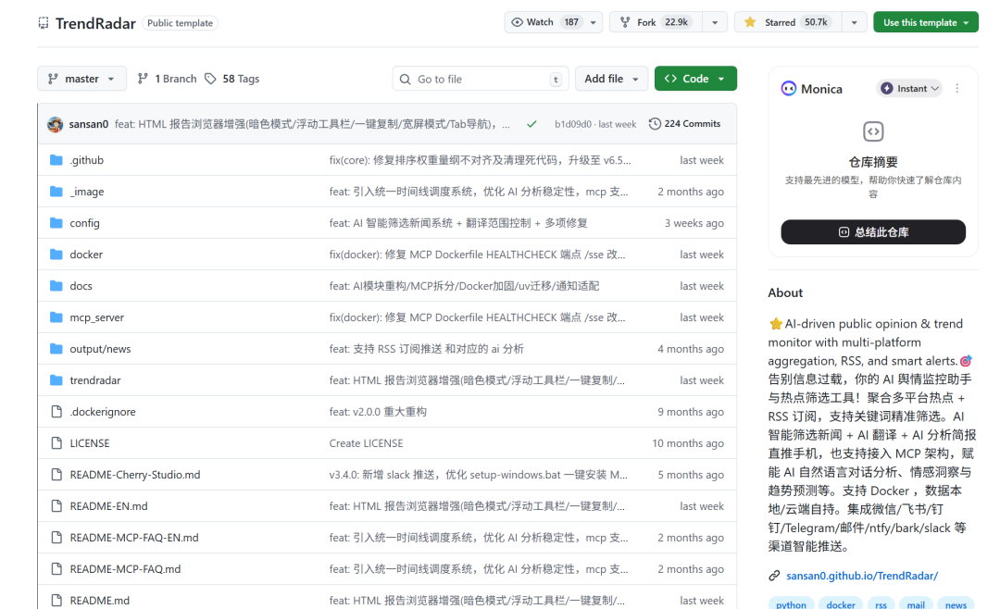

启动前必须先把配置文件改好，不然容器能起来但推送不会有动静。主要改三个地方：

### 配置一：config.yaml

用 VS Code 或记事本打开 

```
config/config.yaml
```

，盯住这几个必改项：

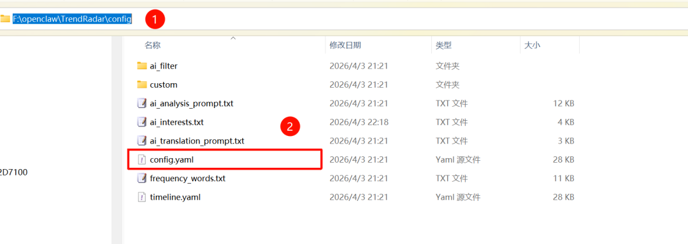

• 

```
app.timezone
```

：国内写 

```
Asia/Shanghai
```

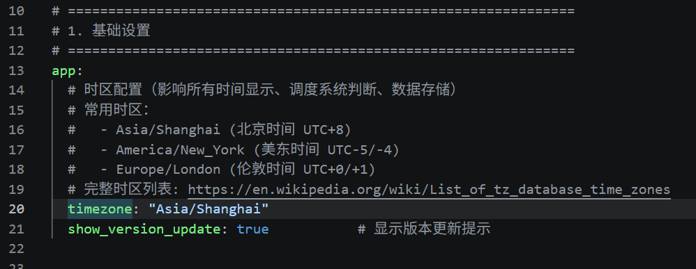

```

```

```
• 
```

```
platforms.sources
```

：增减你想抓的平台，比如知乎、微博、抖音、B站

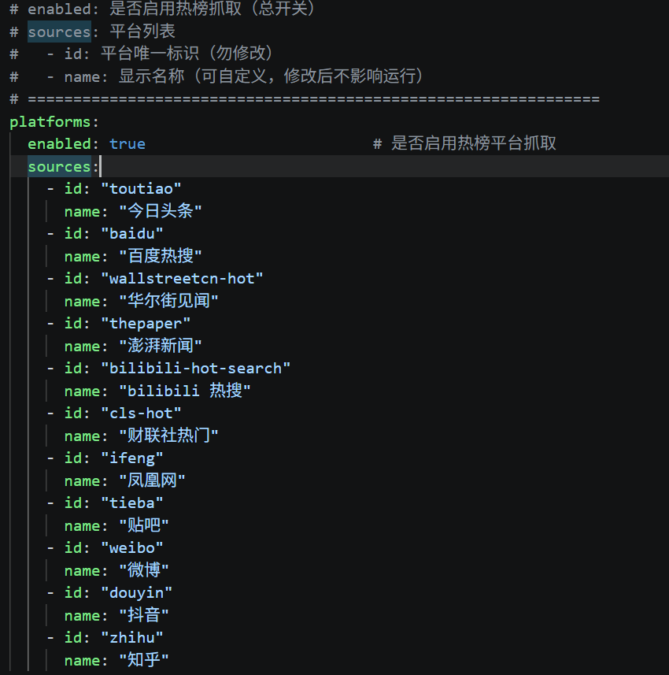

• 

```
rss.feeds
```

：默认有 Hacker News等，想加其他源直接往里填 RSS 地址，不想要的，删掉即可

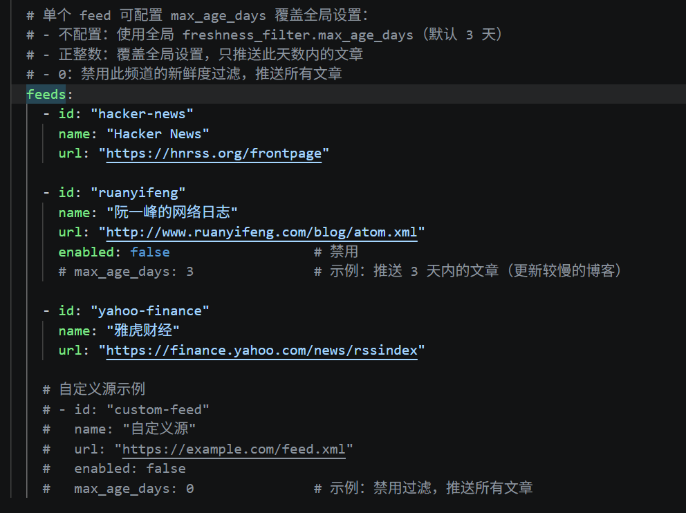

其他项可以先用默认的，后续熟悉了再按需调整。

### 配置二：.env 文件

在 

```
.env
```

 文件里补充以下环境变量：

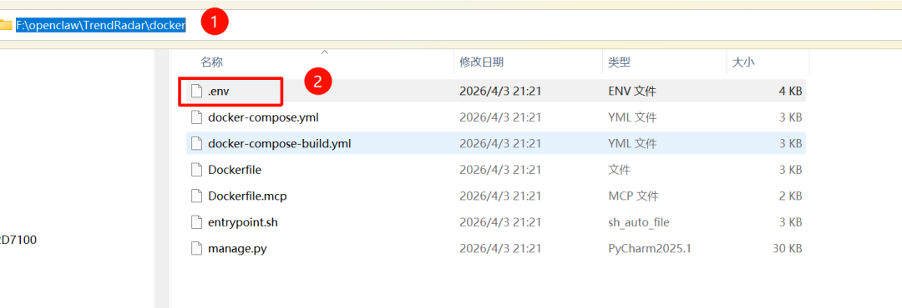

`# 端口，默认8080可以改成8899
PORT=8899

# 飞书机器人 webhook 地址（创建飞书机器人后获取）
FEISHU_WEBHOOK_URL=https://open.feishu.cn/open-apis/bot/v2/hook/xxxxxx


`

也支持填电报、钉钉、企业微信等渠道：

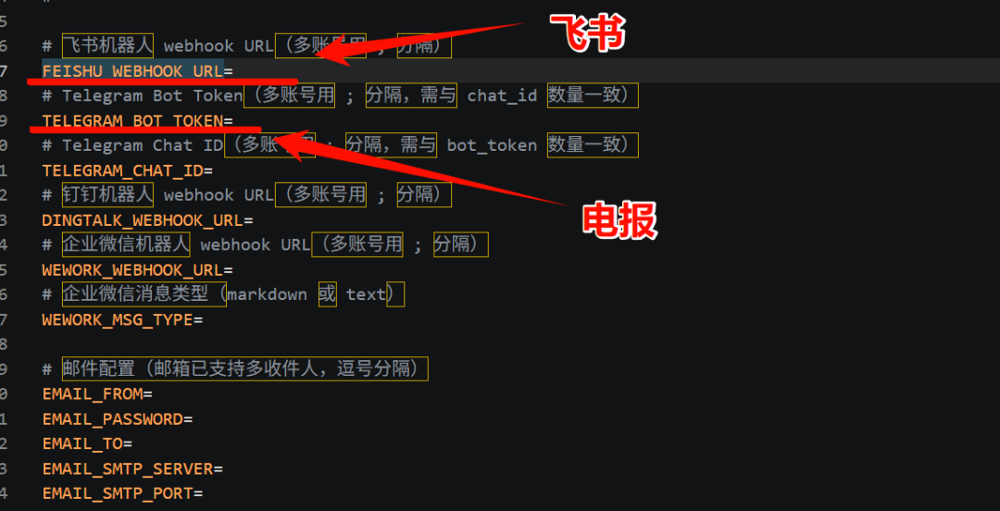

飞书 webhook 怎么获取：在飞书群 → 群设置 → 群机器人 → 添加机器人 → 自定义机器人，把 webhook 地址复制过来。

**电报怎么填 `TELEGRAM_BOT_TOKEN` (机器人令牌)：**

- 在 Telegram 中搜索 `@BotFather` 并开始对话。
- 发送 `/newbot` 命令，然后根据提示为你的机器人设置一个**名字**（例如：MyTrendRadarBot）和一个**用户名**（必须以 `bot` 结尾，例如：MyTrendRadarBot）。
- 创建成功后，`@BotFather` 会回复一条包含 `API Token`（格式如 `1234567890:ABCdefGHIJKLMNOPQRSTUVWXYZ...`）的消息，将其复制下来，这就是你的 **`TELEGRAM_BOT_TOKEN`**
- **`
  `**

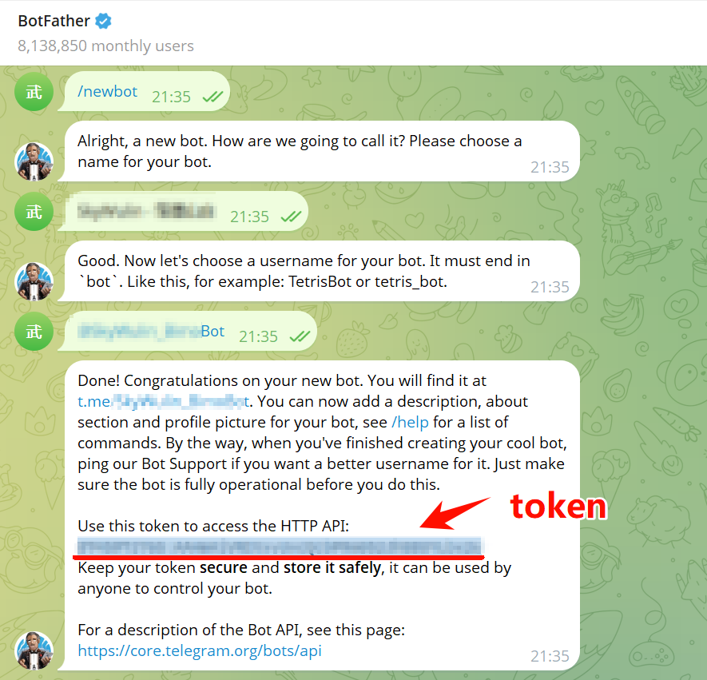

启用AI分析功能，方便分析文章和热点：

```
# 是否启用 AI 分析 (true/false)
```

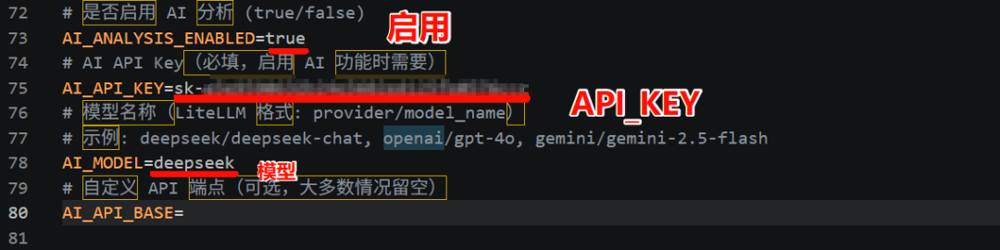

配置定时抓取，我这里配置了4小时一次，你可以按照你的喜好，甚至可以指定周一到周五几点执行，如果不会配置，可以问AI，这个CRON\_SCHEDULE属性的格式是标准的定时器配置格式：

```
# 定时任务表达式，每 240 分钟执行一次
```

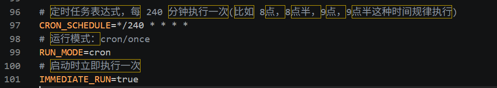

### 配置三：ai\_interests.txt

这个文件决定 AI 怎么帮你过滤内容。

打开 

```
config/ai_interests.txt
```

，这个文件很有意思，里面用自然语言描述你关注的方向就可以了。

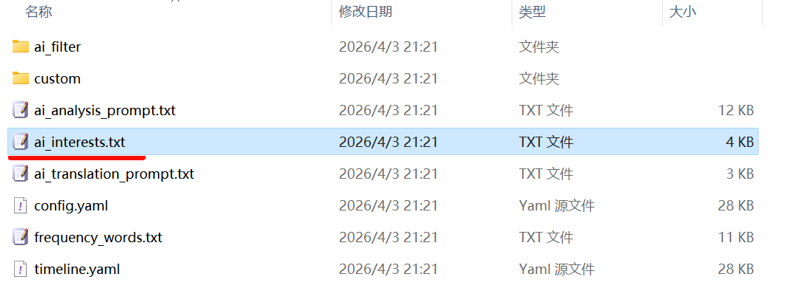

比如我可以写：

> 高度关注 AI 动态，包括但不限于AI 产品、AI 编程工具ClaudeCode、Agent 方向、大模型发展等方向的内容，偏好热点、高传播度、高话题性、适合写成公众号等自媒体选题的资讯。

最终的样子（还可以精简一下，我这里没怎么动）：

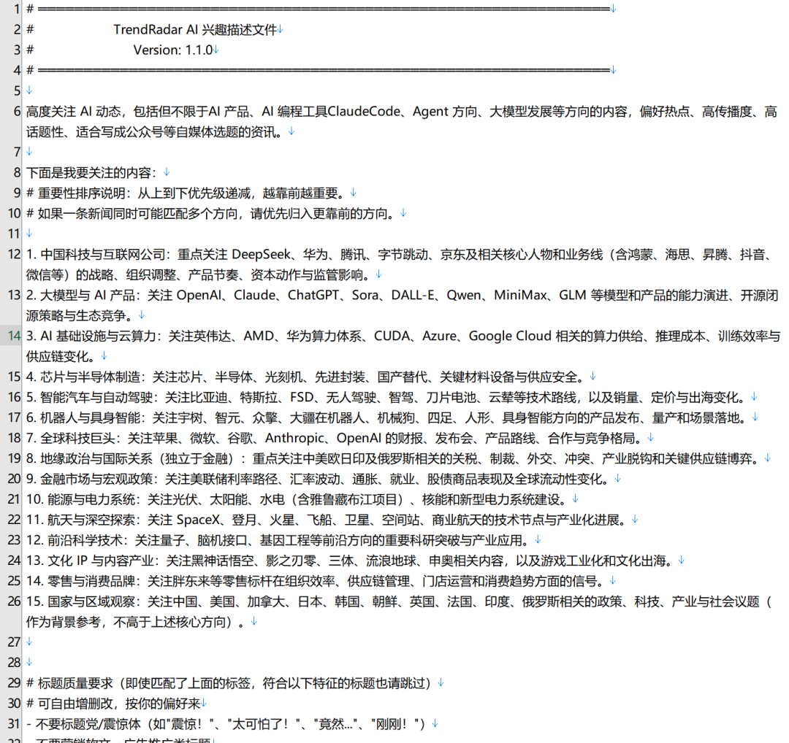

## 启动容器，坐等到推送

配置全部完成后，进入项目里的 

```
docker
```

 目录，在地址栏输入 

```
cmd
```

 打开命令提示符，

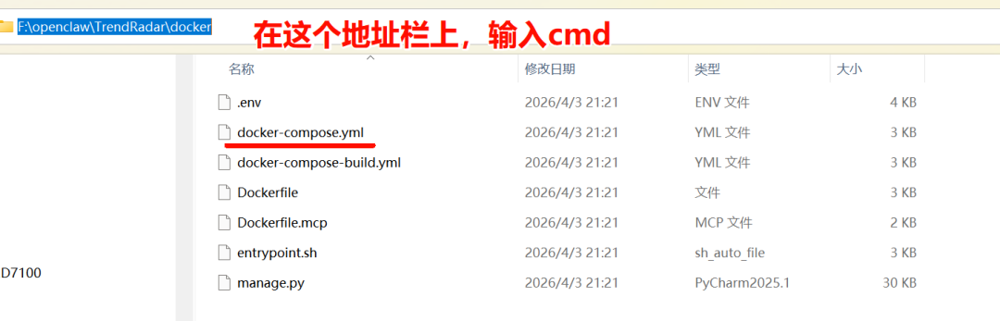

执行：

`docker compose up -d`


第一次启动会拉取镜像，等一两分钟。跑起来之后，验证容器状态：

`docker ps`


看到 8999 端口在运行，说明部署成功。

接下来坐等飞书推送就行。每天定时收到热点聚合内容，推送里包含各平台热搜标题、摘要和 AI 总结分析。

如果想直接在本机看，打开浏览器访问 

```
http://localhost:8999/#tab-0
```

，热点数据、平台分布、AI 总结都在上面。


## 跑了半个月，说说感受

对我来说，这个工具真正解决的不只是"热点抓取"这件事，而是整个信息流的主动性问题。

以前是我去找信息，容易刷着刷着注意力漂移，半小时过去了只记住了几个热搜标题。现在是信息按时推过来，我只需要判断"这条值不值得写"，其他环节全自动化了。

对于公众号博主、自媒体人、独立开发者这些每天需要跟踪热点的人来说，这套组合值得试试。

项目地址：https://github.com/sansan0/TrendRadar

动动手指部署一下，第一条推送可能明天就到了。

有了这些素材以后，再结合OpenClaw小龙虾，那不手拿把掐的~

如果有想学AI和OpenClaw，这里有免费体验3天的课程，详尽的教程，涵盖公众号矩阵玩法、小红书虚拟手册、OpenClaw获客、AI漫剧、AI绘画、AI编程、OPC一人公司等等内容：


如果你想和交流，**欢迎**关注**研磨架构，不迷路流**：

|  |  |
| --- | --- |
|  |  |
