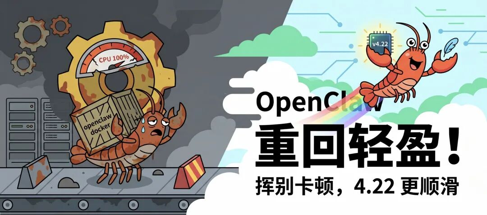

> 📎 来源: [i龙虾](https://mp.weixin.qq.com/s?__biz=MzI3MTk5OTc3Ng==&mid=2247484443&idx=1&sn=89a6277c9d4cb42dbfb941f981314ccd&chksm=ea0b452709c7649498e169314374719d2c71481c15d0fda4d36a6d929ad2fd83ef8c879e2eef&mpshare=1&scene=1&srcid=0424FGWgRvoyNMQNPcoZLxvY&sharer_shareinfo=d340d0d395a4cca0f01b35fe0d63b6ac&sharer_shareinfo_first=d340d0d395a4cca0f01b35fe0d63b6ac) | 时间: 2026-04-24 15:08

---



4月21日到23日，OpenClaw 连出三版。节奏挺快的——三天三次推送，而且不是小修小补，4.20 和 4.22 都是内容量很大的版本。

这次更新后一个最明显的感受是OpenClaw终于又恢复了原先的轻盈。之前某个版本更新后执行openclaw命令就会变卡，CPU飙升，像执行个openclaw docker后就很慢，这次更新后终于正常了。

---

## 4.20：安全再次加固

4.20 的 changelog 大概六七十条，但安全相关的修复集中得很明显，几乎占了三分之一。

**设备配对权限收紧。** 以前非管理员设备能看到其他设备的配对列表，能批准别的设备发来的配对请求。现在非管理员只能管自己的，看不到别人的，也批准不了别人的请求。

**WebSocket 广播加了权限门槛。** 之前配对作用域内的会话能被动接收其他 session 的聊天内容，包括它本不该看到的消息。现在接收对话内容至少需要

```
operator.read
```

，未知类型的广播事件也默认隔离。

**Agent 无法再改网关核心配置。** 这个改动我觉得挺重要的。以前 AI 可以通过

```
config.patch
```

 或

```
config.apply
```

 指令修改网关配置，现在这条路被堵死了——沙箱设置、插件信任、网关认证、SSRF 策略、MCP 服务器，这些全都不能被模型驱动的指令覆写。如果 AI 能改网关配置，整个安全体系等于是纸糊的，这个补得对。

**MCP 环境变量注入被拦截。**

```
NODE_OPTIONS
```

 这类解释器启动时的环境变量现在会被 stdio 服务器过滤，不让注入。

**dotenv 的 fail-closed 策略。** 工作区

```
.env
```

 文件里的

```
OPENCLAW_*
```

 键名不再被不受信任的工作区继承。之前是"未知键默认通过"，现在改成了"未知键默认拒绝"。思路对，总算来了。

**QQBot 两处 SSRF 修复（AI 辅助发现）。**

```
uploadC2CMedia
```

 和

```
uploadGroupMedia
```

 的直传 URL 路径加了 SSRF 防护，MINIMAX\_API\_HOST 的工作区环境变量注入也被封堵了。这两条 changelog 末尾都标了

```
[AI-assisted]
```

，意思是 AI 辅助发现并修复的。这个用法越来越常见了。

4.22 里安全补丁也没停——

```
.env
```

 里新增了 Matrix、Mattermost、IRC、Synology 等端点设置的工作区覆写拦截，Telegram 群里的

```
/models
```

 命令现在也会做权限校验，未授权用户无法通过内联按钮浏览或修改模型了。

---

## 4.21 可以使用最强生图模型了生图了

图片生成默认切到

```
gpt-image-2
```

，支持 2K/4K。OpenAI 图片失败时现在会在 warn 级别记日志，就算后备 provider 接手成功了也能看到原始失败原因。

一个安全修复：

```
enforceOwnerForCommands=true
```

 启用时，

```
commands.ownerAllowFrom
```

 如果没配置，之前非 owner 用户可以通过宽泛的

```
allowFrom
```

 或空 owner 列表绕过，直接触发 owner-only 命令。现在收紧了，必须真正通过 owner 身份验证。

Slack thread 回复有时候会跑到错误的 thread，也修了。

---

## 4.22 xAI 多模态全套来了

这版最显眼的新功能是 xAI 的多模态支持，一口气加了图片生成、文字转语音、语音转文字三块。

图片生成：

```
grok-imagine-image
```

 和

```
grok-imagine-image-pro
```

，支持参考图片编辑。OpenAI 的图片生成默认模型也在 4.21 里从旧版换成了

```
gpt-image-2
```

，现在支持 2K/4K 分辨率。

语音：六种 xAI 原生声音，支持 MP3/WAV/PCM/G.711 输出格式。语音转文字走

```
grok-stt
```

，也支持 Voice Call 实时转录流。

同一版本里，Deepgram、ElevenLabs、Mistral 也加了 Voice Call 实时转录支持，ElevenLabs 还额外加了 Scribe v2 批量音频转录。语音这块正在全面铺开。

---

## TUI 本地嵌入模式：不启 Gateway 也能用了

这个我觉得比较实用。以前 TUI 终端聊天必须依赖 Gateway 才能跑，4.22 加了本地嵌入模式（embedded mode），可以在没有 Gateway 的情况下直接在终端跑对话，插件审批机制还是保留的。

想轻量体验、或者临时用用但不想启服务的场景，现在有路了。

---

## 腾讯云、Bedrock Claude Opus 4.7 Mantle

4.22 新加了腾讯云（Tencent Cloud）provider 插件，内置 TokenHub 鉴权流程和 Hy3 模型的计价元数据，型号是

```
hy3-preview
```

。

Amazon Bedrock 这边加了一条新路：通过 Mantle 的 Anthropic Messages 路由接入 Claude Opus 4.7，带 bearer-auth 流式支持，不需要再把 AWS bearer token 当 Anthropic API key 用了。同时，Opus 4.7 的上下文窗口在 runtime 元数据里也修正成了 1M，之前一直错误继承了 200k 的旧值。

---

## WhatsApp 两个值得单说的修复

**重复发送 bug（#70386）。** 这个 bug 挺经典的：Cron 消息在 WhatsApp 30 分钟无消息看门狗触发、同时有重连 drain 进行时，会被重复发送 7 到 12 次。原因是出站发送过程中没有持有"正在发送"的锁，并发的重连 drain 会把同一条待发消息重新驱动一遍。现在加了进程内的 active-delivery claim，发送过程中锁住，重连不再重复触发。

**群组和私聊的系统提示（

```
systemPrompt
```

）。** 现在可以给每个 WhatsApp 群组或私聊单独配置系统提示了，支持

```
"*"
```

 通配符兜底。这个能力 BlueBubbles 在 4.20 里就加了，WhatsApp 在 4.22 跟进，也支持账号级别的覆写（account-scoped overrides）。

---

## Kimi 多轮工具调用 bug 修了

这个 bug（#62319）是 Kimi K2.6 在做多轮工具调用时，用的是

```
functions.:
```

 这种格式的 tool\_call ID，但 OpenAI 兼容传输层会对这个 ID 做"净化"处理，把格式改掉，导致服务端对不上原始定义，2-3 轮之后 agentic 流直接断掉。

现在 Moonshot 路径加了

```
sanitizeToolCallIds
```

 的退出开关，不再强行净化 Kimi 原生的 tool call ID 格式了。如果你之前遇到 Kimi 跑几轮就挂的情况，大概率就是这个。

---

## 重回轻盈：plugin 加载提速 82-90%，doctor 提速 74%

4.22 里有两个性能改进比较显著。

bundled plugin 加载改用 Jiti 原生加载方式，实测比之前快了 82-90%，TypeScript 源文件仍然走 transform 路径。

```
openclaw doctor --non-interactive
```

 的冷启动时间降了约 74%，主要靠延迟加载 doctor plugin 路径和优先走已构建的

```
dist/*
```

 产物。

日常用 doctor 做诊断的人应该会有感知，以前等的时间挺长的。

---

## ``` /models add ``` 命令

4.22 加了

```
/models add
```

 命令，可以在对话里直接注册一个新模型，不用重启 gateway 就能用。

顺带，

```
config set
```

 加了

```
--merge
```

 和

```
--replace
```

 两个标志，分别对应"追加"和"完全覆盖"，之前用 config 命令误操作把模型配置全删的问题可以通过

```
--merge
```

 规避了（#65920、#68392、#68653）。

---

## 几个之前踩过坑的修复

**lossless-claw 兼容性（4.20 修）。** 4.14 引入的 context engine id 严格匹配规则把

```
lossless-claw
```

 打挂了，每次对话都报

```
info.id must match registered id
```

。4.20 里修了，不再要求 engine id 和注册 slot id 强一致。

**费用计算多算问题（4.20 修）。**

```
estimatedCostUsd
```

 每次持久化都把同一次运行费用重复叠加，最高叠几十倍。修完后账单会准一些。

**Cron 状态文件分离（4.20 新增）。** 运行时状态现在单独存到

```
jobs-state.json
```

，

```
jobs.json
```

 只放任务定义，用 git 追踪 Cron 配置的人不会再因为每次跑完任务

```
jobs.json
```

 就变脏了。

**Ollama

```
/think off
```

 不生效（4.22 修，#69902）。**

```
/think off
```

 和

```
--thinking off
```

 对 qwen3 这类 Ollama 模型一直不起作用，会一直等到看门狗超时。现在改成把

```
think: false
```

 直接传给 Ollama 的

```
/api/chat
```

 接口了。

**Claude CLI session 跨重启断连（4.22 修）。** Gateway 重启后 Claude CLI session binding 会丢失，下次对话变成新开一个 session，之前的对话上下文断了。现在改成按稳定的账户身份做 key，OAuth token 轮换不再导致 session 重置。

**MCP 进程泄漏（4.22 修）。** stdio MCP 进程在 transport 关闭时没有被正确清理，session 删除/重置时也没有释放 bundled MCP runtime，导致孤立进程积累。现在统一走一条清理路径了（修了 #68809、#69465、#69145 等）。

---

## 小结

三版放在一起来看：

4.20 是一次系统性的安全审计结果落地，能感觉到是有人认真对着权限边界过了一遍，而不是随机发现一个修一个。

4.22 是功能量很大的一版——xAI 多模态、TUI 本地模式、腾讯云接入、Opus 4.7 Mantle 路由，加上 plugin 加载性能的显著提升。加在一起对日常使用者影响不小。

如果你现在还在 4.19 或更早，这三版都值得升。Ollama +

```
/think off
```

 的用户、Kimi 多轮工具调用的用户、WhatsApp Cron 消息重复发送的用户，有几个针对性的修复。

我已经升级到了4.22，目前没有发现问题。
