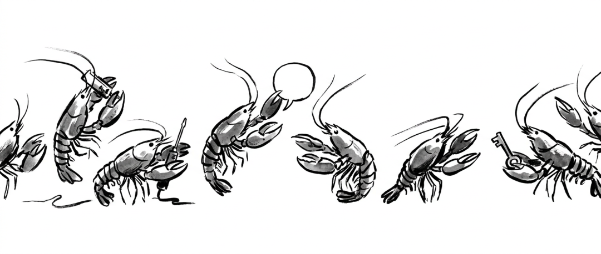
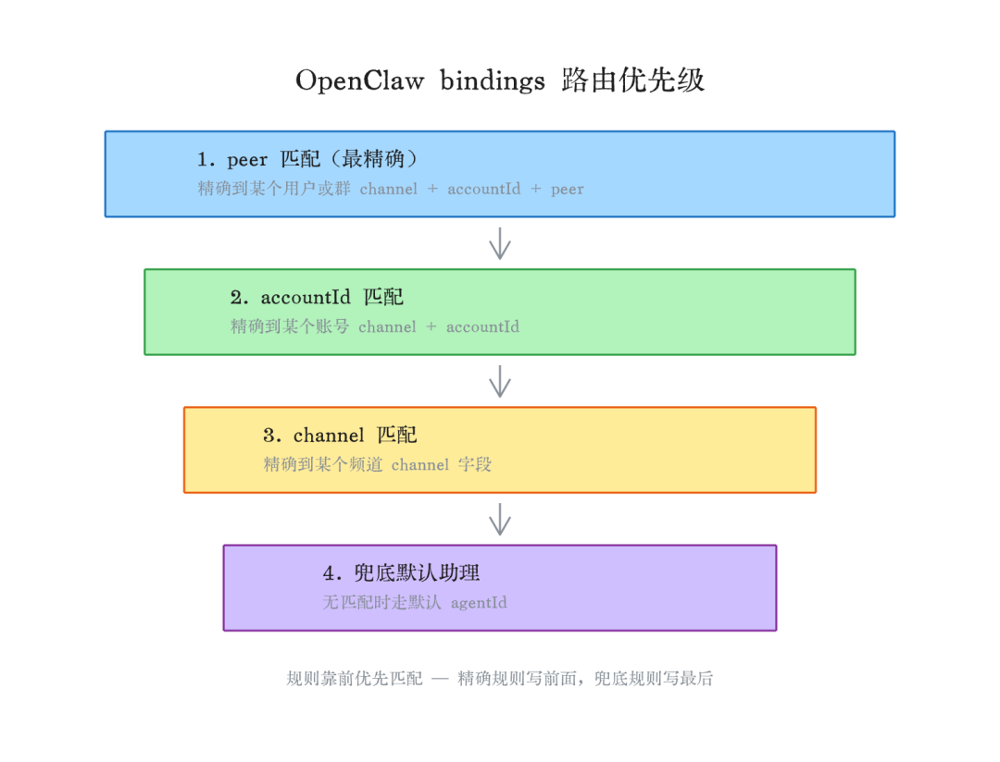
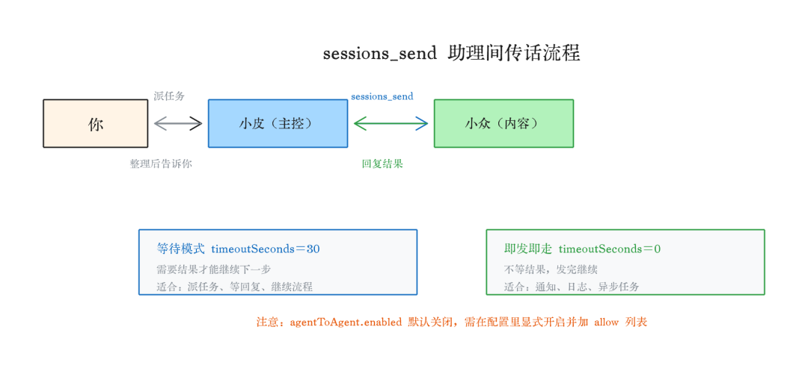

> 📎 来源: [小众AI](https://mp.weixin.qq.com/s?__biz=Mzg5MjkzNDcxMA==&mid=2247484111&idx=1&sn=34e6360eee2d305598bcc6e0251cd162&chksm=c1afef9d4b9067f852c80835f9b1f3d9a48b79eac05a99b3e9e1181a0c27a22cc234c3a08437&mpshare=1&scene=1&srcid=0421keOcceTbnzUybbfVaRjJ&sharer_shareinfo=4d62c74189c0d2ad0f3eb5864ded9bbf&sharer_shareinfo_first=4d62c74189c0d2ad0f3eb5864ded9bbf) | 时间: 2026-04-21 12:04

---

大家好，我是青澈君，一个喜欢捣鼓openclaw的80后，顺便学学Vibe Coding，也在坚持写日记。



上一篇文章👉[OpenClaw从零搭好你的 AI 团队之如何养好多只小龙虾](https://mp.weixin.qq.com/s?__biz=Mzg5MjkzNDcxMA==&mid=2247484105&idx=1&sn=c92b353acbe7be5d205eed067dbeae03&scene=21#wechat_redirect)讲了怎么把多个助理跑起来：申请 Bot Token、配置 openclaw.json、写好 workspace 核心文件，验证群里 @ 有响应。

如果你按那篇搭下来，现在应该有了一支各管各的 AI 团队。助理响应归响应，但它们互不知情，路由也是最粗的那一层。这篇讲进阶：路由怎么设计得精确、助理间怎么直接传话、权限怎么分、出问题怎么查。

## bindings 进阶：路由规则怎么设计

上一篇用了最简单的 binding：一个账号对应一个助理，够用。但实际用下来，你迟早会遇到更复杂的场景。

「OpenClaw」的路由遵循一个原则：最精确的规则优先。

优先级从高到低：

1. 精确到某个用户或群（peer 匹配）
2. 精确到某个账号（accountId）
3. 精确到某个频道（channel）
4. 兜底到默认助理

实际场景举例：有一个重要的私聊，想让 ops 来处理，其他 Telegram 消息走普通助理：

json

```
"bindings":[{"agentId":"ops","match":{"channel":"telegram","accountId":"ops","peer":{"kind":"direct","id":"tg:123456789"}}},{"agentId":"main","match":{"channel":"telegram","accountId":"main"}}]
```

第一条精确到具体用户，优先匹配；其他消息走第二条兜底。

**一个容易漏的坑**：binding 里不写 accountId，只匹配默认账号。你有多个 Telegram Bot 时，每条 binding 都要指定对应的 accountId，不然部分消息会路由到错误的助理，而且不报错，静默处理错了。

还有一个细节：多条 binding 同时匹配时，配置文件里靠前的优先。精确规则写前面，兜底规则写最后。



## sessions\_send：让助理之间直接传话

多个助理默认完全隔离，各干各的，互不知情。

但很多场景需要它们协作。比如小维收到任务要转给小众来写，小众写完要汇报给小文做排期。如果全靠你在中间传话，多 Agent 的价值就打折扣了。

「OpenClaw」的 sessions\_send 解决这个问题。一个助理可以直接给另一个助理的 session 发消息，对方收到后当成正常任务处理，完成后回复，发起方拿到结果继续推进。

实际效果：你给小皮说一句让小众帮我想三个选题，小皮自己去联系小众，小众处理完回复给小皮，小皮整理后告诉你。全程不用你转达。

两种发法：

等待模式（需要结果才能继续）：

```
sessions_send(sessionKey="agent:xiaozhong:main", message="帮我想三个多Agent相关的选题", timeoutSeconds=30)
```

即发即走（不急着要结果）：

```
sessions_send(sessionKey="agent:xiaozhong:main", message="今天的选题任务已派发", timeoutSeconds=0)
```

**这个功能默认是关闭的**，需要在配置里显式开启，并指定哪些助理之间可以互发：

json

```
"tools":{"agentToAgent":{"enabled":true,"allow":["ops","xiaozhong","xiaowen","xiaoji"]}}
```

没开这个，助理发消息会被拒绝，不报错，消息直接静默消失。我排查了很久才发现（一直以为是 session key 写错了）。

还有一个防死循环机制：两个助理互发消息，来回最多 5 轮，超过自动停止。这个设计很必要，防止两个助理陷入无限对话消耗 token。



## 我的助理怎么分工

光说概念不直观，把自己的分工贴出来：

**小皮（主控）**：日常对话入口，任务分发，跨助理协调。不确定该找谁的事先找它。

**小维（ops）**：系统运维和配置管理，处理技术类问题，网关重启、配置变更走这里。

**小众**：「小众 AI」公众号内容，从选题到发布全流程。只做这一件事。

**小文**：内容统筹，AI 日报、选题推送，负责给小众和其他内容助理派活。

**小记**：个人日记，只记私人内容，不做任何公开内容。

**小设**：配图和视觉设计，其他助理需要配图时找它。

**dev**：代码开发，有编程任务才找它，日常对话不走这里。

……

每个助理的 AGENTS.md 里都写清楚了只做什么、不做什么、找谁汇报。这套分工的核心不是谁能干什么，是谁不干什么。边界比能力更重要。

## 权限分级：每个助理能干什么要想清楚

「OpenClaw」支持给每个助理单独配工具权限：

json

```
{"id":"xiaozhong","tools":{"allow":["read","write","web_search","sessions_send"],"deny":["exec","browser"]}}
```

我的分级：

**小皮**：全权限，能执行命令、改文件、操作浏览器。

**内容类助理**（小众、小文等）：能读写文件、能搜索、能给其他助理发消息，不能执行 shell 命令。

**对外的助理**（暴露给其他人用的）：只开读取和搜索，其他全关。

权限收得越细，出了问题影响范围越小。一个助理配置出问题或者被误导，不会牵连其他人。

如果某个助理会执行代码、写文件，还可以加沙箱隔离：

json

```
{"id":"dev","sandbox":{"mode":"all","scope":"agent"}}
```

纯内容类的助理不涉及代码执行，沙箱可以不开，省掉一层复杂度。

## 出了问题怎么查

多助理场景下排查比单助理麻烦，问题可能出在任何一个环节。

**第一步，看日志**

bash

```
openclaw gateway logs
```

配置错误、Token 错误、路由错误大多在这里报出来。先看日志再猜原因。

**第二步，确认路由对了**

bash

```
openclaw agents list --bindings
```

列出所有助理和路由规则，直观看到一条消息会被交给哪个助理。

**第三步，单独私聊测**

直接私聊某个 Bot，不在群里。私聊没问题但群里没响应，99% 是 BotFather 隐私模式没关。私聊也没响应，查 Token 和 binding 有没有漏写。

**第四步，检查 agentToAgent**

助理间协作没反应，先确认这个开关开了，再查 allow 列表里有没有包含对应的助理 id。

## 搭完之后

说实话，整个过程比我预想的麻烦一点。配置项分散，改好几个地方，漏一个就不工作，还不报错，只是静默失败。

但搭完之后用起来确实不一样。不是多了几个 AI 可以问，而是有了一支可以并行干活的团队。我现在基本不用自己在助理之间传话，小皮知道该找谁、怎么分发、出了问题怎么汇报。

**养了 16 个助理之后，我最大的感受是：分工比智商重要。**

这两篇讲的是 Telegram 的搭法。「OpenClaw」同样支持飞书、Discord、WhatsApp，配置逻辑完全一样，只是 Bot 申请方式不同。

你搭多 Agent 遇到的最大的坑是什么？欢迎留言，我看到都会回。


