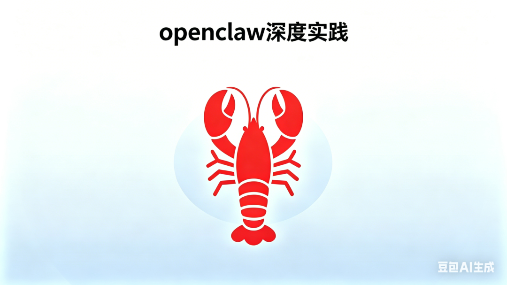

> 📎 来源: [姜菌油煎](https://mp.weixin.qq.com/s?__biz=MzI5Mzg2NTY0NA==&mid=2247484177&idx=1&sn=42e4062e3a9f4bcacc5c658db1ad2510&chksm=ed2791661fffd459396c3f45e06f0a67b6d5469c8720a339d25d103c3e5fc47b408cc7393fa1&mpshare=1&scene=1&srcid=0423d8pDYHwMDb0MVcaHpao5&sharer_shareinfo=3d2240a1fdc5d4e3495b8f2a58678551&sharer_shareinfo_first=3d2240a1fdc5d4e3495b8f2a58678551) | 时间: 2026-04-23 21:17

---

在讨论一款自动化工具时，很多人最先关注的是“它能做什么”。

比如，能不能一键发布小红书？能不能定时发邮件？能不能整理 Excel？能不能采集数据并生成报告？

这些场景我统统跑通了，同时梳理了他的能力边界（场景会不断变化，而真正决定工具价值的，往往是它背后的**通用能力），一通百通，来说说还有什么其他的场景也适用吧。**

以 openclaw 为例，我们不妨从几个典型场景出发：

场景1：**网页操作自动化**

例如，小红书一键发布，本质上并不是“只会发小红书”，而是具备了对网页界面的识别、输入、点击、上传、提交等操作能力。只要规则相对明确，这类能力就可以迁移到更多场景中，例如后台录入、活动报名、内容分发、表单填写、系统间重复搬运信息等。

实际案例：给出主题，要求openclaw根据主题自动生成图文封面、标题、正文、标签，在通过本人扫码登录后，实现自动发布笔记操作。

ps：小红书使用AI托管会封号哦，仅以此案例说明可实现能力与场景

场景2：**定时任务通信**

比如定时发邮件、定时汇总日报、定时提醒相关人员处理任务。这背后体现的不是单纯“发出一封邮件”，而是任务调度与流程编排能力：在指定时间触发、按步骤执行、在失败时重试，必要时还能通知结果。对于企业来说，这类能力很适合承接周期性、规则明确的协同工作。

实际案例：给出邮件地址、协议地址、授权码等，要求每周三12:00发送邮件提醒发送小红书。

场景3：**文档与表格的自动整理**

很多企业内部仍有大量 Excel 处理工作，包括字段清洗、内容归类、格式统一、数据合并、按规则筛选和生成汇总表。这类工作通常耗时、重复、容易出错，但规则却比较稳定。因此，从能力层面看，openclaw 所承接的是结构化数据处理能力，而不只是“会改表格”。

实际案例：给到一份业务商品订单数据，根据库存、销量，统计商品是否需要额外采购并单独新增一个字段罗列。简单的字段读取跟比较、写入，300+数据，准确率是100%

场景4：**数据采集与报告生成**

例如，从网站、系统后台或固定来源中采集数据，再按既定模板输出成日报、周报、监测报告或经营摘要。这一场景体现的能力包括信息获取、数据整理、内容提炼与报告生成。对很多团队来说，这类工作本身并不复杂，真正消耗时间的是重复执行与人工搬运。

实际案例：根据某岗位梳理当地的招聘需求，梳理出来源、JD、薪资范围、给出这个地区该岗位的招聘行情分析报告，并保存在本地。

场景能力拆解

从这些场景往下拆解，可以看到 openclaw 更像是一组能力的组合。归纳起来，大致有以下几种：

- 浏览器页面操作
- 任务调度
- 本地文件读取、编辑
- 外部通信

- 其他常见的AI大模型能力（如检索、分类、总结、生成、提取、改写和图片视频多模态内容等）

正因为如此，它的价值并不只在于“能否完成某一个动作”，而在于是否能把重复、标准化、低创造性的流程稳定接管下来。

企业提效场景

如果期望企业内部提效，可以通过场景是否具备以下特点进行判断：

- 鉴赏要求低（工业化、流水线）

我理解AI生成的内容是大数据学习的标准答案，对于常用领域，内容质量尚可，但是对于艺术画、高定、对于这种讲究灵魂阐述、灵感迸发的领域来说，质量就过于粗糙了。虽然对于大多数人来说是没有鉴赏能力的。

- 定期重复

越高频重复的流程、场景实现AI提效后，整体提升更多，进步更显著。

- 组织流程契合

不存在部门壁垒、数据壁垒、自动化流程中涉及到的每个部门及数据都能获得，现在AI提效就和之前的数字化流程是一样的，推进人的使用，组织的契合是最重要的。

在企业内部流程中，这类能力其实有很多可落地的替代空间。

- 市场团队：处理多平台内容发布与数据回收
- 运营团队：用它生成日报、周报和活动数据汇总
- 销售或客服团队：用它整理客户表格、同步系统信息、发送定时提醒
- 职能部门：将部分固定报表、通知发送、基础数据搬运工作自动化

我之前做金融科技多一些，以银行客户经理为例：（openclaw本地部署、数据安全和内网考虑）银行系统繁杂，了解一个客户信息就要通过N多系统收集内容，最后根据行内模版给出一个文档。客户经理收集各方信息汇总报告录入行内。

以财务为例：企业业务数据，与企业的成本支出，多个saas服务的发票下载，汇总成表。

企业AI提效适用场景众多，具体需要一事一例，详细说明可以写好几篇文，这边只是简单举个例子，毕竟企业自己更清楚自己的流程。

除此之外，保持理性预期

第一，**AI 不是万能的**。如果任务规则不清晰、上下文频繁变化、依赖强判断或涉及复杂例外情况，那么自动化效果往往会打折扣。

第二，**建议保留人工审核环节**。尤其是在对外发布、正式发送、财务数据、客户信息、合同文档等高风险流程中，AI 更适合作为“前置处理器”或“执行助手”，而不应完全替代最终确认。

第三，**成本也要纳入评估**。除了开发和接入成本外，token 消耗本身也是一笔不小的支出。如果流程调用频繁、文本处理量大，长期运行后的费用并不一定低。因此，企业更适合优先选择那些高频、重复、价值明确的场景落地，而不是为了“用 AI”而用 AI。

从这个角度看，openclaw 的意义并不只是替代几个具体动作，而是为企业提供一种重新梳理流程的方式：把重复劳动拆开，把可标准化的步骤自动化，把人的精力留给判断、协同和决策。

这或许才是自动化工具真正值得关注的地方。

---

欢迎任何形式的交流，人身攻击反弹，duang~

作者介绍：姜菌油煎，啥也不是，就想记录点啥分享点啥~

最近一直在洗脑自己的话：向前走，别回头。
