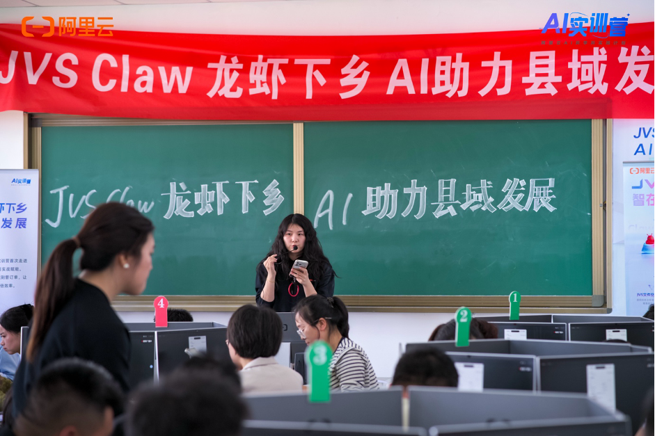
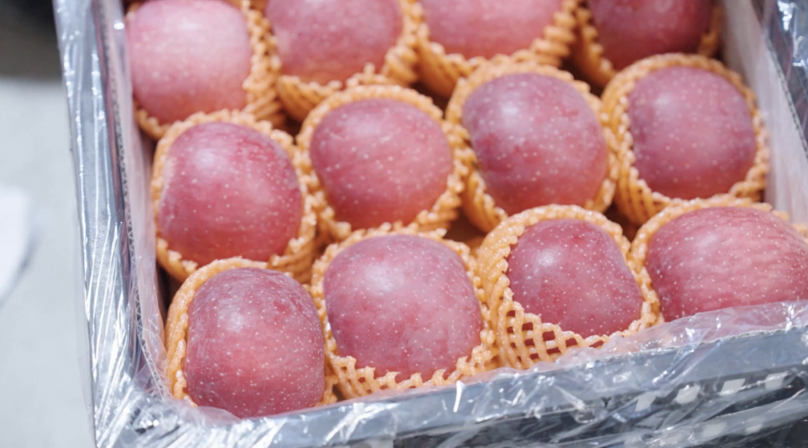
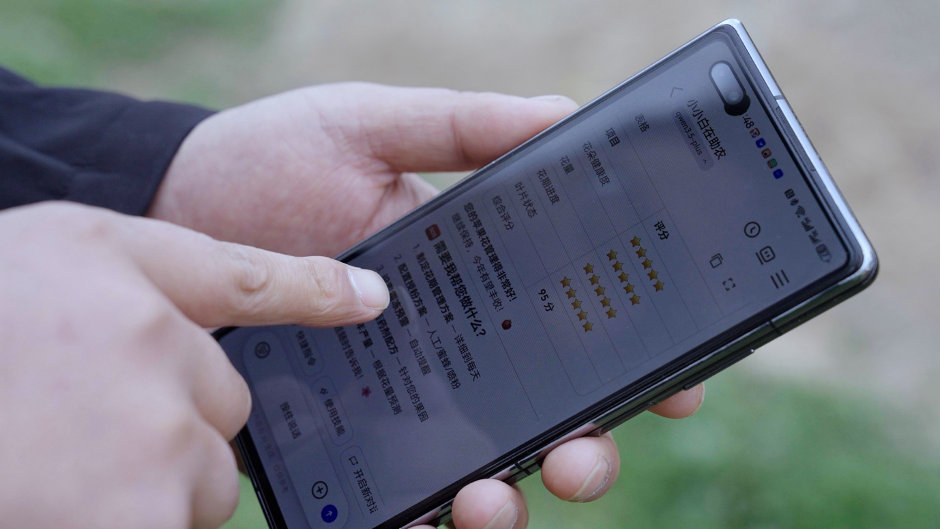
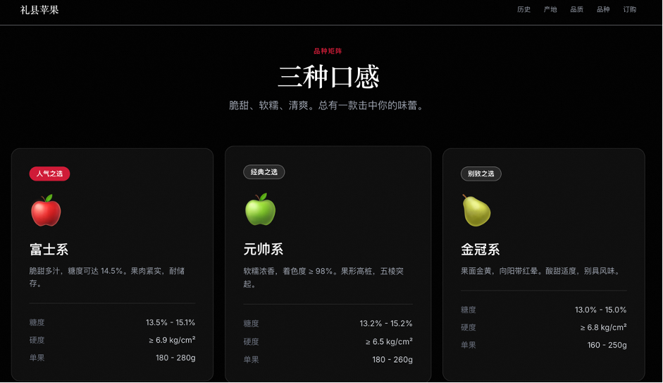

> 📎 来源: [阿里云](https://mp.weixin.qq.com/s?__biz=MzA4NjI4MzM4MQ==&mid=2660260340&idx=1&sn=e05cc6c521b71d5dd694b7b34686372e&chksm=8582a20cfcae2b58a971fbf09ad4b23fe84722a37e952d26957ad533344f1295440460dffc12&mpshare=1&scene=1&srcid=0428FCc3c0nRpTkqSLxrYSwB&sharer_shareinfo=6d489a3d1e3c08b2852f07632e6cfa2d&sharer_shareinfo_first=6d489a3d1e3c08b2852f07632e6cfa2d) | 时间: 2026-04-28 20:11

---

不久前，在阿里巴巴乡村特派员牵线下，阿里云在礼县开展了一场AI助力县域发展的培训，以旗下JVS Claw龙虾软件为代表的人工智能应用，第一次走进了这座西北山城的田间和果园。

**01**

**三代人耕耘的礼县苹果**

礼县地处西秦岭北麓，海拔1350至1750米，年均日照1968小时，年平均气温9.9℃，无霜期180到200天之间，冬无严寒，夏无酷暑，使这里成为黄土高原陇南苹果优势产区的核心地带。

1952年，礼县引进苹果种植；1973年，被列为甘肃省外销苹果生产基地；2008年，礼县苹果成为北京奥运会推荐果品；2011年，通过国家地理标志产品保护认证。截至目前，全县苹果种植面积达61万亩，年总产量超60万吨，第一产业总产值达30亿元。

90后果农白亚龙是新一代礼县果农的代表。2014年，他从苹果销售起步，做过批发、电商，如今管理上千亩果园：山上600多亩传统乔化果园，山下200多亩现代矮化密植园，配套冷库和育苗基地，打通了从育苗、种植、仓储到销售的全产业链。

“从小家里就有苹果树，知道啥时候摘果子，啥时候打药。”白亚龙说。但他不满足于沿袭传统经验，而是坚信“用工业思维搞农业”：引入无人机打药，600亩山地果园3天完成喷洒，而传统人工作业需10天；亩均用水量从200升降至32升，药量减少20%-30%；山下果园全面铺设滴灌和水肥一体化设备，实现精准灌溉。

**02**

**JVS Claw成了新农具
龙虾开始做果园管理**

数字技术正应用于礼县果园。培训当天，白亚龙率先试用：他拍摄盛开的苹果花上传至JVS Claw，几秒后收到分析报告：花瓣、花蕊、花柱、叶片状态正常，约30%-40%的花处于初花期。

“这个‘贾维斯’太精确了。”白亚龙说。JVS Claw不仅判断花的健康状况，还自动关联了当地天气数据，提示“4月18日至19日有霜冻风险”，并逐一排查霜冻可能造成的花瓣焦变、花柱变褐、子房变黑等症状，最终给出结论：花叶均未受冻。紧接着，一份未来7天的果园管理排期表自动生成，精确到每天几点该做什么、该买什么药、该配多少比例。

“他不仅告诉你花怎么样，还把接下来要干的事、要注意的病虫害、要用的药剂配比全给你列出来了。”白亚龙一边翻看手机一边说，“连管理日志都帮你生成好了，可以直接导成PDF发给果农们。”

在此之前，白亚龙也用过其他等AI产品，但他觉得那些更像是“高级搜索引擎”——发个指令过去，做个简单汇总，“总结出来的东西跟你内心所想的总是差那么多”。而JVS Claw给他的感觉完全不同：“这不是简单的一问一答了。它有记忆，你今天问了什么，明天它还记得。”

白亚龙把这个过程叫“养虾”。在他看来，每一只“虾”都可以被训练成不同的专业助手——一只专门帮他管理果园农事，一只专门帮他做PPT和培训课件，一只专门帮他策划直播和营销方案。培训当天晚上，他就用JVS Claw设计了一个礼县苹果的品牌推广网页：2700年秦文化底蕴、70年苹果种植历史、品质数据、时间线，一应俱全。

“我给它的提示词非常简单——设计一个甘肃礼县苹果介绍的网页，结合当地悠久的历史。”白亚龙说：“它把1952年引进苹果、1973年外销基地、2008年奥运果品，时间线全给你画出来了。连广告词都有了——‘每一口都是自然的馈赠’。”

**03**

**从“会用手机”到“会用AI”**

培训后，白亚龙第一时间将JVS Claw推荐给果园技术员和管理人员。“以后有不懂的，发语音问它就行。”他说。

这对于当地以70后为主力的果农群体来说，意义尤为深远。

过去，果园管理全靠老师傅的经验和“土专家”的口口相传，组织一次技术培训耗时耗力。而现在，“只要有手机，只要有网，装好了就可以问”。培训现场，他当场让JVS Claw帮自己生成了一份个人IP运营方案——从账号定位、内容策略到平台选择，几分钟就拿到了一份完整的策划书。

“我觉得这个AI不再是玩具，而是切切实实的生产力，我们为什么不接受？”白亚龙说这话时很自信。在他看来，从搜索引擎到大模型再到JVS Claw，每一次技术迭代都在帮助农民更高效地解决问题。区别只在于，过去是一问一答，现在是AI主动帮你想、帮你做。

在白亚龙的设想中，未来的礼县果园里，每个果农手机上都有自己的AI助手，每片果园的天空都有无人机巡飞，每一颗苹果都有溯源码。

/ END /
