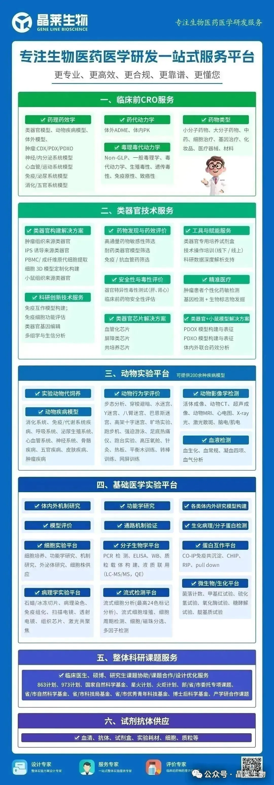

> 📎 来源: [晶莱生物](https://mp.weixin.qq.com/s?__biz=MzE5MTg4MDU1NQ==&mid=2247491609&idx=1&sn=6418f8ee884dece7bd50ca7b61be852f&chksm=97d3ac7120929269c9e6eb42e0d870d37bf49524f4795849e51c7392f8e15d56d407687abb9b&mpshare=1&scene=1&srcid=0423spNeLJdFYiBEiPQx6DZ6&sharer_shareinfo=0606d4f6a5e105ecdf35f4b644cef640&sharer_shareinfo_first=0606d4f6a5e105ecdf35f4b644cef640) | 时间: 2026-04-23 22:01

---

**前言**

上回介绍了 OpenClaw 的基本概念[医生做科研，为什么需要OpenClaw？](https://mp.weixin.qq.com/s?__biz=MzE5MTg4MDU1NQ==&mid=2247491571&idx=1&sn=b66f69c76b96401c753420dc9876a5d2&scene=21#wechat_redirect)，今天直接上干货 ——10 个我实测过、确实能提升效率的技能，以及具体怎么用。

**写在前面**

OpenClaw的Skills生态发展很快，目前已经有**10000+**个技能。
但不是每个都实用，有些看起来高大上，实际用不上。
这篇文章筛选的是**真正对医学科研有帮助的10个技能**，涵盖：文献检索、基金申请、 研究设计、 数据分析、 图表制作。

**每个技能我会说明：**

- 解决什么问题
- 具体功能
- 使用方式
- 实际效果

**0****1**

****Literature Review：多数据库文献检索****

### **解决什么问题**

写综述或立项依据时，需要在多个数据库检索文献，手动整理耗时耗力，还容易遗漏。

### **核心功能**

| 功能 | 说明 |
| --- | --- |
| 多库搜索 | 同时搜索Semantic Scholar、OpenAlex、Crossref、PubMed四大数据库 |
| 自动去重 | 同一文献在不同数据库只保留一条 |
| 摘要提取 | 自动提取完整摘要 |
| 智能排序 | 按引用数排序 |
| 格式导出 | 导出Excel格式 |

**使用方式**

python3 scripts/lit\_search.py search "CAR-T therapy solid tumor" --limit 200 --source all

**✅实际效果**

**检索200篇文献：**
**传统方式：**在PubMed、Web of Science分别检索 → 手动去重 → 整理摘要，约需2周
**Literature Review：**一条命令，30分钟完成
**⏱️节省时间：**约99%

**0****2**

**Grant Writer：国自然申请书辅助撰写**

### **解决什么问题**

**国自然申请书的常见问题：**立项依据逻辑不清、预算编制不合规、格式不规范、创新点表述不当。这些问题往往在评审阶段才被发现，导致申请失败。

### **核心功能**

**1. 立项依据检查**

逻辑链条完整性（背景→现状→问题→研究）

国内外研究现状平衡性

关键科学问题提炼准确性

**2. 预算编制审查**

设备费占比检查（国自然要求≤20%）

劳务费与绩效区分

测试化验加工费合理性

间接费用计算（20-30%）

3. 格式规范检查

字数限制

图表格式

参考文献格式

**4. 全文逻辑审查**

研究内容与技术路线对应性

预期成果可考核性

创新点表述合理

**使用方式**

按模块逐步检查，生成审查报告，根据报告修改完善。

**✅实际效果**

帮助发现申请书中的潜在问题，避免在评审阶段被指出。平均减少修改轮次2-3轮。

**⏱️ 节省时间：约67%**

**0****3**

**Medical Research Workflow：医学研究方案设计**

### **解决什么问题**

**研究方案设计时，容易出现以下问题：**

- 研究类型选择不当
- 纳排标准设置不合理
- 偏倚考虑不周全
- 可行性评估不足

### **核心功能**

| 代理角色 | 职责 | 具体工作 |
| --- | --- | --- |
| **Dwight（规划师）** | 框架构建 | 研究类型选择（RCT、队列、病例对照等）、PICO要素定义、研究设计逻辑 |
| **Kelly（文献研究员）** | 证据支撑 | 类似研究设计参考、纳排标准借鉴、终点设置参考、常见陷阱提示 |
| **Rachel（批判审查者）** | 风险识别 | 假设漏洞检查、偏倚风险评估、可行性评估、伦理风险检查 |

**使用方式**

输入研究主题和初步想法，三代理依次工作，输出完整Protocol文档。

**✅实际效果**

提前发现方案设计中的问题，避免伦理审查或投稿时返工。

**⏱️ 节省时间：**约1个月（避免返工）****

**04**

**NSFC Roadmap：技术路线图生成**

### **解决什么问题**

国自然申请中的技术路线图制作耗时，且需要反复修改。

### **核心功能**

- 输入文字描述，自动生成技术路线图
- 符合国自然评审规范（科学问题→研究内容→技术路线→预期成果）
- 专业配色（学术蓝#005F7A，白底黑字）
- 支持纵向递进式和横向展开式

**使用方式**

输入研究流程的文字描述，自动生成Mermaid代码或图片。

**✅实际效果**

**制作技术路线图：**

**传统方式：**PPT画图，调格式，约需1天

**NSFC Roadmap：**输入文字，10分钟生成

**⏱️节省时间：**约95%

**05**

**Data Analyst：数据分析与可视化**

### **解决什么问题**

医学科研中的数据分析需求：数据清洗、统计分析、可视化、报告生成。

复杂分析需要统计师协助，沟通成本高。

### **核心功能**

**基础功能：**

- 数据清洗（缺失值、异常值、重复数据）
- 描述性统计（均数、标准差、中位数、频数）
- 统计检验（T 检验、卡方检验、ANOVA）
- 数据可视化（柱状图、折线图、散点图、生存曲线）

**进阶功能：**

- 多因素回归分析
- 倾向性评分匹配
- 时间序列分析
- 自动化报告生成

**使用方式**

Python代码或SQL查询，支持Jupyter Notebook交互。

**✅实际效果**

**中等复杂度数据分析：**

**传统方式：**写需求给统计师→ 等待 → 沟通修改，约需2周

**Data Analyst：**自己完成，1天出结果

**⏱️节省时间：**约92%

💡前面5个技能，已经覆盖了医学科研最核心的**文献、基金、方案、数据四大痛点**，接下来的5个技能，更是能帮你把**文献处理、内容提炼、图表制作、项目管理**的效率拉满，每一个都有实测数据支撑。

**06**

**PDF Reader：PDF文献内容提取**

**解决什么问题**

需要从PDF文献中提取关键内容、批量处理文献、整理读书笔记。

**核心功能**

- 全文文本提取
- 指定页面范围提取
- 带页码标记
- 批量处理

**使用方式**

- **提取全文**

python3 scripts/extract.py paper.pdf

- **带页码提取**

python3 scripts/extract.py paper.pdf --with-page-numbers

- **提取特定页面**

python3 scripts/extract.py paper.pdf --start-page 1 --end-page 5

**✅实际效果**

批量提取100篇文献摘要，**约需10分钟。**

**⏱️节省时间：**约80%

**07**

**Summarize：内容摘要生成**

**解决什么问题**

快速了解长文核心观点、筛选大量文献、整理会议纪要。

**核心功能**

- 支持网页URL、PDF、图片、YouTube视频、音频文件
- 多模型支持（Gemini、GPT、Claude等）
- 灵活输出长度（短/中/长/超长）

**使用方式**

- 网页摘要

summarize"https://www.nature.com/articles/xxx"--length medium

- PDF摘要

summarize "/path/to/paper.pdf" --length short

- 视频摘要

summarize "https://youtu.be/xxx" --youtube auto

**✅实际效果**

**快速筛选文献：**从100篇中筛选20篇值得精读的，**约需2小时。**

**⏱️节省时间：**约83%

**08**

**Deep Research Pro：深度研究报告生成**

**解决什么问题**

进入陌生领域需要快速了解全貌、写立项依据需要全面的研究现状、做竞争分析需要了解同行进展。

**核心功能**

- 自动分解研究主题
- 多源搜索（15-30 个来源）
- 深度阅读关键文献
- 生成带引用的研究报告

**使用方式**

输入研究主题，系统自动执行研究流程，输出报告。

**✅实际效果**

**陌生领域调研：**

**传统方式：**搜索文献 → 阅读综述 → 整理笔记，约需2周

**Deep Research Pro：**2小时生成20页报告

**⏱️节省时间：**约95%

**09**

**Diagram Generator：科研图表制作**

**解决什么问题**

科研论文需要机制图、流程图、信号通路图等，找设计师沟通成本高，自己画耗时。

**核心功能**

- 研究流程图
- 机制图（信号通路、分子机制）
- 统计流程图
- 支持 Mermaid 和 Draw.io 格式

**使用方式**

描述图表内容，自动生成可编辑的图表文件。

**✅实际效果**

**制作机制图：**

**传统方式：**找设计师 → 沟通 → 修改，**约需 1 周，费用 500 元**

**Diagram Generator：**30 分钟生成，免费

**⏱️节省时间：**约99%

**10**

**Tech Roadmap：项目时间线管理**

**解决什么问题**

基金申请需要研究计划甘特图、项目管理需要进度跟踪。

**核心功能**

- 甘特图生成
- 里程碑标记
- 任务依赖关系
- 项目时间规划

**使用方式**

输入任务列表和时间安排，自动生成甘特图。

**✅实际效果**

**制作项目甘特图：**

**传统方式：**Excel或Project制作，**约需半天**

**Tech Roadmap：**10分钟生成

**⏱️节省时间：**约90%

**技能组合使用建议**

****场景1：国自然申请（4周计划）****

| 周次 | 任务 | 使用技能 |
| --- | --- | --- |
| **第1周** | 文献调研 | Deep Research Pro + Literature Review + Summarize |
| **第2周** | 方案设计 | Medical Research Workflow + Grant Writer |
| **第3周** | 图表制作 | NSFC Roadmap + Diagram Generator + Data Analyst |
| **第4周** | 完善提交 | Grant Writer |

****场****景2：临床研究方案设计****

**1. Literature Review + PDF Reader：**文献回顾

**2. Medical Research Workflow：**方案设计

**3. Tech Roadmap：**研究流程图

**4. Data Analyst：**统计方案设计

****场****景3：******综述撰写**

**1. Literature Review + PDF Reader：**全面检索

**2. Summarize：**快速筛选

**3. Deep Research Pro：**填补知识空白

**4. Diagram Generator + Data Analyst：**图表制作

**效果汇总**

| 工作环节 | 传统方式 | AI辅助方式 | 节省时间 |
| --- | --- | --- | --- |
| **文献检索** | 2周 | 30 分钟 | 99% |
| **基金申请** | 3个月 | 1 个月 | 67% |
| **研究设计** | 2 周 + 返工 | 1 周 | 60%+ |
| **数据分析** | 2 周 | 2 天 | 86% |
| **图表制作** | 1 周 | 半天 | 93% |
| **深度调研** | 2 周 | 2 小时 | 95% |

**⏱️平均节省时间：**约85%

---

**写在最后**

上回我们介绍了 OpenClaw 在科研中的基本概念和用途[医生做科研，为什么需要OpenClaw？](https://mp.weixin.qq.com/s?__biz=MzE5MTg4MDU1NQ==&mid=2247491571&idx=1&sn=b66f69c76b96401c753420dc9876a5d2&scene=21#wechat_redirect)。

今天这篇是**实战篇，**聚焦于医学科研场景下的具体应用。

这 10 个技能不是万能钥匙，它们解决的是**重复性、机械性**的工作，让你有更多时间：

- 思考科学问题
- 设计实验
- 分析数据

**工具的价值在于使用。**建议从 1-2 个最契合你当前需求的技能开始，逐步扩展到更多场景。

**💬这10个OpenClaw技能里，你最想先尝试哪一个？你在科研里最头疼的是文献、国自然、数据分析还是画图？欢迎在评论区留言或私信，我们会优先给大家出对应技能的详细教程！**

后续我们还会持续更新OpenClaw在医学科研里的**落地用法**，不想错过的话，记得**点个关注，不迷路**。

**👍 觉得有用？点赞、在看、转发，让更多科研伙伴看到！**

**关于晶莱**

**晶莱生物**创立于2016年，拥有北京(北京晶莱华科生物技术有限公司)及长沙(湖南晶莱生物技术有限公司)两个研发机构，是专注于生物医药临床前研发与基础医学科研服务的国家高新技术企业及专精特新企业。依托北京、长沙两地的3000余平实验平台，晶莱构建了8个研究平台，可为客户提供包括临床前CRO、类器官模型构建、动物寄养、动物模型构建、细胞型构建、药效及各类表型、机制、通路等全方位的研究服务。

截至目前，晶莱生物已与国内超过1000家生物医药公司、高校及医院建立了紧密的合作关系，成功实施了10000余项研究/研发项目，积累了超过100000+客户。

