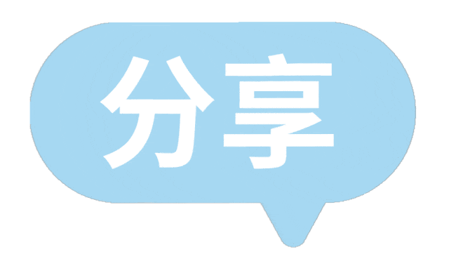

> 📎 来源: [墨语心菲](https://mp.weixin.qq.com/s?__biz=MjM5MzUxMjk3Nw==&mid=2448491462&idx=1&sn=39f62d0f563f113b288aa455427c8156&chksm=b3240fcd0650f1f827cc67d1fcff139fb4921b7e3bcdad65d2fa857cfb20e18099ca7fef678f&mpshare=1&scene=1&srcid=0423VFeSb2aJJJc8k6KdhlDw&sharer_shareinfo=1d8a89189984419402a902123e8fd084&sharer_shareinfo_first=1d8a89189984419402a902123e8fd084) | 时间: 2026-04-23 21:15

---

**点击蓝字**

**关注我们**

**一**

**使用感受：当工具从"玩具"变成"管家"**

最近把主力环境从OpenClaw（俗称"龙虾"）迁移到Hermes Agent，用一个词形容感受：从驯兽变成了用管家。

用龙虾的时候，我总有一种在"驯服野生AI"的错觉。它很聪明，但太不稳定——配置好的股票定时任务隔天就失联，微信端的消息偶尔能收到、偶尔石沉大海，最头疼的是定时任务，有时正常，有时发不出来，你永远不知道下次是否能正常发出来。

切换到Hermes之后，这些异常基本都消失了。

稳定性方面，Hermes的会话持久化做得扎实。我配置的每日16:30自动拉取腾讯财经API、更新持仓数据的定时任务，跑了两周没有掉过一次链子。微信、飞书两个通道同时在线，我在任何一个端发指令都能无缝接续上下文。这种"随时在、随时应"的感觉，才是Agent应有的样子。

操作授权方面，Hermes的设计更贴近真实工作流。它有一个危险命令检测+用户确认的中间层，不是一刀切地拒绝所有终端操作，而是智能识别风险等级——比如我让它

python3 /root/.openclaw/workspace/tencent\_stock\_api.py更新股价数据，它直接执行；但如果涉及

rm -rf或者系统级修改，它会弹出清晰的确认提示，说明风险点，让我一键授权或拒绝。这种分层授权比龙虾那种"要么全给、要么全拒"的二元策略高明太多。

**二**

**Hermes vs 龙虾：一场Agent架构的代际差异**

如果龙虾是第一代"脚本包装器"，Hermes就是第二代"Agent操作系统"。两者的差异不是功能多少的问题，而是架构哲学的分野。

**2.1 稳定性：工程化 vs 实验性**

龙虾给我的感觉是一个聪明的Python脚本集合——它能在本地跑起来，但缺乏生产级的容错机制。网络抖动、API限流、长时间运行的内存泄漏，这些问题在龙虾上都会以"突然沉默"的方式表现出来。

Hermes则明显经过了工程化打磨：

● 进程隔离

后台任务（cronjob）与前台对话跑在不同会话中，互不影响

● 状态持久化

SQLite存储的对话历史、任务状态，重启后自动恢复

● 优雅降级

当某个API（比如股票数据源）不可用时，它会标注数据来源状态，而不是直接崩溃

**2.2 自成长：主动升级 vs 被动安装**

这是两者最本质的差距。

龙虾的技能是"插件扩展"：你首先需要有一个skill插件，它可以是网上的，也可以是你自己做的。然后你让龙虾联网下载，或者你手动部署到龙虾服务器上，重启网关生效；当然，你也可以让龙虾自己提炼一个技能。本质上，龙虾还时被动的方式来扩展。你喊他，他才会安装和升级；你不喊他，他就不会动。

Hermes的技能是"动态生态"：除了龙虾的这种被动安装外，hermes会从你的任务，以及和它的上下文中，找到需要提炼总结的地方，然后自己自动整理成skill，目的是更好的为你服务。

等你过段时间登陆hermes服务器上看，你可能会惊讶的发现，它在skil目录建立了不少自己整理的技能。比如我目前用财经的多，它就自己建立了一个finance的目录，里面有多个技能；

更深层的是\*\*"技能记忆"的打通。Hermes的memory和skill\_manage是原语级能力——Agent可以基于使用历史自主优化技能（比如发现我常分析港股，自动把港股API字段映射记成偏好），甚至可以在完成任务后主动问我"是否需要把这个流程保存为技能？"。这种"用一次、长一智"\*\*的自成长能力，让Agent的边际成本持续下降。

**2.3 架构设计：多Agent编排 vs 单体式**

龙虾是典型的单体架构：一个大脑（LLM）+ 一套工具，所有任务堆在一起处理。

Hermes引入了多Agent编排的理念。

以我炒股的使用场景为例：

● Main代理（管家）:负责识别我要"分析股票"，协调任务

● Stock代理（deepseek模型）：专职金融分析，加载stock-data-analyst技能，访问财经API和本地数据库

● 定时调度器（cron）：独立于对话循环，按时触发数据更新

● 网关层（gateway）：把微信消息、飞书消息翻译成统一的Agent事件

这种分工不是炫技，而是解决了一个核心问题：不同任务需要不同的专业能力。让金融分析的子代理跑在deepseek模型上（擅长推理），让管家代理跑在轻量模型上（快速响应、节省成本），这才是理性的架构。

**2.4 记忆系统：长期记忆 vs 金鱼记忆**

龙虾也有号称有长期记忆，但是可能知识不断的在记录memory.md 等，等上下文超了，也会压缩，容易丢失一些数据；特别是重启龙虾，或者new一个会话的时候，就感觉傻傻的，有些东西不记得了。

Hermes内置了三层记忆，体现下来长期记忆更稳定，也不容易错乱：

● 短期记忆（Session上下文）：当前对话的连续思维链

● 中期记忆（持久化笔记）：通过memory工具保存的用户偏好、环境信息、项目约定

● 长期记忆（技能/历史会话）：保存的技能定义、过往分析模板、历史报告

当我今天让Hermes分析兆易创新时，它能自动关联到上周我持仓记录里的仓位占比、投资逻辑，甚至能对比"上次分析时建议的止损位390，今天价格到了424，是否需要调整策略"。这种时间维度上的连续性，让Agent从"问答机器人"变成了"有交情的顾问"。

**2.5 人机协作：授权与兜底**

龙虾的权限模型是"能力边界模糊的灰色地带"——你不知道它什么时候会自作主张，什么时候又会过分保守。

Hermes在tools/approval.py中实现了显式危险命令检测：

● 读文件、写文件 → 低风险，自动执行

● 终端命令 → 分级评估（白名单/灰名单/黑名单）

● 网络请求 → 检查目标域名和请求体

● 删除、系统修改 → 强制用户确认

这种设计尊重了一个基本事实：用户才是最终责任人，Agent应该提供足够信息让用户做知情决策，而不是替用户担责或逃避。

**三**

**Hermes安装配置概要指引**

如果你也想体验这种"管家级"的AI Agent，以下是快速上手指南（基于Linux环境）：

环境准备

# 1. Python 3.10+

python3 --version

# 2. 创建虚拟环境（强烈推荐）

python3 -m venv venv

source venv/bin/activate

# 3. 安装Hermes

pip install hermes-agent

# 或从源码安装

git clone https://github.com/hermes-agent/hermes.git

cd hermes && pip install -e .

初始化配置

# 运行交互式配置向导

hermes setup

# 配置项包括：

# - 默认LLM模型（如 anthropic/claude-sonnet-4、moonshot-v1-8k）

# - API Key（OpenAI、Anthropic、Moonshot等）

# - 启用的工具集（terminal、file、browser、web等）

# - 消息平台（可选：Telegram Bot Token、Discord Token、微信/飞书配置）

核心配置文件

# ~/.hermes/config.yaml

启动使用

# 交互式CLI模式

hermes

# 带特定模型启动

hermes --model moonshot-v1-32k

# 在对话中使用关键命令

> /help # 查看所有命令

> /skills # 发现和管理技能

> /cron list # 查看定时任务

> /memory # 管理长期记忆

> /skin ares # 切换主题

进阶：配置多平台网关

# 编辑 ~/.hermes/config.yaml，添加 messaging 配置

# 可同时连接微信、飞书、Telegram，消息互通

**四**

**AI Agent的发展方向：殊途同归的"数字生命"**

写完使用体验，想聊一点更宏观的判断。

AI的发展，除了LLM基础能力的快速迭代（多模态、长上下文、推理能力），Harness Engineering（驾驭工程/智能编排） 正在成为一个同等重要的战场。

OpenClaw、Hermes、AutoGPT、LangGraph、Dify……这些项目表面看是不同团队在造不同的"轮子"，但底层的进化方向惊人地一致：

**1**

**方向一：长期记忆**

当前LLM的上下文窗口再长（200K、1M tokens），也只是在"短期记忆"上做文章。真正的突破在于跨会话、跨任务、跨时间的持久记忆——Agent需要记住你是谁、你偏好什么、你上周做到哪一步、你三个月前的投资逻辑是什么。Hermes的memory原语和session\_search（历史会话检索）是这个方向的实践。未来，Agent的记忆系统会更像人类：分层的（瞬时/短期/长期）、有关联的（自动建立概念链接）、可遗忘的（不重要的事自动淡化）。

**2**

**方向二：自进化**

现在的Agent还需要人类开发者写技能、写提示词、调工作流。下一步是Agent自己优化自己——发现常用任务后自动生成工具脚本，发现某模型在某类任务上表现差后自动切换模型，发现自己的记忆太多后自动压缩归档。

Hermes的技能系统已经迈出了半步：Agent能读取技能的SKILL.md、自主调用技能、甚至基于用户反馈修改技能。再往前一步，就是\*\*"元技能"\*\*——Agent学会如何创造新技能。

**3**

**方向三：智能编排**

单个Agent的能力总有边界。未来的形态是多Agent协同网络：一个任务被自动拆解，分配给最擅长的子Agent（金融分析给deepseek、代码给Claude、创意给GPT-4o），由一个调度Agent（如Hermes的Main代理）编排协作、整合结果。

Hermes的delegate\_task和子Agent机制已经展现了这种可能性。当调度足够智能时，用户感知到的将是一个"无所不能的统一入口"，背后却是多个专家Agent在分工协作。

**4**

**对普通人的意义：一人公司时代**

这三个方向汇合在一起，会产生一个颠覆性的结果：一人公司（Company of One）的可行性。

想象这样一个场景：

● 你有一个想法——"做一个面向小微商家的自动记账+税务提醒工具"

● 你描述给AI Agent

● Agent自动完成：市场调研（搜索竞品）、技术选型（写代码）、UI设计（调用图像生成）、测试部署（操作服务器）、持续运维（定时监控告警）

● 整个过程你只需要在关键节点做决策和授权

这不是科幻。Hermes已经能完成其中很多环节：写Python脚本、配置定时任务、搜索资料、生成报告。随着Agent能力的提升，一个普通人+一套Agent系统，可能相当于一个5-6人的专业公司（研究员、开发、设计、运营、财务顾问）。

缺的不再是执行力和资源，而是想法的质量和创新的勇气。

当AI把"做"的成本降到接近于零时，人类的比较优势只剩下两样东西：提出好问题的能力和判断价值的品味。其余的一切——查资料、写代码、跑数据、做PPT、发邮件、盯盘——Agent会比你做得更快、更稳、更不知疲倦。

**结语**

从龙虾到Hermes，我看到的不只是两个开源项目的对比，更是AI Agent从"酷炫Demo"走向"生产工具"的缩影。

龙虾让我相信AI Agent是可能的，Hermes让我相信它是可用的。而接下来的一波浪潮——长期记忆、自进化、智能编排——会让它变成不可或缺的。

对每一个普通人来说，最好的策略不是等待Agent完美，而是现在就开始用。在用的过程中理解它的边界，调整你的工作流，让它接管重复性劳动，把你的时间解放出来，去做那些只有人类才能做的事：

**提出想法、做出判断、承担风险、创造价值。**

**Agent是杠杆。杠杆本身不创造价值，但它能把你的价值放大十倍、百倍。**

**END**

**微信号丨**墨语心菲

**知乎丨**墨语心菲

