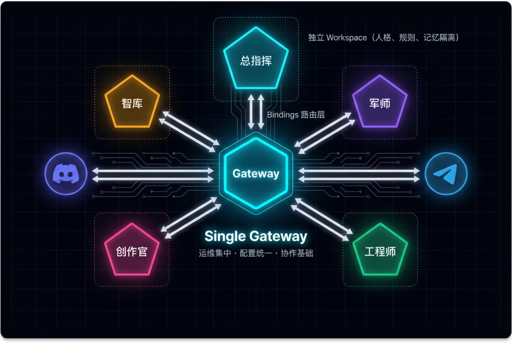
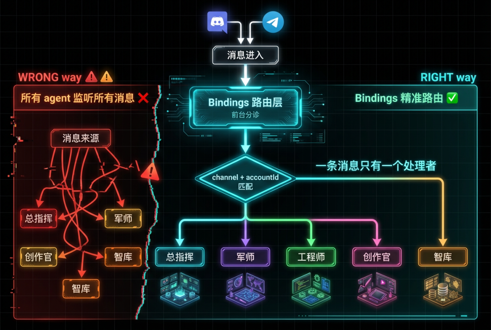
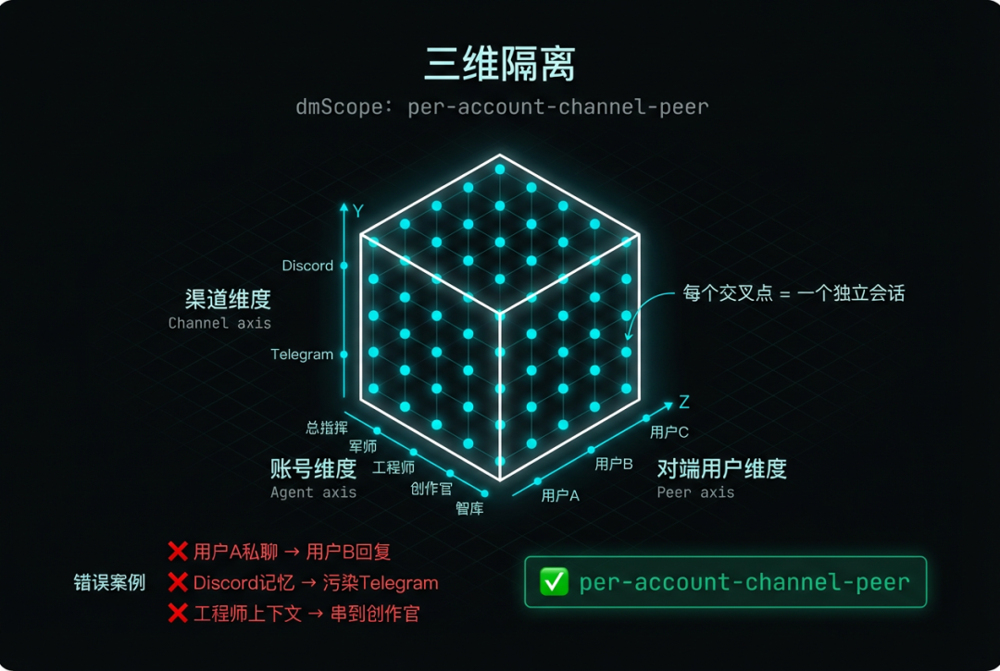
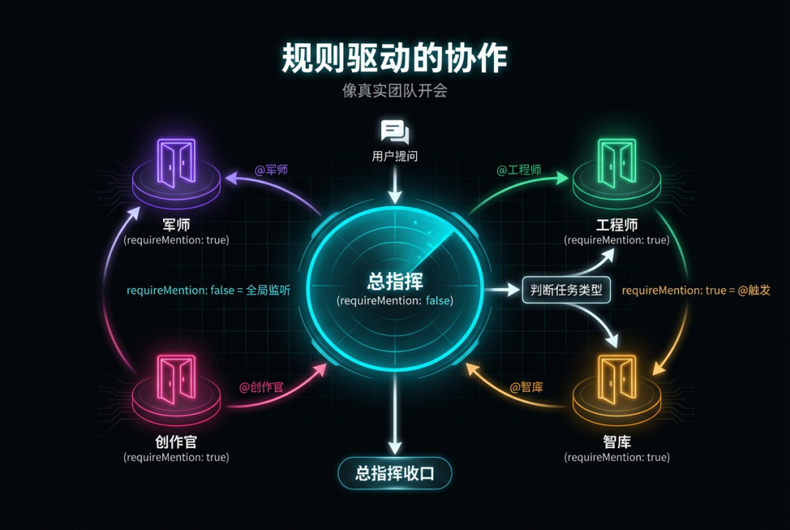
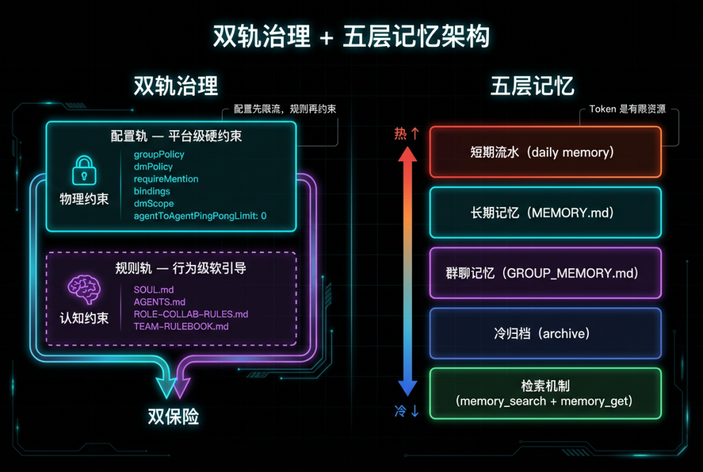
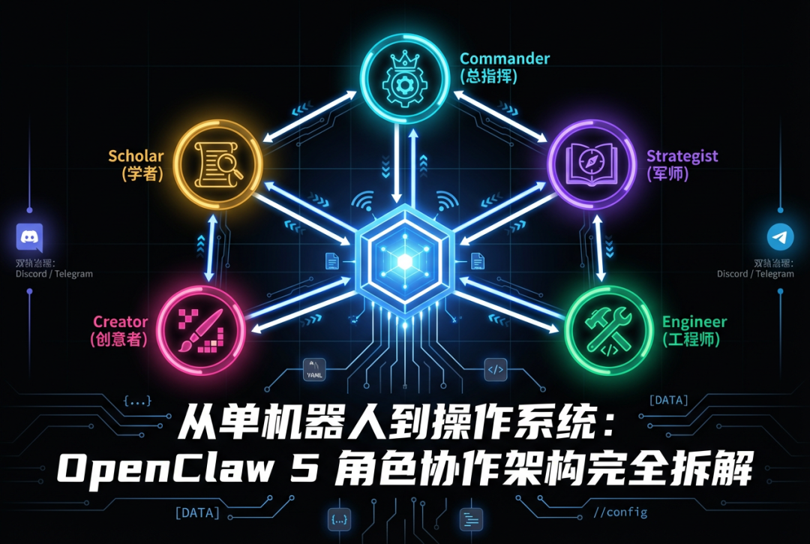

> 📎 来源: [AI Hour](https://mp.weixin.qq.com/s?__biz=MzY4ODAxMDc5MQ==&mid=2247484282&idx=1&sn=7ee707cf374b9c4bfa89b7eb4a182fd8&chksm=f273fde5d273c11faf2be21b0c3a5a9fdd707aa0541f1ea9d9496c169407323d2568c471fb56&mpshare=1&scene=1&srcid=04237RFy6XuVz4csAbsJBEQQ&sharer_shareinfo=e58417eba94d66f563cbe58093e4aa93&sharer_shareinfo_first=e58417eba94d66f563cbe58093e4aa93) | 时间: 2026-04-23 23:57

---

大多数人理解的"多 Agent"：开 5 个 bot，各聊各的。

**这不叫多 Agent，这叫多个单机器人。**

真正的多 Agent 系统有组织、有协议、有记忆隔离 —— 像一个团队在协作，而不是五个人在各自对着墙说话。

这篇文章拆解的是我用 OpenClaw 搭建的 5 角色协作系统的完整架构。从路由层到记忆系统，从会话隔离到群聊编排，每一层都是真实踩坑后的工程决策。不是 demo，不是概念验证，是正在跑的系统。

---

## 一、总体架构：Single Gateway + Multi-Agent

先看全貌：

```
单个 Gateway 进程├── 5 个独立 Agent（总指挥、军师、工程师、创作官、智库）├── Discord + Telegram 双通道├── Bindings 路由层└── 独立 Workspace（人格、规则、记忆隔离）
```

**为什么选择单 Gateway？**

三个理由：

1. 1. **运维集中** —— 一个进程管理所有角色，不用开 5 个服务
2. 2. **配置统一** —— 一份总配置文件，不用到处同步
3. 3. **协作基础** —— 同一运行时才能高效通信，跨进程通信的复杂度不是你想踩的坑

**5 个角色的职责划分：**

- **总指挥** —— 态势感知、任务拆解、派工、收口
- **军师** —— 策略分析、方案评估、风险预判
- **工程师** —— 技术执行、代码实现、系统维护
- **创作官** —— 内容创作、表达优化、对外输出
- **智库** —— 知识审核、质量把关、合规检查

关键是：每个角色有明确的边界。不是"谁都能干"，是"谁该干什么"。



---

## 二、路由层：Bindings 的精准映射

这是整个系统的"前台分诊"。

```
bindings:  - channel: discord    accountId: zongzhihui    agentId: zongzhihui  - channel: discord    accountId: engineer    agentId: engineer  - channel: telegram    accountId: zongzhihui    agentId: zongzhihui  - channel: telegram    accountId: engineer    agentId: engineer  # ... 共 10 条映射（5 角色 × 2 渠道）
```

**设计原理：入口层就决定"谁处理这条消息"。**

不是让所有 agent 听到后抢答 —— 那会乱成一锅粥。Bindings 就是系统的前台，消息进来先分诊，直接送到对的人手里。

```
# 错误做法：所有 agent 监听所有消息all_agents.forEach(agent => agent.listen(message))  # ❌ 会导致抢答混乱# 正确做法：通过 bindings 精准路由target_agent = bindings.route(message.channel, message.account_id)target_agent.handle(message)  # ✅
```

一条消息只有一个处理者。这条规则听起来简单，但很多多 Agent 系统在这一步就翻车了。



---

## 三、会话隔离：per-account-channel-peer 策略

```
session:  dmScope: per-account-channel-peer
```

就这一行配置，解决了多 Agent 系统最头疼的问题 —— 上下文串台。

**三维隔离：**

- **账号维度** —— 哪个 agent 在处理
- **渠道维度** —— Discord 还是 Telegram
- **对端用户维度** —— 谁在聊天

三个维度交叉，意味着：

- 同一人通过不同渠道找同一角色 → 上下文不串
- 不同用户找同一角色 → 完全隔离
- 多 agent + 多账号场景 → "错串"风险降到最低

**没有这层隔离会发生什么？**

```
❌ 用户 A 的私聊内容出现在用户 B 的回复里❌ Discord 的对话记忆污染 Telegram 的上下文❌ 工程师的技术讨论串到创作官的写作上下文里
```

这不是理论风险，是我真实踩过的坑。



---

## 四、群聊编排：规则驱动的协作

群聊是多 Agent 协作的主战场。核心策略只有一条：

**总指挥全局监听，其他角色 @ 触发。**

```
agents:  zongzhihui:    channels:      discord:        requireMention: false  # 全局监听，不需要 @  engineer:    channels:      discord:        requireMention: true   # 必须 @        mentionPatterns:          - "@工程师"          - "@engineer"  junshi:    channels:      discord:        requireMention: true        mentionPatterns:          - "@军师"          - "@junshi"
```

**协作流程是这样的：**

1. 1. 用户在群里提问
2. 2. 总指挥监听到，判断任务类型
3. 3. 总指挥 @ 对应角色处理
4. 4. 角色完成后，总指挥收口

效果就像一个真实团队在开会 —— 有主持人（总指挥），有分工（其他角色），有结论（收口）。不是 5 个 AI 在自由聊天。



---

## 五、双轨治理：配置层 + 规则层

模型会犯错、会漂移、会忘记规则。一层约束不够，必须双轨。

**配置轨（平台级硬约束）：**

```
groupPolicy: opendmPolicy: allowlistrequireMention: true/falsebindings: [...]dmScope: per-account-channel-peeragentToAgentPingPongLimit: 0  # 🔥 关键：防止 agent 互相客套循环
```

这些是平台层面的硬限制，模型绕不过去。

**规则轨（行为级软引导）：**

| 文件 | 职责 |
| --- | --- |
| ``` SOUL.md ``` | 角色灵魂 —— 人格、语气、职责 |
| ``` AGENTS.md ``` | 运行手册 —— 协作流程、记忆规范 |
| ``` ROLE-COLLAB-RULES.md ``` | 协作边界 —— 什么该做什么不该做 |
| ``` TEAM-RULEBOOK.md ``` | 团队统一规则 |
| ``` TEAM-DIRECTORY.md ``` | 角色 ID 映射表 |

**为什么需要双轨？**

配置层先限流 —— 你物理上做不到越界。规则层再约束 —— 即使你能做到，也知道不该做。双保险。

其中 

```
agentToAgentPingPongLimit: 0
```

 这个配置特别关键。没有它，两个 AI 会无限互相客套："你做得很好" → "谢谢夸奖" → "不客气" → 死循环。

---

## 六、Workspace 文件体系

每个角色有自己的独立 Workspace：

```
workspace-engineer/├── SOUL.md              # 角色灵魂├── AGENTS.md            # 运行手册├── ROLE-COLLAB-RULES.md # 协作边界├── IDENTITY.md          # 身份定义├── USER.md              # 用户画像├── TOOLS.md             # 工具清单├── MEMORY.md            # 长期记忆├── GROUP_MEMORY.md      # 群聊记忆├── HEARTBEAT.md         # 心跳规范└── memory/    ├── 2026-03-15.md    # 每日流水    └── 2026-03-16.md
```

**为什么要标准化？**

- 每个角色结构一致 → 易维护
- 新增角色直接复制模板 → 可扩展
- 文件职责清晰 → 不会混乱

想象一下 5 个角色各用各的结构 —— 维护成本会指数级增长。标准化是多 Agent 运维的前提。

---

## 七、记忆系统：懒加载 + 分层 + 归档

记忆是多 Agent 系统里最容易失控的部分。

**五层记忆架构：**

1. 1. **短期流水**（daily memory） —— 当天任务、上下文碎片
2. 2. **长期记忆**（MEMORY.md） —— 稳定偏好、可复用经验
3. 3. **群聊记忆**（GROUP\_MEMORY.md） —— 只保留群里可复用的信息
4. 4. **冷归档**（archive） —— 老数据定期归档
5. 5. **检索机制**（memory\_search + memory\_get） —— 语义召回 + 精确读取

**核心价值：隔离。**

- 私聊质量不被群聊历史污染
- 群聊协作不被个人私密上下文干扰
- 上下文窗口"按需加载"，不是"全量灌入"

**开发者思维：Token 是有限资源。** 每条记忆都在占用推理空间。你不会把公司所有历史会议纪要全塞进一个会议室 —— 记忆系统也一样，必须精打细算。





---

## 八、私聊 vs 群聊：同一角色的双重人格

同一个工程师角色，在私聊和群聊里表现完全不同：

| 维度 | 私聊模式 | 群聊模式 |
| --- | --- | --- |
| 角色 | 单兵专家 | 团队成员 |
| 处理方式 | 端到端，全链路负责 | 只负责擅长的部分 |
| 质量标准 | "一个人能搞定" | "增量接力" |
| 协作 | 不需要 | 总指挥串联和收口 |

**以工程师为例：**

- **私聊** → 给出完整技术方案 + 代码 + 测试
- **群聊** → 只负责技术实现部分，方案由军师给，验收由智库做

这不是功能切换，是角色认知的切换。同一个角色在不同场景下知道自己该做多少、该做什么。

---

## 九、Discord vs Telegram：为什么 Discord 是主战场

不是因为 Discord 更好用，是因为它更适合多 Agent 协作。

**Discord 的优势：**

- 5 账号并行 + 明确 @ 机制
- 角色身份可见、对话链可见
- 总指挥监听 + mention gate 更直观
- ```
  groupPolicy = open
  ```

  ，灵活性高

**Telegram 的定位：**

- ```
  allowlist + mention gate
  ```

  ，更收敛
- 适合"受控生产通道"
- 不是不能协作，而是我配置成了不同策略

| 维度 | Discord | Telegram |
| --- | --- | --- |
| 群策略 | open | allowlist |
| DM 策略 | open | allowlist |
| 协作模式 | 全员可见、自由协作 | 受控通道、精准路由 |
| 适合场景 | 日常协作、头脑风暴 | 生产任务、正式输出 |

两个渠道不是重复，是互补。

---

## 十、踩过的坑与解决方案

**坑 1：Agent 互相客套循环**

问题：两个 AI 无限确认 —— "你做得很好" → "谢谢" → "不客气" → 死循环。

解决：

```
agentToAgentPingPongLimit: 0
```

，直接从配置层掐死。

**坑 2：上下文串台**

问题：用户 A 的私聊内容出现在用户 B 的回复里。

解决：

```
dmScope: per-account-channel-peer
```

，三维隔离。

**坑 3：群聊抢话混乱**

问题：5 个角色同时回复，信息爆炸。

解决：总指挥全局监听，其他角色 

```
requireMention: true
```

。

**坑 4：记忆膨胀失控**

问题：上下文窗口被历史记忆占满，推理质量断崖下降。

解决：分层记忆 + 懒加载 + 定期归档。

**坑 5：配置漂移**

问题：规则写了但模型不遵守，时间一长开始自由发挥。

解决：配置层 + 规则层双轨治理。配置是物理约束，规则是认知约束。

---

## 写在最后

多 Agent 不是"多开几个 bot"的事。它是完整的工程系统 ——

**架构层**决定消息怎么流转。**路由层**决定谁来处理。**隔离层**决定上下文不串台。**编排层**决定谁先谁后。**记忆层**决定信息怎么存取。**治理层**决定边界在哪。

每一层都需要认真设计，少一层就是一个生产事故。

OpenClaw 提供了一个很好的底座，但工程量比想象大得多。好消息是，一旦把这套架构跑通，你拿到的不是一个聊天机器人 —— 是一个有分工、有协作、有记忆的 AI 团队操作系统。

**下一步？** 选一个场景 —— 客服、研究、创作 —— 深入实践。架构是通用的，场景决定价值。

我们 AI Hour 社群一直在探索 AI 前沿的玩法和实践，欢迎加入 AI Hour 社群，每周一个新的 AI 玩法


