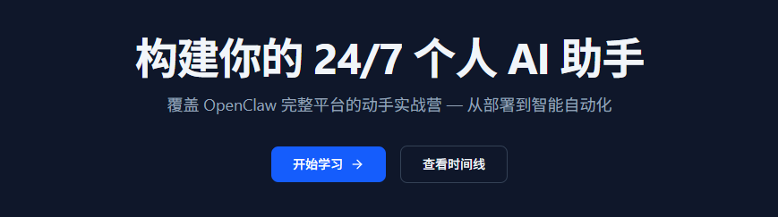
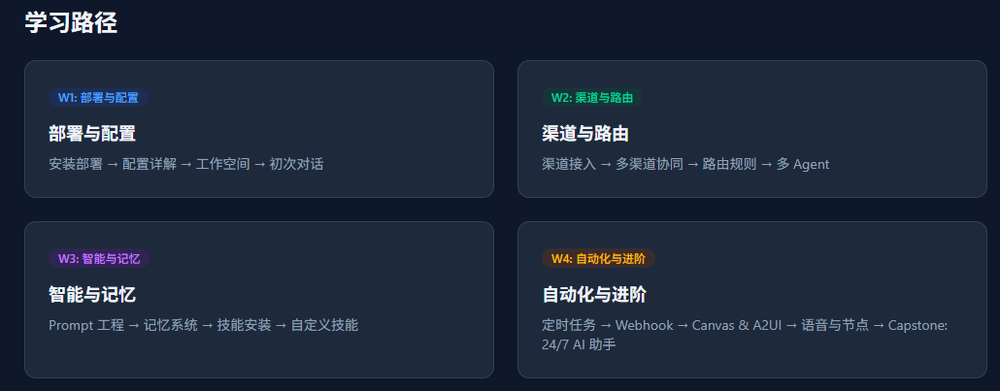
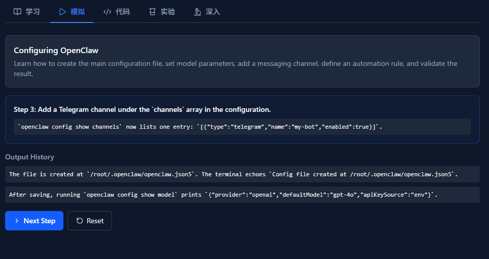
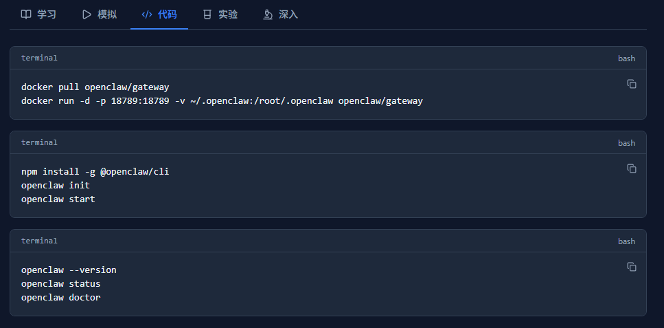
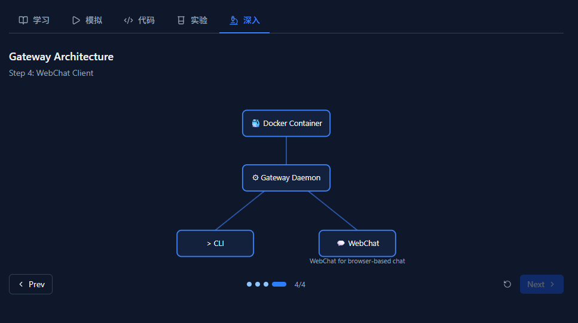
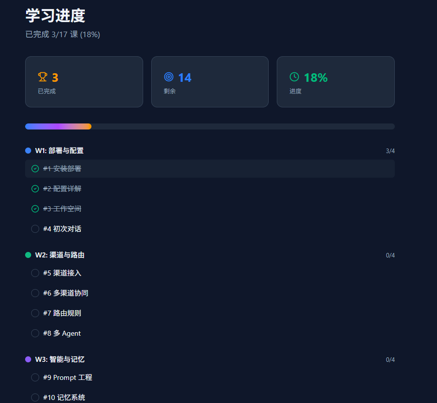

> 📎 来源: [牛码AI宇宙](https://mp.weixin.qq.com/s?__biz=MzI5MTI3OTkxNg==&mid=2247485170&idx=1&sn=32164dfec6b369d8a8a9c8232790a856&chksm=edcc5cfbda48a49be8707cae38f7afa7efbd46363d53cb8dead2768bde449fd8ef38adf07fa4&mpshare=1&scene=1&srcid=0423w1WRVB3QF2AWFXC4g70i&sharer_shareinfo=89647c424c94d5044f53950ffe5b8cfc&sharer_shareinfo_first=89647c424c94d5044f53950ffe5b8cfc) | 时间: 2026-04-23 03:55

---

#

> ❝

> 一个开源框架，让你拥有一个真正懂你、7x24 小时在线的个人 AI 助手。 不是 ChatGPT，不是 Cursor —— 是属于你自己的。

> ❞

## 你有没有想过，拥有一个专属的 AI 助手？

它知道你的偏好，记得上周的对话，能在 Telegram、Discord、Slack 上同时回复你，每天早上给你发简报，自动执行你交代的事务。

这不是科幻。**「OpenClaw」** 就是一个能让你实现这一切的开源框架。

今天，我整理了一份 **「17 课、四周完整的学习路线」**，从安装部署到打造生产级 AI 助手，手把手带你走完全程。

而且 —— 这份教程自带**「交互式学习平台」**，模拟器、代码编辑器、可视化架构图，全部在线可用。



## 什么是 OpenClaw？

OpenClaw 是一个**「模块化 AI Agent 框架」**，以守护进程（daemon）的形式运行在你的服务器或本地机器上。

核心能力一句话概括：

> ❝

> **「连接多个聊天平台 + 拥有持久记忆 + 可扩展技能 + 定时自动执行任务 = 你的 24/7 个人 AI 助手。」**

> ❞

关键特点：

- **「无需 GPU」**：推理由远程 LLM 提供（OpenAI、Claude、本地模型等），1 核 CPU + 512MB 内存即可运行
- **「多渠道接入」**：Telegram、Discord、Slack、IRC、邮件等 25+ 渠道同时在线
- **「持久记忆」**：不是每次对话都从零开始，AI 会记住你的偏好和上下文
- **「技能系统」**：像安装插件一样扩展 AI 的能力
- **「定时任务 + Webhook」**：自动化一切

## 四周学习路线



整个课程分为四个阶段，循序渐进：

### Week 1：部署与配置（约 3 小时）

**「目标：把 OpenClaw 跑起来，让 AI 开口说话。」**

#1 | 安装部署（Docker / npm） | 45 min | | 

#2 | 配置详解（openclaw.json） | 60 min | | 

#3 | 工作空间与 AI 人格设定 | 50 min | | 

#4 | 初次对话（CLI & WebChat） | 35 min |

前三课把基础环境搭好，第四课你就能和自己的 AI 聊天了。

最有趣的是**「第三课」**：通过 SOUL.md、IDENTITY.md、TOOLS.md 三个 Markdown 文件定义 AI 的性格。想让你的助手说话毒舌一点？温柔一点？专业一点？改几行文字就行。

### Week 2：渠道与路由（约 3.5 小时）

**「目标：让 AI 同时出现在你的所有聊天软件里。」**

#5 | 渠道接入（Telegram / Discord / Slack） | 55 min | | 

#6 | 多渠道协同 | 50 min | | 

#7 | 路由规则（5 层绑定表） | 60 min | | 

#8 | 多 Agent 配置 | 55 min |

这周的高光时刻是**「多 Agent 配置」**：你可以同时运行多个不同人格的 AI。一个负责工作，一个负责闲聊，一个负责写代码 —— 全部跑在同一个进程里。

而**「路由规则」**让你的 AI 知道什么消息该走哪个 Agent、触发什么技能。就像给 AI 装了一个智能调度中心。

### Week 3：智能与记忆（约 3.5 小时）

**「目标：让 AI 变聪明，变有记忆。」**

#9 | Prompt 工程（8 层 Prompt 栈） | 65 min | | 

#10 | 记忆系统 | 55 min | | 

#11 | 技能安装（ClawHub 市场） | 50 min | | 

#12 | 自定义技能开发 | 65 min |

**「第 9 课」**是硬核干货。OpenClaw 使用 8 层 Prompt 栈架构，每一层都影响模型的行为。理解了这个架构，你就真正掌握了控制 AI 输出的能力。

**「第 10 课」**解决了一个关键痛点：AI 的健忘症。通过 MEMORY.md 和每日记忆快照，你的 AI 会越用越懂你。

**「第 11-12 课」**是技能系统。OpenClaw 有一个类似应用商店的 ClawHub，也可以自己写技能。

### Week 4：自动化与进阶（约 5 小时）

**「目标：让 AI 自动干活，并整合所有能力。」**

#13 | 定时任务（cron / every / at） | 50 min | | 

#14 | Webhook（事件驱动自动化） | 50 min | | 

#15 | Canvas & A2UI（可视化交互） | 55 min | | 

#16 | 语音与分布式节点 | 40 min | | #17 | Capstone：完整 24/7 AI 助手 | 90 min |

这周是整个课程的**「高潮」**。

- **「定时任务」**：每天早上 8 点自动发天气 + 日程简报
- **「Webhook」**：GitHub 有新 PR 自动通知，服务器异常自动告警
- **「A2UI」**：AI 不再只返回纯文本，还能推送卡片、图表、表单
- **「语音」**：接入语音识别和合成，和 AI 真正"说话"

**「最后一课 Capstone」** 将前 16 课的所有内容整合，部署一个生产级的完整 AI 助手。

## 不只是文档，是交互式学习平台

为了降低学习门槛，我专门开发了一个**「在线学习平台」**，而不是简单放一堆 Markdown 文档。

### 场景模拟器

每节课都有交互式模拟器，带你一步步操作。比如第一课的安装流程，模拟器会引导你：

```
ounter(lineounter(lineounter(lineounter(lineounter(line
```

###  实时配置编辑器

内置 Monaco 代码编辑器（和 VS Code 同款），可以直接在线编辑 JSON5 配置文件，实时预览配置效果。



### 架构可视化

每节课都有动画 SVG 架构图，直观展示系统工作原理。多渠道数据流、Prompt 栈层级、记忆系统运作方式 —— 一目了然。



### 学习进度追踪

内置 Dashboard，追踪 17 课的学习进度，随时知道"学到哪里了"。



## 如何开始？

**「GitHub 仓库」**：https://github.com/caleb-lu/learn-openclaw

整个平台是纯静态导出，克隆下来 

```
npm run build
```

 就能在本地跑。也欢迎 Star、Fork、提 PR。

## 写在最后

AI 助手正在从概念走向现实。但大多数教程只教你调 API，不会教你构建一个真正可运行、可扩展、可自动化的 AI 系统。

OpenClaw 给了一个完整的框架，这份教程给了你一条清晰的学习路径。

17 课，大约 15 个小时。四周末，你会拥有一个真正属于自己的 24/7 AI 助手。

**「现在就开始吧。」**

*如果觉得有用，欢迎转发给同样对 AI 感兴趣的朋友。**有问题或建议，欢迎在 GitHub 提 Issue。*
