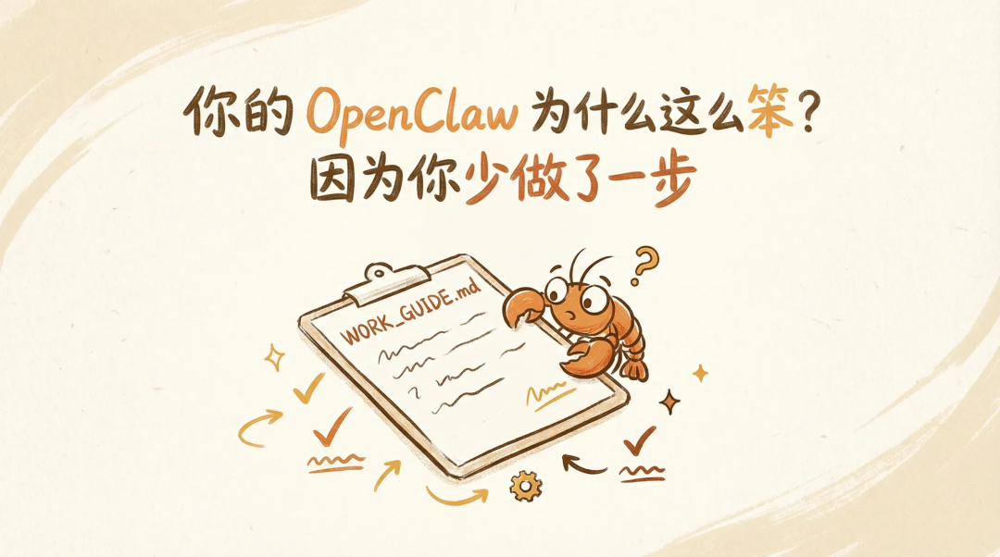

> 📎 来源: [谈小罗Coding](https://mp.weixin.qq.com/s?__biz=MzU5NTcxMzkyNg==&mid=2247484566&idx=1&sn=33cca7b0cb0841bd8e4828b9c6a1db31&chksm=ffa89628391673dfb710ef3df4e8b24952b5ccccdfa78c07d2c2ef57bbf621ed35df3a6d06f4&mpshare=1&scene=1&srcid=0421hAyyRLksADDzBUrGH4Yk&sharer_shareinfo=eb1ed920647aa963347c7d38755680b6&sharer_shareinfo_first=eb1ed920647aa963347c7d38755680b6) | 时间: 2026-04-21 12:02

---

👆 **「关注」**加**「星标」**，一起用 AI 搞点有意思的事！

---



cover

「在过去一周中，我积极参与了各项工作任务并取得了阶段性成果。」

这是我的 OpenClaw 帮我写的周报。我差点把它卸了。

让它帮忙回消息，口气像个刚毕业的客服。让它整理笔记，三句话能说完的事它给你扯 800 字。群里隔三差五就有人问：「为什么我的龙虾这么蠢？」

你有没有想过，问题可能不在龙虾。

## 招了新员工，没给 JD

想象一下。你公司新来了个实习生，挺聪明的，什么都能干。但你没告诉 ta 公司做什么的，没说你的工作习惯，没交代哪些文件不能碰。

然后你让 ta 帮你回客户消息。

ta 能写出来，但大概率是一股培训教材的味道。因为 ta 不了解你，只能按「最安全的方式」来。

OpenClaw 也一样。你装好了，直接开聊，它只知道你给它的那句话。它不知道你是程序员还是设计师，不知道你喜欢简洁还是详细，不知道你的财务文件碰不得。

所以它只能用最通用、最安全、最无聊的方式回应你。

不是它傻。是你没给它写工作说明书。

## WORK\_GUIDE.md 是什么

说白了就是一份文档，告诉你的 Agent「你是谁」和「怎么跟你配合」。

你的工作场景是什么。比如你是个前端开发，主力用 React，日常就是写代码改 bug。还是你是自由职业者，需要它帮你管客户沟通和日程。这些背景信息给了，它就不用每次都猜你是干嘛的。

然后是你的偏好。喜欢回答简洁还是详细？要不要代码注释？能不能用网络用语？我自己就写了一条：「回答不要用企业套话，不要用『赋能』『抓手』『对齐』这些词。」写完这条之后世界清净了不少。

最重要的是红线。哪些事绝对不能做。不能动财务相关文件，不能自动发送未经我确认的消息，不能访问生产环境数据库。之前写安全指南那篇提过，Agent 如果不知道边界在哪，它不会主动问你的。去年被钓鱼丢了 1000 刀之后我就学乖了，涉及钱的操作全部写进红线，没得商量。

最后补上你的常用工具和环境。用什么编辑器、什么框架、什么部署方式。给了这些上下文，它回答问题的时候就不用每次都从头猜了。

这四块内容写成一个 markdown 文件就行。

有个细节要提一下。你可能之前看过我写的 SOUL.md（给龙虾换灵魂那篇），SOUL.md 管的是龙虾的「人格」和说话方式，OpenClaw 启动的时候会自动加载它。但 WORK\_GUIDE.md 不一样，它目前不会被自动加载。

怎么办？最简单的方式是把 WORK\_GUIDE 的内容直接写进 SOUL.md 里。反正都是告诉龙虾「你该怎么跟我配合」，放一起更省事。你也可以单独写一份 WORK\_GUIDE.md，然后在 SOUL.md 里加一句「每次对话前先读一遍 WORK\_GUIDE.md」，让它自己去找。

我现在的做法是合在一起。SOUL.md 上半部分是人格设定，下半部分就是 WORK\_GUIDE 的内容。一个文件搞定，龙虾启动就全。

## 手把手写一份

别慌，不用写得多复杂。下面是我自己用的模板，你可以直接抄然后改：

```
12345678910111213141516171819202122232425262728# WORK_GUIDE.md ## 关于我- 成都程序员，客户端开发（Android/Flutter/HarmonyOs）- 日常工作：写代码、改 bug、写技术文档、整理笔记- side project：公众号写作、独立开发 ## 我的偏好- 回答要简洁，别写一堆铺垫- 不要用企业套话（赋能、抓手、对齐、闭环、颗粒度）- 技术问题直接给方案，不用解释基础概念- 中文为主，专业术语保留英文- 代码注释用英文 ## 红线（绝对不能做的事）- 不能动任何 .env 文件和密钥相关文件- 不能自动发送消息（飞书/微信/邮件），必须我确认- 不能删除任何文件，只能建议删除- 不能访问或操作任何钱包、交易所相关内容- 涉及金额计算必须标注「请人工复核」 ## 常用工具和环境- 编辑器：Claude Code- 主力语言：TypeScript, Dart, Kotlin，ArkTs- 常用框架：React, Flutter, Next.js- 部署：Vercel, Cloudflare Pages- 笔记：Obsidian- 项目管理：飞书
```

当然我第一版花了快一个小时，因为纠结措辞纠结半天。但其实十分钟就够了，你不需要一次到位，用着用着想到什么加什么就行。我自己这份已经改了七八版了。

有几个小建议。

红线那部分宁多勿少。你以为常识的事情，Agent 未必觉得是常识。

偏好不用写太多。五六条就够了，写太多它反而容易搞混。挑你最在意的那几条就行。

别在里面写密码和 token。这个文件是纯文本，写了就等于明文存储。工具账号可以写名字，但认证信息别放进来。

## 写完之后你会发现什么变了

给你看个对比。

写 WORK\_GUIDE 之前，我让 Orinon 帮我写周报：

「在过去一周中，我积极参与了各项工作任务，完成了多个模块的开发和优化工作，取得了阶段性成果。」

写完之后，同样的指令：

「本周完成了 3 个 Flutter 页面重构，修了 auth 模块的 token 刷新 bug，公众号发了两篇 OpenClaw 系列。」

因为它知道我干什么的了，也知道我讨厌套话。

还有个意外收获。每次 Orinon 要执行一些敏感操作的时候，它会自己弹出来说「这个操作涉及你红线里提到的 XX，需要你确认」。有点像你教狗不能上沙发，然后它真的站在沙发边上看着你 =。=

这个机制比什么安全插件都管用。因为它不是通用规则，是你自己定的、符合你实际场景的规则。

招了个实习生，第一天不给 JD 就让干活，能干好才怪。

给你的 OpenClaw 写一份 WORK\_GUIDE.md，就是在补这个最基本的步骤。十分钟的事，后面省心十倍。

---

##### 关于作者 | 谈小罗Coding

AI 程序员，OpenClaw 中文生态布道者。白天写代码，晚上折腾 AI Agent。相信「先吃饱，再吃好」，喜欢用最小成本跑通一件事。

---

**如果这篇文章对你有帮助，欢迎点赞、在看、转发，让更多人看到。**

有任何问题欢迎留言，我会一一回复。
