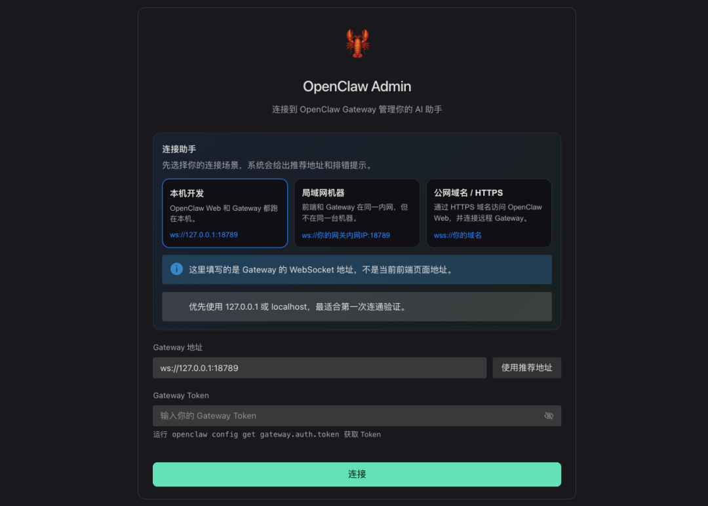
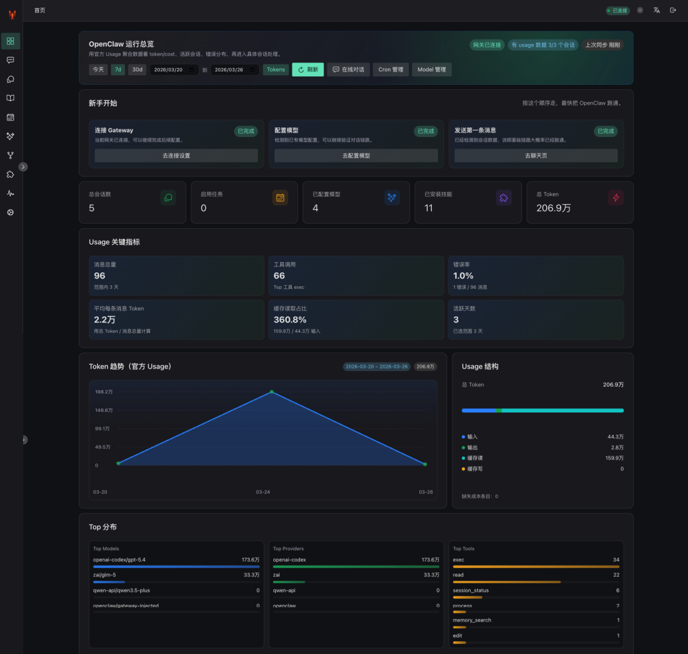
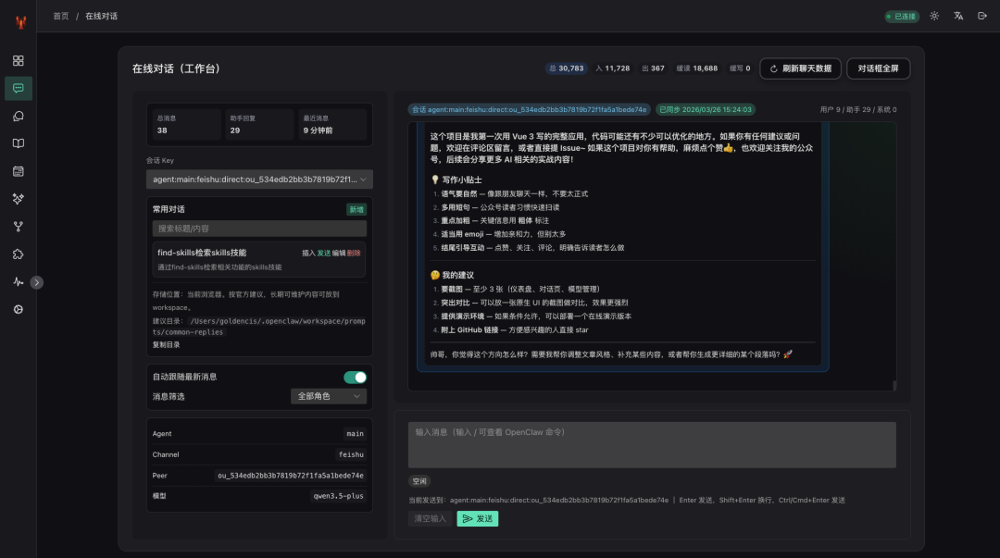
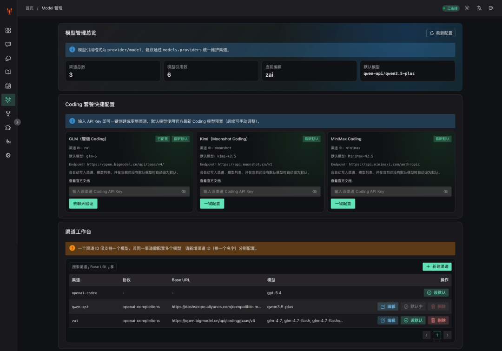
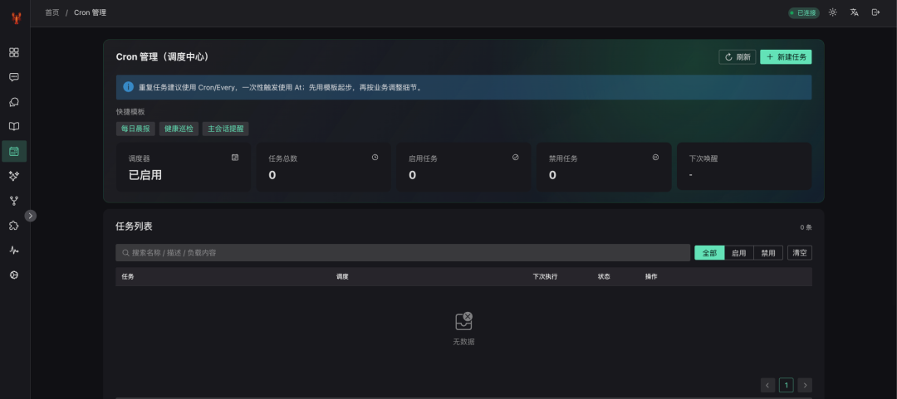
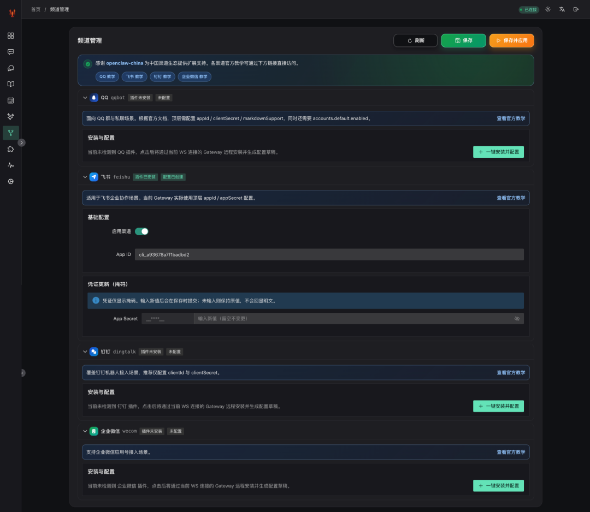
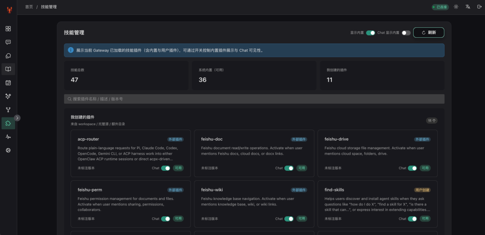
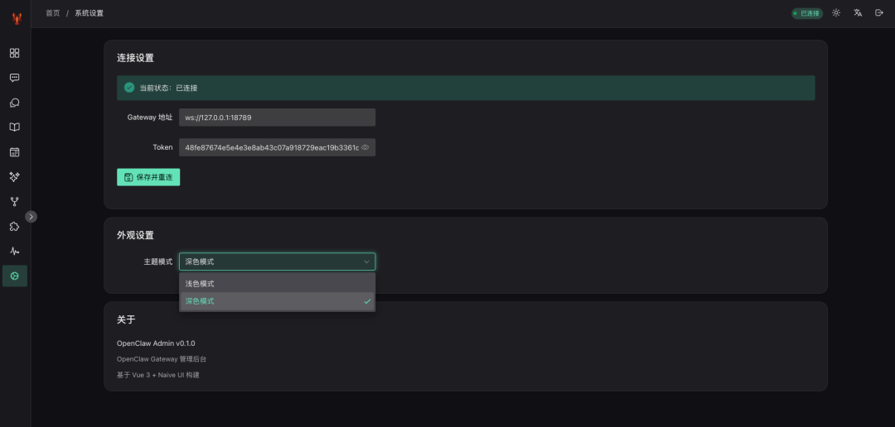

> 📎 来源: [布道Agent](https://mp.weixin.qq.com/s/TfdOI3_yV_105wVsbShLhg) | 时间: 2026-04-13 15:35

---

# 一个超爽的 OpenClaw UI

大家好，我是布道AI。

前段时间我用 OpenClaw 搭建了自己的 AI 助手，功能确实强大，但有两个问题一直让我很头疼：

1. 1. **消息不能实时显示** — 每次发送消息后，得等好久才能看到完整回复，那种"打字机"的流式效果根本看不到
2. 2. **原生 UI 实在太丑** — 打开官方控制台，瞬间回到 10 年前的网页风格

这是一套用 **Vue 3 + Naive UI** 重新写的 OpenClaw 管理界面。

用了一段时间后，朋友都说："这 UI 看着就舒服，操作也顺手多了！"

今天就把这个项目分享给大家，希望能帮到同样在用 OpenClaw 的你。

---

## 🎨 先看图

### 1️⃣ 登录连接



支持 **本地** 和 **远程** 服务器一键连接：

- 本地开发：

  ```
  ws://127.0.0.1:18789
  ```
- 远程服务器：

  ```
  wss://你的域名
  ```
- Token 认证，安全可靠

### 2️⃣ 仪表盘概览



- 会话数、Cron 任务、模型数量一目了然
- Token 用量和成本统计可视化
- 趋势图，支持 Token/Cost 切换

### 3️⃣ 在线对话



**核心亮点来了！**

- ✅ **WebSocket 实时通信** — 消息一个字一个字蹦出来，打字机效果丝滑可见
- ✅ **会话快速切换** — 下拉选择，不用反复登录
- ✅ **快捷回复模板** — 常用消息一键发送
- ✅ **命令补全** — 

  ```
  /new
  ```

  ```
  /skill
  ```

  ```
  /model
  ```

   智能提示

### 4️⃣ 模型管理



- 多模型一键切换：GPT-5.4、Qwen3.5-Plus、GLM-5...
- Provider 配置可视化
- 默认模型快速设置
- 不用再改配置文件了！

### 5️⃣ 调度中心（Cron 管理）



- 定时任务列表展示
- 启用/禁用快速切换
- 运行历史查看
- 立即执行测试

### 6️⃣ 频道管理



**国内四大渠道一站式配置：**

- 🐧 QQ 机器人
- ✈️ 飞书
- 💬 钉钉
- 🏢 企业微信

插件安装状态检测、账号配置、认证配对，全部可视化操作。

### 7️⃣ 技能管理



- 已安装技能列表
- 一键更新
- 启用/禁用切换
- 技能配置编辑

### 8️⃣ 系统设置



- Gateway 地址管理
- Token 配置
- 设备配对审批
- 连接状态检测

## ✨ 核心亮点总结

### 1️⃣ 实时流式消息，打字机效果丝滑可见

飞书机器人最大的痛点就是**不能实时看到回复**。而我的项目中集成了 **WebSocket 实时通信**，消息一个字一个字蹦出来的感觉，真的很爽！

### 2️⃣ 现代化 UI，看着就舒服

抛弃了原生的"命令行风格"，采用 **Naive UI 组件库**，卡片式布局、圆角、阴影、渐变色，该有的一样不少。

### 3️⃣ 支持本地 + 远程双模式

这是很多人关心的点！

- **本地开发**：直接连接 

  ```
  ws://127.0.0.1:18789
  ```

  ，无需配置
- **远程服务器**：支持 

  ```
  wss://
  ```

   加密连接，部署到 VPS 也能安全访问
- **一套代码，多处使用**：家里电脑、公司电脑、手机浏览器，随时随地管理

### 4️⃣ 多模型一键切换

内置模型管理功能，GPT-5.4、Qwen3.5-Plus、GLM-5... 点一下就能切换，不用去配置文件里改来改去。

### 5️⃣ 一站式管理，所有功能都在一个页面

| 功能 | 说明 |
| --- | --- |
| 💬 在线对话 | 实时聊天、会话切换、快捷回复 |
| 📊 仪表盘 | Token 用量、成本统计、趋势图表 |
| ⏰ Cron 管理 | 定时任务、运行历史 |
| 📚 记忆管理 | 查看/编辑 Agent 记忆文件 |
| 🧩 技能管理 | 安装/更新用户技能 |
| 🌐 频道管理 | QQ/飞书/钉钉/企业微信配置 |
| 🤖 模型管理 | 多模型切换、Provider 配置 |
| ⚙️ 系统设置 | Gateway 地址、Token、设备配对 |

### 6️⃣ 上手简单，3 步搞定

1. 1. 输入 Gateway 地址和 Token
2. 2. 登录进入仪表盘
3. 3. 打开"在线对话"开始聊天

就这么简单。

---

## 🚀 快速部署

### 环境要求

- Node.js 18+
- npm 或 pnpm

### 安装步骤

```
# 1. 克隆项目git clone <仓库地址>cd OpenClawUI# 2. 安装依赖npm install# 3. 启动开发环境npm run dev# 4. 访问 http://localhost:3001
```

构建后的文件在 

```
dist/
```

 目录，可部署到：

- Nginx / Apache
- Vercel / Netlify
- 阿里云 OSS
- 任何静态托管服务

---

## 💬 最后

这个项目是用 Vue 3 写的完整应用，代码可能还有不少可以优化的地方。如果你有任何建议或问题，欢迎在评论区留言;

需要源码私信、私信、私信...

**如果这个项目对你有帮助，麻烦点个赞👍，也欢迎关注我的公众号，后续会分享更多 AI 相关的实战内容！**
