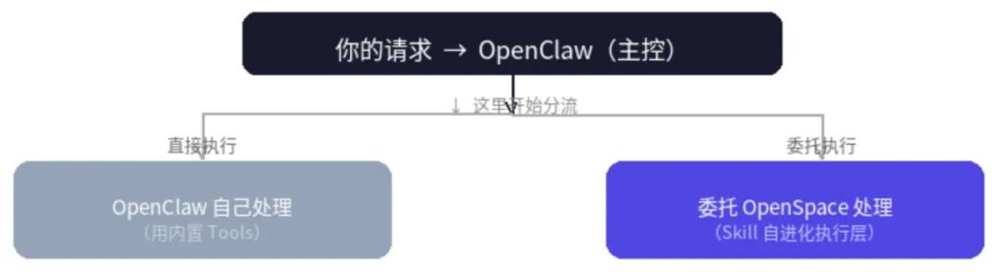

> 📎 来源: [嘎叔学AI](https://mp.weixin.qq.com/s?__biz=MzIyNjYxNjM0Mg==&mid=2247484960&idx=1&sn=fee301b9cce15ed3be19a4834f5ffae7&chksm=e9b2b5dabfd6023530fa93efd525241e6a60ac3d50d87938120ec639be0708c4a68fd7f27350&mpshare=1&scene=1&srcid=0425hfW2KPGIPw6qLQfu2vGw&sharer_shareinfo=d75ae0fbf966c32c62dc951fcd05ac04&sharer_shareinfo_first=d75ae0fbf966c32c62dc951fcd05ac04) | 时间: 2026-04-25 18:06

---

## 先说结论

OpenSpace 确实是一个有价值的项目，它的核心理念很清晰：**让 AI Agent 不只是执行任务，还能从任务中学习，变得一次比一次强。**

但经过实机验证，我发现了一个关键问题：**如果你不知道如何正确使用，也没有一个支持多 system message 的模型，OpenSpace 的"自进化"能力根本无法真正生效。**

换句话说：**OpenSpace 的价值取决于驱动它的模型的强弱，而使用强模型的时候我们反而并不需要太过纠结“能力”。这其实就是“一根筋两头堵”。**

下面我会详细展开我们验证的过程、发现的问题、以及这个矛盾的核心所在。

---

## OpenSpace 是什么

OpenSpace 是港大 HUDS 团队开源的一个"自进化 Skill 引擎"。

它的核心思想是：今天的 AI Agent（无论用 Claude、GPT 还是国产大模型，又或者使用了 OpenClaw 这样的底座工具）都有一个致命缺陷——

> **从来不从实际任务中学习和进化。同样的失败重复犯，同样的探索重复做，知识困在单个 Agent 里无法共享。**

OpenSpace 要解决的就是这个问题。它通过三个进化机制让 Agent 真正学会：

| 进化类型 | 触发条件 | 效果 |
| --- | --- | --- |
| **AUTO-FIX** | Skill 执行失败 | 自动修复指令，生成新版本 |
| **AUTO-IMPROVE** | Skill 执行成功但有优化空间 | 创建增强版本 |
| **CAPTURE** | 发现新的成功模式 | 从实际执行中提取为新 Skill |

它的 Benchmark 数据也很亮眼：在 50 个专业任务上，使用 OpenSpace 后**收入提升 4.2 倍，Token 消耗降低 46%**。

这个数字的来源是 GDPVal 真实评测，涵盖税务、法律、工程、媒体等 6 个行业。

---

## 它和 OpenClaw 是什么关系

**简单说：OpenSpace 是 OpenClaw 的可选扩展。**

OpenClaw 本身是一个多 Agent 协作系统，能处理飞书、iMessage 等多个渠道的消息，管理一套 Skill 体系。OpenSpace 接入后，可以为 OpenClaw 增加"执行层 + 自进化"能力。



接入方式在 README 里写得很清楚——通过 MCP 协议，在 OpenClaw 的 mcporter 配置里加一行就行。

---

## 真正的局限性在哪里

经过测试，我意识到 OpenSpace 的集成有一个根本性的架构问题：

### 问题一：OpenSpace 不会自动被调用

OpenClaw 接入了 OpenSpace，不代表 OpenClaw 会自动把任务交给它处理。

**目前的实际状态是：**

```
任务来了 → OpenClaw 自己处理 → 不会触发 OpenSpace → 不会有进化除非你显式说："把这个任务交给 OpenSpace 执行"
```

也就是说，OpenSpace 的进化能力需要两个前提同时成立：

1. **有人告诉 OpenClaw 什么时候用它**

   （目前没有这个路由规则）
2. **OpenSpace 本身能正常执行**

   （目前被 MiniMax 兼容性问题卡住，因为不支持多 system message ）

两条路都堵着。

### 问题二：强模型和 API 兼容性之间的矛盾

这是更深层的问题。

OpenSpace 的价值在于进化出高质量的 Skill。而**高质量的 Skill 需要强模型来写指令**——你需要模型有足够的推理能力、指令遵循能力和工具调用能力。

但实际测试发现：

| 模型 | 能力 | 多 system message 支持 |
| --- | --- | --- |
| MiniMax M2.7 | 强（我们线上用的） | ❌ 不支持 |
| 本地 Qwen 3.5 量化 | 弱 | ✅ 支持 |
| DeepSeek V3 | 强 | ✅ 支持 |

也就是说：

> **用强模型（MiniMax）→ OpenSpace 执行失败** **用支持多 system message 的模型（Qwen 量化）→ 模型能力变弱，进化出的 Skill 质量也存疑**

前面也说过，当你在使用一个顶级模型的时候，Skill 的质量对结果的影响，已经非常有限了。那么这个时候你更追求的是一次过，而不是继续反复调试 skill ，所以对大部分普通用户来说，这个目标场景已经不存在了。

这是目前一个很难两全的现实困境。

---

## OpenSpace 真正适合什么场景

虽然目前有局限性，但 OpenSpace 的价值是真实的。它的设计理念非常清晰：

**核心价值 = 把"成功模式"固化成可复用 Skill，让后续同类任务的成本趋近于零。**

这意味着它最适合：

1. **高频重复任务**

   — 同一个任务会执行很多次，Skill 进化才有意义
2. **工具链复杂的任务**

   — 需要多次 Tool 调用、错误恢复，成功模式值得固化
3. **多 Agent 协作场景**

   — 一个 Agent 进化的 Skill 可以共享给其他 Agent

反过来说，如果你的任务是一次性的、简单的、不重复的，OpenSpace 的价值几乎为零——你只是在帮它积累 Skill 库存，而不是享受进化的收益。

只有当你确确实实在执行一个非常复杂，即便使用顶级模型都还需要反复调试、验证的工作流时，使用OpenSpace，或许能得到一个比较好的结果。

但问题是，越是专业的领域，对结果的确定性要求就更高。“或许”这两个字本身就是不被接受的。

---

## 结论

OpenSpace 是一个有真实价值的技术方向。它的核心洞察是对的：**AI Agent 不应该每次任务都从零推理，应该从成功和失败中学习，把模式固化成可复用、可共享、可进化的 Skill。**

但它要真正发挥价值，有两个前提：

1. **执行层能正常运行**

   — 这需要你的 LLM 支持多 system message，或者换一个支持的模型
2. **任务有重复性**

   — 单次任务不值得，只有高频重复才能体现进化的价值

如果这两个条件都满足，OpenSpace 确实能带来显著的效率提升（4.2 倍收入提升、46% Token 节省是他们的 Benchmark 数据）。

如果条件不满足，强行集成只会增加系统的复杂度和成本，而没有实际的收益。

---

**后续计划：** 我们会继续关注 OpenClaw 或其他模型、工具的集成可能性，也会在任务真正有重复性的时候重新评估 OpenSpace 的集成价值。如果你有更多想法或经 验，欢迎交流。
