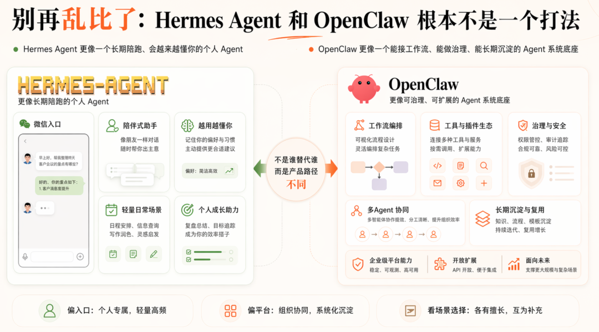
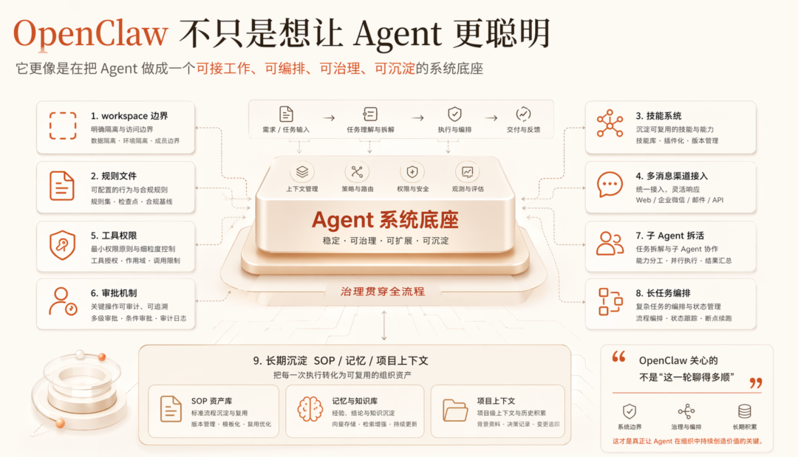
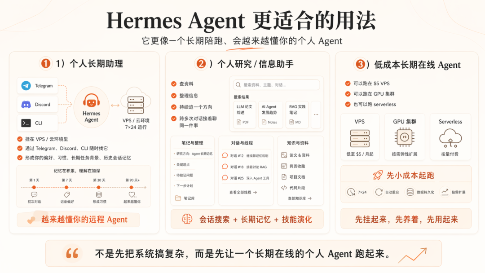
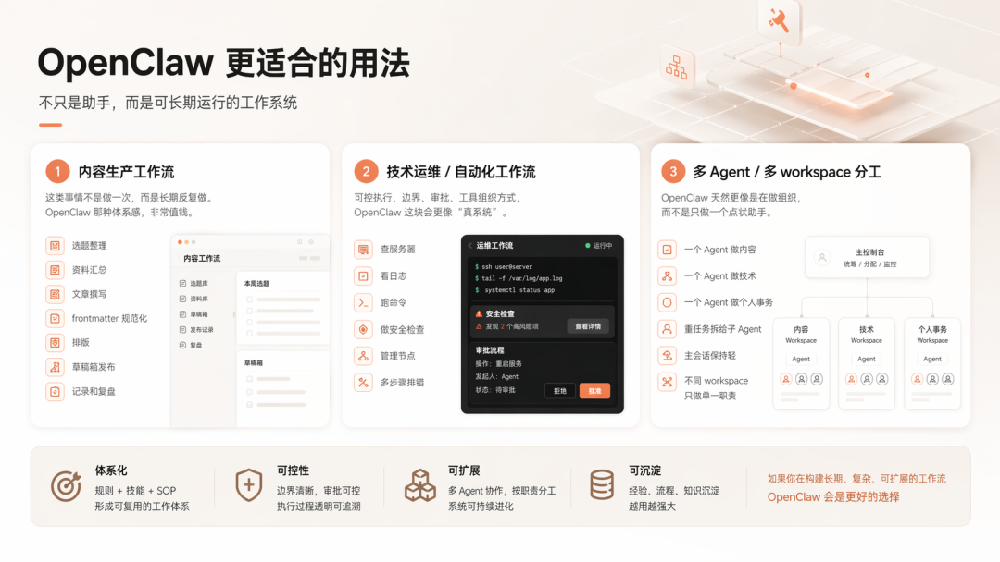
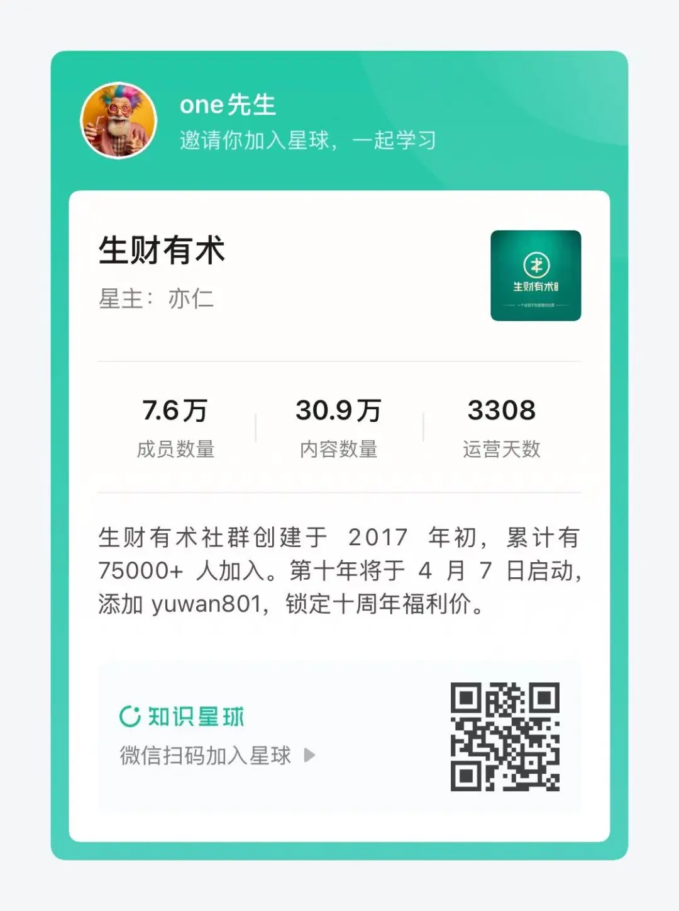

> 📎 来源: [One的AI工具箱](https://mp.weixin.qq.com/s?__biz=MzI0Mjc0MzA0Mg==&mid=2247485630&idx=1&sn=0f601891f103df1a1164bad980089dec&chksm=e8c365cad657e8d795a2a5c2c2bd668d07213ad0afe9b857f45c49a636c7d18a3a5ad06f0af5&mpshare=1&scene=1&srcid=0424S6oQVkNAI2q2jUewZQWb&sharer_shareinfo=01025009f01a4d627d41035acb9f08f6&sharer_shareinfo_first=01025009f01a4d627d41035acb9f08f6) | 时间: 2026-04-24 00:15

---

> 一篇帮你快速判断“我该先用 Hermes Agent 还是 OpenClaw”的实战对比稿。

大家好，我是 One

最近很多人开始把 **Hermes Agent** 和 **OpenClaw** 放在一起比。

但说实话，大部分人一开始就比错了。

因为这俩虽然都叫 Agent，
但根本不是同一个打法。

如果你硬把它们理解成“两个差不多的 AI Agent 工具”，
那后面大概率会选错。



我先把结论拍你脸上：

- **Hermes Agent 更像一个长期陪跑、会越来越懂你的个人 Agent**
- **OpenClaw 更像一个能接工作流、能做治理、能长期沉淀的 Agent 系统底座**

所以真正该问的，不是：

**Hermes Agent 和 OpenClaw 谁更强？**

而是：

**你现在到底是想养一个 Agent，还是想搭一套 Agent 系统。**

这个问题不想清楚，后面越研究越乱。

今天这篇，我就直接帮你拆透：

- Hermes Agent 到底值不值得装
- Hermes Agent 和 OpenClaw 真正差在哪
- 两边分别适合什么用法
- 什么人更适合 Hermes Agent
- 什么人更适合 OpenClaw
- 以及 Hermes Agent 的详细安装部署步骤

而且安装那块，我不会跟你玩虚的。
直接给命令。

## 一、Hermes Agent 和 OpenClaw，像是像，但压根不是同一道题

先说一句公道话。

Hermes Agent 和 OpenClaw 确实有很多相似点：

- 都不是传统聊天框
- 都能接模型
- 都能接工具
- 都能在本地或云上跑
- 都能做跨会话记忆
- 都不是一次性 demo，而是奔着长期使用去的

但真正拉开差距的，不是“功能表上有哪些共同项”。

而是：

**它们各自最想补的那一块，到底是什么。**

这才是关键。

**Hermes Agent 最想补的是：让 Agent 越用越像你自己的**

我看完 Hermes Agent 官方 README，最大的感觉就一句：

**它不是只想做一个会调工具的 Agent。**

它更想做的是一个：

**会记、会学、会长技能、会慢慢理解你的长期 Agent。**

官方打得最凶的点也都在这：

- built-in learning loop
- 从经验里生成 skill
- skill 会在使用里继续改进
- 会主动推动知识持久化
- 能搜索历史会话
- 会跨 session 建立对用户的理解

说白了，Hermes Agent 想补的是一个很真实的问题：

**为什么很多 Agent 当场挺聪明，过两天又像失忆。**

今天你花半小时把背景讲清楚，
它懂了。

明天你再来，
又得重新铺一遍。

这种体验，其实很烦。

Hermes Agent 这条路线，本质上就是想把 Agent 从“单次调用工具”推进到“长期陪跑型个人助手”。

这是它最有辨识度的地方。

**OpenClaw 最想补的是：让 Agent 真正变成一套系统**

OpenClaw 这边就不一样了。



如果你真长期用过，会越来越清楚：

**OpenClaw 不只是想让 Agent 更聪明，它更像是在把 Agent 做成一个可接工作、可编排、可治理、可沉淀的系统底座。**

它更重视的是：

- workspace 边界
- 规则文件
- 技能系统
- 多消息渠道接入
- 工具权限
- 审批机制
- 子 Agent 拆活
- 长任务编排
- 长期沉淀 SOP / 记忆 / 项目上下文

你会发现，OpenClaw 关心的不是“这一轮聊得多顺”。

它更关心的是：

**这个 Agent 以后能不能稳定接事。**

而且不是接一次。
是长期接。

所以如果你让我用一句话概括两边区别，我还是那句：

- **Hermes Agent 更像在养成一个 Agent**
- **OpenClaw 更像在搭建一个 Agent 系统**

## 二、很多人选错，不是因为没看文档，是因为根本没搞清自己要什么

很多人比工具特别喜欢比这些：

- 支持多少模型
- 接多少平台
- 有没有 memory
- 会不会自动生成 skill
- 能不能远程挂 VPS

这些都重要。

但还不是最重要的。

最重要的是：

**你自己现在到底处在哪个阶段。**

**如果你现在最想要的是“先搞一个自己的长期 Agent”**

那 Hermes Agent 会更顺。

适合这种人：

- 个人玩家
- 技术爱好者
- 想先在 VPS 挂一个 Agent
- 想从 Telegram / Discord / CLI 随时叫它
- 特别在意“越用越懂我”
- 不想每次都从头重新解释背景

这种用户的真实需求，通常不是复杂工作流。

而是：

**我想先有一个真正属于我的 Agent。**

那 Hermes Agent 很对路。

**如果你现在最想要的是“让 Agent 真正接工作”**

那 OpenClaw 往往更对。

适合这种人：

- 内容工作流用户
- 技术工作流用户
- 运维 / 自动化用户
- 想做多 workspace 分工的人
- 想做多 Agent 协作的人
- 想把规则、记忆、SOP、模板长期沉淀下来的人

这种用户的核心诉求，不是“我想拥有一个有个性的 AI 伙伴”。

而是：

**我想让 Agent 真的接住事，而且越做越稳。**

这时候 OpenClaw 这条路会更像正路。

## 三、Hermes Agent 和 OpenClaw 分别适合什么用法？我给你直接拆场景

**Hermes Agent 更适合的用法**



如果你选 Hermes Agent，最适合的用法通常是这些：

**1）个人长期助理**

你把它挂在 VPS 或云环境里，
通过 Telegram、Discord、CLI 随时找它。

它不只是回答问题。
而是慢慢形成：

- 你的偏好
- 你的习惯
- 你的长期任务背景
- 你的历史会话记忆

这种体验更像“一个越来越懂你的远程 Agent”。

**2）个人研究 / 信息助手**

如果你平时经常会：

- 查资料
- 整理信息
- 持续追一个方向
- 跨多次对话接着聊同一件事

那 Hermes Agent 那种“会话搜索 + 长期记忆 + 技能演化”的路线就会比较香。

**3）低成本长期在线 Agent**

官方自己就很强调这点：

- 可以跑在 $5 VPS
- 可以跑在 GPU 集群
- 也可以跑 serverless

这意味着它很适合先小成本起跑。

不一定一开始就搞很复杂。
先挂起来，先养着，先用起来。

**OpenClaw 更适合的用法**

如果你选 OpenClaw，更适合这些场景：

**1）内容生产工作流**

比如：

- 选题整理
- 资料汇总
- 文章撰写
- frontmatter 规范化
- 排版
- 草稿箱发布
- 记录和复盘

这类事情不是做一次。
而是长期反复做。

这时候 OpenClaw 那种 workspace + 规则 + 技能 + SOP 的体系感，非常值钱。

**2）技术运维 / 自动化工作流**

比如：

- 查服务器
- 看日志
- 跑命令
- 做安全检查
- 管理节点
- 做多步骤排错

这种场景里，可控执行、边界、审批、工具组织方式，都非常关键。

OpenClaw 这块会更像“真系统”。

**3）多 Agent / 多 workspace 分工**

如果你已经开始想这些问题：

- 一个 Agent 做内容
- 一个 Agent 做技术
- 一个 Agent 做个人事务
- 重任务拆给子 Agent
- 主会话保持轻
- 不同 workspace 只做单一职责

那 OpenClaw 的优势会越来越明显。

因为它天然更像是在做组织，而不是只做一个点状助手。

## 四、所以到底谁适合用 Hermes Agent，谁适合用 OpenClaw？

我直接给你一句最省脑子的判断。

**更适合 Hermes Agent 的人**

如果你符合下面这些特点，先看 Hermes Agent：

- 你是个人用户
- 你想先搞一个自己长期在线的 Agent
- 你更在意长期记忆、个性化、连续上下文
- 你希望它越用越懂你
- 你希望它挂在 Telegram / Discord / CLI 里随叫随到
- 你现在还没有特别复杂的团队流程和治理需求

一句话：

**你要的更像一个“越养越顺手”的个人 Agent。**

**更适合 OpenClaw 的人**

如果你符合下面这些特点，先看 OpenClaw：

- 你想让 Agent 真正接工作
- 你想做长期可复用的工作流
- 你想沉淀规则、SOP、模板、记忆、项目上下文
- 你想做多 Agent 协作
- 你想让执行有边界、有审批、有治理
- 你不是只要一个陪跑 AI，你是要一套长期系统

一句话：

**你要的不是“一个 AI”，你要的是“一套能长期跑的 Agent 生产系统”。**

## 五、Hermes Agent 详细安装部署步骤：别上来玩虚的，先最小闭环

下面进入最实用的部分。



很多文章写安装，写着写着就开始飘。

“几分钟上手”
“轻松部署”
“一键即可”

结果真到你自己装的时候，全是坑。

所以这里我按最小闭环来。

先跑起来。
再优化。

**方案一：官方一键安装（最快）**

适合：

- Linux
- macOS
- WSL2
- Android Termux
- 想先尽快跑起来的人

先执行：

```
curl -fsSL https://raw.githubusercontent.com/NousResearch/hermes-agent/main/scripts/install.sh | bash
```

安装完成后，刷新 shell：

```
source ~/.bashrc
```

如果你是 zsh：

```
source ~/.zshrc
```

然后直接启动：

```
hermes
```

如果你只是想先确认 Hermes Agent 能不能在你机器上跑，
先走这条最快。

**方案二：手动安装（更适合想自己掌控依赖的人）**

如果你不想直接执行远程安装脚本，
而是想一层层自己装，
那就走手动路径。

**第 1 步：安装 uv**

```
curl -LsSf https://astral.sh/uv/install.sh | shsource ~/.bashrc
```

**第 2 步：克隆仓库**

```
git clone https://github.com/NousResearch/hermes-agent.gitcd hermes-agent
```

**第 3 步：准备 Python 3.11**

Ubuntu / Debian：

```
sudo apt updatesudo apt install -y python3.11 python3.11-venv git curl
```

macOS（Homebrew）：

```
brew install python@3.11 git curl
```

**第 4 步：创建虚拟环境**

```
uv venv venv --python 3.11source venv/bin/activate
```

**第 5 步：安装 Hermes Agent**

官方 README 当前给的开发路径是：

```
uv pip install -e ".[all,dev]"
```

如果你只是普通用户，理论上不一定非得 dev。
但官方当前给的稳妥路径就是这条，我这里按官方写。

**第 6 步：启动**

```
hermes
```

如果命令没进 PATH，也可以试：

```
./hermes
```

或者直接按官方快捷脚本：

```
git clone https://github.com/NousResearch/hermes-agent.gitcd hermes-agent./setup-hermes.sh./hermes
```

这个路径更适合开发者，或者你就是想长期自己维护环境。

## 六、装完 Hermes Agent 后，别急着激动，先把这几步补上

**1）跑初始化向导**

```
hermes setup
```

这个命令很关键。

如果你之前用过 OpenClaw，
它还可能自动检测 `~/.openclaw`，并提示要不要迁移。

**2）选择模型**

```
hermes model
```

官方支持的来源不少，比如：

- Nous Portal
- OpenRouter
- OpenAI
- Hugging Face
- NVIDIA NIM
- Kimi / Moonshot
- GLM
- MiniMax
- 你自己的兼容 endpoint

这里我的建议很简单：

**先用你最熟、最稳、最好排错的 provider。**

别为了显得高级，一上来就混很多 provider。

**3）配置 `.env`**

官方仓库里有 `.env.example`。
最稳妥的做法：

```
cp .env.example .envnano .env
```

最小闭环至少补一个模型 key。
比如最常见的 OpenRouter：

```
OPENROUTER_API_KEY=你的_key
```

如果你后面要用搜索、抓取、浏览器能力，再按需补：

```
EXA_API_KEY=你的_keyFIRECRAWL_API_KEY=你的_keyBROWSERBASE_API_KEY=你的_keyBROWSERBASE_PROJECT_ID=你的_project_id
```

记住一句话：

**先把模型跑通，再补工具。**

**4）检查工具**

```
hermes tools
```

先看哪些工具真的可用。

别主能力还没跑稳，就先把工具层堆满。

**5）如果你想远程聊，再配 gateway**

如果你不只是本地 CLI 用，
还想从 Telegram、Discord 这些入口直接找它，
再继续：

```
hermes gateway setuphermes gateway start
```

到这一步，Hermes Agent 的最小闭环才算真正成型：

- 机器上装好了
- 模型配好了
- CLI 能聊
- gateway 能收消息

## 七、如果你要把 Hermes Agent 挂到 VPS，上来就按这个顺序走

很多人不是装不上。

而是装上以后，活不久。

所以 VPS 路线最重要的不是花，而是稳。

**最小配置建议**

如果你是个人长期使用，先这么起：

- 2 vCPU
- 2GB~4GB 内存
- Ubuntu 22.04 / 24.04
- 公网 IP

如果你主要是消息入口 + 远程 Agent，这个配置够起步。

**部署步骤**

**第 1 步：补基础环境**

```
sudo apt update && sudo apt install -y curl git python3.11 python3.11-venv build-essential tmux
```

**第 2 步：安装 Hermes Agent**

```
curl -fsSL https://raw.githubusercontent.com/NousResearch/hermes-agent/main/scripts/install.sh | bashsource ~/.bashrc
```

**第 3 步：初始化**

```
hermes setup
```

**第 4 步：先在 CLI 验证**

```
hermes
```

先确认四件事：

- 能启动
- 能调用模型
- 不报 provider 错
- 会话能正常工作

**第 5 步：再配 gateway**

```
hermes gateway setuphermes gateway start
```

**第 6 步：用 tmux 先挂起来**

```
tmux new -s hermeshermes gateway start
```

然后按：

```
Ctrl+b d
```

把它挂到后台。

这个方式不花哨，但非常实用。

先把“它能稳定活着”解决，
比什么都重要。

## 八、Hermes Agent 最容易踩的坑，我先帮你标出来

**1）Windows 原生别头铁**

官方 README 已经写了：

**原生 Windows 不支持，走 WSL2。**

所以 Windows 用户最省事的路线就是：

- 先装 WSL2
- 再在 Ubuntu 里装 Hermes Agent

**2）Termux 别乱补依赖**

官方专门提了，Termux 走的是裁剪过的安装路径。
因为完整依赖里有 Android 不兼容的语音相关依赖。

所以手机端优先走官方文档，别自己乱改。

**3）先别一口气把所有工具开满**

很多人装完就开始：

- 搜索也上
- 浏览器也上
- 自动化也上
- 多 provider 也上
- 多平台也上

最后系统刚起步就一团乱。

正确顺序就五步：

1. 先装好
2. 先把模型跑通
3. 先把 CLI 跑通
4. 再把 gateway 跑通
5. 最后再按需补工具

**4）VPS 第一天最重要的不是强，是稳**

这个我再说一遍。

很多个人用户一上来就想追求：

- 多 provider
- 多入口
- 多工具
- 多守护方式
- 多自动化任务

最后全都半吊子。

我还是那句话：

**先活，再强。**

Agent 这东西，稳定在线一个星期，
比第一天堆 20 个功能有价值得多。

## 九、最后一句：Hermes Agent 值得看，但它和 OpenClaw 真不是同一道题

如果你问我，Hermes Agent 值不值得看？

我觉得值得。

因为它不是又一个简单套壳工具。
它的主线很明确：

**把 Agent 从“会调用”往“会记忆、会成长、会长期陪跑”推进。**

这条线对个人用户很有吸引力。

但如果你问我，它会不会直接替掉 OpenClaw？

我觉得没那么简单。

因为 OpenClaw 更强的地方，不只是“也有 Agent”。
而是它更像一套系统底座，能把这些东西收起来：

- 工作流
- 技能体系
- 多通道接入
- 规则和记忆文件
- 可控执行
- 多 Agent 分工
- 长期运营沉淀

所以最后我给你一句最短判断：

- **如果你想先拥有一个越用越懂你的个人 Agent，先看 Hermes Agent。**
- **如果你想让 Agent 真正接住工作，并且长期可控、可沉淀、可复用，先看 OpenClaw。**

别再上来就问谁更强。

先问自己：

**你是想养一个 Agent，还是想搭一套 Agent 系统。**

这个问题想清楚了，后面很多选择其实就不难了。

以上，

***End***

-----------划重点----------

如果你最近也在关注 AI、OpenClaw、Agents，想更快接触到互联网最前沿的新趋势、新玩法、新机会，那我还是很建议你去看看生财有术。

很多真正有价值的信息，公开网上不是没有，而是出来得太晚、太碎、太浅。等你看到的时候，往往已经是二手、三手信息了。

而在高质量社群里，你更容易接触到一线实战者的真实反馈，看到项目是怎么跑通的，机会是怎么被发现的，方向是怎么被验证的。

这也是为什么，直到现在，生财依然是很多人获取 AI 和互联网高质量信息的重要入口。

你获得的不只是信息本身，更是一个持续更新的认知场和行动场。

如果你想少走弯路，想更早看到机会，想把自己放进真正有价值的信息环境里，现在确实是个不错的时间点。

目前可以免费体验 3 天（勇敢白嫖），不满意还有退款权益，几乎没有太大决策压力。

先进去看看，再决定要不要长期留下。

很多时候，人与人的差距，不是努力程度，而是你站在什么样的信息源旁边。

****
