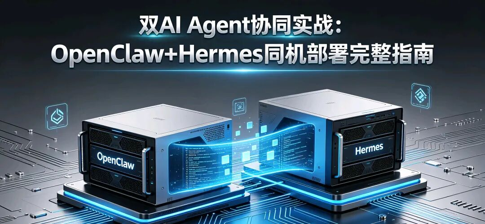

> 📎 来源: [李朝兴](https://mp.weixin.qq.com/s?__biz=MjM5Mzk4MjUzNQ==&mid=2449525985&idx=1&sn=c72a0b99bdedd9ccea8e33d3e85f2961&chksm=b03b81d037cf74922f91637d1aed352292675ca3d0932ef9471f3a55f05a1bc32ae0d3035ec7&mpshare=1&scene=1&srcid=0425PV0yGY0Zgr2gIs4VG45f&sharer_shareinfo=5fe37aeec6d1e303f2f0b205907174a5&sharer_shareinfo_first=5fe37aeec6d1e303f2f0b205907174a5) | 时间: 2026-04-25 19:29

---

开篇：一个真实的需求困境

老板扔给你一个任务：“研究一下新能源汽车市场，下周一给我份报告，要有数据、有分析、有PPT。”

如果全靠自己干，你得：

1. 搜几十篇行业报告

2. 扒各种销量数据

3. 分析趋势做图表

4. 写几千字分析文字

5. 做成精美的PPT

保守估计三天工作量。但你用了OpenClaw+Hermes组合，半天搞定。

怎么做到的？因为你可以把这俩AI Agent部署到了同一台机器上，让它们一个当“研究员”，一个当“分析师”，协同干活。今天就把这套方法完整教给你。

两个AI，分工明确

OpenClaw——研究总监

它的强项是信息检索和任务拆解。给它一个研究课题，它能：

· 列出需要调研的维度

· 规划搜索关键词

· 设计报告结构

· 评估信息可信度

Hermes——数据分析师

它的专长是数据处理和内容生成。给它明确指令，它能：

· 从网页提取结构化数据

· 统计分析并生成图表

· 撰写分析段落

· 制作PPT

协同模式

OpenClaw制定研究框架 → Hermes执行具体任务 → OpenClaw整合结果 → 循环直到产出完整报告

环境搭建：10分钟搞定

第一步：装基础环境

bash

# Python环境

conda create -n agents python=3.10

conda activate agents

# 拉代码

git clone https://github.com/OpenClaw/OpenClaw.git

git clone https://github.com/Hermes-

Agent/Hermes.git

第二步：分别配置

OpenClaw配置（研究员模式）：

bash

# .env.claw

LLM\_PROVIDER=openai

LLM\_MODEL=gpt-4

OPENAI\_API\_KEY=你的key

# 研究员特有配置

RESEARCH\_MODE=true

MAX\_SEARCH\_DEPTH=3

SOURCES\_PER\_TOPIC=5

# 告诉它Hermes在哪

HERMES\_ENDPOINT=http://localhost:8003

Hermes配置（分析师模式）：

bash

# .env.hermes

MODEL\_PROVIDER=anthropic

MODEL\_NAME=claude-3-opus  # 长文本分析能力强

# 数据分析工具

ENABLED\_TOOLS=web\_scraper,data\_analyzer,chart\_generator,ppt\_maker

第三步：启动双服务

bash

# 终端1

cd OpenClaw && python run.py

# 终端2  

cd Hermes && python run.py

看到两个服务都显示ready，就可以开始了。

实战：半自动完成市场研究报告

任务输入

json

{

  "topic": "2024年新能源汽车市场分析",

  "requirements": [

    "全球及中国市场销量数据",

    "主要品牌市场份额",

    "技术路线对比（纯电vs混动）",

    "未来趋势预测",

    "输出Word报告+PPT"

  ]

}

OpenClaw的拆解结果

json

{

  "research\_plan": [

    {

      "phase": 1,

      "name": "数据收集",

      "tasks": 

        {"source": "乘联会", "data\_type": "月度销量"},

        {"source": "车企财报", "data\_type": "交付数据"},

        {"source": "行业报告", "data\_type": "市场预测"}

      ],

      "executor": "hermes"

    },

    {

      "phase": 2,

      "name": "数据分析",

      "tas ks": [

        {"analysis": "同比增长率计算"},

        {"analysis": "市场份额变化"},

        {"analysis": "技术路线占比趋势"}

      ],

      "executor": "hermes"

    },

    {

      "phase": 3,

      "name": "报告撰写",

      "tasks": [

        {"section": "执行摘要"},

        {"section": "市场概况"},

        {"section": "竞争格局"},

        {"section": "趋势预测"}

      ],

      "executor": "hermes"

    },

    {

      "phase": 4,

      "name": "PPT制作",

      "tasks": [

        {"slides": 15, "template": "商务简约"}

      ],

      "executor": "hermes"

    }

  ]

}

实际执行过程（关键节点）

数据收集阶段：

Text

🦞 OpenClaw: 开始阶段1-数据收集

🦞 OpenClaw: 委托Hermes抓取乘联会数据

🕊️ Hermes: 正在访问 http://cpcaauto.com...

🕊️ Hermes: 提取到2023.01-2024.06月度销量表格

🕊️ Hermes: 数据已结构化保存为 cpca\_sales.csv

🦞 OpenClaw: 继续抓取比亚迪、特斯拉财报数据...

🕊️ Hermes: 提取到Q1/Q2交付数据，已汇总

分析阶段：

text

🦞 OpenClaw: 数据收集完成，进入分析阶段

🦞 OpenClaw: 委托Hermes进行同比分析

🕊️ Hermes: 计算中...2024上半年同比增长32.7%

🕊️ Hermes: 生成趋势图 trend\_2024.png

🕊️ Hermes: 市场份额分析：比亚迪占比33.5%，特斯拉11.2%...

🕊️ Hermes: 生成饼图 market\_share.png

报告撰写：

text

🦞 OpenClaw: 分析完成，开始撰写报告

🕊️ Hermes: 正在撰写"执行摘要"章节...

🕊️ Hermes: 摘要完成，328字，包含核心发现

🕊️ Hermes: "市场概况"章节完成，配图3张

🕊️ Hermes: "竞争格局"章节完成，含对比表格

🕊️ Hermes: 全文5217字，已保存为 report.docx

PPT生成：

text

🦞 OpenClaw: 报告完成，最后生成PPT

🕊️ Hermes: 提取报告关键点...

🕊️ Hermes: 生成15页幻灯片

🕊️ Hermes: 应用商务模板

🕊️ Hermes: 插入6张数据图表

🕊️ Hermes: PPT已保存为 presentation.pptx

总耗时：4小时23分钟（大部分是Hermes在跑数据）

这套系统的核心价值

1. 并行处理能力

Hermes可以同时跑多个数据抓取任务：

python

# OpenClaw会智能调度

tasks = [

    "抓取乘联会数据",

    "抓取中汽协数据", 

    "抓取比亚迪财报",

    "抓取特斯拉财报"

]

# 4个任务并行执行，节省75%时间

2. 上下文不丢失

OpenClaw维护整个研究过程的状态，Hermes每次执行都有完整的上下文：

text

OpenClaw内部状态：

- 已收集数据源：7个

- 已生成图表：6张

- 报告完成度：100%

- 下一步：等待人工审核

3. 质量把控

OpenClaw会在关键节点做验证：

🦞 OpenClaw: 检测到特斯拉Q2数据与Q1差异过大

🦞 OpenClaw: 委托Hermes重新核实

🕊️ Hermes: 二次验证完成，数据准确（因新工厂投产）

🦞 OpenClaw: 已添加数据说明注释

进阶技巧

定制研究模板

python

# 在OpenClaw中预设模板

research\_templates = {

    "市场分析": {

        "required\_sections": ["市场规模", "竞争格局", "趋势预测"],

        "data\_sources": ["官方统计", "财报", "行业报告"],

        "output\_format": ["Word报告", "Excel数据表", "PPT"]

    }

}

人工介入点设置

python

# 关键决策让人来做

if data\_confidence < 0.7:

    openclaw.pause("数据可信度较低，请人工确认")

if conclusion\_controversial:

    openclaw.pause("结论可能有争议，建议人工review")

多格式输出

python

# Hermes支持多种输出

output\_config = {

    "report": ["docx", "pdf", "markdown"],

    "data": ["csv", "excel", "json"],

    "visualization": ["png", "html交互图表"]

}

适用场景扩展

这套协同模式不只适合市场研究：

学术研究：

· OpenClaw规划文献综述框架

· Hermes检索论文、提取关键信息

· 协作完成综述论文初稿

竞品分析：

· OpenClaw设计分析维度

· Hermes监控竞品动态、提取更新日志

· 定期生成竞品报告

投资研究：

· OpenClaw制定尽调清单

· Hermes抓取财务数据、新闻舆情

· 输出投资分析报告

内容创作：

· OpenClaw规划内容大纲

· Hermes搜集素材、撰写初稿

· 配合完成长文、视频脚本

常见问题与解决

Q: 抓取的数据不准怎么办？

A: OpenClaw有数据校验机制，会对比多个来源，差异过大会报警。

Q: 生成的内容太AI化？

A: 在提示词里加入风格要求，比如“语言平实，避免套话，加入具体数据”。

Q: 成本如何控制？

A: 合理设置搜索深度和来源数量。深度2、来源3的配置，一份报告API成本约2-3美元。

Q: 能完全自动化吗？

A: 建议保留人工审核环节。AI负责80%的工作，人负责20%的决策和润色。

总结：让AI干体力活，人干脑力活

部署完这套系统，我对“工作”有了新理解：

以前：80%时间搜集整理，20%时间分析思考

现在：20%时间定义方向，80%时间深度思考

OpenClaw+Hermes不是替代我，而是把我从信息搜集、数据整理、格式排版这些“体力活”里解放出来。我现在可以把精力放在：

· 判断哪些信息真正重要

· 提出有洞察的问题

· 做出战略性的结论

这才是人机协作的正确姿势。

这套系统我已经打包成Docker镜像，一行命令就能跑起来。GitHub上有完整的配置文件和示例任务，拿去就能用。

记住：工具越强，人的判断力越重要。AI能给你100页报告，但哪3页最关键，还得你说了算。

下期预告：如何加入第三个Agent做报告审核，形成“研究员-分析师-审核员”的三人协作小组。

