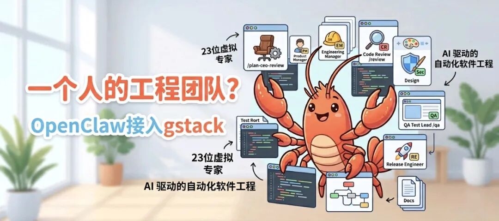

> 📎 来源: [i龙虾](https://mp.weixin.qq.com/s?__biz=MzI3MTk5OTc3Ng==&mid=2247484486&idx=1&sn=ef40b2bd343c5cab9218a0fec45d0cb8&chksm=ea66855bbc8b45214c547a87edeb1532b75803c1f7d8d15c092cb7087b26f25295485e293b9c&mpshare=1&scene=1&srcid=042994THHhGH3WmwsNJjugn4&sharer_shareinfo=4145b8a8f61488ff763b02582b27aca7&sharer_shareinfo_first=4145b8a8f61488ff763b02582b27aca7) | 时间: 2026-04-29 03:41

---



前几天刷 GitHub，被一个项目的星标曲线吓到了。

发布不到一周，84,000+ stars。然后我看了一眼作者名字：Garry Tan。Y Combinator 现任 CEO，孵化过 Coinbase、Instacart、Rippling 的男人，现在把他自己整套工作流开源了，项目叫 **gstack**。

他的说法是：过去 60 天在兼职状态下，他发布了 3 个生产服务、40+ 个功能，每天的代码产出速度大约是他 2013 年的 **810 倍**。

这篇文章会详细介绍如何安装和使用gstack，以及——对虾友们比较关心的——怎么把它接进 OpenClaw 和 Hermes 里让它真正运转起来。

---

## 一、gstack是什么

gstack 是一套 **“自动化软件工程团队”工具集**。
它的核心理念是：通过一系列精心设计的工具和提示词（Prompts），将单一的 AI 编程助手（如 Claude Code）打造成一个由 23 位虚拟专家组成的完整软件开发团队，让单兵作战的开发者或创始人能够拥有媲美二十人团队的开发和发布速度。

目前 gstack 内置 28 个命令，覆盖从想法到部署的完整开发生命周期。支持的 AI Agent 包括 Claude Code、Codex、Cursor、OpenCode、OpenClaw、Hermes 等 10 种。MIT 开源，免费。

### gstack能做什么？

gstack 将 AI 划分成了不同的专业角色，涵盖了软件开发的整个生命周期。你可以通过在命令行中输入特定的斜杠命令（Slash commands）来召唤这些“虚拟员工”为你工作：

 1. **产品与架构规划**：

**虚拟 CEO / 产品经理**：当你有一个新功能的想法时，它可以帮你重新审视产品定义、商业逻辑和用户需求。

**工程经理**：帮你规划和锁定系统架构，避免走弯路。

 2. **代码编写与审查**：

**代码审查员**：在你提交代码更改（Branch/PR）时，它会自动寻找代码中的潜在漏洞和生产环境级别的 Bug。

**安全官**：自动为你运行 OWASP 和 STRIDE 安全审计，确保代码不会引入安全风险。

 3. **设计与质量保证 (QA)**：

**设计师**：专门审查用户界面，防止 AI 生成粗糙或不合理的前端代码。

**QA 测试主管**：它不仅是看看代码，还能打开真实的浏览器环境，针对你的测试链接（Staging URL）进行端到端的交互测试。
4. **发布与运维**：

**发布工程师**：帮你自动化处理 Pull Requests (PR) 并安全地将代码部署上线。  此外还有专门负责生成高质量文档（如 PDF 文档）等角色的工具。

---

## 二、安装部署

### 前置条件

gstack 的核心是 Claude Code，所以你得先装好它。如果你还没装，先跑这个：

```
npm install -g @anthropic-ai/claude-code
```

装完用

```
claude --version
```

 确认一下。

gstack 本身是一个 Git 仓库，安装就是把它 clone 到指定位置，然后跑 setup 脚本。

### 全局安装（个人使用推荐）

```
git clone --single-branch --depth 1 https://github.com/garrytan/gstack.git ~/.claude/skills/gstack \
  && cd ~/.claude/skills/gstack \
  && ./setup
```

```
--depth 1
```

 是只拉最新快照，不拉完整历史，速度快很多。

```
--single-branch
```

 只拉主分支。如果你在国内网络慢，可以考虑先用镜像加速或者配好代理再跑。

setup 脚本会：

1. 检测你本地装了哪些 AI agent（Claude Code、Codex、OpenClaw 等）

2. 在对应位置创建 skill 符号链接

3. 在你的

```
CLAUDE.md
```

 里注入 gstack 配置段落
4. 询问你是否要用命名空间前缀（如

```
/gstack-office-hours
```

 代替

```
/office-hours
```

）

setup 完成后，打开 Claude Code，输入

```
/office-hours
```

，如果 Claude 开始向你追问产品细节而不是直接写代码，说明安装成功了。

### 为团队项目安装

如果你想让整个团队都用同一套 gstack 版本，从项目根目录跑：

```
cd <你的项目根目录
~/.claude/skills/gstack/bin/gstack-team-init required
git add .claude/ CLAUDE.md
git commit -m "require gstack for AI-assisted work"
```

```
required
```

 参数表示这个项目强制使用 gstack，任何人 clone 这个 repo 打开 Claude Code 都会自动加载。

### 使用命名空间前缀避免冲突

默认情况下，gstack 的 skill 用短名字，比如

```
/review
```

、

```
/ship
```

。如果你的项目里已经有同名的 slash command，可以加前缀：

```
cd ~/.claude/skills/gstack && ./setup --prefix
```

这样所有命令变成

```
/gstack-review
```

、

```
/gstack-ship
```

 这样的格式，不会冲突。

### 更新 gstack

gstack 更新相对频繁，用内置命令升级：

```
/gstack-upgrade
```

或者手动：

```
cd ~/.claude/skills/gstack && git pull && ./setup
```

### 卸载

如果想完全卸载，跑下面这几行（顺序很重要）：

```
# 1. 停掉 browse 后台进程
pkill -f "gstack.*browse" 2>/dev/null || true

# 2. 删除符号链接
find ~/.claude/skills -maxdepth 1 -type l 2>/dev/null | while read -r link; do
  case "$(readlink "$link" 2>/dev/null)" in
    gstack/*|*/gstack/*) rm -f "$link" ;;
  esac
done

# 3. 删除主目录
rm -rf ~/.claude/skills/gstack

# 4. 删除全局状态
rm -rf ~/.gstack

# 5. 如果装了 OpenClaw 集成，一并删掉
rm -rf ~/.openclaw/skills/gstack* 2>/dev/null

# 6. 清理临时文件
rm -f /tmp/gstack-* 2>/dev/null
```

卸载脚本不会自动修改

```
CLAUDE.md
```

，需要手动删掉 gstack 那段配置。

---

## 三、28 个 Skill 全解析

这是最值得花时间的部分。我把 28 个 skill 按使用场景分了五组，每个都说清楚什么时候用、用来干什么。

### A 组：规划与策略（在写任何代码之前）

**```
/office-hours
```** — 产品追问模式

这是我个人最常用的一个。你给 Claude 一个想法，它不会直接开始写代码，而是像一个 YC 导师一样向你提 6 个强迫性问题：这个功能给谁用？它们现在怎么解决这个问题？你的方案比现状好在哪里？哪个假设最容易被证伪？

它的设计逻辑是：**在写代码之前先确认你在解决对的问题**。很多时候你跑完

```
/office-hours
```

，会发现自己原来想做的那个功能根本不是核心需求。

**```
/plan-ceo-review
```** — 战略范围挑战

这是"Garry Tan 的 YC review 方法论打包成 prompt"的那个 skill。它会分四种模式操作你的产品方案：
- **Scope expansion**：找到你描述里隐藏的那个"10分产品"，看你现在是不是在做一个 3 分版本
- **Selective expansion**：在保持核心不变的情况下，哪一个维度值得扩展
- **Hold scope**：挑战当前范围是否已经过大
- **Scope reduction**：把你的方案砍到最小可行版本

适合在重要 feature 开工前跑，防止走偏。

**```
/plan-eng-review
```** — 工程架构锁定

工程管理者视角。会问你：这个技术选型有没有更简单的替代方案？依赖链里有什么单点故障？这个设计半年后还能撑得住吗？在动代码之前，先把架构决策固化。

**```
/plan-design-review
```** — 设计 QA

设计师视角的产品审查。专门检查 AI 写出来的界面里那些明显的"AI slop"：颜色用了 50 种、排版没有视觉层级、交互逻辑不一致。

**```
/autoplan
```** — 自动生成执行计划

把一个功能描述转成带优先级的任务列表。和

```
/office-hours
```

 搭配最好：先跑

```
/office-hours
```

 确认方向，再跑

```
/autoplan
```

 拆任务。

### B 组：执行与开发（写代码阶段）

**```
/review
```** — 代码审查

偏执模式的代码审查员。不只是看代码风格，专门找能在生产环境炸掉的问题：未处理的错误路径、竞争条件、SQL 注入风险、内存泄露点。

**```
/careful
```** — 谨慎修改模式

用来做高风险操作前的保护。比如你要重构核心模块、迁移数据库、改安全相关代码，先跑

```
/careful
```

 让 Claude 进入"每一步都要确认"的模式，防止大规模误操作。

**```
/freeze
```** 和 **```
/unfreeze
```** — 代码冻结/解冻

```
/freeze
```

 告诉 Claude：这段代码不要动，只在允许的范围内修改。

```
/unfreeze
```

 解除限制。适合在专注某个功能时防止 Claude "顺手"改了其它地方。

**```
/guard
```** — 防止功能蔓延

实现过程中的范围守护。当你给 Claude 加需求的时候，它会主动提示哪些新加的东西超出了原定计划，让你有意识地做决定，而不是任由 scope 悄悄膨胀。

### C 组：质量与测试

**```
/qa
```** — 完整 QA 流程

最重量级的 skill 之一。它会真的打开一个 Chrome 浏览器，加载你的 URL，然后像测试工程师一样点来点去：填表单、测边界输入、检查 console 报错、验证移动端适配。不是看代码，是跑真实环境。

**```
/qa-only
```** — 纯 QA，不改代码

当你只想测试、不想让 Claude 在测试过程中顺手改代码的时候用这个。

**```
/benchmark
```** — 性能基准测试

跑性能测试，收集指标，给出优化建议。适合发布前确认关键接口的响应时间。

**```
/cso
```** — 安全审计（CSO 模式）

Chief Security Officer 模式。跑 OWASP Top 10 检查表：XSS、CSRF、SQL 注入、权限提升、敏感数据暴露……发现问题就报告，不自动修复（避免改出新 bug）。

### D 组：发布与部署

**```
/ship
```** — 发布准备

整合了 review、changelog 生成、发布 checklist 三个步骤。跑完能给你一份"这次可以发版了"或者"还有这几个问题需要先处理"的判断。

**```
/land-and-deploy
```** — 落地并部署

merge PR 然后触发部署流程。具体行为取决于你用的 CI/CD 配置。

**```
/canary
```** — 金丝雀发布

灰度发布辅助。帮你配置流量比例、监控关键指标、在检测到异常时回滚。

**```
/document-release
```** — 发布文档生成

根据这次的 commit 和变更自动生成 changelog、发布说明和面向用户的更新文档。

### E 组：复盘与研究

**```
/retro
```** — 周度复盘

跑完一周的工作后做结构化复盘：什么进展顺利，什么卡住了，根本原因是什么，下周要改变什么。

**```
/investigate
```** — 问题调查

遇到 bug 或者线上事故时用。四步走：现象观察 -> 假设生成 -> 验证排查 -> 根因分析。比"帮我看看这个 bug"要结构化很多。

**```
/learn
```** — 技术学习模式

当你需要理解一个新技术或者陌生代码库的时候用。它不是直接给你答案，而是通过追问引导你自己搞清楚原理。

### F 组：浏览器与跨 Agent 协作

**```
/browse
```** — 网页浏览代理

gstack 自带一个有安全防护的浏览器 agent，用于所有网页相关操作。**重要**：装了 gstack 之后，你的

```
CLAUDE.md
```

 里应该有这样一条配置：

```
Use /browse from gstack for all web browsing. Never use mcp__claude-in-chrome__* tools.
```

这条配置让 Claude 统一走 gstack 的

```
/browse
```

 而不是 Claude in Chrome 的原生工具，原因是 gstack 的 browse 有多层安全防护（下面会讲）。

**```
/pair-agent
```** — 跨 Agent 协调

这是 gstack 里最酷的一个设计。你在 Claude Code 里，同时开着 OpenClaw 或者 Hermes，

```
/pair-agent
```

 可以在两个 agent 之间协调任务，把长期规划和短期执行拆给不同的 agent 处理。

**```
/connect-chrome
```** 和 **```
/setup-browser-cookies
```** — 浏览器连接和 Cookie 管理

配置 gstack 如何连接到你的本地 Chrome，以及怎么安全地导入 Cookie。

---

## 四、安全防护机制

gstack 的浏览器 agent 对抗 prompt injection（提示注入）的防护做得很认真，官方文档专门有个 ARCHITECTURE.md 讲这块。

简单说，gstack 对浏览器读到的所有内容都过了四层过滤：

**L1-L3：内容安全过滤**（

```
browse/src/content-security.ts
```

）
对每个页面内容和工具输出跑数据标记、隐藏元素剥除、ARIA 正则、URL 黑名单，并加一个信任边界 envelope。

**L4：本地 ML 分类器 TestSavantAI**
一个 22MB 的 BERT-small ONNX 模型（int8 量化），打包进 agent 本地跑，不需要联网。扫描每条用户消息和每个工具输出，判断是否有注入风险。如果你想要更高精度，可以加这个环境变量启用 721MB 的 DeBERTa-v3 集成：

```
GSTACK_SECURITY_ENSEMBLE=deberta
```

**L4b：对话级 Claude Haiku 二次审查**
在完整对话层面（用户消息 + 工具调用 + 工具输出）跑一次 Haiku，从整体视角判断是否有异常。

两个分类器都投票认为有问题，才会 block——避免单个模型对正常内容误判（比如 Stack Overflow 上充满了各种奇怪指令的页面）。

紧急情况可以用 kill switch：

```
GSTACK_SECURITY_OFF=1
```

另外还有一个彩蛋：

```
$B handoff
```

。当 Claude 碰到 CAPTCHA、登录墙、MFA 这些它自己过不去的东西，可以调用

```
$B handoff
```

，会在你桌面打开一个可见的 Chrome 窗口，加载到卡住的那个页面，带着 Claude 的所有 cookie。你手动处理完，告诉 Claude "好了"，Claude 用

```
$B resume
```

 接着干。

---

## 五、在OpenClaw里用gstack

好，到了对我们这些 OpenClaw 用户最关键的部分。

### 核心设计理念先搞清楚

gstack 和 OpenClaw 的关系要先理解清楚，不然你会走弯路。

官方文档里有一句话说得很准：**gstack 是作为方法论来源与 OpenClaw 集成的，不是移植的代码库**。

OpenClaw 的 ACP runtime 会直接 spawn Claude Code session。gstack 提供的是"这些 session 应该怎么跑"的规范和纪律。所以本质上，你在 OpenClaw 里用 gstack，走的是两套并行的机制：一是通过 Claude Code session 调用 gstack skill，二是用 gstack 专门为 OpenClaw 裁剪的对话型 skill。

### 方式一：让 OpenClaw agent 自己装

最简单的方式，直接跟你的 OpenClaw agent 说：

```
install gstack for openclaw
```

agent 会自动跑 gstack 的 setup 流程，完成 OpenClaw 侧的配置。

### 方式二：手动配置 AGENTS.md

在你的 OpenClaw 项目里创建或编辑

```
AGENTS.md
```

，加上这段：

```
## Coding Tasks

When spawning Claude Code sessions for coding work, tell the session to use gstack skills.

Examples:
- Security audit: "Load gstack. Run /cso"
- Code review: "Load gstack. Run /review"
- QA test a URL: "Load gstack. Run /qa https://your-url.com"
- Build a feature end-to-end: "Load gstack. Run /autoplan, implement the plan, then run /ship"
- Plan before building: "Load gstack. Run /office-hours then /autoplan. Save the plan, don't implement."
```

配置完之后，你就可以用自然语言跟 OpenClaw 对话：

"帮我对登录功能做安全审计" -> OpenClaw 自动 spawn 一个 Claude Code session，加载 gstack，跑

```
/cso
```

"做代码审查" -> spawn session，跑

```
/review
```

**关键**：当 OpenClaw 的 ACP runtime spawn Claude Code session 的时候，会自动设置

```
OPENCLAW_SESSION
```

 环境变量。gstack 检测到这个变量，就知道自己是在 OpenClaw 上下文里运行，会调整部分行为（比如把计划结果写回 OpenClaw 的 memory store，而不只是输出到 terminal）。

### 方式三：ClawHub 安装原生 OpenClaw Skill

gstack 为 OpenClaw 单独做了 4 个对话型 skill，不需要 Claude Code 就能用，直接在 OpenClaw agent 的聊天里调用：

```
clawhub install gstack-openclaw-office-hours
clawhub install gstack-openclaw-ceo-review
clawhub install gstack-openclaw-investigate
clawhub install gstack-openclaw-retro
```

这四个 skill 是 gstack 方法论的 OpenClaw 版本裁剪，去掉了浏览器、遥测、复杂前置逻辑，保留了核心的追问框架。

•

```
gstack-openclaw-office-hours
```

：6 个强迫性产品追问，直接在聊天里运行

•

```
gstack-openclaw-ceo-review
```

：10 节战略挑战框架，4 种 scope 操作模式

•

```
gstack-openclaw-investigate
```

：4 阶段问题排查（现象 -> 假设 -> 验证 -> 根因）

•

```
gstack-openclaw-retro
```

：周度复盘结构化模板

装完之后，这些 skill 的 source 在 gstack repo 的

```
openclaw/skills/
```

 目录里，可以自己查看和修改。

### 方式四：直接指向 GitHub repo（最灵活）

这个方式来自 OpenClaw Alpha 社区的一个发现，相当妙：

> "gstack 厉害的地方在于，就算它还没有正式的 OpenClaw 支持，你直接把 GitHub repo 地址和 skill 文件指给 OpenClaw，OpenClaw 就会像对待原生 skill 一样运行它。"

具体操作是在 OpenClaw 配置里直接引用 gstack 的 raw GitHub 链接，比如：

```
https://raw.githubusercontent.com/garrytan/gstack/main/skills/office-hours.md
```

OpenClaw 会把这个 Markdown 文件当成 skill 加载并执行。这意味着 gstack 发布新 skill 的时候，你不需要重新装，直接更新 URL 就行。

### 规划流程的推荐用法

针对"先规划后执行"这个场景，gstack 文档里有一个推荐的 OpenClaw 工作流：

1. **OpenClaw agent 调用

```
gstack-openclaw-office-hours
```**：产品追问，搞清楚在做什么

2. **持久化计划**：orchestrator 把计划链接保存到 OpenClaw 的 memory store 或者 brain repo

3. **准备好之后 spawn 完整 session**：告诉 Claude Code session 引用已保存的计划来执行

这个流程把"想清楚"和"动手做"拆开了，规划在 OpenClaw 的对话里完成，执行在 Claude Code session 里完成，互不干扰，也互相知情。

---

## 六、在 Hermes 里用 gstack

如果你已经在用 Hermes（或者从 OpenClaw 迁过来了），gstack 的集成方式和 OpenClaw 基本一样，因为两个 agent 的底层模型相同：都是 spawns Claude Code sessions 来执行任务，gstack 提供方法论框架。

### 安装方式

直接跟你的 Hermes agent 说：

```
install gstack for hermes
```

或者手动指定 host 跑 setup：

```
cd ~/.claude/skills/gstack && ./setup --host hermes
```

### AGENTS.md 配置

Hermes 同样支持

```
AGENTS.md
```

（Hermes 的

```
skills/RESOLVER.md
```

 或

```
AGENTS.md
```

 都能用，v0.19 之后两个文件名都支持），配置格式和 OpenClaw 相同：

```
## Coding Tasks

When spawning Claude Code sessions:
- Security audit: "Load gstack. Run /cso"
- Code review: "Load gstack. Run /review"
- QA: "Load gstack. Run /qa https://..."
- Full feature build: "Load gstack. Run /autoplan, implement, then /ship"
```

### 从 OpenClaw 迁移到 Hermes 时保留 gstack

如果你在迁移过程中用

```
hermes claw migrate
```

，gstack 相关的配置会自动检测。但如果检测不全，手动补一下：

```
# 预览迁移内容
hermes claw migrate --dry-run

# 确认没问题后执行
hermes claw migrate

# 验证
hermes status
```

迁移完之后，

```
~/.openclaw/skills/gstack*
```

 里的东西会被复制到 Hermes 对应目录。检查一下

```
~/.hermes/migration/openclaw/
```

 下的归档文件，确保没有遗漏。

### Hermes 独有的搭配：gbrain + gstack

这里多说一点，因为 Garry Tan 还有另一个配套项目：**gbrain**（Garry's Opinionated OpenClaw/Hermes Agent Brain）。

官方对两者关系的描述是：**GStack is the engine. GBrain is the mod.**

• gstack = 写代码相关的 skill（ship、review、QA、investigate、office-hours、retro）

• gbrain = 其它一切（brain 管理、信号检测、数据摄入、知识富化、定时任务、报告、身份管理）

gbrain 的

```
skills/RESOLVER.md
```

（或 OpenClaw 的

```
AGENTS.md
```

，两者互通）会告诉 agent 对于任何任务应该读哪个 skill 文件。当 agent 需要写代码，RESOLVER 把它导向 gstack；当 agent 需要更新 brain、搜索历史、生成报告，RESOLVER 导向 gbrain 对应的 skill。

gbrain 安装：

```
# 安装主包
npm install -g @garrytan/gbrain

# 或者通过 skill 包安装
gbrain skillpack install
```

装完之后，你的 Hermes/OpenClaw agent 会有 gbrain + gstack 双引擎：写代码靠 gstack，知识管理靠 gbrain，agent 自己根据任务类型决定调哪套。

---

## 七、实战操作流：从想法到上线的完整演示

把上面的东西串起来，用一个具体场景说明怎么用。

场景：你要给自己的项目加一个"用户导出数据"功能。

### Step 1：在 OpenClaw 里先想清楚

告诉你的 OpenClaw agent：

```
我想给项目加一个用户数据导出功能。先用 gstack-openclaw-office-hours 帮我过一遍。
```

agent 会开始追问：
- 哪些用户需要导出？B2B 企业用户还是个人用户？
- 它们现在怎么拿到自己的数据？
- 导出是一次性的还是定期的？
- GDPR/数据合规有要求吗？
- 最快能上线的最小版本是什么样的？

这 10 分钟的追问，可能会帮你发现"其实用户要的不是导出，它们要的是数据备份"或者"先做个 API 接口比 UI 按钮更快验证需求"。

### Step 2：把计划存进 memory

追问完之后，让 agent 把结论总结成计划并保存：

```
总结这次 office-hours 的结论，存到 memory，标记为 feature-export-plan
```

### Step 3：spawn Claude Code session 执行

你切到 Claude Code，或者让 OpenClaw 直接 spawn 一个 session：

```
Load gstack.
加载 feature-export-plan，先跑 /autoplan 拆任务，确认计划后开始实现。
```

Claude Code 会先输出任务列表请你确认，然后开始写代码。

### Step 4：边写边用 /guard

在写代码过程中，如果你加了一句"顺便把登录流程也改一下"，Claude 会提醒：

```
⚠ 这超出了 feature-export-plan 的范围。是要扩展计划，还是新建一个单独任务？
```

### Step 5：发布前跑 /review 和 /cso

```
/review
```

偏执模式代码审查，专找生产级 bug。

```
/cso
```

安全审计，尤其是导出功能涉及用户数据，SQL 注入、权限检查这些必须过一遍。

### Step 6：QA

```
/qa https://localhost:3000/export
```

Claude 真的打开浏览器，测试导出功能：点按钮、选格式、触发下载、验证文件内容。

### Step 7：生成发布文档，然后 ship

```
/document-release
/ship
```

```
/document-release
```

 自动生成 changelog。

```
/ship
```

 做最后检查，确认可以发布。

整个流程里，你作为开发者的核心工作是：**在 office-hours 里回答追问，在 review 里确认问题，在 QA 里验证结果**。写代码的部分基本交给 Claude Code 了。

---

## 八、常见问题

**Q：安装完 /office-hours 但 Claude 直接开始写代码了，没有追问**

A：检查

```
CLAUDE.md
```

 里有没有 gstack 配置段。打开

```
~/.claude/CLAUDE.md
```

，找

```
## gstack
```

 部分，确认 available skills 列表里有

```
office-hours
```

。没有的话重新跑

```
./setup
```

。

**Q：

```
/browse
```

 报错**

A：先确认 Chrome 已安装。gstack 的 browse 需要本地 Chrome，跑

```
/connect-chrome
```

 做初始配置，第一次使用 cookie 功能时会弹 macOS Keychain 权限请求，要点 Allow。

**Q：OpenClaw 里 clawhub install 失败**

A：检查 clawhub 版本（

```
clawhub --version
```

），确认 OpenClaw 在跑。如果网络问题，可以直接从 gstack repo 的

```
openclaw/skills/
```

 目录手动复制 skill 文件到

```
~/.openclaw/skills/
```

。

**Q：技能冲突，和其它工具的 /review 撞名了**

A：用前缀模式：

```
cd ~/.claude/skills/gstack && ./setup --prefix
```

，所有命令变成

```
/gstack-*
```

 格式。

**Q：Hermes 迁移之后 gstack skill 不好使**

A：新 session 才会加载迁移过来的 skill，当前 session 不生效。重启一个新对话，然后

```
hermes status
```

 确认 API key 和 skill 都正常。

---

## 九、一点个人感受

它最核心的价值在规划阶段，尤其是

```
/office-hours
```

 和

```
/plan-ceo-review
```

。这两个 skill 背后是 Garry Tan 评估了几千家创业公司之后提炼出来的思维框架。当一个方法论足够成熟，它就能被编码成可复用的 prompt，这就是 gstack 在做的事情。

跟 OpenClaw 结合起来用，两者的分工很清晰：OpenClaw 管对话层和消息层，gstack 管开发流程的结构和质量控制。你在 OpenClaw 里想清楚要做什么，然后 spawn 一个有 gstack 护航的 Claude Code session 去执行，最后结果通过 OpenClaw 的 memory 持久化。

这套工作流在团队里会更有价值——每个开发者都用同一版本的 gstack，都经过同样的规划追问、同样的代码审查标准、同样的安全检查流程，风格和质量的一致性就有了基础。

gstack 是 MIT 开源，30 秒安装，没有任何付费墙。先装上跑几个

```
/office-hours
```

，感受一下"被逼着想清楚需求"是什么感觉。

装上了的来评论区说一声。
