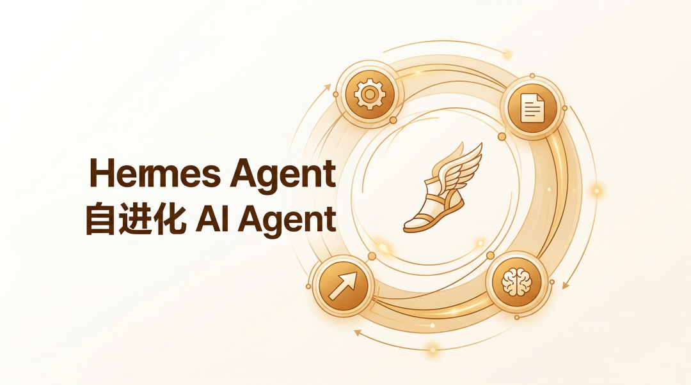
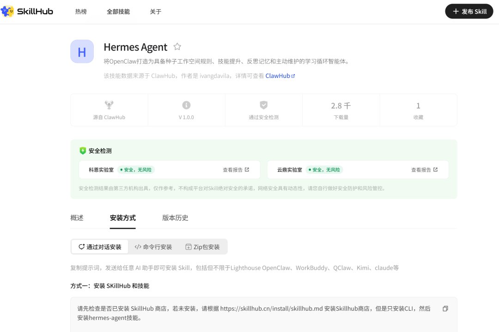

> 📎 来源: [智在点滴](https://mp.weixin.qq.com/s?__biz=MzkwMTYxMzMwOQ==&mid=2247487792&idx=1&sn=fec588af7a5c692de2f86867d04e8ad8&chksm=c165823ccad93c59ca9087d7a0f9af47f27fce173763cd7eebfd9c1f422aa4689d5a90efc1ec&mpshare=1&scene=1&srcid=0418aR2PgD81Qo3wVnhFAv05&sharer_shareinfo=18f0ef4a0bf59c891757d1b988a6313d&sharer_shareinfo_first=18f0ef4a0bf59c891757d1b988a6313d) | 时间: 2026-04-18 18:49

---

📌 科技 · 工具 · 思考

# 

最近科技圈有个开源项目挺火——**Hermes Agent**。

不少人在说它更轻量、更开放、体验更丝滑。

而我，一个忠实的OpenClaw用户，看着看着，心里就开始痒了：

> 🤔 要不……也试试Hermes？

💭 **但转念一想——换平台的成本，也挺高的。**

**毕竟我养龙虾的时候，喂养了大量的资料。**

---

然后，我闲逛SkillHub的时候，偶然发现了一个**「缝合怪」**式的存在：

> ✨ 在OpenClaw里，装一个Hermes Agent的Skill？

**😲 我当时就愣住了——这算不算……鱼和熊掌，兼得？**

---

## 🌟 01 先说OpenClaw的好，我为什么舍不得换

坦白讲，用了这么久OpenClaw，早就离不开了。

它的生态成熟，插件丰富，社区活跃。

Skill市场里总能淘到想要的东西。

而且它和我的工作流已经深度绑定了——公司信息、行业报告、知识库调用……都在这一套体系里运转。

> **🔑 切换成本，不只是习惯问题。是时间，是数据，是已经搭好的工作流。**

---

## 🔥 02 Hermes Agent凭什么让人心动

Hermes火，不是没有道理。

它不仅解决了小龙虾的记忆问题

更关键的是——

> 💡 它的设计哲学，是「让AI真正成为你的助手」，而不是一个被动的问答机器。

多Agent协同、任务分解、自主执行……这些能力，对做业务的人来说，诱惑太大了。

简单来说，接到任务后，hermes就像一个指挥官一样，智慧调动子agent来干活。

所以我能理解，为什么那么多人开始「动摇」。

---

## 🎯 03 然后我在SkillHub看到了这个

一个Skill，可以在OpenClaw里调用Hermes Agent的能力。

那一刻，我脑子里冒出一个词——

**「既要又要」**

这不就是我一直追求的吗？

用OpenClaw的成熟生态，同时蹭Hermes的前沿能力。

**听起来很美对不对？**

**❓ 但我停下来问了自己一个问题——
它真的能1+1>2吗？
还是只是1+1≈1.5，甚至1+1=1？**

---

## 🧠 04 我的思考：兼得的背后，从来不是免费的

技术整合，从来不是简单叠加。

OpenClaw装Hermes Skill，本质上是在**用OpenClaw的框架去承载另一个系统的能力**。

这里有几个现实问题：

> **第一，适配程度。**

> 不是所有Hermes的能力，都能丝滑平移到OpenClaw。API限制、交互逻辑、功能阉割……都可能存在。

> **第二，稳定性。**

> 这种「嫁接」，依赖于Skill维护者的更新速度。如果Hermes本体快速迭代，Skill跟不上，体验就会割裂。

> **第三，学习成本。**

> 你以为「兼得」省心，实际上你可能需要同时理解两套系统的逻辑。复杂度不降反升。

**💡 所以——「既要又要」听起来很爽，但你得问自己：
你真的需要两者同时在场吗？**

---

## 💎 05 我的答案：看场景，别看噱头

我的选择是：**保持开放，但理性尝鲜。**

如果一个Skill能解决我实际的痛点——比如帮我更高效地处理航班信息、协调运力——我会装，会用，会给反馈。

但如果只是为了「赶潮流」，那我宁愿把时间花在实际业务上。

> 🎯 技术是为工作流服务的，不是用来证明自己「跟得上时代」的。

---

## 📝 写在最后

写了这么多，不是要给你一个标准答案。

而是想说——

> 🌟 面对新旧交替，我们很容易被「要不要换」这个问题裹挟，却忘了问自己真正需要什么。

**OpenClaw还是Hermes？原生还是缝合？**

**答案从来不在技术本身，而在你自己的使用场景里。**

---

### 💬 如果你也在纠结这个问题...

或者已经尝试过类似的「整合方案」——

**欢迎在评论区聊聊你的真实感受 ✍️**

> 🔲 你现在用的AI助手，最大的「痛」是什么？

> 🔲 切换平台，你最担心什么？

> 🔲 如果有一个Skill能让你同时用两个系统，你会第一时间装吗？

**👇 评论区见，我们一起聊聊！**

---

商务合作 · 技术交流 · 关注「智在点滴」

如果这篇文章对你有启发，欢迎转发给身边也在「选平台」的朋友 💜

—— 我是seven，我们下期见 🚀
