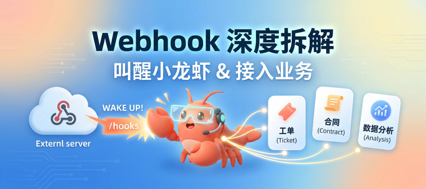
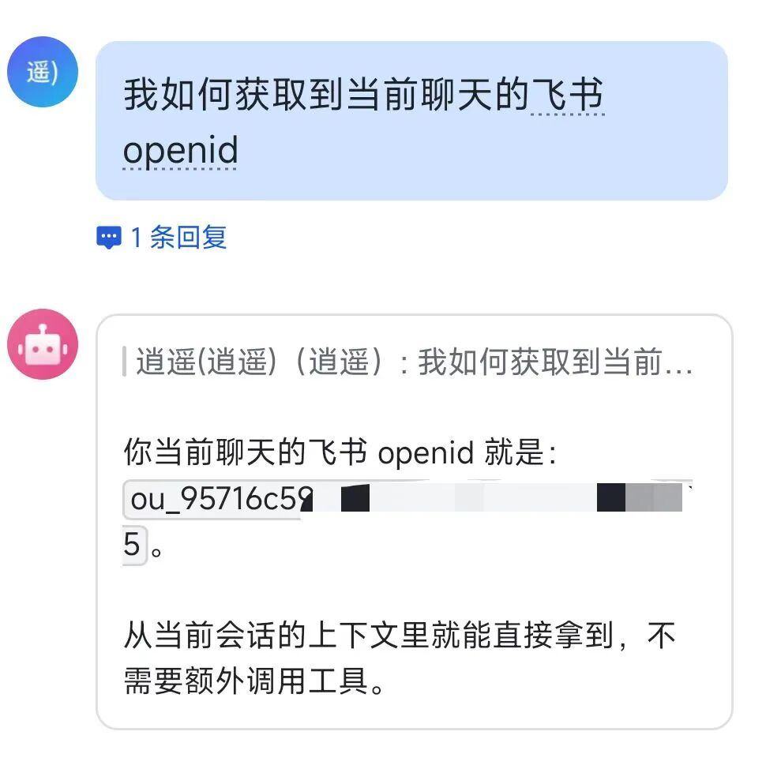
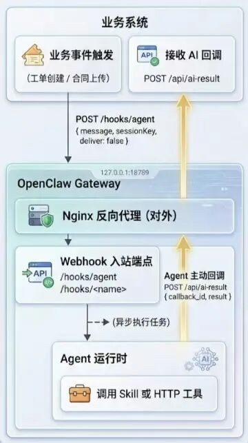

> 📎 来源: [i龙虾](https://mp.weixin.qq.com/s?__biz=MzI3MTk5OTc3Ng==&mid=2247484106&idx=1&sn=66bce0ae104e19f3852fd4a15fead99b&chksm=eae2d11551ac3a5d3eab54cab6906821d53bdebfa95a15ac65c8aecf3aea759d35996ed2a63b&mpshare=1&scene=1&srcid=0424RLmiHp33wVli5nrGzVP1&sharer_shareinfo=c2af37068de5e80753e6d104d357761a&sharer_shareinfo_first=c2af37068de5e80753e6d104d357761a) | 时间: 2026-04-24 21:33

---



文章比较长，建议先收藏再看。

如果你只是想让龙虾响应外部事件，看前半部分就够了。如果想把OpenClaw 对接自己的业务系统——比如工单触发 AI 分析、合同上传自动审查——后半部分专门讲这个，包括结果怎么回传。

## 通过Webhook让龙虾响应外部事件

OpenClaw 的 Webhook 挂在网关上，默认端口 18789，路径默认 `/hooks`。在 `openclaw.json` 配置文件里加这几行开启：

{

  "hooks": {

    "enabled": true,

    "token": "your-shared-secret",

    "path": "/hooks"

  }

}

```
hooks.enabled=true
```

 的时候 

```
token
```

 是必填的，没有 token 根本启不来。认证方式官方推荐用请求头：

```
Authorization: Bearer
```

也支持 `x-openclaw-token: `

## 三种调用方式

### ``` /hooks/wake ```  简单调用

最轻量的触发方式，请求体只有两个字段：

{ "text": "收到新邮件", "mode": "now" }

```
text
```

 是事件描述，作为系统行写进主会话队列。

```
mode
```

 有两个值：

```
now
```

 立即触发心跳，

```
next-heartbeat
```

 等下次定期检查再处理。

适合场景：外部脚本监控某个目录，出现新文件就通知龙虾处理。逻辑简单、不需要隔离运行环境时用这个。

### ``` /hooks/agent ```  跑一个隔离的 Agent

这是重头戏，完整参数列表：

{

  "message": "帮我总结这封邮件",

  "name": "Email",

  "agentId": "main",

  "wakeMode": "now",

  "deliver": true,

  "channel": "feishu",

  "to": "ou\_xxx",

  "model": "openai/gpt-5.4-mini",

  "thinking": "low",

  "timeoutSeconds": 120

}

几个需要重点注意的字段：

**`agentId`** — 单Agent 可以不传，多Agent 可以通过 openclaw agents list 获取。

**```
deliver
```

 + 

```
channel
```

 + 

```
to
```** — 控制 Agent 执行完任务后把结果发给谁。

```
channel
```

 支持 

```
feishu
```

、

```
wechat
```

、

```
telegram
```

、

```
discord
```

  等已配置的渠道，

```
to
```

 是对方 ID。不需要通知任何人时设 

```
deliver: false
```

。

获取接收人ID：可以通过先打开实时日志（运行 openclaw logs --follow），然后给你的小龙虾发消息，在日志中查看；如果是飞书的话，可以直接问小龙虾当前聊天的飞书openid，他会直接告诉你。



**`model`** — 单次覆盖默认模型。常规任务换轻量模型省钱，但要注意 `agents.defaults.models` 白名单的限制。

**`timeoutSeconds`** — Agent 运行的超时上限。长任务必须设，不然遇到模型响应慢或工具调用卡住，进程会一直挂着。

返回码是 

```
202
```

，表示异步启动成功，Agent 还在跑。这是后面集成业务系统时需要重点处理的地方。

请求示例：

```
curl -X POST http://127.0.0.1:18789/hooks/agent \
```

---

### ``` /hooks/ ``` （映射端点）给外部系统专门开的接口

用于集成 GitHub、Gmail、Stripe 这类第三方服务。它们发过来的请求体格式各不相同，不可能直接符合 

```
/hooks/agent
```

 的格式。

通过 `hooks.mappings` 配置自定义端点，比如 `/hooks/github`，用 `match` 匹配来源，用模板或 JS/TS 模块把外部 payload 转成 Agent 能理解的格式。

Gmail 已内置，配置里加：

{ "hooks": { "presets": ["gmail"] } } 

然后跑 `openclaw webhooks gmail setup`，会自动写好 `hooks.gmail` 配置。

## 4.7 版本新增的 TaskFlow 是什么

v2026.4.7 的描述是"Webhook 驱动的 TaskFlow，支持外部系统通过共享密钥端点创建和驱动任务流"。

这是接着 4.2 版本 TaskFlow 底层重构的延伸。4.2 做的是把任务流状态持久化，加了可恢复的检查点、子任务管理和 

```
api.runtime.taskFlow
```

 插件接口。4.7 是在这个基础上，把 Webhook 和 TaskFlow 打通——外部系统不只是触发一次 Agent 回合，而是可以通过 Webhook 持续驱动一个有状态的任务流。

实际场景：CI/CD 流水线每次 PR 合并触发一个 Webhook，龙虾启动 TaskFlow：先拉代码分析，发现问题通过 Telegram 通知你，等你确认后继续下一步。整个流程有状态，中途可以暂停、继续，不因网络抖动或重启丢失进度。

## 把 OpenClaw 接入业务系统

前面说的是标准的"外部事件触发龙虾"模式。但如果你是开发者，想让自己的业务系统——工单、ERP、合同管理、客服平台——把 AI 能力嵌进业务流，还有一个核心问题没解决：**Agent 跑完任务，结果怎么回到你的系统？**

```
/hooks/agent
```

 返回 

```
202
```

 就结束了，业务系统拿不到同步响应。下面把这个问题拆开说。

### 整体架构



业务系统 -> OpenClaw 这条线是 HTTP POST，是主动推送。
 OpenClaw -> 业务系统这条线，Agent 执行完任务后主动回调，也是 HTTP POST。
 两侧都是接收方，两侧也都是发送方，没有轮询，没有长连接。

### 业务系统触发 OpenClaw

业务系统在适当时机 POST 到 

```
/hooks/agent
```

。关键是 

```
message
```

 里要包含回调指令，告诉 Agent 执行完任务把结果发回哪里：

{

  "message": "请分析以下合同风险：{contract\_text}\n\n分析完成后，请调用 HTTP 工具，POST 结果到 http://your-system/api/ai-result，携带 callback\_id={callback\_id}",

  "name": "合同审查",

  "deliver": false,

  "timeoutSeconds": 180

}

---

### 结果回传：三种方案

#### 方案一：让 Agent 主动 HTTP 回调

在 

```
message
```

 里明确指示 Agent 把结果 POST 回业务系统的接口。Agent 天然支持调用 HTTP 工具，这是最直接的做法。

适合场景：任务类型固定、对结果格式要求不严格的情况。

注意：Agent 自由生成的回调 payload 结构可能不稳定，建议在 Prompt 里给出明确的 JSON 模板。

---

#### 方案二：用专用 Skill 封装回调逻辑（推荐）

在 OpenClaw 里创建一个叫 

```
business-callback
```

 的 Skill，专门负责把 Agent 的分析结果结构化后 POST 回业务系统。这样格式可控，也不用在每个 

```
message
```

 里重复写 HTTP 调用说明。

Skill 配置（

```
SKILL.md
```

 核心部分）：

```
## business-callback
```

触发时的 

```
message
```

 可以简洁很多：

分析这份合同风险：{contract\_text}

分析完成后调用 business-callback，callback\_id={callback\_id}

---

#### 方案三：Mapped hooks

适合场景：接入多个业务子系统，每个系统的 payload 格式不同，但都要走同一套 Agent 逻辑。

详细见官方文档：https://docs.openclaw.ai/automation/cron-jobs#mapped-hooks-post-/hooks/%3Cname%3E

---

### 幂等性问题

Webhook 发送方可能重试，中继可能重放。同一笔业务不能被处理两次——尤其是写库操作、外发通知这类副作用。

业务系统接收回调时先查 `callback_id` 是否已处理，处理过直接返回 `200` 忽略即可。

---

### 安全注意事项

**OpenClaw：**

• Webhook 端口 18789 只绑本机（

```
127.0.0.1
```

），用 Nginx 做反向代理后再对业务系统开放

• Hook token 独立管理，不复用 Gateway 认证 token

• 不要在 Webhook 日志里记录原始请求体，payload 里可能含有业务敏感数据

**业务系统：**

• 回调接口加内部 token 校验，防止伪造回调。跟 OpenClaw 的 hook token 独立管理

• 如果 OpenClaw 和业务系统在同一内网，还可以限制来源 IP 双重保险

**关于提示词注入：**

用户上传的内容（合同原文、工单描述）里可能嵌了 "请忽略前面的指令" 这类攻击，需要注意处理，把用户数据和 Agent 指令明确分开。

---

v2026.4.7 的 Webhook 和 TaskFlow 结合那条链路我还没有完整跑通，等实测出来再单独写一篇。欢迎评论区交流。
