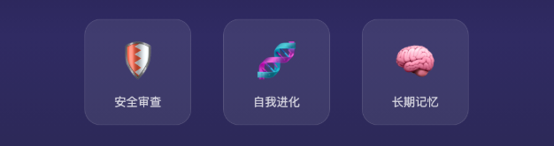

> 📎 来源: [虾看虾说](https://mp.weixin.qq.com/s?__biz=MzUxNjczOTc4MA==&mid=2247483789&idx=1&sn=cc7717fac5b4d1801e3d83e25e52f207&chksm=f862557b69026459cb9a2ab7fcb14a2b88803a4f13489751ab955570aab56d3d4bcbd96e9250&mpshare=1&scene=1&srcid=0420taGSirbvvT3j3sQLXtL5&sharer_shareinfo=3d7527a1ef5f2ae65e607b462556487a&sharer_shareinfo_first=3d7527a1ef5f2ae65e607b462556487a) | 时间: 2026-04-20 15:49

---

# 如何用 OpenClaw 搭建一个有记忆、会协作的AI Agent团队

📝 作者：虾看虾说 

💡 **使用方法：将这篇文章发给你的 OpenClaw，即可一键部署同款多Agent团队。**

🦞 我用一个周末搭了一支 AI 团队：有性格、有记忆、会互相审查、还会主动汇报进度。现在每天在飞书上自动运转，我只需要当"老板"。

## 先看效果：我的 AI 团队

🎯 老板（你）

↓

🐱 小秘 · 总调度
收消息 → 分析 → 分派

🦦

阿文

文章写作

选题→撰写→配图→交稿

🦁

小扣子

代码开发

需求→编码→测试→部署

⬆ 执行层 ⬆

🦅

鹰酱

文章审查

审核爆点→真人味

🐻

大扣子

代码审查

审查质量→运行测试

⬆ 审查层 ⬆

🦊 狐总 · 项目管理
跟进进度 → 提汇报 → 催交付

⬆ 管理层 ⬆

🧠 共享记忆层 · 技能全局共享 · Agent 间自动唤醒

**小秘** 🐱 收到消息后分析任务类型，文章类转给阿文，代码类转给小扣子，简单问题自己秒回。

**阿文** 🦦 负责公众号文章全流程：选题→调研→撰写→去AI味→配图→排版→提交草稿。

**小扣子** 🦁 负责代码开发：理解需求→调用 CodeX 编码→测试→部署。

**鹰酱** 🦅 文章审查员，像鹰一样锐利。审核文章有没有爆点、有没有真人味、是否符合平台调性，不通过就打回重写。

**大扣子** 🐻 代码审查员，像熊一样稳重。审查代码质量，亲自运行项目测试，确保交付无 bug。

**狐总** 🦊 项目管理员，像狐狸一样精明。创建项目、跟进进度、定时汇报、发现懈怠立即上报。

关键在于——它们**不只是分工**，而是**有执行、有审查、有管理、共享记忆、互相唤醒**。

### 任务状态流转

📝 待处理 → 🔄 进行中 → 👀 审核中 → ✅ 已完成

↓ 打回                 ↓ 修改中

❌ 打回               🔧 修改中

狐总每隔 **15-20 分钟**检查一次所有任务状态，发现超时未推进的立即上报老板。每个 Agent 完成任务后需要主动更新状态。

## 为什么你需要这个？

说个扎心的事实：**单个 AI Agent 做不了复杂工作。**

🧠 上下文有限

聊完就忘，每次都要从头解释一遍

💭 没有持久记忆

上次说过的偏好，下次还得再说

🎯 专业度不够

什么都会一点，什么都不精

🔍 没有审查机制

出错了没人发现，写完就发出去

🔄 无法并行工作

写文章的时候就不能写代码

**💡 多 Agent 分工解决方案：**各司其职 → 双重审查 → 持续管理 → 持久记忆

## 搭建步骤

假设你已经装好了 OpenClaw（

```
npm install -g openclaw@latest
```

），核心配置文件在 

```
~/.openclaw/openclaw.json
```

。

### 第一步：Agent 团队关键配置

⚠️ **最容易踩的坑！**不配这一步，Agent 之间完全无法协作。OpenClaw 默认 Agent 之间是完全隔离的，必须配置 `subagents.allowAgents`。

① subagents.allowAgents （允许派活）

• ["\*"] 可以调度任何 Agent — 小秘、狐总用

• ["article-writer"] 只能调度指定 Agent — 鹰酱打回修改用

• [] 只能调度自己 — 阿文、小扣子用

② agentToAgent（权限互通）

• 让子 Agent 能调用工具和 API

• 类似工牌权限：进不同办公室需要不同门禁• 

• 不配的话，子 Agent 能写但不能发、能查但不能改

```
{  "agents": {    "defaults": {      "workspace": "~/.openclaw/workspace-miao"    },    "list": [      {        "id": "miao",        "name": "小秘",        "workspace": "~/.openclaw/workspace-miao",        "subagents": { "allowAgents": ["*"] }      },      {        "id": "article-writer",        "name": "阿文",        "workspace": "~/.openclaw/workspace-article-writer",        "subagents": { "allowAgents": [] }      }    ]  },  "tools": {        "agentToAgent": {"enabled": true}  },}
```

```

```

### 第二步：给每个 Agent 写"入职档案"

每个 Agent 有独立的 workspace，包含以下核心文件：

```
~/.openclaw/workspace-/├── AGENTS.md        # 工作协议（怎么干活）├── SOUL.md          # 人格设定（怎么说话）├── IDENTITY.md      # 身份卡（名字、形象、口头禅）├── USER.md          # 老板的偏好├── TOOLS.md         # 工具使用笔记├── MEMORY.md        # 长期记忆├── memory/          # 每日日志├── .learnings/      # 自我改进记录└── skills/          # Agent 专属技能
```

以阿文为例，他的 `SOUL.md`：

**# 阿文 · 公司写手 🦦**

一只勤劳的水獭，公司的专职写手～平时看起来憨憨的，但一到写文章就变认真脸。

**说话风格：**

• 专业但不装：用数据和案例说话

• 直指核心：不绕弯子，直接给结论

• 有态度：敢于表达观点，不说正确的废话

• 偶尔水獭式吐槽：「这篇稿子...我先啃啃看」

### 第三步：搭建记忆系统

没有记忆的 Agent 就是金鱼。这是整个系统的灵魂。我们用 **elite-longterm-memory**，结合Mem0即可完整构建多层记忆框架

🔥 Layer 1 · HOT RAM

SESSION-STATE.md
工作记忆

📝 Layer 2 · ARCHIVE

MEMORY.md + memory/
长期知识

🧠 Layer 3 · Mem0

自动事实提取
减少80% token

📌 **Mem0** 是推荐配置，到 mem0.ai 申请 API Key 即可。用 Mem0 代替 LanceDB，所以**不需要 OPENAI\_API\_KEY**。每个 Agent 使用独立的 user\_id，记忆隔离互不干扰。

### 第四步：安装必备技能

技能是 Agent 的"超能力"，安装到 `~/.openclaw/skills/` 就全员共享。

**🔒 openclaw-skill-vetter** — 安全审查，装技能前必查
`clawhub install openclaw-skill-vetter`

**🔧 self-improving-agent** — 记录错误教训，持续改进
`clawhub install self-improving-agent`

**🧠 elite-longterm-memory** — 多层记忆框架
`clawhub install elite-longterm-memory`



`
`

以下技能按需安装，能大幅提升 Agent 的能力：

- **multi-search-engine** — 17 个搜索引擎聚合（中英文全覆盖）
- **github** — Issue / PR / CI 操作
- **humanize-chinese** — 中文去 AI 味
- **summarize** — URL / 文件 / 音视频摘要
- **tavily-search** — AI 优化的网页搜索
- **agent-browser** — 无头浏览器自动化

⚠️ **安装铁律：**任何新技能必须先经 openclaw-skill-vetter 安全审查。

### 第五步：配置协作流程

协作逻辑写在 AGENTS.md 里。小秘收到老板消息后分析任务类型，自动 spawn 对应 Agent：

```
// 小秘的 AGENTS.md 中定义的流程：// 收到老板消息后，分析任务类型：if (任务类型 === "文章写作") {  sessions_spawn(    agentId: "article-writer",    task: "搜集今天关于 AI Agent 团队管理的 3 个选题"  );}if (任务类型 === "代码开发") {  sessions_spawn(    agentId: "codex",    task: "实现用户反馈的登录页面 bug 修复"  );}
```

📌 **完整协作链：**
老板 → 🐱 小秘分析 → 文章类：🦦 阿文撰写 → 🦅 鹰酱审核 → 🦊 狐总跟进
代码类：🦁 小扣子开发 → 🐻 大扣子测试 → 🦊 狐总跟进

## 新 Agent 入职清单

技能是全局共享的，新员工入职**不需要重新安装技能**。

1️⃣ **创建 workspace** — `mkdir -p ~/.openclaw/workspace-newbie/{memory,.learnings,skills}`

2️⃣ **写核心文件** — AGENTS.md、SOUL.md、IDENTITY.md

3️⃣ **注册到配置** — 在 openclaw.json 的 agents.list 中添加

4️⃣ **重启 Gateway** — `openclaw gateway restart`

💡 技能已在全局 skills/ 目录中，新 Agent 重启 Gateway 后自动可用

## 实用技巧

**🎯 让团队持续进步：**狐总定期汇报 → 老板及时表扬 → Mem0 记录表现 → .learnings/ 记录错误 → 设定截止时间 → 任务完成后给反馈

**🛠️ 专业工具做专业事：**复杂代码用 codex-orchestrator 调用 Codex / Claude Code。分工越细，产出质量越高。

**🔒 安全第一：**安装任何新技能前必须通过 openclaw-skill-vetter 安全审查。技能可以访问文件系统、API 密钥、甚至以你的身份发消息。

**文件安放规范：**根目录只放核心配置文件。文章→work/articles/，草稿→work/drafts/，日志→memory/，技能→skills/。

## 总结

搭建多 Agent 团队，核心就四件事：

🏗️

架构设计

统筹+执行+审查+管理

🧠

记忆系统

越用越聪明

🛠️

技能生态

全局共享一次安装

📋

管理规则

规范+安全+审查

一个周末，搭出你的 AI Agent 团队。
**下次老板问"这个谁来做？"的时候，你可以指着屏幕说："我的团队已经在处理了。"** 🦞

👆 觉得有用就点个**赞+在看**，让更多人看到！

📮 关注「虾看虾说」，每天带你看最前沿的 AI 技术

📝 作者：虾看虾说

📎 相关资源：OpenClaw 文档 docs.openclaw.ai ｜ 技能市场 clawhub.com ｜ Mem0 mem0.ai
