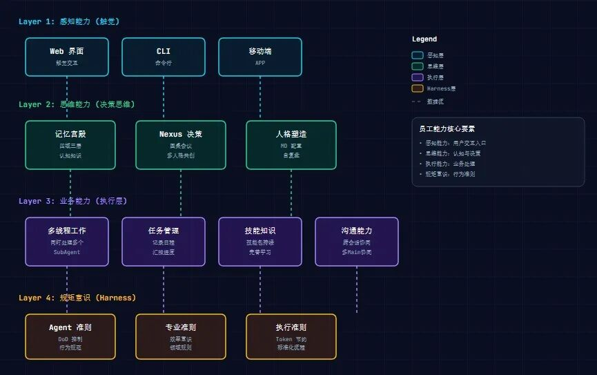
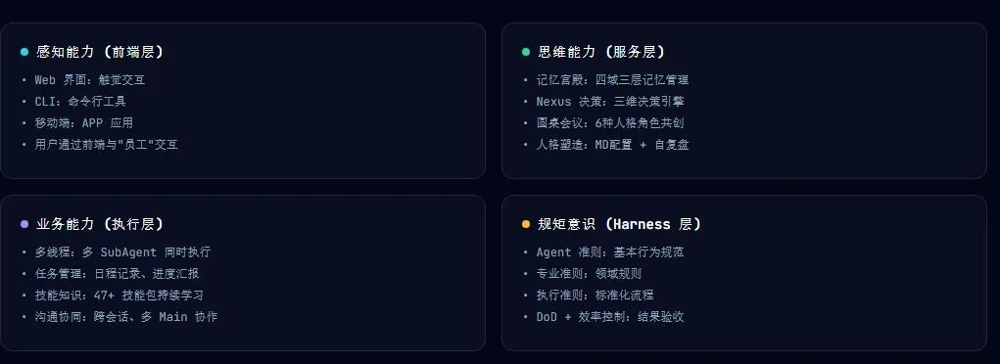

> 📎 来源: [产品老高](https://mp.weixin.qq.com/s?__biz=MzIzMjUyNDQ2MQ==&mid=2247488477&idx=1&sn=19d45b43b4a6809c8f1eee8f92fe6a9e&chksm=e993a44387f249ef676888a6218c2f535e2043e8c152f6e97c4100646bf67571f6a14448e94a&mpshare=1&scene=1&srcid=0424TWFDhNwHSMvXFwocoZvV&sharer_shareinfo=47d6c584268c7d5e292f181a068c8f4e&sharer_shareinfo_first=47d6c584268c7d5e292f181a068c8f4e) | 时间: 2026-04-24 21:38

---

#

**导语：**什么样的架构设计，才能真正让AI Agent从"工具"进化到"员工"？这不是一篇单纯的技术文档，而是一个从业人员对Agent架构设计的系统性反思。

## 一、两个架构的设计哲学：一个根本性的定位差异

在深入技术细节之前，我想先聊一聊我对于当前两个主流系统理解的背后最根本的差异——**系统定位**。这个定位差异，决定了它们各自的能力边界和发展天花板。

**OpenClaw的定位是"劳动力工具"**。你可以把它理解为一把瑞士军刀，功能强大、响应迅速，但需要人类来"握着"它。它更像是一个超级助手，能够高效执行明确的指令，但缺乏独立思考和自主决策的能力。

**Hermes Agent的定位是"思考控制器"**。它更像是一个聪明的大脑，具备强大的推理能力和知识储备，但在"动手能力"上明显不足。它更像是CEO的智囊团，能够出谋划策，但具体的执行落地还需要交给别人。

这两种定位没有绝对的对错之分，关键在于应用场景。但我必须说，在我看来，这两种定位都只是触及了AI Agent的局部可能性。**真正的突破，可能在于找到第三种路径——让AI Agent成为一个兼具认知能力和执行能力的完整"人"。**

## 二、OpenClaw深度解析：效率至上主义的得与失

### 2.1 架构设计概览

先说说OpenClaw。它的架构是典型的**扁平化设计**，流程简洁：用户 → Gateway → Sessions/SubAgents → Tools → LLM。

这种设计的优势是显而易见的——**执行效率极高**。

OpenClaw的Sessions和SubAgents机制，让它能够并行处理多个任务；丰富的Tools生态，让它能够应对各种工作场景；快速的响应时间，让用户几乎感受不到延迟。

### 2.2 强执行背后的代价

但是，强执行导向的架构设计也带来了明显的问题。

**第一个问题：认知能力的严重不足。**

OpenClaw的记忆系统相对简单。Sessions可以维护对话上下文，但这种记忆是短暂的、碎片化的。当任务跨越多个会话时，Agent很难保持一致性和连续性。这在单人单次使用的场景下可能不是问题，但如果是需要长期协作的"员工"，这就是致命缺陷。

**第二个问题：经验积累机制的缺失。**

一个真正优秀的员工，会从错误中学习，在重复任务中不断提升效率。但OpenClaw缺乏这样的机制。每次任务都是全新的开始，Agent不会记住"上次这样做效率更高"，它的能力是静态的，不会随时间和使用而进化。

**第三个问题：准则层的薄弱。**

OpenClaw有基本的Tool使用规范，但缺乏完整的Harness系统。这意味着Agent的行为边界是模糊的——什么能做，什么不能做，全靠LLM自己"理解"。在简单场景下这不是问题，但在复杂商业场景中，这种模糊性会导致不可预测的行为和潜在的风险。

### 2.3 OpenClaw适合的场景

**OpenClaw最适合的场景是：明确任务的快速执行。**

比如：帮我生成一段代码、帮我查询某个API、帮我整理一份报告。这些任务的特点是：目标明确、输入清晰、输出可预期。在这种场景下，OpenClaw的强执行能力是巨大优势。

但如果你需要的是能够独立承担一个完整项目、能够理解模糊需求、能够从错误中学习的"员工"，OpenClaw就力不从心了。

## 三、Hermes Agent深度解析：思考者的困境

### 3.1 架构设计概览

相比OpenClaw的"行动派"路线，Hermes Agent走的是**"思考派"路线**。

它的架构强调Controller的决策能力：用户 → Controller → Decision System → Executor → LLM，加上完善的知识库系统。

从设计意图来看，Hermes Agent试图解决OpenClaw的认知短板。这种设计让Hermes Agent更像一个"军师"——它会思考、会分析、会给出建议。

### 3.2 强思考的局限性

**第一个问题：执行能力的短板。**

Hermes Agent的Executor模块相对薄弱。它能够规划出完美的执行计划，但在实际执行环节频频受阻——工具调用失败、流程控制混乱、异常处理不当。一个完整的任务闭环需要"想到"和"做到"的双重能力。Hermes Agent擅长前者，但后者成了它的阿喀琉斯之踵。

**第二个问题：试错机制的缺失。**

优秀的员工不是天生就会做所有事情，而是能够在试错中成长。但Hermes Agent缺乏有效的试错和反馈机制。它更倾向于"计划-执行-结束"的线性流程，而不是"计划-执行-评估-调整-再执行"的迭代流程。

**第三个问题：更像"组织"而非"个体"。**

Hermes Agent的架构设计，更像是在构建一个"组织"——有Controller作为决策中枢，有Executor作为执行单元，有知识库作为信息枢纽。但这种设计天然适合多Agent协作，而不适合作为单一"员工"。如果你需要的是一个能够独立完成任务的"员工"，Hermes Agent可能不是最优选择。

### 3.3 Hermes Agent适合的场景

Hermes Agent的设计思路更适合**复杂的多Agent协作场景**。

比如，你需要多个专业Agent协同完成一个项目：一个负责数据分析，一个负责报告撰写，一个负责质量审核。在这种情况下，Hermes的控制和协调能力就能发挥价值。

## 四、我的破局：员工个体模型

### 4.1 核心理念：从工具到员工的跃迁

在深入研究OpenClaw和Hermes Agent之后，我形成了一个核心观点：**AI Agent应该被设计成"员工个体"，而不是"工具"或"终端控制器"。**

**定位决定解决问题的思路：**

- 如果定位是"工具"，我们就会专注于提升执行效率
- 如果定位是"控制器"，我们就会专注于提升思考能力
- 如果定位是"员工个体"，我们就必须同时解决"认知-执行-规矩"三个维度的问题

我认为，"员工个体"的定位天花板是最高的。因为它指向的是通用人工智能的一个关键特征：**能够独立完成开放性任务的能力。**

### 4.2 我的架构设计思路

基于"员工个体"的定位，我设计了一套完整的架构框架：

**第一层：前端接入层（触觉）**

这是Agent与用户沟通的窗口，包括Web、CLI、移动端等多种交互形式。核心目标是：**让用户能够自然、便捷地与Agent沟通。**

**第二层：服务层（决策思维）**

这是Agent的"大脑"，包含三个核心组件：**记忆系统、决策系统、人格塑造**。

**记忆系统**——层次记忆设计：

- **四域分类：**工作域、生活域、知识域、情感域
- **三层结构：**短期、中期、长期
- **语义检索：**引入向量存储，实现理解意图的记忆搜索

**第三层：执行能力层（业务能力）**

这是Agent的"四肢"，确保想法能够落地执行。**五级Agent分级**设计：

| 级别 | 类型 | Token消耗 | 响应时间 | 适用场景 |
| --- | --- | --- | --- | --- |
| L1 | 工具直调 | ~100 | <1s | 简单指令执行 |
| L2 | Skill执行 | ~500 | 2-5s | 标准任务处理 |
| L3 | 子代理 | ~2K | 5-15s | 复杂任务分解 |
| L4 | 头脑风暴 | ~10K | 15-60s | 需要深度思考 |
| L5 | 人工介入 | - | - | 边界情况处理 |

### 4.3 Harness系统：让Agent"可控"

这是我认为当前所有Agent架构都严重忽视的一个维度。在企业场景中使用AI Agent，最担心的不是能力不足，而是行为不可控。

**五层准则体系：**

- **Agent准则：**诚实、透明、可追溯
- **专业准则：**代码规范、安全实践、合规要求
- **执行准则：**任务接收→计划→执行→汇报→复盘
- **DoD控制：**明确定义"完成"的标准
- **效率控制：**Token上限、响应时间限制

## 五、我的思考

###

### 5.1 我的核心观点

**观点一：定位决定上限，架构是定位的具象化。**

"员工个体"的定位天花板是最高的，因为它指向的是通用人工智能的一个关键特征：**能够独立完成开放性任务的能力。**

**观点二：记忆系统是Agent进化的关键基础设施。**

当前的AI Agent普遍缺乏长期记忆能力，这严重制约了它们的"成长性"。我提出的层次记忆设计，试图突破这个瓶颈。

**观点三：Harness系统是商业化落地的必要条件。**

在企业场景中使用AI Agent，最担心的不是能力不足，而是行为不可控。这种"设计时就把风险考虑进去"的思路，值得所有Agent开发者重视。

## 六、是否还有更优解？

### 6.1 当前架构的共同局限

- **局限一：**自主性边界模糊。在什么情况下Agent可以自主决策？在什么情况下必须等待人类确认？这个边界在设计中是模糊的。
- **局限二：**情感与社会认知的缺失。忽略了AI Agent作为"虚拟员工"的情感和社会属性。
- **局限三：**资源消耗与性能的矛盾。完整实现设计所需的计算资源依然可观。

### 6.2 我眼中的更优解方向

- **方向一：**强化学习的持续进化机制——从反馈信号中学习，而不只是从文本中学习
- **方向二：**情境感知的动态决策——根据情境动态调整策略
- **方向三：**多Agent人格的协同涌现——通过深度交互产生"1+1>2"的涌现效应
- **方向四：**物理世界交互的原生支持——与物理世界交互的能力不可或缺

### 6.3 一个激进的设想：分布式员工意识

当前所有Agent架构都假设单一Agent服务于单一用户。但真正的"员工"应该是可以同时服务多个用户的。这需要解决：

- **状态隔离：**用户A的任务上下文不能泄露给用户B
- **注意力分配：**多个任务之间如何分配Agent的"注意力"资源
- **公平性保证：**不能让某个用户的任务总是被优先处理

## 七、总结与展望

**核心启示：**

- **OpenClaw教会我们：**执行效率是Agent的根基。无论架构多复杂，最终都要落地到"把事情做成"。
- **Hermes Agent教会我们：**思考能力决定了Agent的上限。
- **我的实践告诉我：**定位决定架构，综合能力才是目标。

AI Agent的发展正在经历一个关键转折期：

- 第一阶段是"工具时代"
- 第二阶段是"助理时代"
- 第三阶段是"员工时代"——Agent能够像人类员工一样独立工作、持续成长

---

**保持好奇，保持批判，保持实践。
没有完美的架构，只有更适合的解决方案。**

---

###

本文基于OpenClaw、Hermes Agent的公开架构文档进行分析，结合作者的思考和方案设计，仅代表个人观点。
