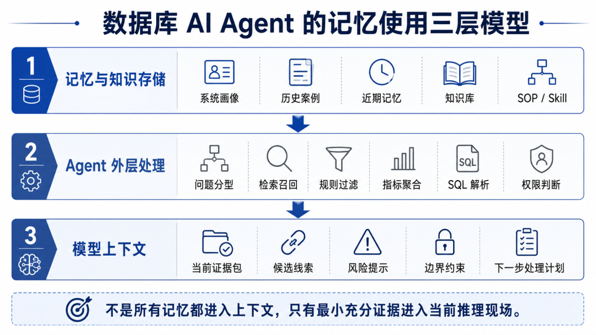
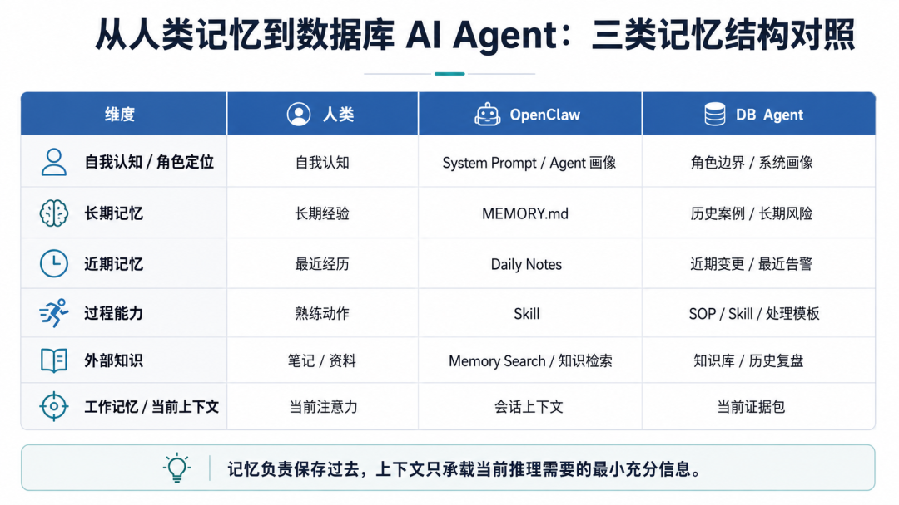

> 📎 来源: [架构与方法](https://mp.weixin.qq.com/s?__biz=MzU2MDk3OTA5Ng==&mid=2247483727&idx=1&sn=b1f187f3a19c1dc7cc466bb4f356f70b&chksm=fd6e5eb8cc5369d04015b15c55a4f7912b209242f31a597bd1061efd1572554e68bc131d274d&mpshare=1&scene=1&srcid=0513mNj38ajzaSe9uKX0umDp&sharer_shareinfo=379033f5944c918ed4a168c0cff6d678&sharer_shareinfo_first=379033f5944c918ed4a168c0cff6d678) | 时间: 2026-05-13 01:56

---

AI 不是记不住。
很多时候，是我们没有想清楚：
什么应该写进系统提示词，什么应该进入长期记忆，什么只是近期上下文，什么应该沉淀成 Skill，什么只是知识库检索。
更重要的是：
不是所有记忆都应该塞进大模型上下文。
对 Agent 来说，真正关键的是：记忆如何保存，如何被检索和预处理，最后哪些内容才有资格进入当前推理现场。

我一开始以为，做一个“数字孪生”很简单。

把过去的文章、笔记、经验、偏好都丢进去，让 AI 能查到，它就会越来越像我。

后来我发现，这个理解太粗糙了。

AI 最麻烦的地方，不是完全记不住，而是它有时会记住一堆东西，却不知道当前问题该用哪一部分。

更危险的是，它可能把一个历史案例当成当前结论，把一次临时判断当成长期经验，把一个过期偏好当成稳定原则。

这对写文章来说，最多是风格跑偏。

但如果放到数据库 AI Agent 里，就可能变成误判。

前面几篇里，我一直在写数据库 AI、Skill、平台和处置闭环。写到这里，其实会遇到一个更底层的问题：数据库 AI Agent 到底凭什么判断？当前 SQL、指标、执行计划当然重要，但很多判断还来自历史案例、系统画像、近期变更和过去的复盘经验。

我最早对“记忆系统”的体感，不是从数据库运维里来的，而是从 OpenClaw 个人助理探索里来的。

也正是在用 OpenClaw 做数字孪生的过程中，我逐渐意识到：数据库 AI Agent 真正缺的不是知识，而是分层记忆系统，以及对上下文的管理能力。

这篇文章想讲清楚一个三层模型：

```
记忆与知识负责保存过去Agent 外层负责检索、过滤和预处理模型上下文只承载当前推理需要的最小充分证据
```

换句话说，Agent 的能力不等于大模型上下文的大小。真正关键的是：当前问题应该激活哪部分记忆，哪些内容应该先在工具层处理，哪些证据才有资格进入当前推理现场。

本文内容主要基于个人业余时间的学习、搭建与思考，属于个人技术探索，不涉及所在单位、具体系统、具体业务或线上运行细节。文中提到的 OpenClaw，主要作为个人助理和知识沉淀入口来讨论，不涉及数据库运维操作接入或具体安全方案。本文里的“数据库 AI Agent”，可以理解为基于 AI Agent 思路构建的数据库运维智能体；为了行文方便，后文有时简称为 DB Agent。

需要特别说明的是，本文并不是在讨论“用 OpenClaw 直接接入数据库并执行运维操作”，也不构成任何生产环境接入建议。OpenClaw 在这里主要是一个个人助理和数字孪生入口，用来观察 Agent 在系统提示词、长期记忆、Daily Notes、Skill、知识检索和上下文组织上的设计。真正落到数据库 AI Agent 场景时，本文讨论的是“记忆与上下文设计方法”，而不是某个具体工具的落地方案。

01

OpenClaw 本质上是什么：不是聊天框，而是具备 Agent 编排能力的 AI 助理

在讨论 OpenClaw 的记忆之前，先要定性 OpenClaw。

我更愿意把 OpenClaw 理解为一个**具备 Agent 编排能力的 AI 助理**，而不只是一个聊天窗口。

它不是简单把一个聊天窗口套在大模型外面。

从公开文档看，OpenClaw 有 agent run 的概念，可以通过 Gateway 或本地模式运行 agent；它会组装自己的 system prompt，并在其中包含工具列表、Skill 列表、工作区、时间、运行时元数据和项目上下文等信息；Skill 机制则通过 

```
SKILL.md
```

、YAML frontmatter 和 markdown instructions 教 agent 何时、如何使用工具。

为了便于理解，可以把它简化成下面这条链路。注意，这不是官方完整架构图，只是帮助理解 OpenClaw 相比普通聊天框多做了哪些事情：

```
用户 / IM / Web  -> OpenClaw 的 Agent 运行机制      -> System Prompt 组装      -> Memory / Daily Notes      -> Skill 加载与触发      -> Tool / MCP / 外部能力      -> Context 组织  -> LLM 推理  -> 回复 / 工具调用 / 记忆更新
```

这也是它和普通聊天框的区别。

普通聊天框主要依赖当前对话。

OpenClaw 这类 Agent 化助理则会尝试处理更多事情：

• 角色与行为边界；

• 上下文组织；

• 长期记忆；

• 近期连续性；

• Skill 调用；

• 工具接入；

• 多渠道入口。

所以，当我们说“用 OpenClaw 做数字孪生”时，重点不应该只是“给模型喂了多少资料”。

更准确的问题应该是：

它是如何把身份、偏好、近期上下文、任务方法和知识检索组织到一起的？

因此，本文不会把 OpenClaw 直接等同于数据库运维平台。它在这里更像一个观察样本，帮助我理解一个 Agent 化助理如何组织身份、记忆、能力和上下文。

这就进入了记忆机制。

02

OpenClaw 的记忆与能力，不是一个单一模块

一开始，我也容易把“记忆”理解成一个很简单的东西：

把重要内容存下来，下次能查到。

但真正看 OpenClaw 的机制后，会发现它不是一个单一的“记忆模块”。

更准确地说，它由两组能力共同组成：一组偏认知与记忆，一组偏能力与检索。

```
认知与记忆层：1. System Prompt / Agent 画像2. MEMORY.md / 长期记忆3. memory/YYYY-MM-DD.md / 近期每日记忆能力与检索层：4. Skill / 过程能力5. Memory Search / 知识检索
```

把这两组分开，有助于避免一个常见误解：

不是所有和“记住、查找、复用”有关的东西，都应该被叫作记忆本体。

```
MEMORY.md
```

 和 daily notes 更接近记忆本身；Skill 更像任务处理方式的编码；Memory Search 则更像外部知识和历史材料的检索入口。

1. System Prompt / Agent 画像：我是谁，我应该怎么工作

OpenClaw 的 Context 文档说明，system prompt 是 OpenClaw-owned，并且会在每次运行时重建，其中包含工具列表、Skill 元数据、workspace、时间、运行时元数据以及项目上下文等内容。

这一层不是普通意义上的“记忆文件”，但它非常关键。

因为它决定的是：

```
我是谁我应该怎么回应我有哪些边界我偏好什么风格我应该如何使用工具和记忆
```

放到个人数字孪生里，这一层可以理解为“画像”。

比如：

• 你希望它以什么身份回答；

• 你希望它采用什么表达风格；

• 你希望它遵守哪些边界；

• 你希望它做判断时更关注哪些维度。

这层更像认知底座。

它不是回答某个具体问题的资料，而是影响 Agent 的整体行为方式。

2. MEMORY.md / 长期记忆：稳定事实、偏好和决策

OpenClaw 的 Memory 文档里，

```
MEMORY.md
```

 被定义为 long-term memory，用来保存 durable facts、preferences and decisions；

```
memory/YYYY-MM-DD.md
```

 则作为 daily notes 保存 running context and observations。

这层更接近我们通常说的“长期记忆”。

它适合放：

```
长期偏好稳定事实重要决策长期项目背景不应该频繁变化的判断原则
```

比如一个个人助理可以记住：

• 我偏好什么样的文章结构；

• 我不喜欢什么表达方式；

• 我关注哪些技术方向；

• 我对某类工具已经形成过什么判断；

• 哪些事情属于长期推进任务。

但这层也不能乱写。

如果什么都往长期记忆里放，它会很快变成噪音堆。

长期记忆应该是经过沉淀后的内容，而不是所有对话的垃圾桶。

3. memory/YYYY-MM-DD.md / 近期每日记忆：最近发生了什么

OpenClaw 的 Memory 文档提到，today 和 yesterday 的 daily notes 会自动加载；但 Context 文档也补充说明，daily files 在普通 turn 中并不一定作为 normal bootstrap Project Context 直接注入，而是可以通过 

```
memory_search
```

 和 

```
memory_get
```

 按需访问，在 

```
/new
```

 或 

```
/reset
```

 等启动场景中，运行时可能会预置近期 daily memory。这个细节很重要：记忆并不总是无脑塞进上下文，而是存在加载策略和按需读取。

这层很像人的“最近记忆”。

很多时候，AI 不需要记住一年以前的所有细节，但它需要知道：

昨天刚刚发生了什么。

比如你正在连续几天写一篇文章，昨天已经定了标题，今天继续改正文。

这时 daily notes 的价值就很明显。

它让 Agent 不至于每次都从零开始。

4. Skill / 过程能力：这类任务通常怎么做

很多人容易把 Skill 理解成工具。

这没有错，但不完整。

OpenClaw 的 Creating Skills 文档说明，Skills teach the agent how and when to use tools；每个 Skill 是一个目录，其中包含 

```
SKILL.md
```

 文件、YAML frontmatter 和 markdown instructions。

所以 Skill 不只是“能做什么”。

它还包含：

```
什么时候用怎么用输入输出是什么要注意什么边界结果应该怎么组织这类任务通常怎么处理
```

更准确地说，Skill 是一种**过程能力**，也就是把某类任务的处理方式编码下来。

如果借用类人记忆做类比，它有点像“过程记忆”；但在工程实现里，它并不是记忆文件，而是任务处理方式的显式描述。

比如写作类 Skill，可能沉淀的是：

• 如何生成文章大纲；

• 如何压缩 AI 味；

• 如何保持方法论口吻；

• 如何给公众号文章设计标题；

• 如何做正文配图建议。

资讯整理类 Skill，可能沉淀的是：

• 关注哪些主题；

• 过滤哪些噪音；

• 如何摘要；

• 如何给出判断；

• 输出格式是什么。

所以，Skill 不等同于记忆文件，但它确实保存了一类任务的处理方式。

5. Memory Search / 知识检索：资料在哪里

最后一层是知识检索。

这里要特别区分：

知识检索不等于记忆本身。

知识检索回答的是：

```
相关资料在哪里？哪些历史材料和当前问题语义相似？哪些文档可以作为参考？
```

长期记忆回答的是：

```
哪些偏好、事实、决策值得长期保留？
```

Skill 回答的是：

```
这类任务应该怎么做？
```

这三者不能混。

一个知识库里可以放很多材料，比如文章、笔记、案例、文档。

但这些材料不一定都应该进入长期记忆。

长期记忆更像经过筛选后的稳定认知。

知识检索更像资料入口。

这也是我后来对“数字孪生”的理解变化：

数字孪生不是把所有资料都塞给 AI，而是把身份、偏好、近期上下文、任务方法和知识检索分层组织起来。

03

记忆不等于上下文：Agent 外层也会使用知识

前面讲的是“记忆存在哪里”。

但这还不够。

因为对大模型来说，真正参与推理的，是当前上下文。

不过，这里也不能简单理解为：

所有记忆最终都要塞进上下文。

这也是一个误区。

更准确地说：

大量外部知识和记忆，可以先被 Agent 外层的工具、规则、检索、索引、代码分析器、本地执行器处理；只有需要模型参与理解、归纳、判断和表达的部分，才应该以压缩后的形式进入上下文。

这点非常关键。

一个强 Agent，不只是“模型强 + 上下文大”。

它还应该有：

```
检索能力工具调用文件读取索引搜索规则过滤状态管理结果排序本地计算错误反馈上下文裁剪
```

OpenClaw 的 Tools and Plugins 文档也强调，agent 生成文本之外的事情都通过 tools 完成，tools 用来读文件、运行命令、浏览网页、发送消息和与设备交互。也就是说，Agent 外层并不是摆设，它会承担相当一部分信息处理和行动能力。

比如 coding agent 很强，往往不只是底层模型强，还因为它有一套 Agent 外壳：

```
读文件搜索代码理解目录结构调用工具执行测试查看报错修改文件再次验证管理任务上下文控制工具调用流程
```

它不是把整个代码仓库都塞进上下文。

更合理的流程是：

```
用户提出需求  -> Agent 搜索相关文件  -> 读取少量关键片段  -> 分析依赖关系  -> 修改代码  -> 执行测试  -> 读取失败输出  -> 再把关键错误和相关代码片段送给模型
```

也就是说：

代码仓库大部分时间在工具层被搜索、读取、执行和验证；只有关键片段进入模型上下文。

这对数据库 AI Agent 也一样。

面对一个慢 SQL 问题，Agent 外层完全可以先做很多处理：

```
SQL 指纹归一化执行计划解析表结构提取索引列表整理统计信息摘要慢日志聚合相似 SQL 检索历史案例召回风险规则匹配
```

这些不需要全部让大模型从原始数据里读。

更合理的是先处理成结构化摘要：

```
当前问题类型：慢 SQL核心 SQL 模式：按 user_id + create_time 查询执行计划问题：走了全表扫描候选原因：缺少合适复合索引 / 统计信息不准相关历史案例：2 条风险提示：该表写入压力较高，索引建议需评估写入成本
```

然后再进入模型上下文。

所以，上下文管理的核心不是“把更多东西塞进去”。

而是：

**控制什么信息有资格进入当前推理现场。**

我现在更愿意把它拆成三层：



一句话总结：

**记忆负责保存过去，Agent 外层负责检索和预处理，上下文负责承载当前推理需要的最小充分证据。**

这比“记忆最终加载到上下文”更准确。

mem0、mem9 这类外部记忆方案也可以放在这个趋势里理解：Agent 的记忆正在从简单文件、提示词片段，走向独立的记忆层和上下文管理层。公开资料显示，mem0 更偏通用 Agent memory layer，mem9 则更偏 OpenClaw / coding agent 场景，强调共享记忆层。它们说明记忆优化不只是存储问题，也开始进入检索、压缩、共享和上下文生命周期。

最近 Hermes Agent 这类工具也在强调类似方向：从经验中创建 Skill、在使用中改进 Skill，并通过内置记忆和外部 memory provider 保持跨会话连续性。这个方向说明，Agent 的演进重点，正在从“模型回答得更好”转向“系统能不能持续沉淀记忆、能力和上下文”。

但对数据库 AI Agent 来说，真正关键的仍然不是选哪个记忆组件，而是：

```
哪些内容应该被记住？哪些内容应该被召回？哪些内容应该被 Agent 外层先处理？哪些内容应该进入上下文？哪些内容只能作为待验证线索？哪些内容不能改变权限边界？哪些记忆被证伪后必须撤回？
```

所以，mem0、mem9、Hermes Agent 都可以看成趋势信号，而不是本文主角。

对数据库 AI Agent 来说，记忆基础设施只是起点。更难的是记忆治理：哪些记忆可以长期保留，哪些需要设置有效期，哪些在被证伪后必须撤回，哪些只能作为待验证线索，不能进入最终判断。

记忆一旦参与判断，就不再只是资料管理问题，而是可靠性问题。

04

OpenClaw 的记忆，为什么有点像人类记忆

当然，OpenClaw 不是人脑。

不能说它真的模拟了人类记忆。

但从工程结构上看，它和人类记忆确实有一些有趣的对应关系。

可以简单类比一下：

| 人类机制 | Agent 对应机制 | 作用 |
| --- | --- | --- |
| 工作记忆 | 当前上下文窗口 | 当前正在处理的信息 |
| 近期记忆 | daily notes / 今天与昨天的记忆 | 保持近期连续性 |
| 长期记忆 | MEMORY.md / 系统画像 | 稳定事实、偏好、决策 |
| 程序性记忆 | Skill / SOP | 某类任务通常怎么做 |
| 外部记忆 | 文档、笔记、知识库、Memory Search | 可检索资料和历史材料 |
| 记忆激活 | 检索、排序、规则命中 | 找出当前相关内容 |
| 自我认知 | System Prompt / Agent 画像 | 我是谁、怎么回应、边界是什么 |

这个类比不是为了把 OpenClaw 说得多神奇。

恰恰相反，它帮助我们把“记忆”和“上下文”这件事讲清楚。

人类不是靠记住所有细节来变得有经验。

很多时候，我们靠的是分层记忆：

```
当前在做什么最近发生了什么长期相信什么这类任务通常怎么做需要时去哪里查资料当前问题激活了哪些相关经验我是谁、我有什么边界
```

人也不会在每次判断时把全部记忆都调出来。

真正参与判断的，是当前被激活、被组织起来的那部分内容。

这就是上下文的意义。

所以，对 Agent 来说，不是“记住得越多越好”。

而是：

当前问题应该激活哪部分记忆？
哪些应该交给工具层处理？
哪些应该进入模型上下文？
哪些只能作为背景，不能直接变成结论？

这句话放到数据库 AI Agent 上，几乎同样成立。

05

从个人数字孪生到数据库 AI Agent

如果说个人数字孪生要记住的是“我如何判断”，那么数据库 AI Agent 要记住的就是“系统如何运行”。

这两者不是同一个场景，但结构上可以对应。

| OpenClaw 记忆层 | 个人数字孪生中的作用 | DB Agent 中的对应设计 |
| --- | --- | --- |
| System Prompt / Agent 画像 | 身份、风格、边界 | Agent 角色、响应边界、风险原则 |
| MEMORY.md | 长期偏好、稳定事实、重要判断 | 系统画像、长期风险、稳定规则 |
| Daily Notes | 最近任务、最近讨论、近期上下文 | 最近变更、近期告警、最近处置 |
| Skill | 某类任务怎么做 | SOP / 处理模板 / 可复用诊断能力 |
| Memory Search | 检索文章、笔记、案例 | 检索文档、案例、规范、排查手册 |
| Context 组织 | 当前任务使用哪些材料 | 当前问题使用哪些证据 |

这个映射让我意识到：

DB Agent 的记忆，不应该只是接一个知识库。

因为知识库只解决“资料在哪里”。

但数据库运维里，很多判断不是资料检索问题，而是经验复用问题。

比如：

• 这个系统平时什么样；

• 这个时间窗口是否特殊；

• 这张表历史上是否敏感；

• 过去类似问题怎么发生；

• 当时采集了哪些证据；

• 最后怎么验证；

• 哪些经验后来证明不适用；

• 哪些动作只能建议，不能自动执行。

这些东西如果不沉淀，DB Agent 很容易退化成通用问答。

它可以说出很多正确但泛泛的排查步骤。

但它不一定知道：

当前这个系统，应该先想起什么。

所以，数据库 AI Agent 的记忆设计，至少应该包括几层：

```
1. 角色与边界   这个 Agent 是做问答、诊断、巡检，还是处置辅助？   哪些事可以建议，哪些事必须停止？2. 系统画像   指一个系统长期运行中形成的相对稳定特征，包括运行基线、业务周期规律、核心表特征、容量与性能趋势，以及已知风险边界。3. 近期记忆   最近变更、最近告警、最近巡检、最近一次处置。4. 历史案例   过去类似问题、关键证据、处理过程、验证结果、复盘结论。5. SOP / Skill 模板   某类问题通常怎么处理，比如慢 SQL、复制延迟、死锁、连接数异常。6. 知识检索   官方文档、参数说明、内部规范、排查手册。7. 上下文编排   决定当前问题应该加载哪些证据、线索、规则和边界。
```

对 DBA 来说，系统画像不只是几张指标曲线。它更像一个系统的“基础代谢率”：在正常业务流量下，CPU、IO、连接数、复制延迟、慢 SQL 比例大概处于什么范围；在日终、月末、批量任务或活动窗口下，哪些指标会自然抬升，哪些抬升才值得警惕。

一个成熟的 DB Agent，不应该看到延迟上升就立刻翻知识库，而应该先问：这是不是这个系统在当前业务周期里的正常波动？有没有触发长期画像里的已知模式？

如果只做第 6 层，那只是知识库问答。

如果只有第 5 层，那只是 Skill 自动化。

如果没有第 2、3、4、7 层，就很难形成真正有经验的判断。



06

数据库 AI Agent 的记忆，难点不在“存”，而在“怎么用”

说到这里，问题就变了。

我们不是要证明“记忆很重要”。

这很容易证明。

真正难的是：

记忆进入 DB Agent 以后，到底怎么用？

至少有五个难点：

```
难点一：记忆不是越多越好，要先做问题分型难点二：知识库、历史案例和长期记忆不能混难点三：历史案例不能直接当答案难点四：错误记忆比没有记忆更危险难点五：记忆能影响判断，但不能改变边界
```

下面逐个展开。

07

难点一：记忆不是越多越好，要先做问题分型

很多人一提记忆系统，第一反应是：

把历史资料都放进去。

但数据库场景里，这很危险。

信息太少，判断不准。 信息太多，噪音会影响判断。

尤其数据库运维的信息量非常大：

• SQL；

• 表结构；

• 索引；

• 执行计划；

• 慢日志；

• 指标；

• 会话；

• 锁；

• 事务；

• 变更记录；

• 业务周期；

• 历史案例；

• 系统画像。

如果一股脑塞给模型，可能带来三个问题：

```
token 爆炸相关性下降弱相关信息被当成强证据
```

所以 DB Agent 不应该先捞一堆记忆，再让模型判断。

更合理的方式是：

```
问题出现  -> 初步问题分型  -> 选择相关知识库范围  -> 匹配相似历史案例  -> 调用相关系统画像和近期记忆  -> Agent 外层做过滤、聚合和规则命中  -> 形成当前证据包  -> 校验问题分型  -> 形成判断和下一步处理计划
```

这里的“证据包”，不是把所有上下文打包给模型，而是经过问题分型和 Agent 外层处理后筛选出来、能够支撑当前判断的一组关键证据。

这里的“校验问题分型”，是指在初步收集证据之后，再确认最初的问题判断方向是否需要修正。因为证据有时会改变对问题类型的判断，初始分型应该被看作假设，而不是最终结论。

比如当前是慢 SQL 问题，优先需要的可能是：

```
SQL 模式表结构索引执行计划统计信息相似 SQL 历史案例相关表的写入压力记忆
```

而不是把所有复制延迟案例、DDL 案例、连接数案例都拿进来。

如果当前是复制延迟问题，优先需要的可能是：

```
复制状态延迟曲线主库写入压力大事务历史案例批量任务窗口从库资源画像
```

而不是先去检索索引优化知识库。

所以，记忆调用也要受问题分型约束。

问题分型的具体逻辑，会放到后面讨论 Skill 编排时再展开。这里先强调一点：记忆的调用范围，应该受问题类型约束，而不是无差别全量召回。

进一步说，一个完整的 Skill 或 SOP，不只是一份步骤清单。

它更像一个编排方案：决定当前问题应该激活哪些历史案例、匹配哪部分知识库、调用哪些工具、向模型提交什么证据。

大模型负责推理和判断，但它判断的材料，是经过 Skill / SOP 编排后筛选出来的。

如果没有 Skill / SOP，模型容易面对一堆材料发散；如果只有 Skill / SOP，没有知识库和历史案例，处理过程又会过于机械；如果只有历史案例，没有当前证据校验，就容易把过去答案照搬到当前问题。

**记忆不是越多越好，关键是当前问题到底需要哪一部分记忆。**

08

难点二：知识库、历史案例和长期记忆不能混

DB Agent 的记忆系统里，有几类东西很容易被混在一起。

• 知识库；

• 历史案例；

• 长期记忆；

• 近期记忆；

• Skill / SOP；

• 当前上下文。

但它们回答的问题不同。

| 类型 | 回答的问题 | 数据库场景例子 |
| --- | --- | --- |
| 知识库 | 标准上怎么说 | 官方文档、参数说明、规范、排查手册 |
| 历史案例 | 过去怎么发生 | 慢查询复盘、DDL 卡住、复制延迟、连接数暴涨 |
| 长期记忆 | 这个系统通常是什么样 | 系统画像、业务周期、核心表特征、风险边界 |
| 近期记忆 | 最近发生了什么 | 最近变更、最近告警、最近巡检、最近处置 |
| Skill / SOP | 这类问题通常怎么处理 | 慢 SQL 处理步骤、复制延迟排查路径 |
| 当前上下文 | 这次判断正在依据什么 | 当前证据、候选线索、风险提示、约束边界 |

知识库是标准依据。

它告诉你：

标准上怎么说。

历史案例是经验线索。

它告诉你：

过去怎么发生。

长期记忆保存系统画像。

它告诉你：

这个系统通常是什么样。

近期记忆是连续上下文。

它告诉你：

最近发生了什么。

Skill / SOP 是过程能力。

它告诉你：

这类问题通常怎么处理。

当前上下文则是当前推理现场。

它告诉模型：

这一次判断应该依据什么。

如果把这些东西都叫“记忆”，就会糊。

更稳的设计是：分层保存，分层处理，分层进入上下文。

09

难点三：历史案例不能直接当答案

历史案例对 DB Agent 很重要。

但历史案例最容易被误用。

比如某次复制延迟，历史上确实是大事务导致。

当前又出现复制延迟时，Agent 不能直接说：

上次是大事务，这次也是大事务。

更合理的方式是：

```
当前现象：复制延迟  -> 匹配历史案例：曾有大事务导致延迟  -> 提取候选线索：检查大事务、批量任务窗口、SQL 线程回放压力  -> 回到当前现场采集证据  -> 判断当前是否满足相似条件
```

历史案例不是答案，而是线索。

它能帮助 Agent 少走弯路，但不能替代当前证据。

同样是慢 SQL，可能是索引问题，也可能是统计信息问题、锁等待、资源抖动、业务流量放大、执行计划变化。

同样是复制延迟，可能是大事务，也可能是网络、从库资源、锁等待、回放线程瓶颈、DDL 影响。

所以历史案例的正确用法不是“照抄答案”，而是：

把过去的经验转化为当前排查的候选方向。

**历史案例不是答案库，而是判断线索库。**

在数据库运维中，“记得”只是起点，“怀疑”才是修养。历史案例如果没有经过当前证据的二次校验，就不是经验，而可能变成误判的成见。

所以，历史案例进入上下文时，最好不要以“结论”的身份出现，而应该以“待验证线索”的身份出现。

10

难点四：错误记忆比没有记忆更危险

记忆系统看起来很美好，但它有一个很大的风险：

一旦记错，就会稳定地错。

没有记忆时，AI 可能每次都从通用步骤开始。

这当然效率不高。

但错误记忆进入系统后，它可能反复影响后续判断。

比如：

• 一次错误复盘被固化成经验；

• 某个临时处置被长期复用；

• 某个系统的经验被错误迁移到另一个系统；

• 某个历史风险已经消失，但记忆没有更新；

• 某个案例只适用于特定时间窗口，却被当成通用规则。

所以，DB Agent 的记忆不能只是普通笔记。

下面用 YAML 形式来表达一条记忆如果进入严肃场景，应该具备哪些结构化信息。这里的 YAML 不是某个框架的原生格式，只是帮助理解。

```
memory:  type: "historical_case"  scenario: "replication_delay"  summary: "某次复制延迟与大事务回放相关"  evidence:    - "延迟曲线与批量任务窗口重合"    - "binlog 中存在大事务"    - "SQL 线程回放耗时升高"  applicable_when:    - "复制延迟发生在批量任务窗口"    - "主库写入量明显升高"    - "从库 SQL 线程回放压力升高"  not_applicable_when:    - "IO 线程异常"    - "网络抖动明显"    - "延迟与批量窗口无关"  confirmed_by: "manual_review"  created_at: "YYYY-MM-DD"  expires_at: "YYYY-MM-DD"  correction_history: []
```

一条真正可复用的记忆，至少要带上：

```
来源时间适用范围确认人有效期复用条件过期策略纠偏记录
```

**错误的记忆，比没有记忆更危险。**

11

难点五：记忆能影响判断，但不能改变边界

还有一个边界必须讲清楚。

即使 DB Agent 记住了某个排查路径，也不代表它可以自行执行。

比如，它记得：

```
某类 DDL 记录可以通过审计视图查询某类慢 SQL 可以查看执行计划某类复制延迟需要检查大事务
```

这只能说明它知道一种排查方向。

但它不能因此绕过受控流程，自己去找工具、自己查底层表、自己连接数据库、自己执行 SQL。

记忆只能参与判断，不能赋予权限。

模型知道一件事，不代表它被授权做这件事。

模型记得一个方法，也不代表它可以绕过平台边界去执行。

更合理的边界是：

```
记忆层：  提供历史线索、系统画像、经验背景Agent 外层处理：  完成检索、过滤、聚合、规则命中和工具结果整理上下文层：  只承载当前推理需要的关键证据和约束能力边界：  决定哪些 Skill、工具或平台接口可以被调用权限边界：  决定当前用户和场景是否允许调用审计记录：  记录调用过程和结果
```

所以，DB Agent 的记忆系统不能变成“自由行动的理由”。

它只能帮助回答：

当前问题可能和哪些历史经验有关？

不能帮助绕过：

当前系统允许我做什么？

**记忆能影响判断，但不能改变权限边界。**

12

写在最后：真正缺的不是知识，而是分层记忆与上下文编排

回头看，我用 OpenClaw 做数字孪生，真正有价值的不是“多喂了多少资料”。

而是它让我看到：

一个 AI 助理如果想长期有用，不能只靠当前对话，也不能只靠一个知识库。
它需要系统提示词、长期记忆、近期记忆、Skill、知识检索和上下文组织一起工作。

这很像人类经验的形成方式。

人不是记住所有细节才变得有经验。

人真正有经验，是因为他知道：

```
我现在在处理什么最近发生过什么长期应该坚持什么这类任务通常怎么做需要时去哪里查资料当前问题激活了哪些相关经验哪些事情不能越界
```

数据库 AI Agent 也是一样。

它真正需要的，不是一个更大的知识库。

而是一套机制：

```
把知识库变成标准依据把历史案例变成候选线索把系统画像纳入长期记忆，让它成为判断的稳定基础把近期记忆变成连续上下文把 Skill / SOP 变成过程能力让 Agent 外层先完成检索、过滤、聚合和规则命中最后把当前推理需要的最小充分证据交给模型
```

最终，它不是为了让 AI 替 DBA 下结论。

而是让 AI 在 DBA 判断之前，把那些过去已经发生过、已经验证过、已经复盘过的经验，更稳定地带回当前问题里。

**数据库 AI Agent 的价值，不是记住所有过去，而是在当前问题里，用对那些真正相关的历史经验。**

下一篇，我想继续往前走一步：如果知识库、历史案例、系统画像和当前证据都已经准备好了，DB Agent 到底该如何编排 Skill，才能把这些东西用在正确的问题上？

13

系列文章导航

系列｜架构与方法 · AI 实践

• 第 1 篇：[做了15年数据库，系统性研究AI几个月后，我的一些方法与判断](https://mp.weixin.qq.com/s?__biz=MzU2MDk3OTA5Ng==&mid=2247483670&idx=1&sn=2b9aa170a8aff6a3cc2a3958feecbd29&scene=21#wechat_redirect)
• 第 2 篇：[从25分钟到2分钟：我把慢查询分析做成了一个Skill](https://mp.weixin.qq.com/s?__biz=MzU2MDk3OTA5Ng==&mid=2247483682&idx=1&sn=642a46881507897c5a20abf0947f4b96&scene=21#wechat_redirect)
• 第 3 篇：[数据库 AI Skill 不是 Prompt：从 demo 到可用，中间差的是工程化](https://mp.weixin.qq.com/s?__biz=MzU2MDk3OTA5Ng==&mid=2247483689&idx=1&sn=47a5cb0786f933d8ddd1dbf742cfbe35&scene=21#wechat_redirect)
• 第 4 篇：[数据库 AI 不是多一个聊天框，而是让 DB Agent 进入运维平台](https://mp.weixin.qq.com/s?__biz=MzU2MDk3OTA5Ng==&mid=2247483709&idx=1&sn=c37f27d97b40595dba8c0a58629f66bf&scene=21#wechat_redirect)
• 第 5 篇：[AI 做数据库运维，难的不是给建议，而是把问题处理到底](https://mp.weixin.qq.com/s?__biz=MzU2MDk3OTA5Ng==&mid=2247483720&idx=1&sn=d90cabfd5c38e942bf5d00d4b42befb9&scene=21#wechat_redirect)

• 第 6 篇： 我用 OpenClaw 做了一个“数字孪生”，才发现数据库 AI Agent 真正缺的不是知识（本文）

如果你也在做架构、数据库、运维，或者也在思考 AI 和经验工作的结合，欢迎交流。后面这个系列，我会继续写架构、方法、实践，以及我在 AI 方向上的一些真实探索。不追热点，不做空泛测评，尽量只写自己真正想清楚、做过、踩过坑的内容。
