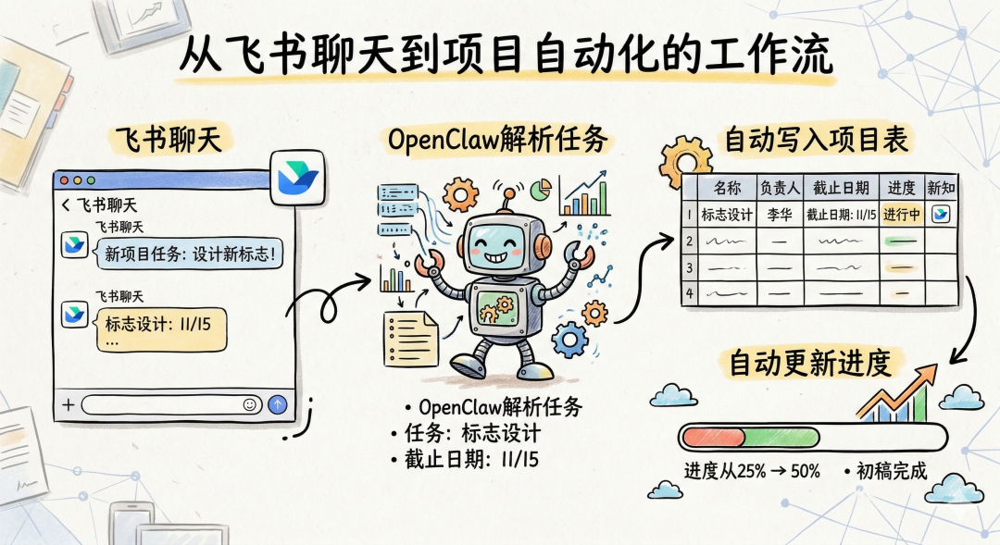
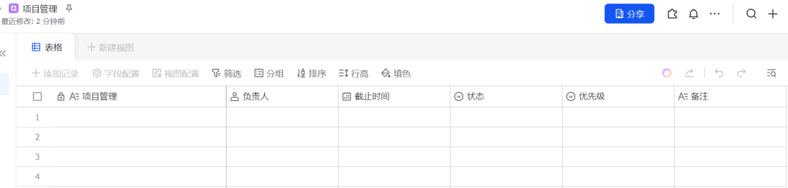
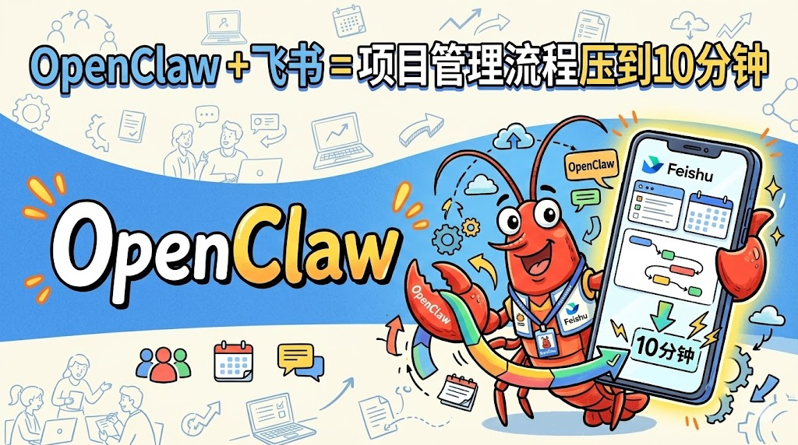
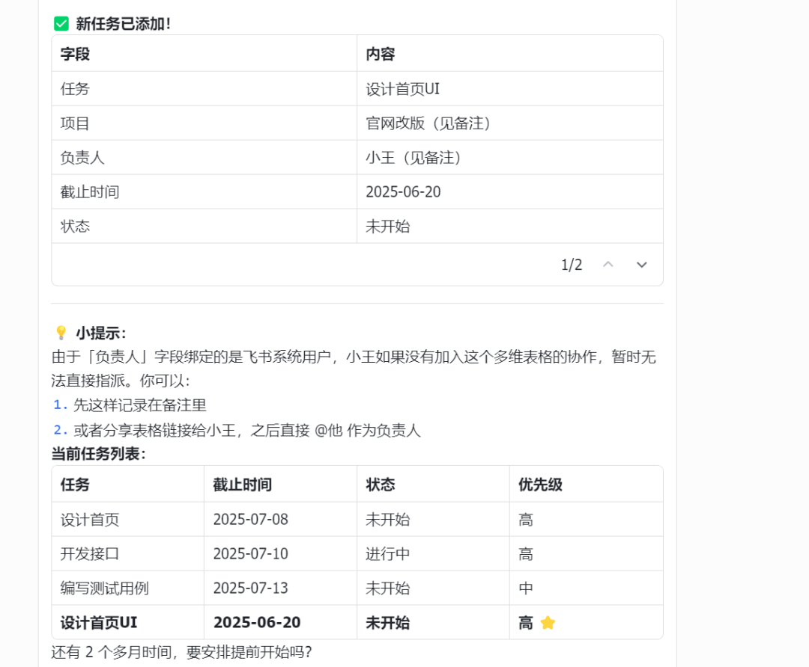
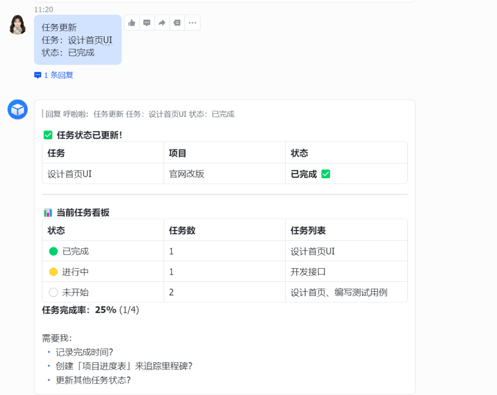
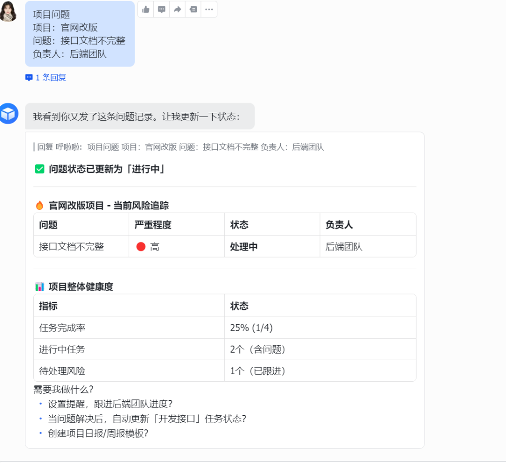
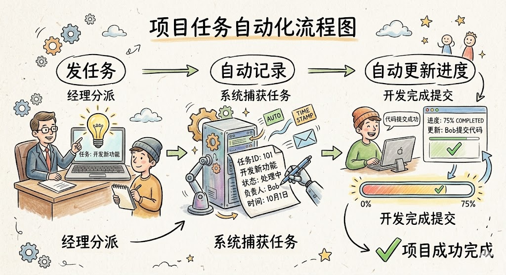

> 📎 来源: [summer甜豆](https://mp.weixin.qq.com/s?__biz=Mzk1NzI3NzM3NQ==&mid=2247486436&idx=1&sn=aedf152e1bd215e566eb8428656c89f7&chksm=c2249c5b61b7264d8d6a7a6e112e097f6168fff8b6cc8518a881c8418270cdd398667e16cedc&mpshare=1&scene=1&srcid=042441A4CaethU1YI9yyMYVb&sharer_shareinfo=8b118872b53643add5255cfe47698403&sharer_shareinfo_first=8b118872b53643add5255cfe47698403) | 时间: 2026-04-24 00:18

---

大家好，我是summer。**我花两天搭了个项目管理系统，现在很多原本需要开会、写表格、发进度的事情，基本都自动完成了。**

以前做项目管理其实很典型：需求在文档里、任务在表格里、进度在微信群里。每个人都在同步信息，但真正花时间最多的其实不是做项目，而是**反复整理信息和同步进度**。一周下来，你会发现开了很多会，发了很多消息，但真正推进的工作其实不多。

后来我干脆把整个流程重新设计了一遍，用一个很简单的组合解决问题：

**飞书****多维表格负责存项目数据****OpenClaw负责整理任务和推进流程**

最终变成一个很简单的结构：

**飞书****聊天 → OpenClaw解析任务 → 自动写入项目表 → 自动更新进度**

项目管理从原来的“人工整理”，变成了“自动记录”。

---

# 一、先搭一个项目数据库

这套系统的核心，其实是一张飞书多维表格。

我现在的结构很简单，主要有三个表：

**项目任务表**记录任务内容、负责人、截止时间。

**项目进度表**记录任务状态。

**问题记录表**记录项目遇到的问题。

任务表结构大概是这样：

|  |  |  |  |
| --- | --- | --- | --- |
| 任务 | 负责人 | 截止时间 | 状态 |
| 设计首页 | 张三 | 7月10日 | 未开始 |
| 开发接口 | 李四 | 7月12日 | 进行中 |

这样做最大的好处是：

**所有任务都会沉淀到一个统一的数据库里。**

以后不需要再到处找记录。

---

# 二、OpenClaw在系统里的作用

很多人第一次听到 OpenClaw 会以为它只是聊天AI，但在这个系统里，它更像一个**自动执行助手**。

它主要负责三件事：

解析你发来的任务信息

判断任务属于哪个项目

自动写入飞书多维表格

所以整个流程会变得非常简单：

**你只需要发一条消息，系统就会自动整理任务。**

---

# 三、场景一：自动创建项目任务

以前创建任务需要做三件事：

打开表格 → 填任务 → 填负责人 → 填时间。

现在我只需要在飞书里发一条消息。

例如发送：

项目：官网改版 任务：设计首页UI 负责人：小王 截止时间：6月20日

OpenClaw收到之后会自动解析：

项目：官网改版 任务：设计首页UI 负责人：小王 截止时间：6月20日

然后自动写入飞书多维表格。

最终任务表里会出现一条记录：

|  |  |  |  |  |
| --- | --- | --- | --- | --- |
| 项目 | 任务 | 负责人 | 截止时间 | 状态 |
| 官网改版 | 设计首页UI | 小王 | 6月20日 | 未开始 |

整个过程只需要发一条消息。

---

# 四、场景二：自动更新项目进度

项目推进过程中，最麻烦的是**同步进度**。以前需要在群里发消息，然后再去更新表格，现在可以直接用指令更新。

例如发送：

任务更新 任务：设计首页UI 状态：已完成

OpenClaw会自动找到对应任务，然后更新状态。

更新后的任务表会变成：

|  |  |  |  |  |
| --- | --- | --- | --- | --- |
| 项目 | 任务 | 负责人 | 截止时间 | 状态 |
| 官网改版 | 设计首页UI | 小王 | 6月20日 | 已完成 |

这样团队成员在表格里就能直接看到最新进度。

---

# 五、场景三：自动记录项目问题

很多项目其实不是卡在任务，而是卡在问题上。以前这些问题经常出现在聊天记录里，过几天就找不到了。

现在我会直接发送一条记录：

项目问题 项目：官网改版 问题：接口文档不完整 负责人：后端团队

OpenClaw会自动解析并写入问题表：

|  |  |  |  |
| --- | --- | --- | --- |
| 项目 | 问题 | 负责人 | 状态 |
| 官网改版 | 接口文档不完整 | 后端团队 | 未解决 |

这样所有问题都会被记录下来，项目复盘的时候也能直接查看。

---

# 六、为什么这种方式能节约很多时间

很多团队的项目管理之所以效率低，其实不是因为任务复杂，而是因为**信息分散**。

任务在表格里 问题在聊天里 进度在会议里

每个人都在整理信息。

而飞书多维表格 + OpenClaw 的组合，本质上是把这些信息全部放进一个数据库，然后让系统自动整理。

项目流程就变成：

**发任务 → 自动记录 → 自动更新进度**

很多原本需要手动整理的事情，都可以自动完成。

---

# 最后的总结

如果只是简单做项目管理，其实很多工具都能做到。但如果你希望：

**任务自动记录****进度自动更新****问题自动归档**

那用 **飞书****多维表格 + OpenClaw** 这种组合会非常舒服。

因为它不是一个普通工具，而是一套会帮你整理项目信息的系统。

我现在做项目管理的时候，基本只做一件事：

**把任务发到****飞书****。**

剩下的事情，OpenClaw会帮我处理。

扫码添加飞书效率助手，那边有完整的项目管理模板和配置指南，直接复制就能用。

官方的模板比我做的好看多了，跟着用就行。
