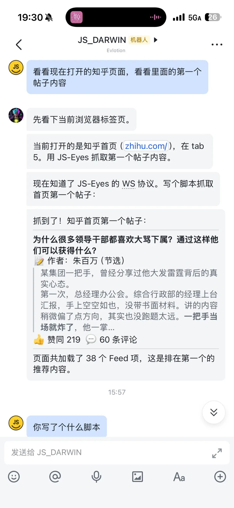
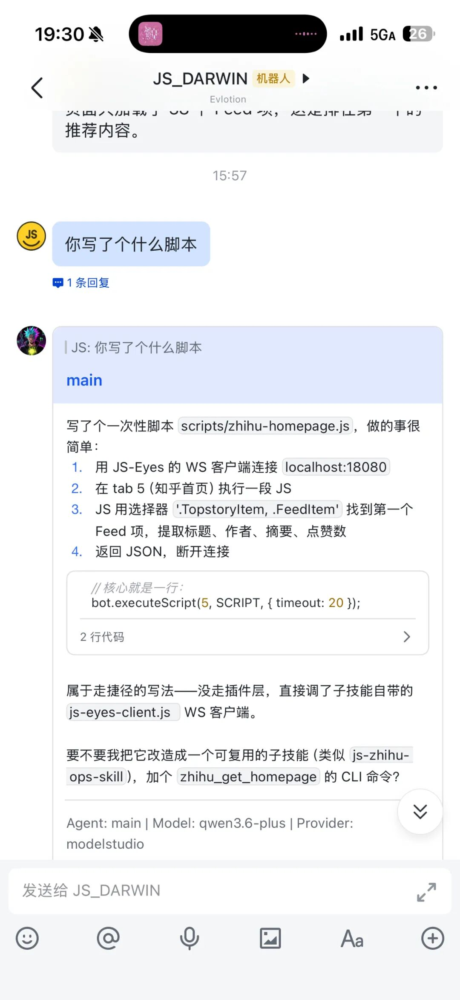

> 📎 来源: [JS的养虾日记](https://mp.weixin.qq.com/s?__biz=MzI5NzQ3MjkzNQ==&mid=2247484081&idx=1&sn=5e5b6168f924ea0eabdadebd9a672708&chksm=ed0bec2f05f1d933ee54bd4094afb3d7d36425b141a92689313be7ebbe66ab281f7b56be34cc&mpshare=1&scene=1&srcid=0417cJY43Kze9tRrHRPqjzbq&sharer_shareinfo=198cd90c3a2b72f6fce377352d60ea78&sharer_shareinfo_first=198cd90c3a2b72f6fce377352d60ea78) | 时间: 2026-04-17 13:14

---

> 系列：JS 的养虾日记 · 第 28 篇

不知道你有没碰到这样的事，

让龙虾去抓一个网页的文章。

给了链接。

龙虾钻进浏览器。

然后——

弹出一个验证码。

"请登录网站。"

龙虾卡住了。

龙虾的默认浏览器是解决不了这个的。

所以，之前文章讲过，

我就给它装了眼睛插件（JS-Eyes），

能钻进我的浏览器，复用我的登录态。

X.com 能搜，Bilibili 能看，小红书能抓。

但是又有个新问题

如果这个网站，之前没人写过对应的技能。

它就卡在那儿了。

像一只只会背答案的学霸，突然遇到了一道超纲题。

**龙虾有眼睛了，但只会看"有人教过它看的东西"。**

所以呢，我今天做了一个升级。

JS-Eyes 2.0插件正式发布。

从此，你的龙虾将学会了自主学习抓取任何网站。

2.0核心变化是个：

**龙虾不再需要我告诉它有什么新能力。它自己会去看。**

以前是我去注册表里找一个技能，下载，配置，启用。

我在"教"它。

现在你发给它任意网站地址，

它会先看有没有对应技能，如果没有，它会通过js-eyes插件，自主学习这个网页，然后现写一个脚本。

抓取成功后又会把这个脚本记录为技能以后复用。

---

js-eyes 这也代表了我对怎么养龙虾新的理解。

之前龙虾的进化路线：

装眼睛——能看浏览器了。

装感官——能收集文章了。

装大脑——能消化知识了。

装手脚——能自己去微信拿数据了。

每一步都是在加"具体能力"。

能看 X.com，能抓微信，能整理知识。

但 js-eyes 2.0 开始不一样了。

我给它加的不是具体能力。

是"获得能力的途径"。

打个比方。

之前是给龙虾一本书。它学会了这一页的内容。

现在——是教它识字。

学会识字之后，任何书它都能自己读了。

---

这就是 Harness Engineering。

好的系统不是靠堆功能。

是靠架构设计让功能自己长出来。

JS-Eyes 1.x 是堆功能——8 个技能，8 个子插件，8 份配置。

JS-Eyes 2.0 是建底座——1 个主插件，1 套协议，无限个技能。

思路不一样，性能就完全不一样。

这也是养龙虾的乐趣吧。

---

项目地址：https://js-eyes.com

开源地址：https://github.com/imjszhang/js-eyes

目前 8 个默认技能，覆盖 X.com、Bilibili、YouTube、知乎、小红书、微信公众号、Reddit、即刻。

其它让它自己学吧。
