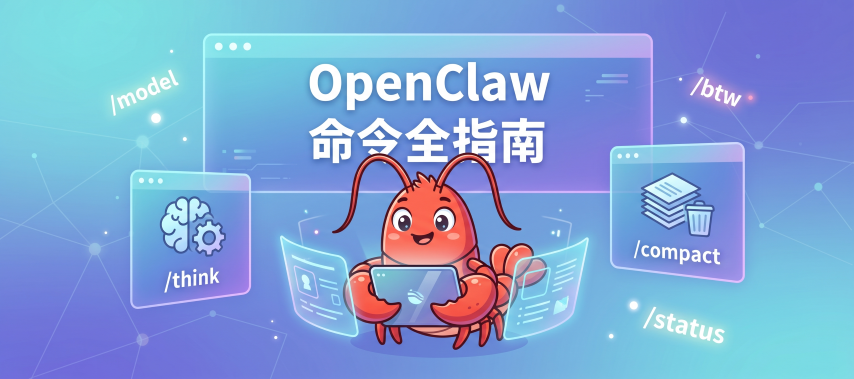

> 📎 来源: [i龙虾](https://mp.weixin.qq.com/s?__biz=MzI3MTk5OTc3Ng==&mid=2247484468&idx=1&sn=04154088b968c903da9a98130183092e&chksm=eace46dc844d501cb90d9e9a09f4ae5abe064c6ce674e2cce52f7de443eced4f39d53d394df3&mpshare=1&scene=1&srcid=0426QW3aPdgSkF6d0C9R40nT&sharer_shareinfo=c63dd7f86cba327b2d53fe4800672464&sharer_shareinfo_first=c63dd7f86cba327b2d53fe4800672464) | 时间: 2026-04-26 19:19

---



之前写过一篇[掌握这些命令是用好Hermes Agent的关键](https://mp.weixin.qq.com/s?__biz=MzI3MTk5OTc3Ng==&mid=2247484210&idx=1&sn=de0d11512aed80967cfb336036ec8305&scene=21#wechat_redirect)，当时OpenClaw聊天内可以使用的命令还很少，也就一直没有写。昨天突然发现OpenClaw现在也增加了很多聊天内可以使用的命令，有些命令真的改变了我的使用习惯，有些则是调试救命用的。整理出来分享给大家。

## 先说几个每天都在用的

### `/new` 和 `/reset`

`/new` 开一个新会话，`/reset` 是它的别名。如果你想换模型，直接 `/new gpt-4o` 或者 `/new claude-opus` 都行，支持模糊匹配。

有个细节：`/reset soft [消息]` 是**不清空对话记录的重置**。它只是丢弃后台的会话 ID，重新加载启动配置和系统提示词。

什么时候用？配置改了但对话不想重开，用这个。

### `/think` ——这个真的被低估了

```
/think off | minimal | low | medium | high
```

别名是 `/thinking` 或者 `/t`。

这个命令控制模型的**推理深度**。不同模型支持的档位不一样，常见的是 `off`、`low`、`medium`、`high`，有些模型还支持 `xhigh`、`adaptive`、`max`。

**使用场景：**

• 写代码调 bug，上 `high`，让它多想一想

• 闲聊或者翻译这种简单任务，`off` 或者 `minimal`，省钱省时间

• 长文分析，`medium` 够用，`high` 可能会啰嗦

我现在的习惯是：对话开始默认低档，遇到复杂任务临时 `/think high`，完了再调回来。

### `/compact` ——长对话的救星

```
/compact [指令]
```

对话太长、上下文快撑不住的时候用。它会把当前会话的上下文压缩一遍，同时可以附带指令告诉它压缩时重点保留什么。

比如：`/compact 重点保留代码部分，其余简化`

**什么信号说明该 compact 了？** 模型开始忘事、重复前面说过的东西、或者 `/status` 里看到上下文占用很高。

### `/model` 和 `/models`

```
/model [名字 | 编号 | status]
```

```
/models [provider] [页码] [limit=n | all]
```

`/model` 查看或切换当前模型。

`/models` 列出所有可用模型，可以按 provider 筛选。

切换模型有个行为值得注意：如果当前没有在跑任务，立刻生效；如果正在执行，会标记为"待切换"，等当前任务完成或者下一轮对话才切过去。

---

## 几个冷门但好用的

### `/btw` ——问个题外话，不污染上下文

```
/btw <问题
```

这个我第一次看到的时候觉得有点奇怪，用了之后真香。

它的作用是**提一个旁路问题，答完之后不会影响后续会话上下文**。

**使用场景：**

正在跟 AI 讨论一个复杂方案，突然想问一个完全不相关的小问题，但又不想打断整个对话的节奏？用 `/btw`。

比如：`/btw Python 里怎么获取当前时间戳`

它答完，这句问答不会进入后续的对话记忆，下一轮对话继续原来的主题，干净。

### `/status` ——运行状态一目了然

```
/status
```

查看当前会话的执行状态、模型信息、provider 用量和配额。

我一般用它来确认：现在用的是哪个模型、剩余配额还有多少。比翻设置页快多了。

### `/tools` ——看当前 agent 能用什么工具

```
/tools [compact | verbose]
```

列出当前 agent 实际可用的工具列表。`compact` 精简显示，`verbose` 详细显示。

这个命令容易被忽视，但排查问题时很有用。有时候 agent 表现怪，是因为你以为它能用某个工具，但实际上那个工具在当前会话里根本没挂载。先 `/tools` 确认一下，省得绕弯子。

### `/usage` ——Token 用量和费用统计

```
/usage off | tokens | full | cost
```

• `off`：关掉每次回复底部的用量显示

• `tokens`：只显示 token 数

• `full`：显示完整用量信息

• `cost`：从本地 OpenClaw 日志里算出费用汇总

用量显示默认是开着的，如果觉得每条消息下面那行数字碍眼，`/usage off` 关掉。想知道这个月花了多少，`/usage cost` 出个汇总。

### `/context` ——搞清楚 AI 到底在读什么

```
/context [list | detail | json]
```

很多人不知道自己的上下文到底是怎么组装的，用 `list` 能看到上下文来源列表，`detail` 更详细，`json` 给你原始数据。

排查模型表现异常的时候，先 `/context detail` 看一眼，有时候问题就在这里。如果想知道token为啥消耗这么快，也可以用这个命令看看。

---

## 执行和权限相关

### `/exec` ——控制代码执行行为

```
/exec host= security= ask= node=
```

参数比较多，拆开说：

• `host`：执行在哪里跑。`sandbox` 是沙箱环境，`gateway` 走网关，`node` 指定特定节点，`auto` 自动选

• `security`：安全策略。`deny` 完全拒绝执行，`allowlist` 只跑白名单里的，`full` 全放开

• `ask`：什么时候弹确认。`off` 不问，`on-miss` 遇到白名单之外的才问，`always` 每次都问

**我的常用配置：**

```
/exec security=allowlist ask=on-miss
```

白名单内的命令直接跑，遇到没见过的就弹一下确认。既不烦人，也不会莫名其妙执行危险命令。

### `/elevated` ——提权模式

```
/elevated [on | off | ask | full]
```

别名 `/elev`。

控制是否启用提权执行。`ask` 是每次都确认，比较安全。不明白这个能做什么的话，建议先别动，默认就好。

### `/approve` ——手动通过执行审批

```
/approve
```

当 `/exec ask=always` 或者 `on-miss` 触发了审批弹窗，用这个命令手动批准或拒绝，`id` 就是弹窗里给的那个审批编号。

---

## 会话绑定和线程管理

### `/session` ——管理会话超时

```
/session idle <时长 | off
```

```
/session max-age <时长 | off
```

这两个参数控制线程绑定的过期行为：

• `idle`：多久没有活动就自动断开绑定，比如 `/session idle 30m`

• `max-age`：不管有没有活动，绑定最多存活多久，比如 `/session max-age 2h`

• 传 `off` 是关掉对应的过期限制

如果你在 Discord 或 Telegram 里把会话绑定到了某个线程，这两个参数决定绑定什么时候自动失效。长期挂着不用的绑定会占资源，设个合理的 idle 超时是好习惯。

### `/focus` 和 `/unfocus` ——线程绑定

```
/focus <目标
```

```
/unfocus
```

把当前 Discord 线程或 Telegram 话题绑定到一个特定的会话目标。绑定之后，这个线程里的消息都会路由到绑定的 session，而不是开新的。

`/unfocus` 解除绑定。

需要在配置里启用 `session.threadBindings.enabled`。

### `/agents` ——查线程绑定的 agent

```
/agents
```

列出当前会话里所有已绑定线程的 agent。和 `/subagents list` 不一样，这个专门看线程绑定维度的 agent 列表。

---

## 子智能体和任务管理

### `/subagents` ——管理子 agent

```
/subagents list | kill | log | info | send | steer | spawn
```

如果你在跑多智能体任务，这个命令是中控台。

• `list`：看看当前有哪些子 agent 在跑

• `kill`：干掉某个跑偏的

• `steer`：给某个子 agent 发一条引导消息，调整方向

• `log`：看它的日志

• `spawn`：手动起一个新子 agent

**场景举例：** 让 AI 同时处理多个文件，某一路卡住了，`/subagents log ` 看看怎么回事，要不行就 `kill` 重来。

### `/kill` 和 `/steer`

```
/kill
```

```
/steer  <消息
```

`/kill` 中止子 agent，`/steer` 发引导消息。`/steer` 的别名是 `/tell`。

### `/tasks` ——查后台任务

```
/tasks
```

列出当前会话的所有活跃和近期后台任务。跑了异步任务不确定有没有完成，先看这个。

---

## ACP 会话管理

### `/acp` ——ACP 智能体协作协议

```
/acp spawn | cancel | steer | close | sessions | status | set-mode | set | cwd | permissions | timeout | model | reset-options | doctor | install | help
```

ACP（Agent Collaboration Protocol）是 OpenClaw 的多 agent 协作框架，这个命令是它的主入口。子命令比较多，常用的几个：

• `spawn`：起一个新的 ACP 会话

• `sessions`：列出所有 ACP 会话

• `status`：查某个 ACP 会话的状态

• `steer`：给运行中的 ACP 会话发引导消息

• `cancel` / `close`：取消或关闭会话

• `model`：给 ACP 会话指定用哪个模型

• `permissions`：查看或修改 ACP 的权限设置

• `doctor`：自检，排查 ACP 配置问题

• `install`：安装 ACP 相关依赖

如果你还没用过 ACP，可以先从 `help` 子命令开始，或者看官方文档的 ACP Agents 页面。

### `/queue` ——控制消息队列行为

```
/queue <模式
```

可选模式：`steer`、`interrupt`、`followup`、`collect`、`steer-backlog`，还可以带选项比如 `debounce:2s cap:25 drop:summarize`。

这个一般用不到，但如果你在用 OpenClaw 跑自动化流水线或者批量任务，队列配置就很重要了。

`debounce:2s` 意思是 2 秒内的连续输入合并成一条，`cap:25` 是队列上限 25 条，`drop:summarize` 是超出上限时把多余消息摘要后丢弃。

## 技能和插件

### `/skill` ——直接运行技能

```
/skill <名字> [输入]
```

当技能没有被注册为独立斜杠命令，或者你记不住对应的命令名，用 `/skill` 直接按名字调。

### `/plugins` ——插件管理

```
/plugins list | inspect | show | get | install | enable | disable
```

别名 `/plugin`。写操作是 owner-only 的。

安装插件：`/plugins install <包名或路径>`，支持本地路径、npm 包、或者 `clawhub:<包名>` 格式。

### `/bash` ——直接跑 shell 命令

```
/bash <命令
```

别名 `! <命令>`，效果一样。

需要在配置里开启 `commands.bash: true`，并且配置好 `tools.elevated` 白名单才能用。

开了之后，可以在聊天里直接执行宿主机的 shell 命令：

```
/bash ls -la ~/projects
```

```
! cat /etc/hosts
```

如果是耗时比较长的命令，它会在后台跑。这时候用 `!poll` 和 `!stop` 管理：

```
!poll [sessionId] # 查进度
```

```
!stop [sessionId] # 停掉它
```

**注意：** 这个功能权限很高，建议只在自部署环境、且你清楚自己在做什么的情况下开启。

### `/allowlist` ——白名单管理

```
/allowlist [list | add | remove] ...
```

管理执行白名单。需要开启 `commands.config=true`。

---

## 配置管理（owner-only）

这几个是管理员专属命令，普通用户用不到，但如果你是自部署的话要知道有这些。

### `/tts` ——语音合成控制

```
/tts on | off | status | chat | latest | provider | limit | summary | audio | help
```

控制文字转语音功能。常用子命令：

• `on` / `off`：开关 TTS

• `status`：查当前 TTS 配置

• `provider`：切换 TTS 服务商

• `limit`：设置单次合成的字数上限

• `summary`：查用量统计

• `audio`：直接输出最近一条音频

TTS 的完整说明在官方文档的 /tools/tts 页面。

### `/restart` ——重启 OpenClaw

```
/restart
```

默认是启用的。如果你在 `openclaw.json` 里设了 `commands.restart: false` 就会禁用这个命令。

升级插件、改完配置需要重载的场景下用，省得跑去服务器手动重启进程。

### `/activation` ——群组激活模式

```
/activation mention | always
```

控制 OpenClaw 在群聊里响应消息的触发条件：

• `mention`：只有 @提到机器人才响应（默认，省资源）

• `always`：群里所有消息都响应（慎用，容易刷屏）

### `/send` ——发送策略（owner-only）

```
/send on | off | inherit
```

控制 OpenClaw 是否发出消息。`inherit` 继承上级配置。一般用于调试或者临时静默某个 channel。

### `/crestodian` ——配置修复助手

```
/crestodian <请求
```

从 owner DM 里运行 Crestodian 设置和修复工具。出现配置问题、启动异常的时候，这是第一个该试的。

在本地 TUI 模式下，`/crestodian` 会从普通 agent 界面切回 Crestodian 界面，但这和远程的 channel 救援模式是分开的，不会授予远程配置权限。

### `/config` ——读写 openclaw.json

```
/config show | get | set | unset
```

直接在聊天里改配置文件，不用 SSH 进去改 JSON。

---

### `/mcp` ——MCP 服务器配置

```
/mcp show | get | set | unset
```

管理 OpenClaw 的 MCP 服务器配置，对应 `mcp.servers` 下的项目。

### `/debug` ——运行时配置覆盖

```
/debug show | set | unset | reset
```

临时覆盖配置，不会写入文件，重启就还原。调试的时候改一些参数试试效果，比直接改配置文件安全。

---

## 导出和记录

### `/export-session` ——导出对话为 HTML

```
/export-session [路径]
```

别名 `/export`。把当前对话导出成 HTML 文件，可以存档、分享。

### `/export-trajectory` ——导出轨迹数据

```
/export-trajectory [路径]
```

别名 `/trajectory`。导出 JSONL 格式的轨迹包，里面有完整的工具调用记录和执行过程。

做复盘、分析 agent 行为的时候很有用。

---

## 调试用的（平时不用开）

### `/verbose` 和 `/trace`

```
/verbose on | off | full
```

```
/trace on | off
```

`/verbose` 开启详细输出，`full` 更详细。`/trace` 只显示插件的调试日志。

**重要提醒：** 这两个在群聊或者多人 channel 里开要小心，会把内部推理过程和工具输出暴露给所有人。正常使用时保持 `off`。

### `/reasoning` ——控制推理可见性

```
/reasoning [on | off | stream]
```

别名 `/reason`。控制是否显示模型的推理过程。`stream` 是边生成边显示。

调试复杂任务时可以开，平时关掉。

---

## 快捷方式说明

有几个命令支持**内联使用**——也就是嵌在正常消息里，会被识别并处理，剩余文字继续正常流程：

• `/help`

• `/commands`

• `/status`

• `/whoami`（别名 `/id`）

比如发一条 `顺便 /status 一下，然后帮我写个 Python 脚本`，它会先执行状态查询，然后继续处理后面的请求。

---

## 命令格式备注

命令和参数之间可以加冒号也可以不加，都行：

```
/think high
```

```
/think: high
```

效果一样，看个人习惯。

---

## 设置和调试命令详解

`/debug`、`/trace`、`/config`、`/mcp`、`/plugins` 这几个命令在日常使用里不常见，但涉及配置管理和调试的场景时很关键。这里单独说说。

### `/debug` ——运行时临时覆盖配置

**需要先在配置里开启：**`commands.debug: true`（默认关闭） **权限：** owner-only

`/debug` 的核心特点是**只改内存，不动磁盘**。重启之后一切归零，配置文件原封不动。

```
# 查看当前所有临时覆盖项
```

**什么时候用？**

想试一个配置改动但不确定效果，不想直接改 `openclaw.json` 的时候。改完测一下，不满意直接 `/debug reset` 还原，零风险。

或者临时需要改一个参数但不想重启——比如快速调一下某个 channel 的白名单，改完验证，没问题再写到磁盘配置里。

**注意：** 覆盖项对之后的配置读取立刻生效，但已经在运行的任务读过的配置不会回溯更新。

---

### `/trace` ——插件调试日志开关

`/trace` 是一个**范围比 `/verbose` 窄得多**的调试开关，只显示插件自己输出的 trace/debug 行，其他的工具输出、状态信息不受影响。

```
# 查看当前 trace 状态（不带参数）
```

开启之后，插件的诊断信息会出现在 `/status` 里，或者作为一条跟在正常回复后面的附加诊断消息。

**和 `/verbose` 的区别：**

• `/verbose` 是全量开关，工具调用、状态输出、内部推理，全都会显示

• `/trace` 只管插件自己打的 debug 行，干净得多

**场景：** 某个插件行为异常，但不想被 `/verbose` 的大量输出淹没，就开 `/trace` 单独看插件的诊断信息。

和 `/debug` 也是两回事——`/trace` 管日志可见性，`/debug` 管配置覆盖，互不干扰。

---

### `/config` ——写入磁盘配置

**需要先在配置里开启：**`commands.config: true`（默认关闭） **权限：** owner-only

和 `/debug` 相反，`/config` 的改动**会写入 `openclaw.json`，重启后继续生效**。

```
# 显示完整配置
```

写入前会做格式校验，填错了直接拒绝，不会写进去一个坏配置。

**推荐工作流：** 用 `/debug set` 先试，没问题再用 `/config set` 固化到磁盘。两个命令的路径语法一致，可以直接复制粘贴。

---

### `/mcp` ——MCP 服务器配置管理

**需要先在配置里开启：**`commands.mcp: true`（默认关闭） **权限：** owner-only

专门用来管理 `mcp.servers` 下的 MCP 服务器定义，存在 OpenClaw 自己的配置里（不是项目级别的配置）。

```
# 列出所有 MCP 服务器配置
```

`set` 的值是 JSON 格式，`command` 是可执行命令，`args` 是参数列表。

**注意：** 实际能不能跑起来，取决于运行时的 transport 适配器支持哪些类型。配置写进去了不代表一定能用，遇到问题先看 `/acp doctor` 做自检。

---

### `/plugins` ——插件查看和启用管理

**需要先在配置里开启：**`commands.plugins: true`（默认关闭） **读操作**公开可用，**写操作**（enable/disable）owner-only 别名：`/plugin`

```
# 默认列出插件列表（同 list）
```

**几个重要区别：**

• `list` 和 `show` 是基于当前工作区和磁盘配置的**实时发现结果**，不是缓存

• `enable` / `disable` 只改配置，**不安装也不卸载**插件本体

• 改完启用状态之后需要**重启 gateway** 才能生效，不是实时热更新

**安装插件**用 `/plugins install `，支持三种来源：本地路径/压缩包、npm 包名、或者 `clawhub:<包名>` 格式。

---

大概就这些。命令挺多，但实际上高频用的就那几个：`/think`、`/compact`、`/model`、`/btw`、`/status`。其他的遇到对应场景再查文档就行，不用死记。

官方完整命令文档：https://docs.openclaw.ai/tools/slash-commands#core-built-in-commands
