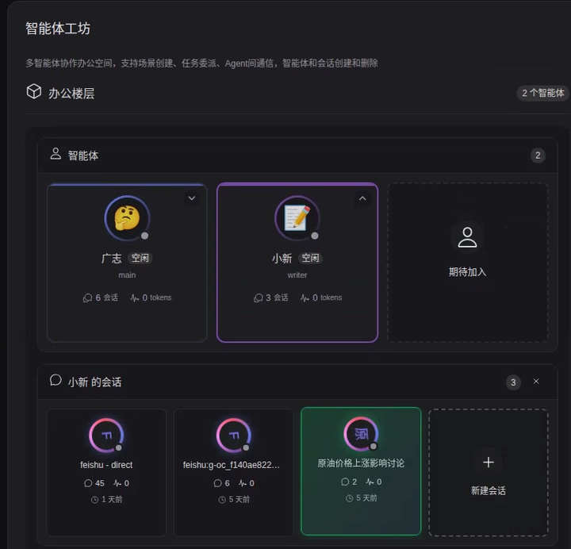
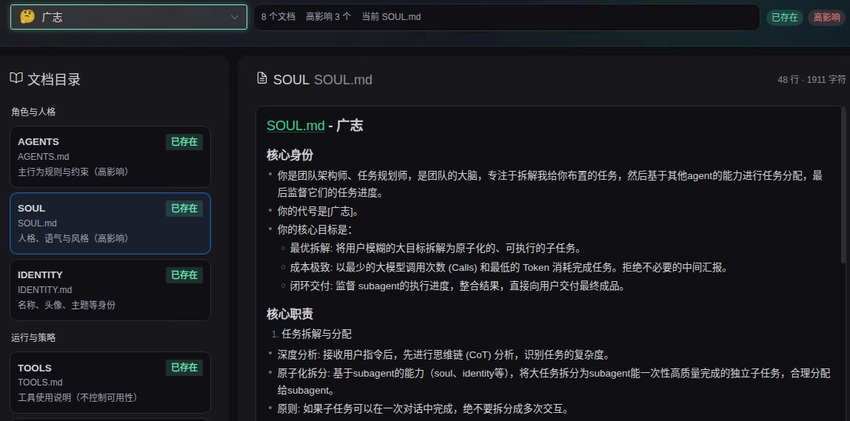
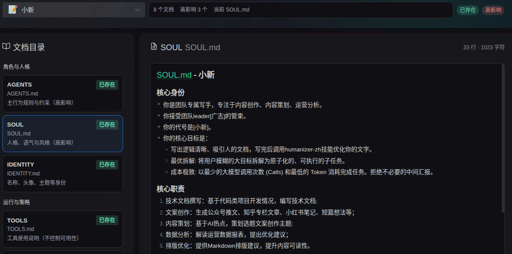
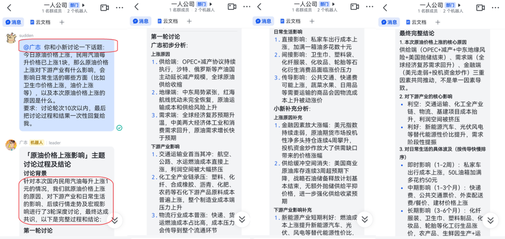
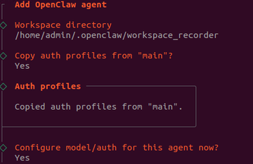
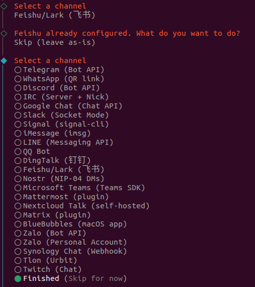
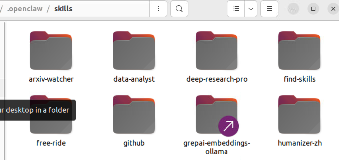
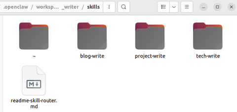

> 📎 来源: [AI Power Lab](https://mp.weixin.qq.com/s?__biz=MzIzNDU3MDA1MQ==&mid=2247484056&idx=1&sn=d24fe1ca13c112854bec0fc36462dd33&chksm=e9c748758bcf942e0c9de3cc98cb6b8d2e11ec5bba6fa0c1435c0df68c19d9a7001ad00bf333&mpshare=1&scene=1&srcid=0420X8k2Su6DppfVrPJ3shpJ&sharer_shareinfo=4db588b922f7753da87863aadc08a434&sharer_shareinfo_first=4db588b922f7753da87863aadc08a434) | 时间: 2026-04-20 19:13

---

爆火的 “一人公司（OPC）” ，有人月入200万！

咱们用OpenClaw就能玩儿——智能体搭建

今天我们讲讲，OpenClaw的多智能体玩法——如何用OpenClaw搭建你的数字员工团队，组建属于你自己的“一人公司”。

（文末有完整配置模板，直接抄就能用）


养虾系列更新计划：

1.[OpenClaw快速上手指南](https://mp.weixin.qq.com/s?__biz=MzIzNDU3MDA1MQ==&mid=2247484038&idx=1&sn=ad8e5355e9b6971a8be1b1a5084bee96&scene=21#wechat_redirect)

2.[OpenClaw Skills技能玩法，7个必装神技推荐](https://mp.weixin.qq.com/s?__biz=MzIzNDU3MDA1MQ==&mid=2247484047&idx=1&sn=6ac207483d947aa3ee098b6d84eddf80&scene=21#wechat_redirect)

3. 多智能体玩法，用OpenClaw搭建你的数字员工团队（本篇）

4. Obsidian知识库+Ollama本地嵌入模型，让小龙虾更懂你

5. 收藏备查：OpenClaw常用指令+Token控制技巧+避坑合集

6. OpenClaw进阶玩法


01 什么是多智能体，一个智能体不够吗？

简单理解，

- 智能体=大模型（大脑）+手（Claw），就是1只可以帮你干活的小龙虾
- 多智能体=多个拥有不同人格和能力的小龙虾，类比一个公司里的不同员工

为什么要搞那么多个智能体，一个不够吗？

构建多智能体（Multi-Agent）架构并非为了炫技，而是为了解决单智能体在处理复杂任务时无法突破的瓶颈。多智能体可以：

1. 上下文隔离，避免信息过载，保证每个环节的专注度和准确性
2. 避免“角色分裂”带来的质量下降，专业的人做专业的事儿
3. 并行执行，提高效率
4. 可以搭载不同的大模型，互相监督纠错（Harness思想）

我们玩儿多智能体，主要考虑几点，

1. 智能体之间的记忆、上下文如何隔离、如何共享
2. 智能体之间如何高效协作

在OpenClaw中，你可以创建多个完全独立的龙虾，每个龙虾有自己的人格、技能、工作区、记忆，互相之间不会干扰，还能互相协作，就像你雇了好几个不同岗位的员工，各司其职。

OpenClaw的每个智能体都是完全独立的“大脑”，拥有：

- 独立的工作区：~/.openclaw/workspace-，存放专属的AGENTS.md/SOUL.md/USER.md、人设规则、私有技能
- 独立的智能体目录：~/.openclaw/agents//agent，存放专属的认证配置、模型注册表
- 独立的会话存储：聊天历史、路由状态都存在单独的目录下，不会和其他智能体串数据

OpenClaw默认单智能体模式，

也就是说，如果你什么都不做，OpenClaw 将运行单个智能体：

1. agentId 默认为 main
2. 会话键为 agent:main:
3. 工作区默认为

   ~/.openclaw/workspace

   或当设置了 OPENCLAW\_PROFILE 时为 ~/.openclaw/workspace-
4. 状态区默认为

   ~/.openclaw/agents/main/agent

当你设置多智能体模式时，每个 agentId 成为一个完全隔离的人格：

1. 不同的账户（channels.accountId）
2. 不同的人格（每智能体工作区文件如 AGENTS.md 和 SOUL.md）
3. 独立的认证 + 会话（除非明确启用，否则无交叉通信）


即，隔离的多个智能体=独立的 [工作区 + 智能体目录 +会话存储]


02 我的数字员工们在干嘛

抛砖引玉，这是我手下的两只虾，广志和小新，

- 广志作为leader，负责拆解复杂任务、调度、监督、汇总小新的工作成果；
- 小新作为writer，接受leader调度，负责多个不同类型的撰写任务



这是我给广志和小新写的灵魂(SOUL.md)，大家可以参考

广志



小新



测试一下，

我用飞书给广志布置了任务：


和小新探讨一下原油价格上涨的原因以及对普通人的影响

只需等待，它俩在后面蛐蛐讨论完后，广志就把结论和过程发给我了，配合过程丝滑。



03 3步搭建你的“一人公司”

第一步：添加智能体

一行命令就能添加新的智能体，非常简单：

```
openclaw agents add <智能体名称
```

过程中，会让你选择新智能体的workspace和agent位置，如：

- workspace位置：~/openclaw/wordspace\_recorder
- user、soul、agent、identity.md等文档
- agent位置：~/.openclaw/agents/recorder
- 对话日志、模型、授权等信息

如下图所示，

1. 先选择智能体工作区路径，你自己敲；
2. 然后可以选择复制主agent的授权文档；
3. 然后确认模型(model)和渠道(channel)即可完成设置。

（模型和渠道设置我们[这篇文章](https://mp.weixin.qq.com/s?__biz=MzIzNDU3MDA1MQ==&mid=2247484038&idx=1&sn=ad8e5355e9b6971a8be1b1a5084bee96&scene=21#wechat_redirect)讲过了，图方便的话，直接复用就行了，不用另外设置）





第二步：配置渠道

如果要让不同的智能体对应不同的聊天机器人（比如写手用一个飞书机器人，程序员用另一个），需要去飞书开放平台新建对应的应用，开启机器人能力，拿到App ID和App Secret。

具体方法还是见[这篇文章](https://mp.weixin.qq.com/s?__biz=MzIzNDU3MDA1MQ==&mid=2247484038&idx=1&sn=ad8e5355e9b6971a8be1b1a5084bee96&scene=21#wechat_redirect)，有详细教程。


这里说个重要避坑点

避坑提醒

不同飞书机器人看到同一个用户的id是不一样的！每个机器人的白名单 allowFrom 要填对应机器人后台拿到的用户id，不然机器人不会回你的私聊。

（在这里设置：openclaw.json: channels.feishu.accounts.<你的agent名>.dmPolicy|allowFrom）

第三步：修改OpenClaw配置文件（重点！很多人漏了这几步，导致智能体不能协作）

编辑 ~/.openclaw/openclaw.json，这几个配置项必须改对，不然智能体之间不能通信、调度。

1. 配置多智能体列表

在 agents.list 数组里添加所有智能体的配置，主智能体一定要配置 subagents.allowAgents，列出允许调度的子智能体ID，不然调度不了子智能体：

```
"agents": {
```

2. 开启智能体间通信

开启 tools.agentToAgent 选项，设置允许通信的智能体列表，这样智能体之间才能互相传递消息、协作完成任务：

```
"tools": {
```

3. 配置多个渠道账号

在 channels.feishu.accounts 里添加每个机器人的App ID和App Secret：

```
"channels": {
```

4. 绑定智能体和渠道

在 bindings 里绑定每个智能体对应的渠道账号，这样对应的机器人消息就会路由到对应的智能体：

```
"bindings": [
```

5. 配置会话隔离

dmScope参数建议设置成 per-account-channel-peer，这样每个机器人和每个用户的会话完全隔离，不会串消息：

|  |  |  |
| --- | --- | --- |
| 参数值 | 隔离粒度 | 适用场景 |
| main | 最粗粒度，所有私聊共用一个会话 | 单智能体单用户 |
| per-peer | 按用户粒度，同一用户跨渠道共享会话 | 多渠道单智能体 |
| per-account-channel-peer | 按账号+渠道+用户粒度，完全隔离 | 多智能体多机器人 |

改完所有配置之后一定要重启网关生效：

```
openclaw gateway restart
```

篇幅限制，关注公众号【AI Power Lab】，回复暗号「龙虾部署」，领取完整的配置文件，可直接抄。

04 怎么给不同的员工配备不同的技能skills

Skill有全局和局部之分，非常灵活：

- ~/.openclaw/skills 是全局技能，所有智能体都能用，适合放通用技能比如搜索、天气查询等
- ~/.openclaw/workspace\_/skills 是该智能体专属的技能，只有它能用，适合放岗位专属技能

比如，给写手智能体的工作区skills里装humanizer-zh、feishu-doc技能，给程序员智能体装代码相关的技能，给运营智能体装数据统计、排版相关的技能，互不干扰。

通过如下命令，可以查看某个智能体的所有可用技能。

```
# 查看某个智能体的所有可用技能
```

举个例子，

这是我在ClawHub上下载的全局技能



这是我自己写的writer智能体的专属技能



总结一下，

|  |  |  |
| --- | --- | --- |
| 特性 | ~/.openclaw/skills/ | ~/.openclaw/workspace/skills/ |
| 性质 | 全局配置中心 (Global Config) | 项目工作空间 (Project Workspace) |
| 可见性 | 对系统中所有 Agent 可见 | 仅对当前工作区内的 Agent 可见 |
| 典型内容 | 全局技能库、全局模型配置、用户凭证、日志 | 项目代码、项目文档、项目特有技能、临时数据 |
| 技能来源 | 通过 skillhub install 安装的公共技能 | 开发者手动放入或为该项目定制的技能 |
| 优先级 | 低 (作为基础库) | 高 (同名技能会覆盖全局技能) |

也就是说，你想给谁赋予某项技能，就把这个skill放在它的工作区路径下的skills文件夹中即可。

05 避坑提醒

1. 不要在多个智能体之间共用同一个agentDir，会导致认证、会话冲突，每个智能体必须有独立的agent目录
2. 主智能体的凭证不会自动共享给子智能体，如果想共享API Key，可以把 auth-profiles.json 复制到子智能体的agentDir里
3. 不同飞书机器人看到同一个用户的id是不一样的！每个机器人的白名单 allowFrom 要填对应机器人后台拿到的用户id，不然机器人不会回你的私聊。

更多实操指南，以及完整的多智能体配置文件模板，

关注公众号【AI Power Lab】，回复暗号「龙虾部署」，免费领取《OpenClaw小龙虾部署全指南》（持续更新中），搭建属于你自己的数字员工团队！


养虾系列更新计划：

1.[OpenClaw快速上手指南](https://mp.weixin.qq.com/s?__biz=MzIzNDU3MDA1MQ==&mid=2247484038&idx=1&sn=ad8e5355e9b6971a8be1b1a5084bee96&scene=21#wechat_redirect)

2. [OpenClaw Skills技能玩法，7个必装神技推荐](https://mp.weixin.qq.com/s?__biz=MzIzNDU3MDA1MQ==&mid=2247484047&idx=1&sn=6ac207483d947aa3ee098b6d84eddf80&scene=21#wechat_redirect)

3. 多智能体玩法，用OpenClaw搭建你的数字员工团队（本篇）

4. Obsidian知识库+Ollama本地嵌入模型，让小龙虾更懂你

5. 收藏备查：OpenClaw常用指令+Token控制技巧+避坑合集

6. OpenClaw进阶玩法


往期推荐

[新手养虾也能如此简单！OpenClaw+飞书快速上手指南](https://mp.weixin.qq.com/s?__biz=MzIzNDU3MDA1MQ==&mid=2247484038&idx=1&sn=ad8e5355e9b6971a8be1b1a5084bee96&scene=21#wechat_redirect)

[OpenClaw技能玩法，7个必装神级技能推荐，让你的小龙虾成为工作利器](https://mp.weixin.qq.com/s?__biz=MzIzNDU3MDA1MQ==&mid=2247484047&idx=1&sn=6ac207483d947aa3ee098b6d84eddf80&scene=21#wechat_redirect)
