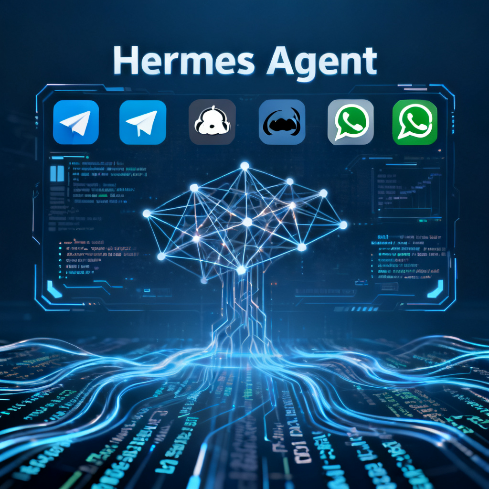

> 📎 来源: [科技爱好者站](https://mp.weixin.qq.com/s?__biz=MzYyNTUzOTA0NA==&mid=2247484607&idx=1&sn=cdb585bd2043b9d55f4ef637ae2c400b&chksm=f1031b81dafc10a09c34756cb3ac86503dd96e0f66fe1de6aa3effc6b93c49861c36cca04d61&mpshare=1&scene=1&srcid=0410I6UYmbOOU4vuhirqiBg9&sharer_shareinfo=ea9e9d5e6952541f69aa7bd20b496723&sharer_shareinfo_first=ea9e9d5e6952541f69aa7bd20b496723) | 时间: 2026-04-13 16:15

---

前言

最近爆火的Hermes Agent，众多大佬纷纷弃用OpenClaw，难道是最强平替？

## 一、Hermes Agent 是什么？

如果你最近在刷科技社区，一定被这个名字刷屏了。

**Hermes Agent** 是由 **Nous Research**（就是那个做了 Hermes-2、Nomad、Deep Learn 系列模型的实验室）推出的新一代 AI Agent 框架。它的核心理念很清晰——做一个「永远在学习、永远在成长」的 Agent。


简单来说，Hermes Agent 有以下几个核心亮点：

### 1.1 持久记忆 + 自动学习

这是 Hermes 最引以为傲的特性。它会在每次对话后自动提炼知识，形成结构化的记忆。当它遇到类似问题时，会主动调用之前的经验——这意味着它真的会「变老」，越用越聪明。

### 1.2 40+ 内置工具

内置的工具生态相当丰富：网页搜索、代码执行、文件操作、日历管理、Slack/Discord 消息推送……基本上覆盖了日常工作的主流场景。

### 1.3 多平台无缝切换

这是 Hermes 最吸引人的特性之一。同一个对话，你可以在 Telegram 发起，在 Discord 继续，在 WhatsApp 收尾，甚至切到命令行继续。**跨平台连续性**这一点，Hermes 做得相当丝滑。

### 1.4 任意模型支持

通过 OpenRouter、Nous Portal、Kimi/Moonshot、MiniMax、OpenAI，或者你自己的 API Endpoint，Hermes 可以随意切换。只需要一条命令

```
hermes model
```

 就能换模型，不需要改任何代码。

### 1.5 开源 + 社区驱动

代码完全开源在 GitHub，并且兼容 agentskills.io 的技能生态。你可以为它贡献新的 Skill，也可以直接用社区共享的技能包。

---

## 二、OpenClaw 是什么？

说 Hermes Agent 的同时，必须先搞清楚它的对手——OpenClaw。

**OpenClaw** 是一个开源的 AI Agent 框架，定位同样是「 个人 AI 助手」，但它的设计哲学和 Hermes 有着微妙的差异。

OpenClaw 的核心特点包括：

### 2.1 插件式架构

OpenClaw 的一切都是插件。你可以用它管理飞书日历、发送微信、处理邮件、生成图片视频、执行 Python 脚本……不同的功能模块独立维护，按需加载。

### 2.2 内置技能市场（ClawHub）

OpenClaw 配套的 ClawHub 技能市场，提供了大量开箱即用的技能。从股票查询到视频生成，从图片处理到公众号发布，基本上你需要的都能找到，不需要自己造轮子。

### 2.3 国产平台深度集成

这是 OpenClaw 相对 Hermes 的显著优势。它对飞书、微信公众号、微信、Telegram 等国产/常用平台的集成非常深入，拿来就能用，不需要额外配置。

### 2.4 定时任务 + 记忆系统

OpenClaw 支持 Cron 定时任务，配合记忆系统，可以每天自动推送股票行情、晨间简报、天气提醒等。你完全可以把它当成一个「永不休息的数字助理」。

### 2.5 多种模型支持

OpenClaw 同样支持多种模型：MiniMax、Kimi、GLM、Qwen 等国产模型都有原生集成，配置简单，切换方便。

---

## 三、硬核对比：谁更胜一筹？

光看功能介绍不够直观，下面我们从多个维度逐一对比。



### 3.1 功能维度对比

|  |  |  |
| --- | --- | --- |
| 对比维度 | Hermes Agent | OpenClaw |
| 多模型支持 | 200+ OpenRouter | 国内外主流模型全覆盖 |
| 开源 | 开源 | 开源 |
| 多平台 | T/D/Slack/WA/CLI | 电报/WA/飞书/微信/T/Signal等 |
| 记忆系统 | 持久记忆+自动学习 | 记忆文件+梦境系统 |
| 定时任务 | 内置Cron | 内置Cron |
| 图片生成 | 无内置 | 即梦AI/MiniMax/Google |
| 视频生成 | 无内置 | 即梦AI/Runway/Wan |
| 音乐生成 | 无内置 | Lyria/MiniMax |
| 飞书/微信集成 | 需自建 | 完整支持 |
| 安装难度 | 需技术基础 | 开箱即用 |

### 3.2 核心差异分析

#### 差异一：平台定位不同

Hermes Agent 更像是一个「极客向」的产品。它假设你有基本的命令行基础，愿意折腾配置，理解 API Key 和 Endpoint 的概念。OpenClaw 则更偏向「开箱即用」，目标用户是想要立刻用起来、而不是花时间配置的普通用户。

#### 差异二：生态深度 vs 广度

Hermes Agent 的生态优势在于「连接一切」——通过 OpenRouter 可以调用市面上几乎所有模型。OpenClaw 的生态优势在于「深度集成」——飞书、公众号这些国产办公场景，做得相当深入。

#### 差异三：记忆机制

Hermes Agent 的记忆系统更主动。它会主动分析对话内容，提取知识点，并定期「复盘」——这个机制像给自己建立了一个私人知识库。OpenClaw 的记忆更偏向「文件系统」模式，日常对话记录到 MEMORY.md，需要精确回溯时更友好。

#### 差异四：媒体能力

**这是两者差距最明显的地方。**OpenClaw 支持完整的图片生成（ 即梦AI、DALL-E）、视频生成（Runway、即梦AI）、音乐生成（Lyria）能力，你只需要用自然语言描述，OpenClaw 就能调用对应工具生成。Hermes Agent 目前没有内置这些能力。

---

## 四、谁应该选 Hermes Agent？

如果你符合以下任意条件，Hermes Agent 可能是更好的选择：

**4.1 你有技术背景**
Hermes Agent 的安装和配置需要一定的 CLI 经验。如果你不介意读文档、折腾配置，它会更适合你。

**4.2 你需要极致的模型选择**
通过 OpenRouter，Hermes 可以访问 200+ 模型，包括最新的 GPT-5.4、Claude 4.6、Gemini 3.1 等。

**4.3** **你想参与社区共建**

agentskills.io 生态虽然还年轻，但增长迅速，有兴趣贡献 Skill 的开发者值得关注。

---

## 五、谁应该选 OpenClaw？

如果你是以下类型的用户，OpenClaw 几乎可以闭眼入：

**5.1 你需要国产办公集成**
每天用飞书办公、需要管理微信公众号、常用微信沟通，OpenClaw 对这些场景的支持几乎是无缝的，配置简单，对接成熟。

**5.2 你需要多媒体能力**
需要 AI 帮你生成图片、视频、音乐，OpenClaw 的内置工具链可以让你省去大量对接工作。

**5.3 你是 AI 新手**
OpenClaw 的安装和使用对新手更友好，有详细文档和技能市场可以一键安装。

**5.4 你需要一个数字助理**
定时推送股票行情、晨间简报、天气提醒，OpenClaw 的 Cron + 记忆系统配合得非常好，用自然语言配置即可。

---

## 六、实际体验：我用了3天后发现了什么

为了写这篇文章，我同时部署了 Hermes Agent 和 OpenClaw，花了大约三天时间进行实际对比。以下是我发现的一些有趣的细节：

#### 6.1 日常对话体验

两者在普通问答上的表现差异不大，都很流畅。真正的差异出现在需要「多步操作」的场景。比如我对两者说：「帮我查一下特斯拉的股票，然后把它今天的涨跌和新闻摘要发到我的飞书。」OpenClaw 通过飞书技能一步完成，Hermes Agent 需要自己写 Workflow——对普通用户有一定门槛。

#### 6.2 图片生成对比

**这里 OpenClaw 有压倒性优势。**我让两者各画一张「赛博朋克风格的城市夜景」，OpenClaw 通过即梦AI生成的图片细节丰富，光影层次感强，Hermes Agent 因为没有内置图片生成能力，需要切换到其他工具，流程被打断。

#### 6.3 记忆能力

Hermes Agent 的记忆机制确实让我眼前一亮。我告诉它「我的项目叫 Alpha，用 Next.js 开发」，之后它真的记住了，后续对话中主动引用了这条信息。OpenClaw 的记忆需要你主动触发——需要说「记住 XXX」，更显式，但也更可控。

#### 6.4 多平台切换

Hermes Agent 的跨平台连续性确实做得很好。我在 Telegram 开始一个对话，切到 Discord 继续，上下文完美保留，体验非常流畅。OpenClaw 目前在多平台协同上还有优化空间。

---

## 七、结论：不是替代，是互补

**回到最初的问题：Hermes Agent 能完全替代 OpenClaw 吗？**

**答案是：不能，而且也不应该。**

两者虽然都是 AI Agent 框架，但设计哲学、目标用户、核心能力集都有显著差异。Hermes Agent 更适合技术爱好者、模型多样性需求强的用户；OpenClaw 更适合需要国产办公集成、多媒体能力、快速上手的普通用户。

**更务实的做法：根据你的具体需求选择工具，或者两者结合使用。**

比如，你可以在 OpenClaw 处理飞书、微信、公众号等日常办公场景，同时用 Hermes Agent 做深度研究、多模型探索。两者的定位并不冲突，反而可以形成互补。

---

## 八、行动建议

如果你看完这篇文章还是犹豫不决，这里有一个简单的决策树：

**第一步：你有没有国产办公集成的需求？**
有（飞书/微信）  直接选 OpenClaw
没有  看第二步

**第二步：你有没有图片/视频/音乐生成需求？**
有  直接选 OpenClaw
没有  看第三步

**第三步：你对多模型灵活性和开源是否更看重？**
是  选 Hermes Agent
否  选 OpenClaw

---

写在最后：AI Agent 领域正处于快速迭代期，今天的最优解可能明年就被超越。比起选对一个工具，持续关注这个领域的发展、保持学习能力，才是真正的竞争优势。

希望这篇文章能帮你做出更明智的选择。如果对你有帮助，欢迎转发给有同样困惑的朋友。
