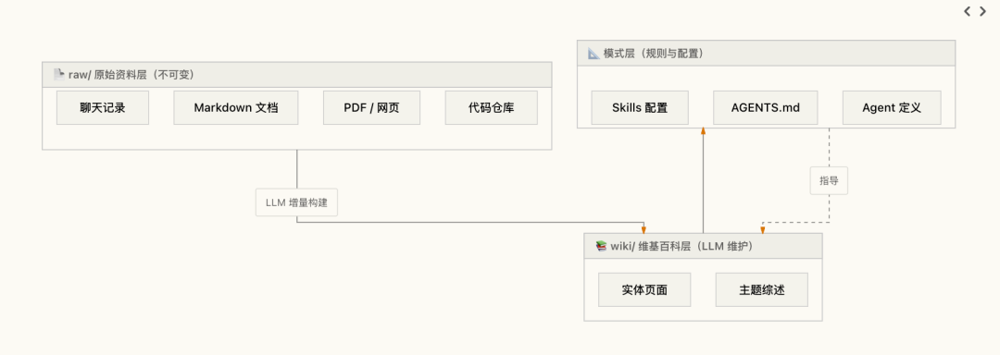

> 📎 来源: [ColinAgent](https://mp.weixin.qq.com/s?__biz=MzYzOTg1NTAxNQ==&mid=2247483695&idx=1&sn=ffde3cf9e4640d23754f4a831e83ccd6&chksm=f18dbaa2418d62cb70b4f6200f78474032f2caaf474372193db3dc1c8ca0f23d109320a45016&mpshare=1&scene=1&srcid=0510qto191X2lQyRxtZH7kL2&sharer_shareinfo=ec74304659c026884d46bcec30da39b9&sharer_shareinfo_first=ec74304659c026884d46bcec30da39b9) | 时间: 2026-05-10 15:52

---

💡 你有没有遇到过这种困境：用了很多 AI 工具——ChatGPT、Claude、Cursor、OpenClaw——但每次产生的知识都散落在聊天记录里，下次想用的时候，**要么找不到，要么得从头再聊一遍**。

最近出现了一个很有意思的项目——OpAgent。它做的事情很直接：把 Andrej Karpathy 的 LLM Wiki 理念和 OpenClaw 式的个人 AI 助手能力，做成了同一个桌面应用。

如果你了解 OpenClaw，可以这样理解 OpAgent：**OpenClaw 是 AI 助手版的「个人服务器」——让 AI 无处不在、随时响应；OpAgent 则是 AI 助手版的「个人操作系统」——不仅无处不在，还把每次协作的产物沉淀成持久的知识资产。**

OpAgent安装后自动部署LLM WIKI,  让你和 AI 的每一次对话、每一份产出，都自动归档到一个**结构化的 Wiki 里**，像滚雪球一样越用越聪明。

这篇文章就来拆解一下这个组合背后的逻辑。

## 🎯 核心理念：两个创新，一个产品

**Karpathy 的 LLM Wiki：让知识「滚雪球」**

2026 年 4 月，Andrej Karpathy 发布了一个 gist：LLM Wiki。

他指出了一个根本问题：当前 LLM + 文档的主流范式（RAG、NotebookLM、ChatGPT 文件上传）都有一个共同缺陷——**每次查询都让 LLM 从零开始重新发现知识。没有积累，没有复利。**

他的方案是：

> **让 LLM 增量式地构建和维护一个持久的 Wiki**——一套结构化、相互链接的 Markdown 文件，横在人和原始资料之间。

这个 Wiki 是复利型知识资产。LLM 处理新资料时不是简单存储，而是将其**整合**进已有知识结构——更新实体页面、修订主题摘要、标记新旧矛盾。知识编译一次，持续保鲜。

Karpathy 把这件事类比为编程：**Obsidian 是 IDE，LLM 是程序员，Wiki 是代码库。**

OpenClaw 是一个运行在自己设备上的个人 AI 助手。

但问题是：这两个东西天然该在一起

**一个是知识大脑，一个是AgentOS。OpAgent 把它们做到了一起。**

## 🏗️ OpAgent 的三层架构

OpAgent 直接落地了 Karpathy 的三层架构，并且把每一层都做成了**你文件系统里的真实目录**：



关键设计：

- **多Agent** —— 可以创建自定义Agent和接入外部Agent
- **人类策展，LLM 维护** —— 人类定义目标和方向，LLM 负责执行和簿记
- **一切皆文件** —— 对话是 

  ```
  .md
  ```

   文件，Agent 定义是文件，Skills 是文件，配置也是文件。能 Git 管理、能 diff、能备份

## 📦 安装指南

### 预构建二进制文件

从 OpAgent 官网 下载对应平台的安装包即可！

## 🚀 快速开始

### 1. 启动 OpAgent → 创建或打开一个目录

打开 OpAgent，你会发现它不像传统 AI 产品那样给你一个聊天框。你直接看到一个**目录结构**——这就是你的知识库工作空间。

```
my-knowledge/├── raw/          # 📄 原始资料（不可变）├── wiki/         # 📚 LLM 生成的维基页面├── research/     # 🔬 研究区├── index.md      # 🧭 导航└── AGENTS.md     # 📐 模式约定
```

### 2. 配置 LLM 模型

支持 OpenAI、Anthropic、本地模型，以及任何兼容的自定义 API。

### 3. 导入源文件 → LLM 自动构建 Wiki

拖拽文档、网页链接或整个文件夹到 

```
raw/
```

 目录。Agent 会自动：

- 🔍 扫描新文档，提取关键实体和概念
- 📝 在 

  ```
  wiki/
  ```

   下生成或更新相关页面
- 🔗 建立双向链接，形成知识图谱
- ✍️ 标记新旧内容的矛盾，生成审查清单

### 4. 在对话中查询知识库

Agent 不是每次从零检索（RAG），而是直接读取你 

```
wiki/
```

 下的结构化页面，**答案来自已编译的知识，速度快、可追溯。**

比如你导入了 k8s 安装文档，然后问它「我想安装 docker 运行时的单机 k8s 环境」——它会从 Wiki 中整合多篇相关页面，给出一份完整方案，**并标注每条信息来自哪篇原始资料。**

### 5. 定期运行 Lint → 维护 Wiki 健康

```
- 内容矛盾（新旧资料说法不一致）- 过时信息- 结构问题
```

发现问题后生成审查清单，等你来确认或修正——这就是「人类策展，LLM 维护」。

## ✨ 核心特性

### 🧠 传统 RAG vs OpAgent

| 特性 | 传统 RAG | OpAgent |
| --- | --- | --- |
| 知识存储 | 每次查询临时检索 | **持久化 Wiki，持续积累** |
| 处理方式 | 检索 → 回答（从头开始） | **增量构建，持续维护** |
| 知识积累 | 无积累，每次重新计算 | **持续积累，越用越智能** |
| 人类参与 | 被动查询 | **人机协作，异步审查** |
| 对话保存 | 隐藏在应用数据库里 | **Markdown 文件，可编辑可复用** |

### 💬 对话就是文件

在 OpAgent 里，每次和 Agent 的对话都**自动保存为 Markdown 文件**。

这意味着：

- 你让 Agent 写的一份方案，不会只停留在聊天记录里——它本身就是一个 

  ```
  .md
  ```

   文件
- 你可以直接打开、改标题、删废话、补充内容、提交到 Git
- Agent 下一轮能继续读你改过的内容，接着往下做
- 一次需求讨论、一轮代码审查、一段排障过程，都可以作为文件留下来

**OpenClaw 让 AI 助手无处不在；OpAgent 让无处不在的每一次对话都变成可积累的知识。**

### 📂 一个窗口，多个工作空间

传统 IDE 一个窗口一个项目。OpAgent 把窗口和工作空间拆开：

- 同一个窗口里可以同时放写作目录、代码目录、资料目录、远程服务器目录
- 每个目录有自己的 Agent、对话、配置
- 移除一个目录不影响其他目录

### 🌐 本地和远程一体化

OpAgent 不把「本地」和「远程」做成两套产品。本地目录、远程服务器目录，在界面里都是工作空间。

连接远程时，OpAgent 通过 SSH 启动远端 runtime，让 Agent 在远程目录里工作。本地客户端只负责界面，文件读写、命令执行、上下文保存都发生在远端。

**和 OpenClaw 的远程沙箱一样，但 OpAgent 更进一步：远程 Agent 直接绑定到远端的目录和工作流。**

### 🔌 多 Agent 协作

OpAgent 把 Agent、Tool、Skill 都抽象为统一的 

```
Node
```

：

- 一个 Agent 可以是独立进程，崩溃后不拖垮主程序
- 一个 Agent 可以用 Go、Python、Node 或其他语言实现
- Agent 之间通过标准协议（

  ```
  agent/call
  ```

  、

  ```
  thread/submit
  ```

   等）互相调用
- 外部 Agent（Claude Code、Codex 等）通过 

  ```
  opagent-protocol
  ```

   SDK 接入

这和 OpenClaw 的多 Agent 路由和插件生态思路一致，但 OpAgent 把它做到了**系统级**——Agent 安装、升级、替换、发现，都像管理文件一样简单。

### 🛡️ 本地优先，完全可控

所有数据存储在本地，支持离线工作。团队协作通过标准 Git 工作流实现——你的 Wiki 目录就是一个 Git 仓库。

## 🤔 为什么要用 OpAgent？

从我个人角度来看：

**如果我自己的文档**，我肯定清楚答案在哪里。但如果是**别人分享的、大量的文档**，检索就非常困难了。此时 OpAgent 就派上用场了——直接学习、对话即可。

更关键的是：

- **OpenClaw 解决「触达」**：AI 助手随时随地响应
- **Karpathy Wiki 解决「积累」**：每次互动都有产出，Wiki 越来越聪明
- **OpAgent 把两者合为一体**：AI 既无处不在，又持续沉淀知识

你在 OpAgent 里跟 Agent 讨论了一小时的技术方案 → 对话自动保存为文件 → Agent 下次能继续读 → Wiki 越长越厚、越用越聪明。

这就是从「AI 聊天工具」到「AI 知识操作系统」的跨越。

## 🔗 参考资源

- **OpAgent 官网**：https://www.opagent.io
- **Karpathy LLM Wiki Gist**：https://gist.github.com/karpathy/442a6bf555914893e9891c11519de94f
- **OpenClaw 项目仓库**：https://github.com/openclaw/openclaw
- **OpAgent 源码**：https://github.com/op-agent/opagent
