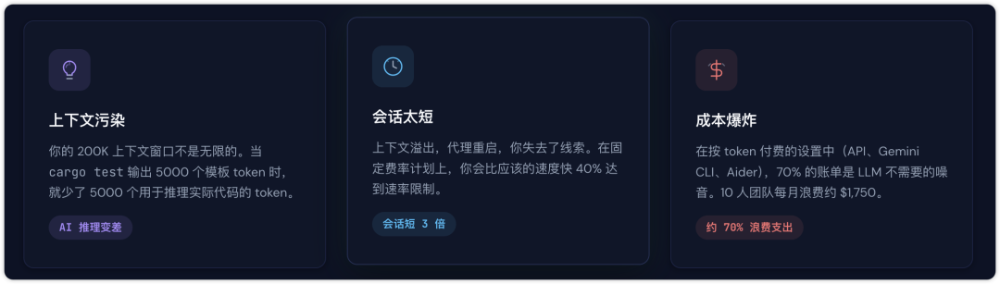
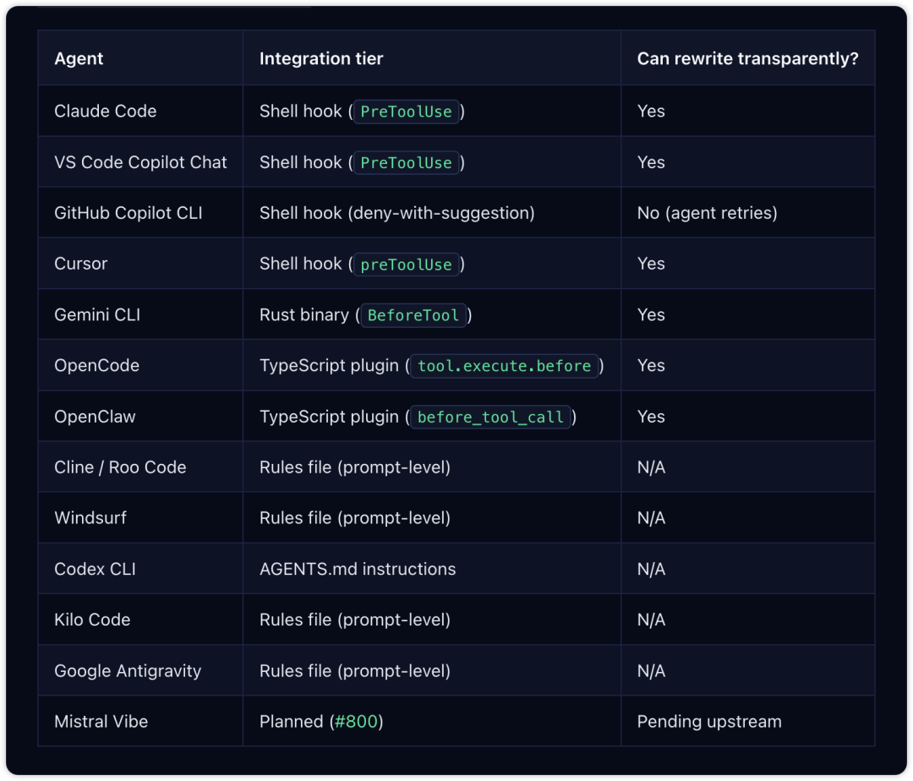
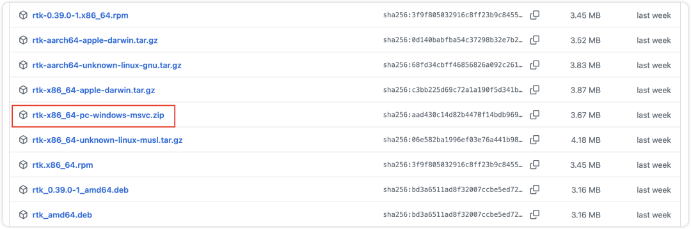
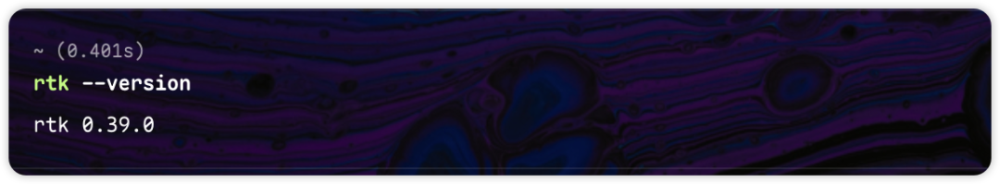
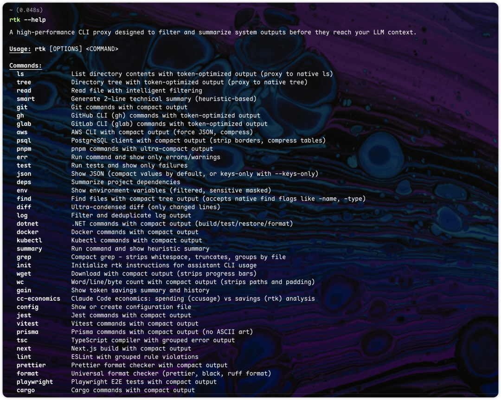
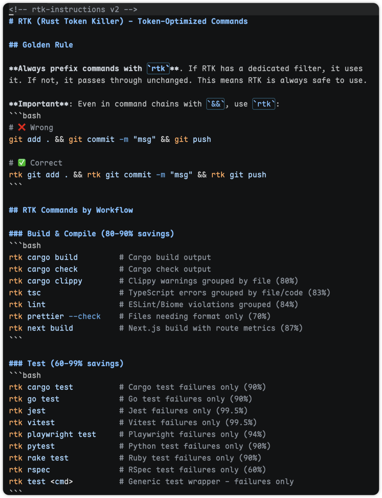
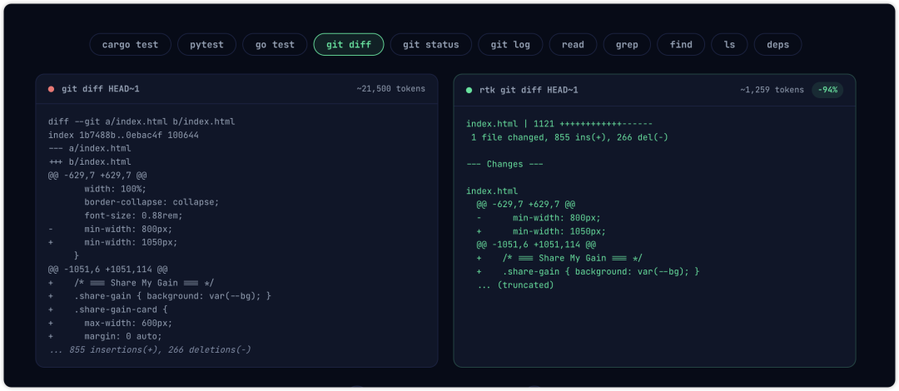
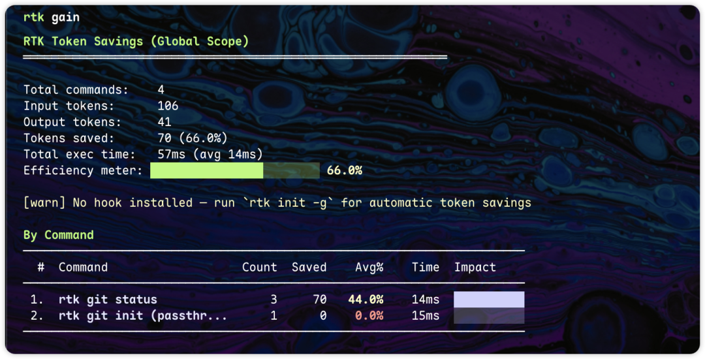

> 📎 来源: [晓来在进化](https://mp.weixin.qq.com/s?__biz=MzkyMjMzMzc1Mg==&mid=2247486154&idx=1&sn=263a519ba0634a9bcb691b32dae80caa&chksm=c0ed164d6eb88660f86450715a79c7120b763604b91d09e54844820a6a238e8ef2481493a364&mpshare=1&scene=1&srcid=0513SXxgkhD5WgezLtbUBIyJ&sharer_shareinfo=6fb59940a355a546cbbd2346fdc8c18c&sharer_shareinfo_first=6fb59940a355a546cbbd2346fdc8c18c) | 时间: 2026-05-13 01:57

---

hi～我是晓来！

用过 Claude Code、Codex 这些 AI Coding 工具的小伙伴都知道，这些家伙干起活来是挺生猛，但是消耗起 Token 来也是如流水……就不带有节制的。

任务稍微再复杂一点，Token 消耗根本就是个无底洞。

这对大部分普通用户来说，这开销……兜不住啊。


不过，等等，还有得救。

这个工具得派上用场了。

#是什么

RTK，一个开源免费的高性能 CLI 代理工具，架在 AI 对话和 Coding Agent 工具之间，在每次命令输出到 AI 大模型的上下文之前，进行过滤和压缩，去掉那些无关紧要的信息，做到节省 Token 的消耗。



经过官方的测试，每次命令消耗的 Token 都能减少 60%～90%，甚至有些可达到减少 92%。


RTK 基本上支持所有主流的 AI Coding Agent，如 Claude Code、Codex、Gemini CLI、OpenCode、OpenClaw 等等。



开源地址：https://github.com/rtk-ai/rtk

#安装

RTK 支持 macOS、Linux 和 Windows 系统。

其中，macOS 和 Linux 支持使用命令快捷安装，Windows 系统需要到 GitHub Releases 那里下载安装包。



macOS 或 Linux 可以通过快速安装命令：

```
curl -fsSL https://raw.githubusercontent.com/rtk-ai/rtk/master/install.sh | sh
```

或者使用 Homebrew 安装：

```
brew install rtk-ai/tap/rtk
```

安装好之后，可以通过命令：

```
rkt --version
```

输入版本信息，代表安装成功。



更多命令用法，可以通过 rkt --help 查看：



#使用

在我们的项目目录中，使用初始化命令：

```
rtk init
```

它会在 CLAUDE.md 文件中生成规则。



然后，我们在使用 Coding Agent 执行命令的时候，比如 git diff，实际上就会执行 rtk git diff 命令，只保留重要的内容。

这样一来，Token 消耗大大减少。



具体降低多少消耗，我们可以通过 rtk gain 命令查看。



RTK 在不改变我们任何操作方式的前提下，将给到 LLM 上下文窗口的内容进行过滤、压缩，只保留重要内容。

以这样的方式，显著降低 AI Coding 的 Token 消耗，非常丝滑。

更多的命令和用法，小伙伴们可以通过官方查看。

RTK 官网：https://www.rtk-ai.app/

好了， 关于 RTK 就先分享到这里。

以上，如果本期内容你觉得不错，可以随手点个赞、在看，也欢迎转发给有需要的朋友，创作不易，感谢喜欢～我是晓来，再会。
