> 📎 来源: [歪斯Wise](https://mp.weixin.qq.com/s?__biz=MzI4MTA0NzkxMA==&mid=2648896698&idx=1&sn=966f92bb4fa66268fc15cb82cc2a7fb3&chksm=f204f3b54151a383bfc549fc4a0e58c180948976028fb5ef4019871c26233cf5869662cdd8ea&mpshare=1&scene=1&srcid=0423RuFHNSrowSQClK50RH7j&sharer_shareinfo=2e047bb27307ad1503e39ccff702e58c&sharer_shareinfo_first=2e047bb27307ad1503e39ccff702e58c) | 时间: 2026-04-23 23:57

---

**⭐️ 关注星标，收看AI实战**

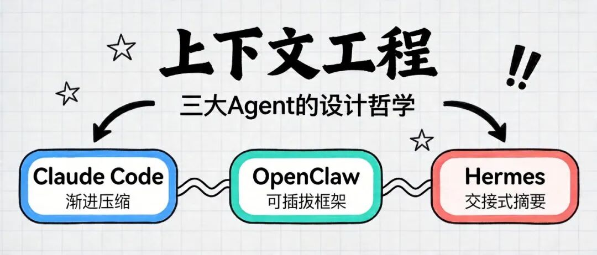

Hermes最近成为了新的热点，除了自我进化机制，更值得注意的是它在上下文管理上做了不少激进设计，比如更早触发压缩、把摘要做成交接文档。

上周写了一篇文章[为什么你的Openclaw龙虾总是智障，ClaudeCode源码泄露揭露：Agent 的差距不在模型，在 Harness Engineering](https://mp.weixin.qq.com/s?__biz=MzI4MTA0NzkxMA==&mid=2648896646&idx=1&sn=911038b1f648dc97d0a821c557a50151&scene=21#wechat_redirect)阐述了Claude Code和Openclaw的Harness机制，能够让AI运行得更加稳定、完善。

在Harness之前，更底层的则是上下文工程，很多时候，模型的幻觉、失忆是因为上下文窗口乱了，如果我们把所有的事情“平权”的放在上下文里，就像大海捞针，模型会很难找到自己想要的东西。

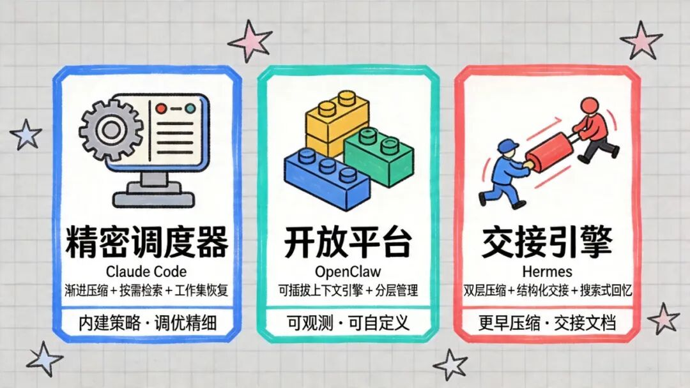

那我们要怎么设计AI产品的上下文呢？

Claude Code 把上下文做成了渐进式调度，OpenClaw 则做成了开放性的生态，而 Hermes 则更强调带交接语义的上下文压缩与回忆。

通过理解这三个Agent的上下文机制，能够给予我们Agent设计的启发。

### 上下文工程是什么？

提示词工程决定了AI怎么运行，而上下文工程决定模型每一轮对话中能看见的内容，它能够帮助我们提升AI对任务的理解、指令的遵循程度、任务的执行表现。

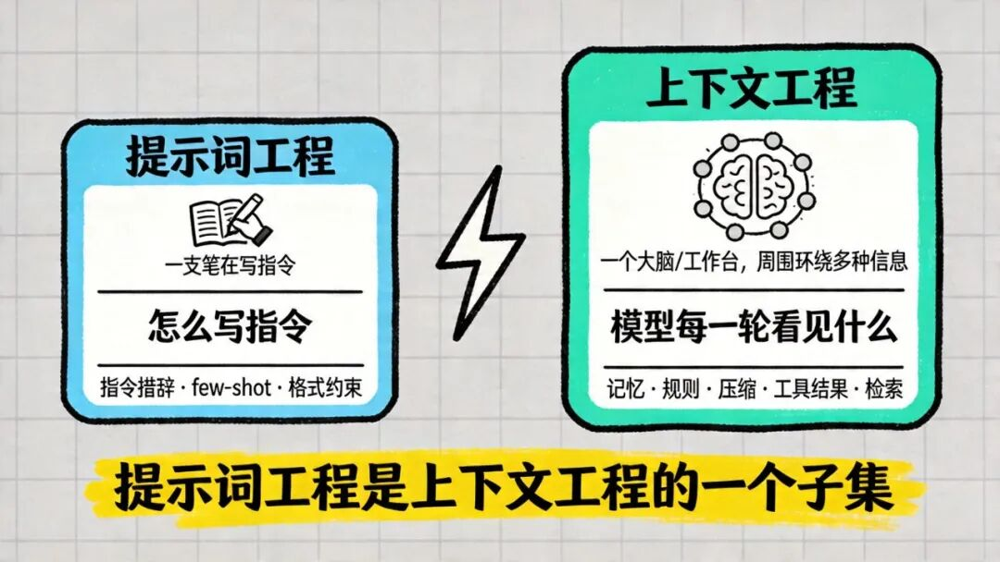

而提示词工程其实是上下文的一部分，模型在真正运作的时候会看见：

```
持久的记忆：Openclew的Soul，模型的记忆Memory
```

所有这些东西，每一轮模型推理时怎么组合、怎么裁剪、什么时候出现、什么时候消失，其实都在上下文工程的范畴。

> **Context** refers to the set of tokens included when sampling from a large-language model (LLM). The **engineering** problem at hand is optimizing the utility of those tokens against the inherent constraints of LLMs in order to consistently achieve a desired outcome. Effectively wrangling LLMs often requires **thinking in context** — in other words: considering the holistic state available to the LLM at any given time and what potential behaviors that state might yield.

> Effective context engineering for AI agents

Anthropic 的官方博客给上下文的定义是：通过持续优化上下文，来保障大模型在固有约束下，**持续地**实现预期效果。

我们需要在不断演变的信息中筛选出有价值的信息将其放入有限的上下文窗口。

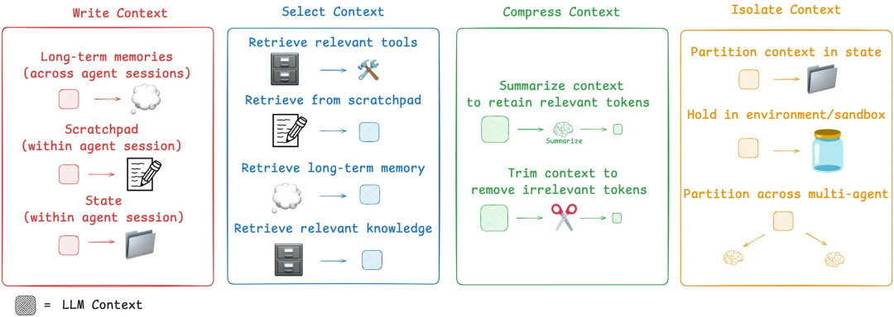

而LangChain 也提供了一个四维框架

- Write，把信息分门别类记录，例如记忆、状态写到窗口外面
- Select，按需选择信息，包括工具、记忆、知识库
- Compress，总结、裁剪上下文，保留高价值的信息
- Isolate，隔离上下文，不同agent使用不同的内容

那上下文到底在解决什么问题呢？

---

- **模型的窗口有上限**
  文件读取、工具输出、推理过程、输出结果会迅速累积，不仅很快会触发上限，也会因为大量的噪音影响到模型的推理。
- **随着上下文变长会变笨**
  随着上下文变长，模型的表现会变差，内容越多注意力就会变差，就像我们也很难从800字里迅速的找到某句话。
- **上下文越长会越贵、速度越慢**
  过多默认注入的内容不仅会抬高 token 成本，也会让模型响应更慢，而且重复发送大段上下文本身就是一笔持续成本。
- **新会话信息丢失**
  在不同的窗口，其实模型是不会主动记住上次发生了什么除非是我们要求它记住。
- **工具噪音**
  日志、文件内容、搜索结果会吞掉真正重要的推理空间。

如果说我们的AI容易失忆、跑偏、又或者一本正经的胡说八道，背后往往是上下文工程做得不好。

### Claude Code：渐进式上下文压缩

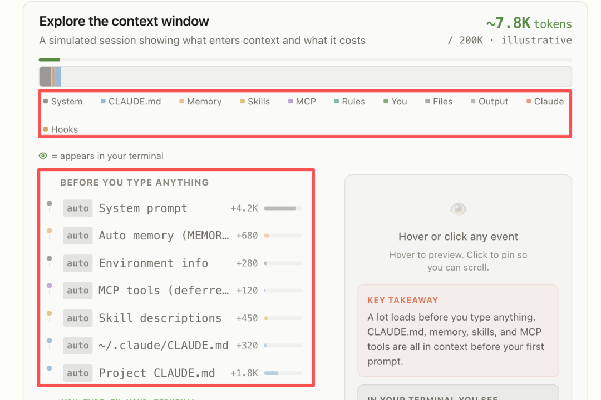

**第一个部分是不怎么变化的内容**：系统提示词、CLAUDE.md以及自动记忆。

系统提示词约束了Claude Agent的表现，它不会出现在我们的对话框里。而CLAUDE.md是指令、规则，它会在启动时自动加载，它为 Agent 提供了长期的行为约束和项目知识。

官方的Explore the context window可以看到整个过程，在你输入任何事情之前，会开始阅读环境数据、可以用的工具、Skills，项目级的CLAUDE.md，这些其实已经提前占用了你的上下文窗口。

如果发现刚开始说几句话就上下文窗口超了，有可能是你的MCP、Skill装太多了。

**另一个部分是输入后的内容**：

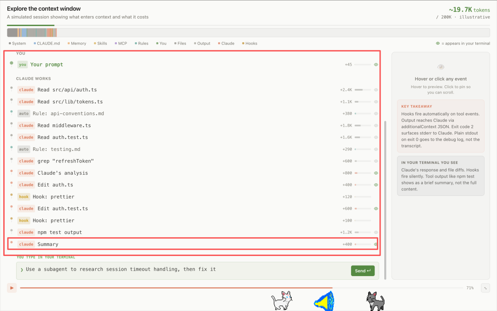

在我们输入指令后，Claude会进行一系列复杂的过程：阅读你的项目文件、思考怎么解决这个问题、开始执行修改代码....直到最后才给我们一个总结。

但这些所有的过程都会占据我们的上下文窗口。

那官方是怎么解决这个问题的呢？

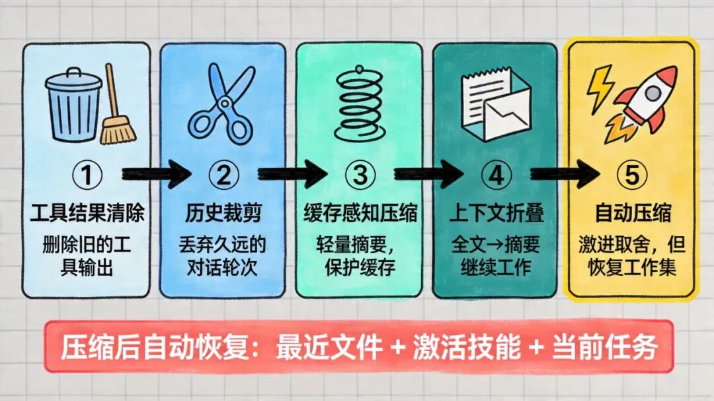

从第三方对泄露代码的逆向分析来看，Claude Code 采用了一套可被概括为 5 层的压缩思路。

按第三方逆向整理，Claude Code 不是一上来就总结全部历史，而是先处理高噪音的工具结果，再做历史裁剪，以及带缓存感知的轻量压缩。

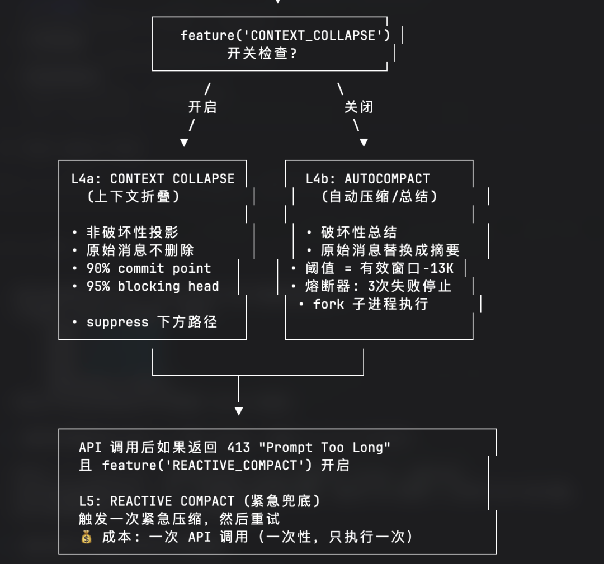

再往后，才会进入更重的上下文折叠或自动压缩。前者更像把全文换成摘要继续工作，后者则意味着对旧上下文做更激进的取舍。

最重要的是，Claude Code在压缩后自动恢复：最近5个读取的文件，激活的skills，它避免了重新读取刚刚编辑得到文件，不用重新激活skills。

这也是Claude Code没有那么容易失忆、动作不容易变形的原因。

### OpenClaw：极度开放的上下文框架

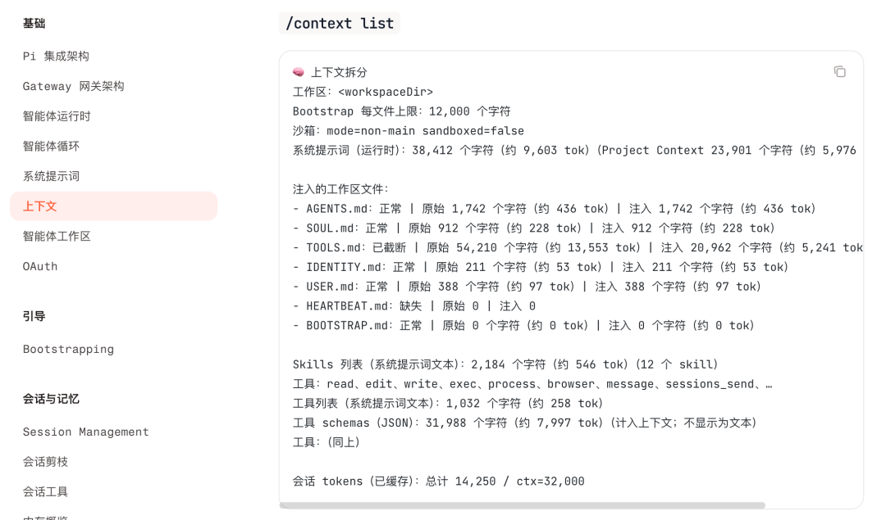

OpenClaw 和Claude Code的初始区别是上下文占用的文件列表相较于Claude Code更多，会包括Soul、Identity、User等等，而这些可能在Claude Code里只是系统提示词、CLAUDE.md还有记忆。

而随着龙虾对我们的理解变深，这些内容也会变长和变多，这也是为什么我们经常性的超限了。。。

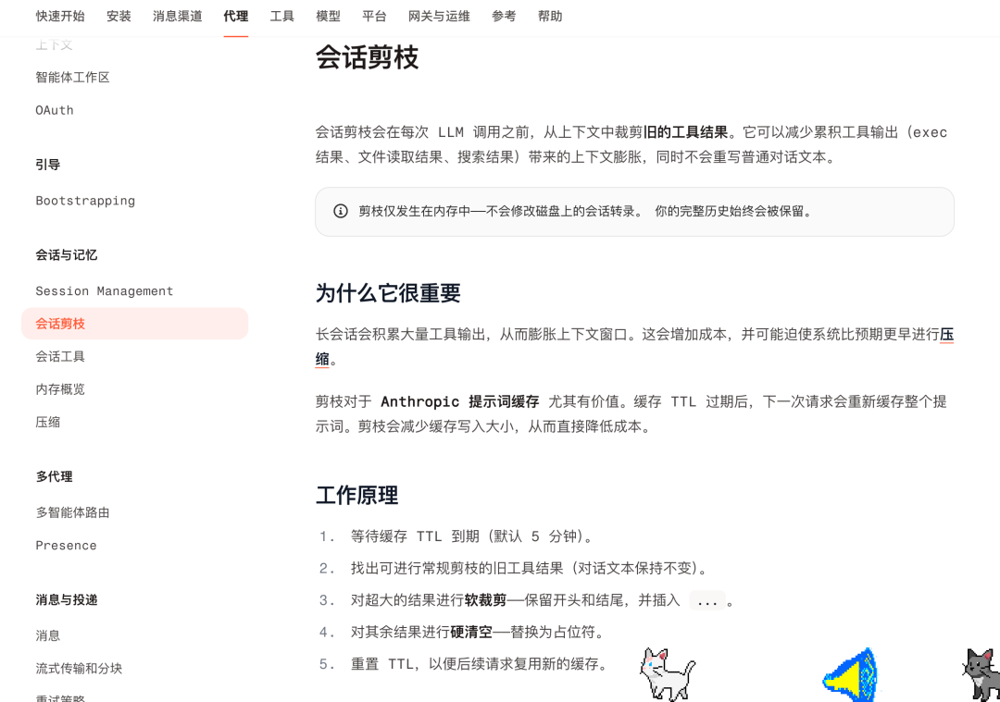

而在裁剪、压缩机制上面是相似的，它也会丢弃旧的工具输出结果。

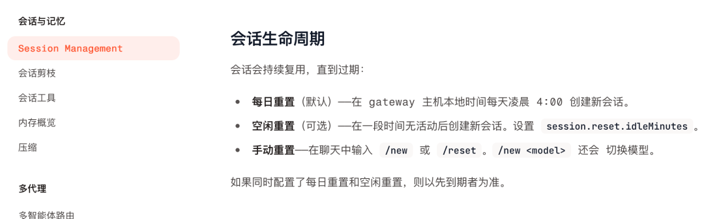

但Openclaw的会话重置没有像 Claude Code 那样更强调工作集恢复。

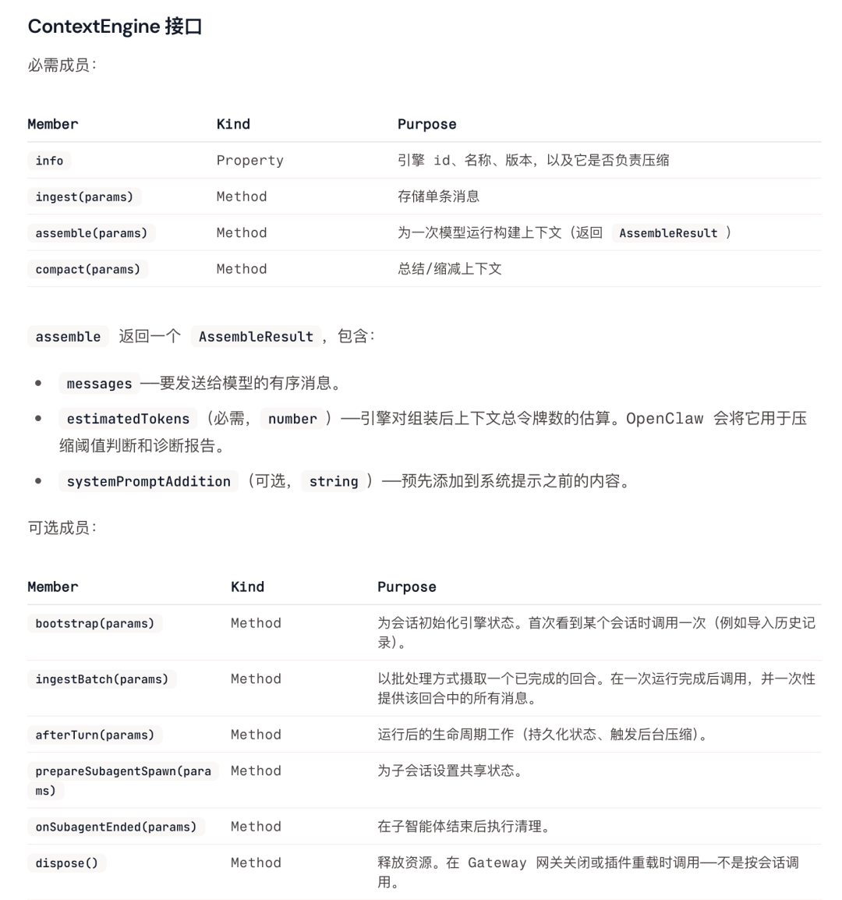

而比较有意思的是Openclaw的context-engine插件。

它是OpenClaw 里的一个可替换组件，负责决定：每次调用模型时，把哪些历史消息塞进上下文窗口，以及窗口满了怎么压缩。默认用的是内置的 legacy 引擎，但你可以写一个插件替换它，实现自己的上下文管理策略。

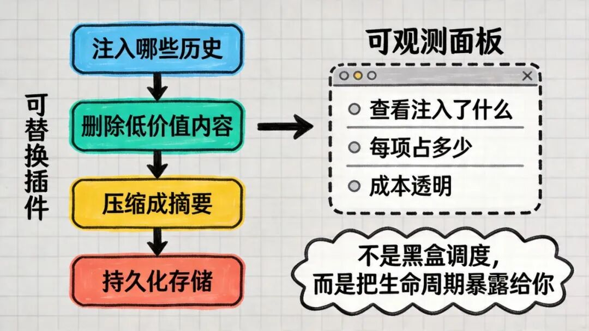

你可以自己选择什么信息要存储、什么时候压缩，以及上下文要按照什么结构梳理，还可以调整需要构建的上下文。

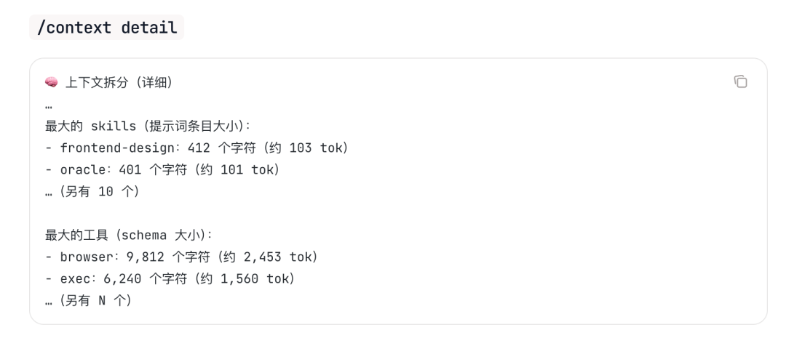

再配合内置的 /context list、/context detail 和 usage 视图，我们就能看到到底注入了什么、每一项大概占了多少成本。

果说 Claude Code 像一套调优精细的内建策略，OpenClaw 更像一个把上下文生命周期开放出来的平台。

但框架的开放性、扩展性不等于开箱即用的可靠性，每个人的风格不同，如果我们没有主动配置和调优上下文策略，Agent 的表现可能不如预期。

### Hermes：把交接当成常态

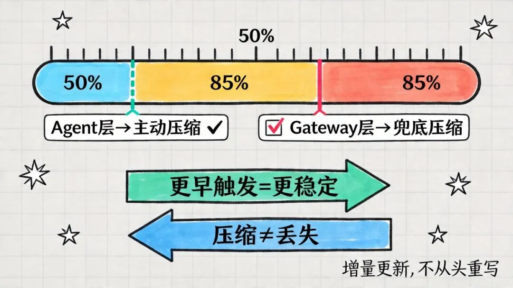

和 OpenClaw、Claude Code 不太一样的是，Hermes 明确采用了双层压缩。

Gateway 层设了 85% 的高阈值，更像是一个兜底机制，在上下文瞬间膨胀过大时介入处理。而 Agent 层则是 50% 的阈值，只要超过 50% 就主动压缩，尽早处理上下文，换取后续步骤的稳定性。

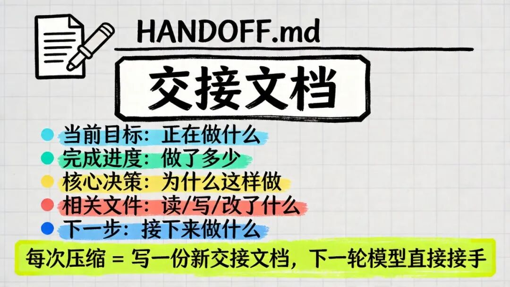

但最重要的地方在于它会生成结构化的摘要，它把压缩的摘要当成了交接文件。

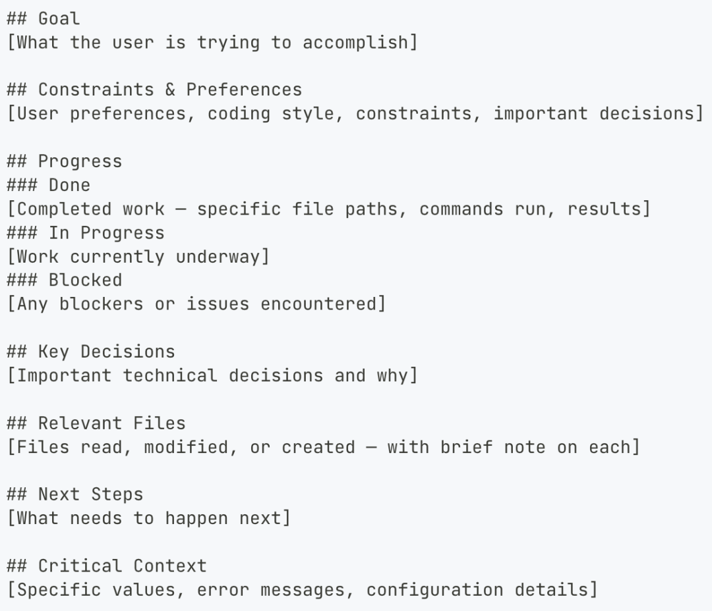

每一次压缩都明确说明了，目标是什么，完成进度怎么样，核心的决策是什么，阅读、修改创建的相关文件，下一步又要做什么

这是 Hermes 设计品味最集中的表现，它不是宽泛的"总结一下之前做了什么"，下一个窗口AI可以基于交接文档快速的接收工作。

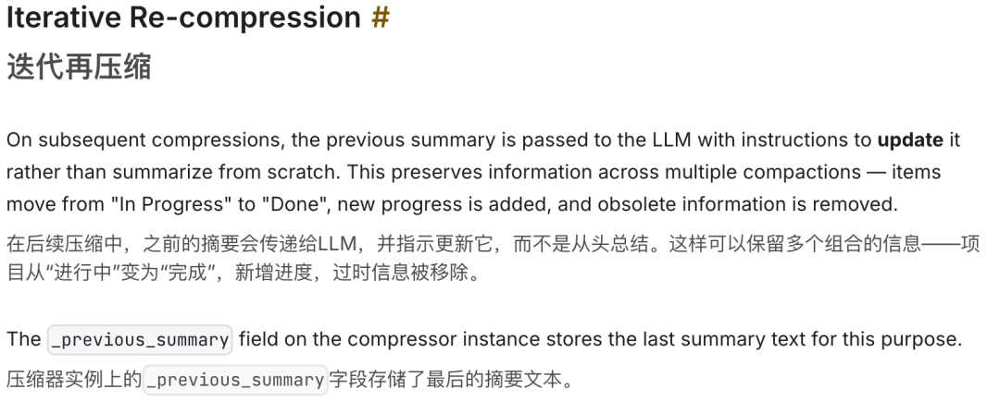

它还支持增量更新：多次压缩后不会从零重新总结，而是在上一次的摘要上追加更新。信息在多次压缩中是递进保持的，而不是每压缩一次丢掉一些信息。

### 给我们做 Agent 的 5 条设计启发

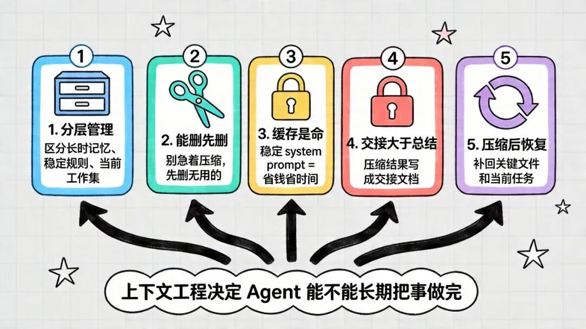

**1. 上下文分层，区分短期会话和长期记忆**

不要把上下分当垃圾桶，什么都往里塞的结果是既记不住重要的事，又被大量无关信息拖慢。

至少应该拆成4层：

1）长时记忆（跨会话保持的东西）

2）稳定不变的规则，包括系统提示词、CLAUDE.md

3）当前使用的技能、工具、文件

4）当前的任务进展

**2. 能删就删，不要做没必要的压缩**

例如无意义的你好、再见，例如不需要关心过程的工具输出结果，不需要花成本让模型去总结。

**3. 缓存的稳定性是一等公民**

**system prompt、记忆快照、工具描述不要频繁变更，稳定才能省钱、才能高效，才能保护稳定性。**

**这一点，可能是我最近意识到我以前的误区，我原本以为当我们拥有了无数优化算力调度的机制，Token会更便宜，但无论国内外大厂都在涨价，产品同学可能要更早的具备成本意识。**

**4. 压缩结果写成交接文档，不是总结**

Hermes 的结构化交接模板告诉我们：压缩不是泛泛而谈，而是给下一轮模型准备一份可继续执行的交接清单。

**5. 压缩后要记得恢复**

至少要补充回当前工作集，比如关键文件、已激活的技能和当前任务状态；否则 Agent 压缩完，很容易重新读一遍刚刚做过的事。

---

模型的编程能力溢出，于是我们有了Cursor。而Openclaw+微信或者飞书又进一步把使用门槛拉低，Hermes把上下文从压缩变成交接，也更早的压缩避免模型不稳定，再叠加上自我进化的机制。

于是Hermes的Star又迅速的提升，大量Openclaw的用户切换到了Hermes。但Hermes的交接机制其实类似HANDOFF，而自我进化的skill在Openclaw之前就已经出现过。

AI时代不仅止于技术创新，还在于把技术上的创新点以一个用户可感知的方式展示了出来。

注：部分图片由AI生成

---

⭐️ 关注星标，收看AI实战

新的AI群在招募小伙伴啦~欢迎一起玩AI


---

```
参考资料
```
