> 📎 来源: [REITs研习笔记](https://mp.weixin.qq.com/s?__biz=MzkyMzcwMzcwMw==&mid=2247484116&idx=1&sn=891cd3286c85801c6956afeada47eaca&chksm=c05bf31d3d9625dd6a8b9c2bcebd09644f74a35c7fb7d1ddf6cdda4ad8edf04272da38804c6b&mpshare=1&scene=1&srcid=0420SqF7EXFSITDDSkA07Ow5&sharer_shareinfo=cd99aed01d61aa29b74d0f56b50e292f&sharer_shareinfo_first=cd99aed01d61aa29b74d0f56b50e292f) | 时间: 2026-04-20 19:11

---

你有没有这样的困扰：每天要翻十几个公众号才能看完行业动态；想找一篇几天前读过的文章却怎么也翻不到；或者想针对某篇推文做深度分析，却只能手动复制粘贴……

现在，我开发了一个 Skill（可直接应用于 OpenClaw）—— **wechat-query-skill**，它把微信公众号的订阅、新文章内容缓存、查询、推送、巡检串成了一条自动化流水线。
你只需要用自然语言对 Agent 说一句话，剩下的全部自动完成。

GitHub 源码：**https://github.com/adennng/wechat-query-skill**

---

## 使用前提

- 你拥有一个微信公众号（订阅号、服务号均可）
- 本地环境已安装 Docker
- 首次使用或登录失效时，需要**公众号管理员微信**扫码登录（登录有效期为4天，可随时重新登录续期）
- 支持 Linux / macOS / Windows

> 只要满足这三条，你就可以把这个 Skill 跑起来。

---

## 整体逻辑

这个 Skill 的核心思路很简单：

- 先把服务部署起来

- 用公众号管理员微信扫码登录

- 把想跟踪的公众号订阅进来

- 后台自动轮询已订阅的公众号并把文章缓存到本地数据库

- 之后查询、分析、推送都优先基于缓存库进行

- 如果缓存里没有，再按需补抓单篇文章

整体逻辑图：

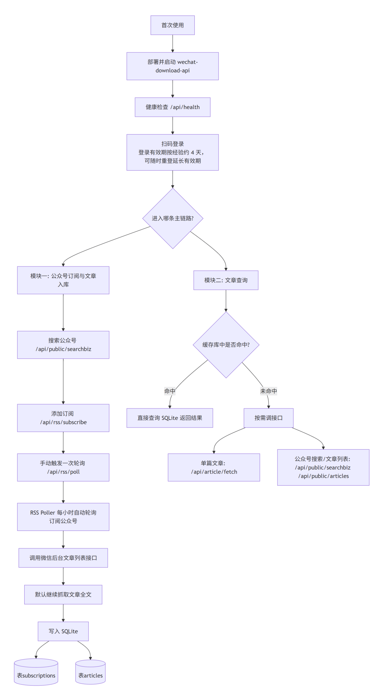

此外，Skill 还添加了两个定时任务：

- 每日推送：负责整理并主动推送已经订阅的公众号最近 24 小时发布的新文章

- 每日巡检：负责检查服务和登录状态

定时任务流程图：

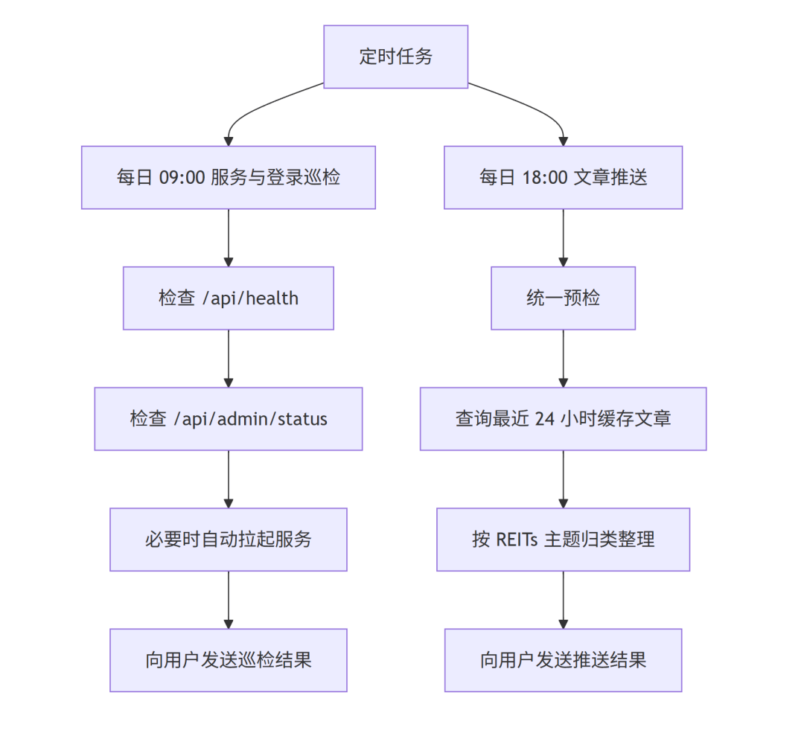

上述定时任务都可以按需进行修改。

---

## 场景演示

我给OpenClaw中独立的一个Agent 配上该Skill，通过飞书与该Agent进行交流~

### 1. 首次部署与扫码登录

第一次使用，和Agent 说“帮我部署并启动服务，然后引导我进行登录”，Agent 会自动检查 Docker、拉起服务、生成二维码，并提醒你使用**公众号管理员微信扫码，最后告知登录成功。**

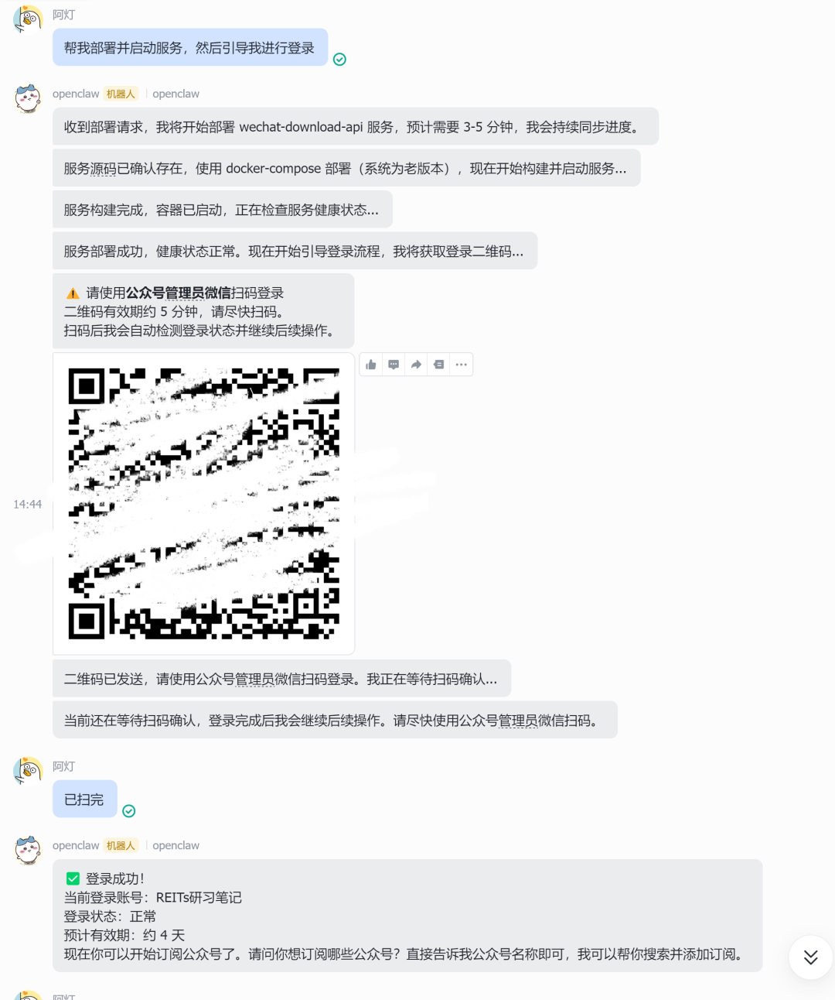

**2. 重新登录（延长有效期）**

登录有效期大约 4 天。你可以随时对 Agent 说 **“重新登录”** 或 **“重登”**，它会立刻发起新的扫码流程，不影响正在运行的后台轮询。（你可以随时询问 Agent “登录状态还有多久到期”或者说“检查服务状态”以了解登录剩余时效，此外，每日定时巡检和定时文章推送时也会提醒你登录还有多久失效）

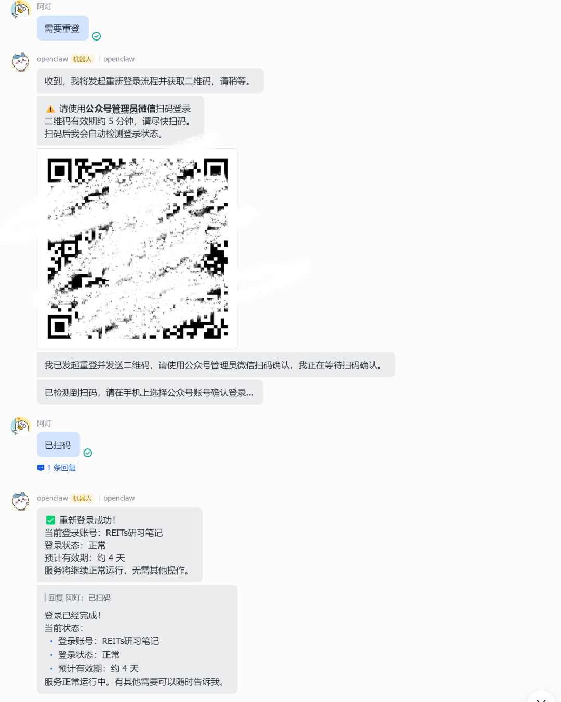

3. 添加订阅

告诉 Agent **“帮我订阅公众号 XX”**，它会先搜索公众号，然后添加订阅，并立即手动触发一次轮询（初始拉取最近10篇文章并入库）。对于添加订阅的公众号，后台会定时拉取新增的文章，并进行解析、缓存至数据库里。

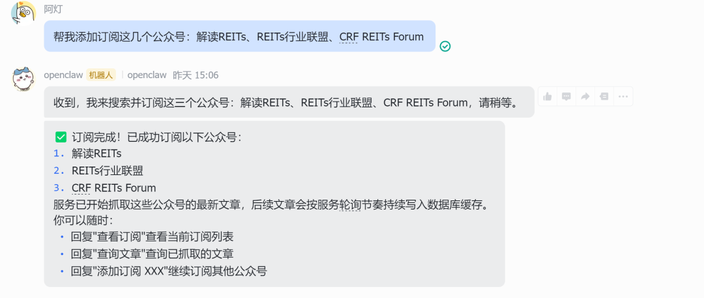

4. 取消订阅

说 **“取消订阅 XX 公众号”** 即可取消订阅某个公众号，对应公众号的缓存文章也会一并删除。

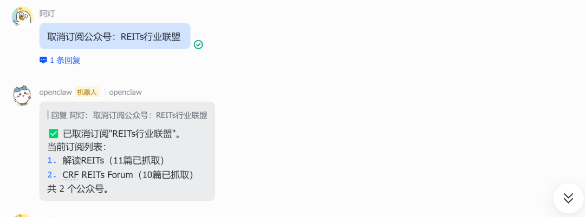

5. 查看订阅列表

输入 **“查看当前订阅了哪些公众号”**，Agent 会返回订阅列表。

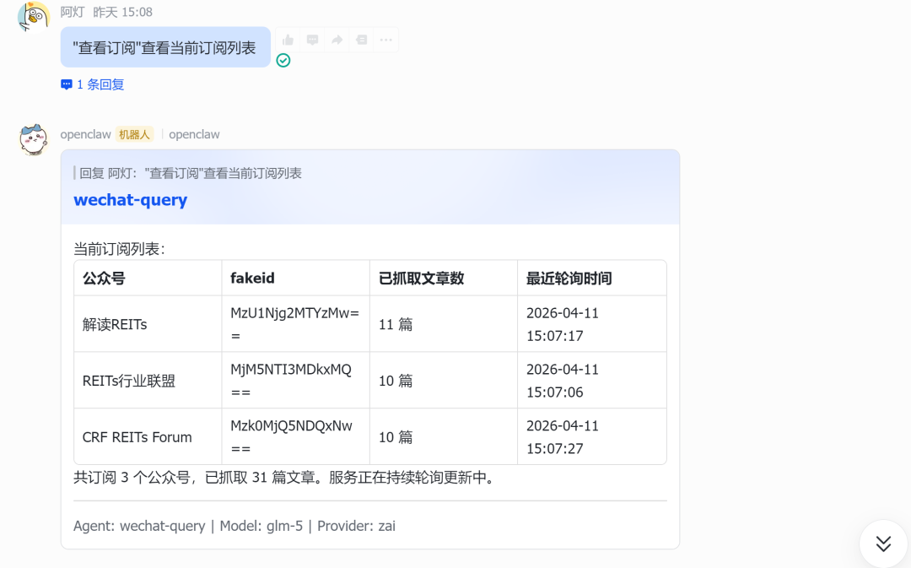

### 6. 查询已订阅公众号的缓存文章

你可以按公众号、时间范围、标题关键词自由组合查询已经订阅的公众号文章。例如：**“查一下 XX 公众号最近 2 天的文章”、“已订阅的公众号最近2天发布了什么文章”。**

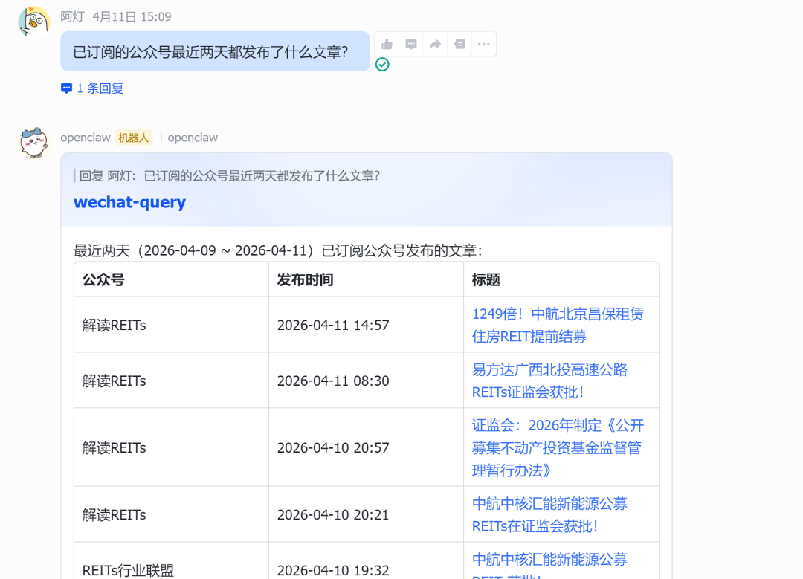

****文章较多时 Agent 可能会以列表展示，可点击对应文章链接详细阅读目标文章，也可以进一步要求其形成文章摘要以快速了解文章内容。****

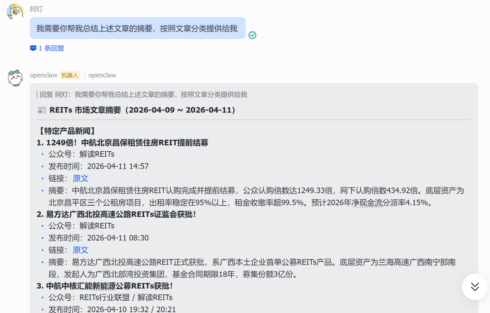

在快速了解全部文章后，你也可以让 Agent 继续详细分析其中某篇文章，例如接着说 **“帮我详细分析上述文章中 xx（文章标题）这篇文章的核心观点”**。

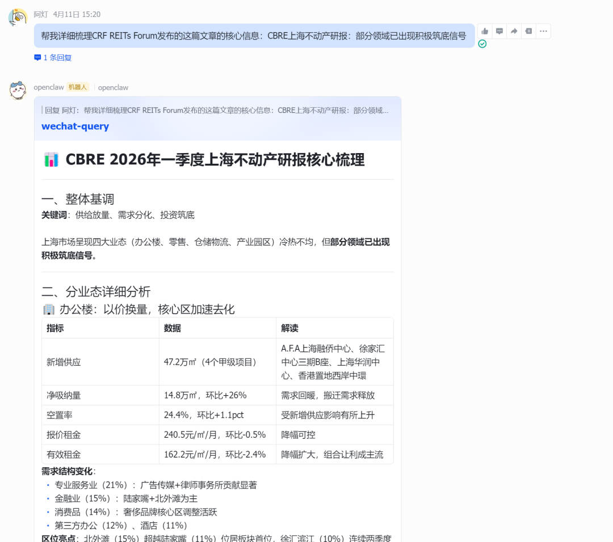

### 7. 提供未订阅公众号的文章链接

即使你从未订阅过某个公众号，只要把文章链接发给 Agent，它也能读取全文并回答你的问题。完成分析后，你可以让 Agent 订阅该公众号。

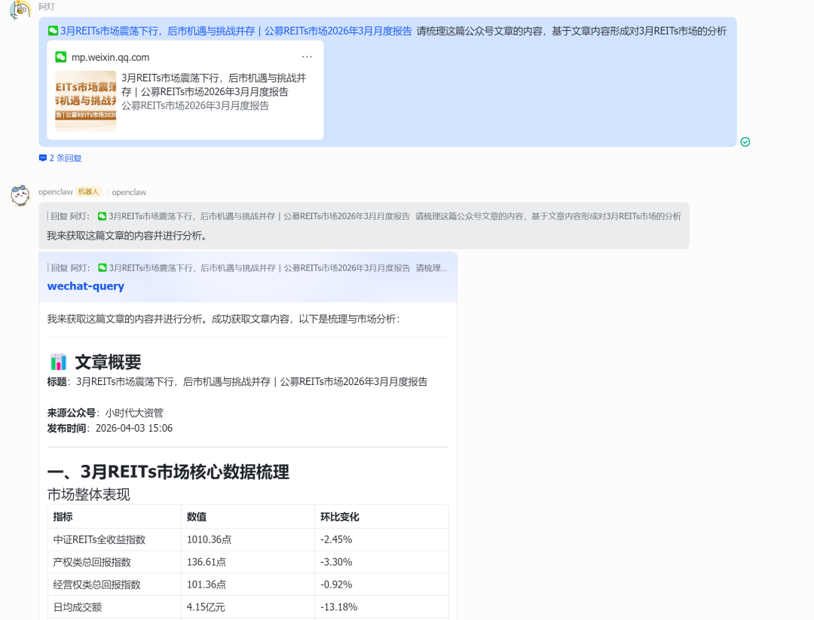

---

## 定时任务：每日推送 + 每日巡检

Skill 内置了两个定时任务，在 OpenClaw 配置好后会自动调度触发，无需人工干预。（你也可以根据需要调整任务的触发时间和要求等）

### 1. 每日 18:00 文章推送

自动统计已订阅的公众号最近 24 小时内新增的文章，按主题分类（请你根据自己的需要修改**`SKILL.md`** 分类规则），推送到飞书。
每篇文章包含：公众号名称、标题、发布时间、原文链接、摘要，并在末尾附上当前登录状态。

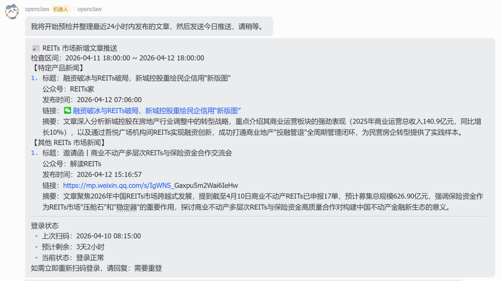

### 2.每日 09:00 服务与登录巡检

自动检查服务是否健康、登录是否有效。如果服务挂了会尝试自动拉起；如果登录接近过期或已经失效，会提醒你重登。

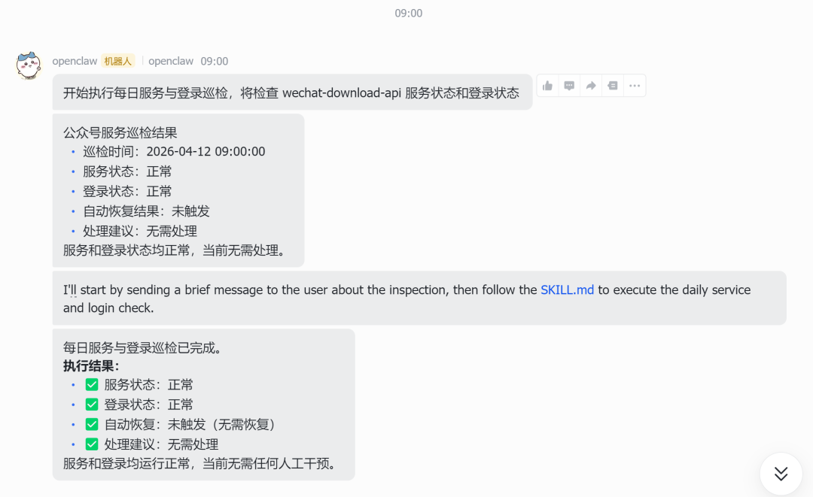

---

## 源码与使用文档

项目完全开源，👉 GitHub 仓库：**https://github.com/adennng/wechat-query-skill ，详细介绍请阅读`README.md` 和`SKILL.md`**
