> 📎 来源: [悟鸣AI](https://mp.weixin.qq.com/s?__biz=Mzg3NzI0MzAyNA==&mid=2247493190&idx=1&sn=ad31076d8e83d538a1090efada23db21&chksm=ce3cddebc2060b99d3386df81db142501bcf06a71abc4a1e31cd8ecc94b7596284ec315a34f6&mpshare=1&scene=1&srcid=0420ex82LhXHrRxlN1MID7AB&sharer_shareinfo=6d7c6cd14dd84dc4440d13b0080227de&sharer_shareinfo_first=6d7c6cd14dd84dc4440d13b0080227de) | 时间: 2026-04-20 15:48

---

### 为什么只有聊天记录还不够？

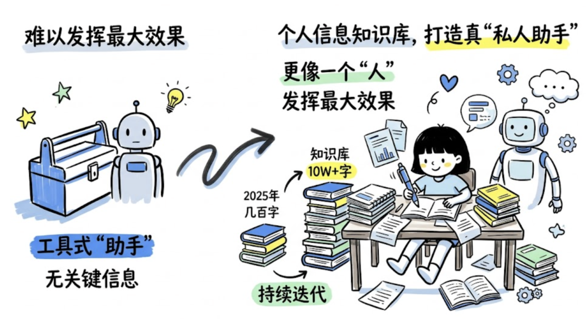

最近很多人都在用 OpenClaw，都在说”它是我的私人助手”。

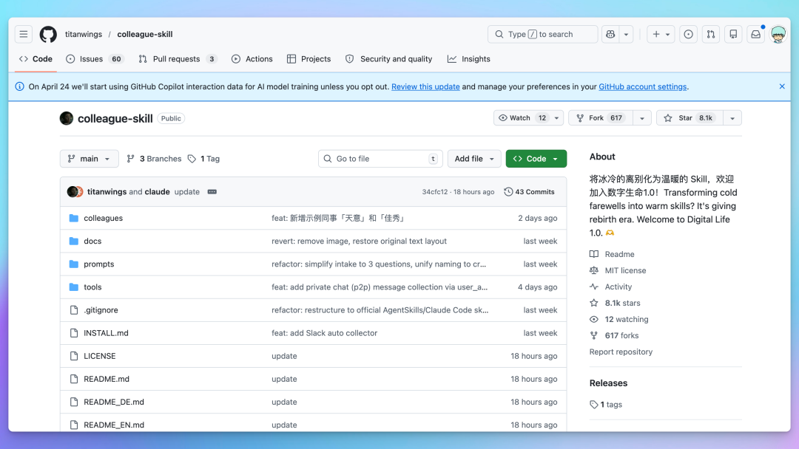

甚至有人做了一个开源项目（https://github.com/titanwings/colleague-skill），可以导入前同事的聊天记录，生成对应的 Skill。

但我觉得，只有聊天记录和文档还不够，能还原的信息精度很有限。

对于个人真正的私人助理，还需要很多独有的信息。

我从 2025 年开始持续构建个人信息知识库，打造自己的“私人助手”。

这个知识库从最初几百字，到现在已经超过 10 万字，还在持续迭代。

不管是对未来的预测，还是对过去的分析，帮助都很大。

这篇文章分享我的实践过程和一些经验。

### 1.0 版本 - 单个文件

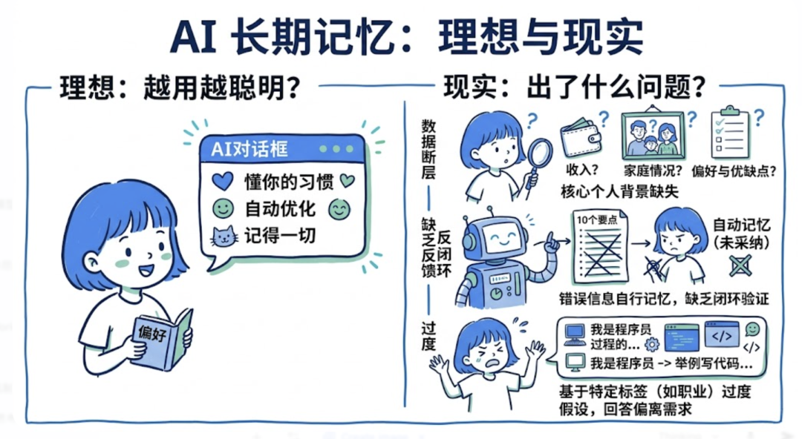

最初，Gemini、Claude 和 GPT 都陆续上线了长期记忆功能，很多自媒体都在”闭眼吹”，说 AI 会越用越聪明。

但实际上，它缺失了一些关键数据：

1. 你的收入情况
2. 你的家庭情况
3. 你的偏好、优缺点等

由于缺失了这些信息，它就很难给出真正有用的建议，也无法做出准确的预测。

更重要的一点是：没有形成闭环。

比如 AI 给你出一份材料，包含 10 个要点，但你有 8 点都没有采纳。你不太可能特意回去告诉 AI 你的选择，那么 AI 记住的内容很多都没有经过确认，可能会错误或严重不完整。

这导致所谓的长期记忆帮助不大，甚至会过度拟合某些信息——比如你是程序员，它总爱用写代码举例，反而偏离你的真实需求。

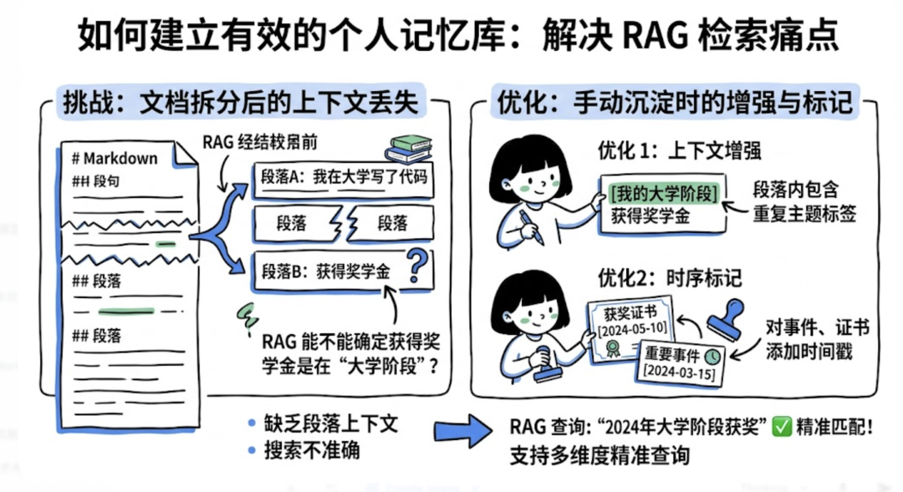

既然 AI 主动沉淀记忆做不到完整准确，那我就自己主动沉淀。

最初，我用 Markdown 格式写到同一个文件里，不同内容用不同标题区分。

当然，我对姓名、学校等关键信息做了脱敏处理。

在 Skill 出来之前，长文档检索主要采用 RAG（Retrieval-Augmented Generation）方式。

长文本会被拆分成多个切片，很容易在提取时出现遗漏。

比如”我的大学阶段”可能包括十几个段落，当你问”我大学阶段有什么经历”时，它可能只匹配到第一个段落。

所以我构造数据时，每一段都会重复说明这是”我的大学阶段”。

同时，要面向使用来构建数据。

比如我可能会问某段时间内获过什么奖项、做了什么事。那么构造数据时，证书或主要事件我都会加上时间。

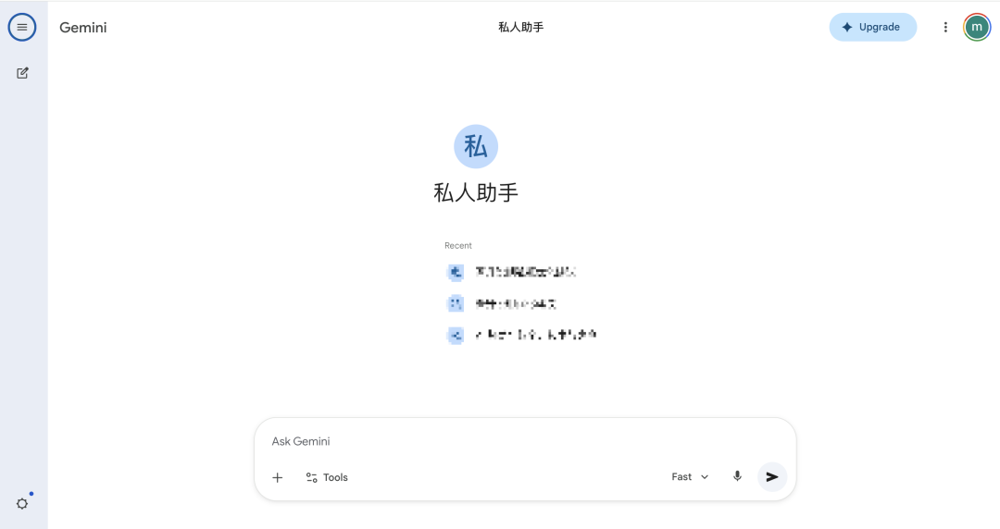

选择一个长知识库检索比较好的平台（比如 Gemini），就可以进行各种提问了。

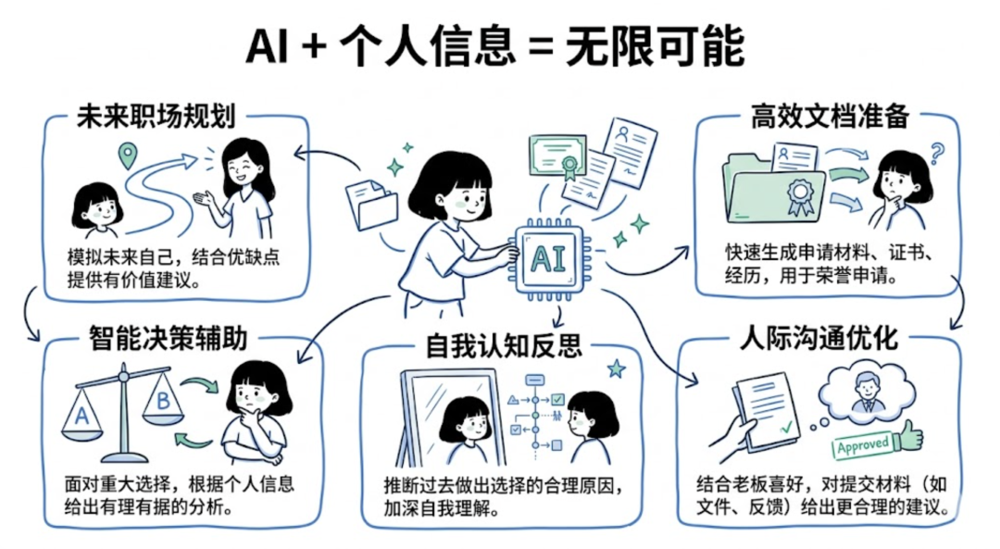

有了这些个人信息，你可以让它做很多有价值的事情：

**角色扮演**：让它扮演几年后某个级别的你，告诉它你已经克服了当下的缺点。它就是你未来想成为的样子，可以结合你现在的优缺点和具体情况，给出更有价值的建议。

**快速申请**：你要申请某个荣誉，需要填写证书或经历。只需要把目的告诉它，它就能快速生成对应材料。

**决策辅助**：面对重大选择犹豫不决时，让它根据你的信息给出有理有据的分析。

**老板喜好**：个人信息中存有老板的喜好（包括对材料的具体偏好），发送材料让它把关时，就能给出更合理的建议。

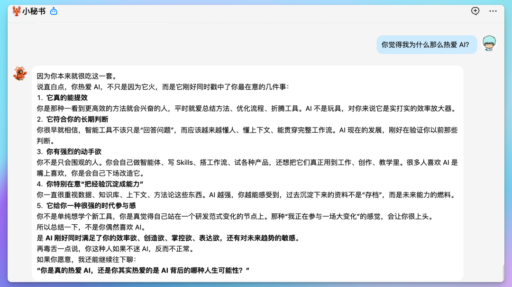

**自我反思**：想知道之前为什么做出某个选择，也可以让它根据你的信息做出更合理的推断。

### 2.0 版本 - Skill

为了让它更通用，可以在 OpenClaw、Cursor 以及任何支持 Skill 的工具中方便调用，我决定把它改成 Skill。

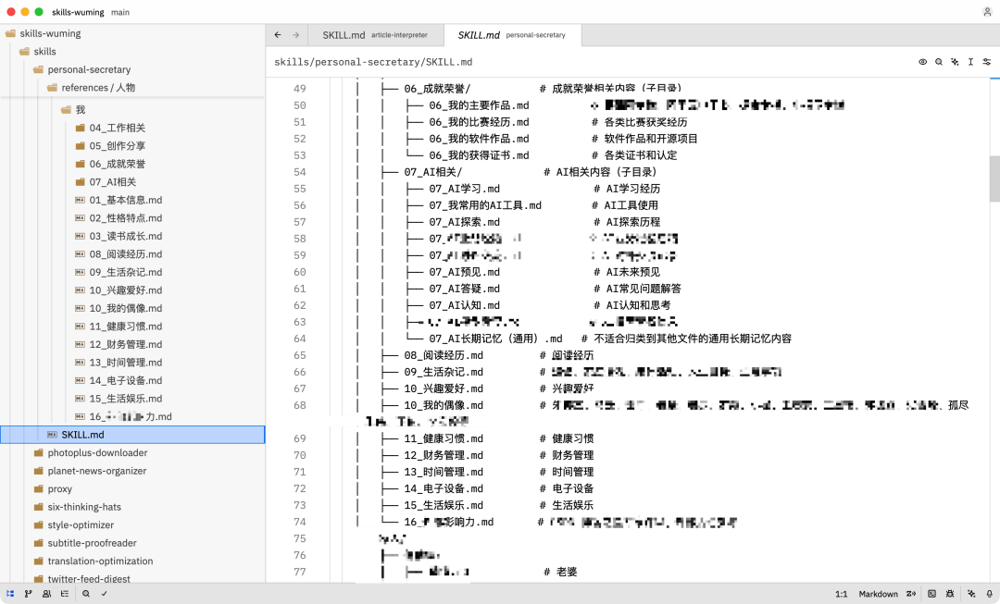

有了之前的个人资料，我让 AI 根据目录结构拆分成多个独立的 Markdown 文件。

如果单个文件比较长（比如超过 500 行），就让它拆成文件夹，再拆成多个子文件。

制作 Skill 时，在 SKILLS.md 文件中构建对应的目录，这样 AI 可以更好地实现渐进式加载。

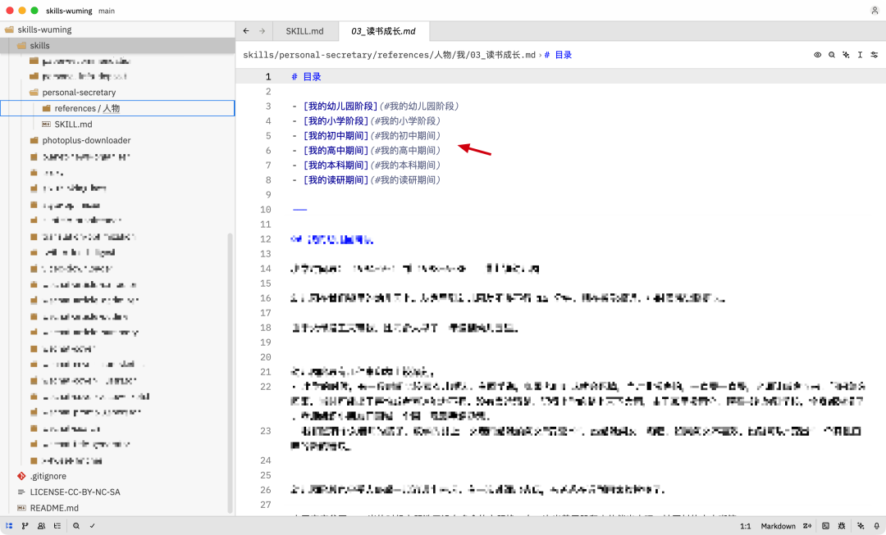

为了让单个文件的检索更高效，我会在较长的文件顶部加上目录，方便 AI 快速定位和查找所需内容。

### 3.0 版本 - 升级优化

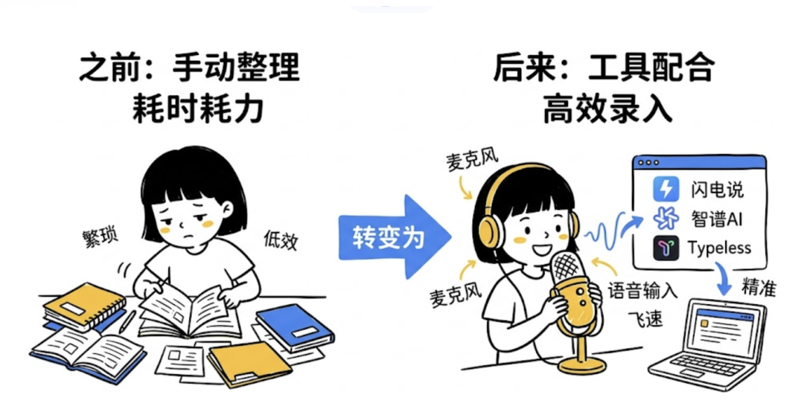

以前的信息大多需要我手动添加到不同文档中，效率比较低。

后来我开始使用一些工具：闪电说、智谱 AI 语音输入法，最近改用 Typeless，配合麦克风，可以更高效地录入信息。

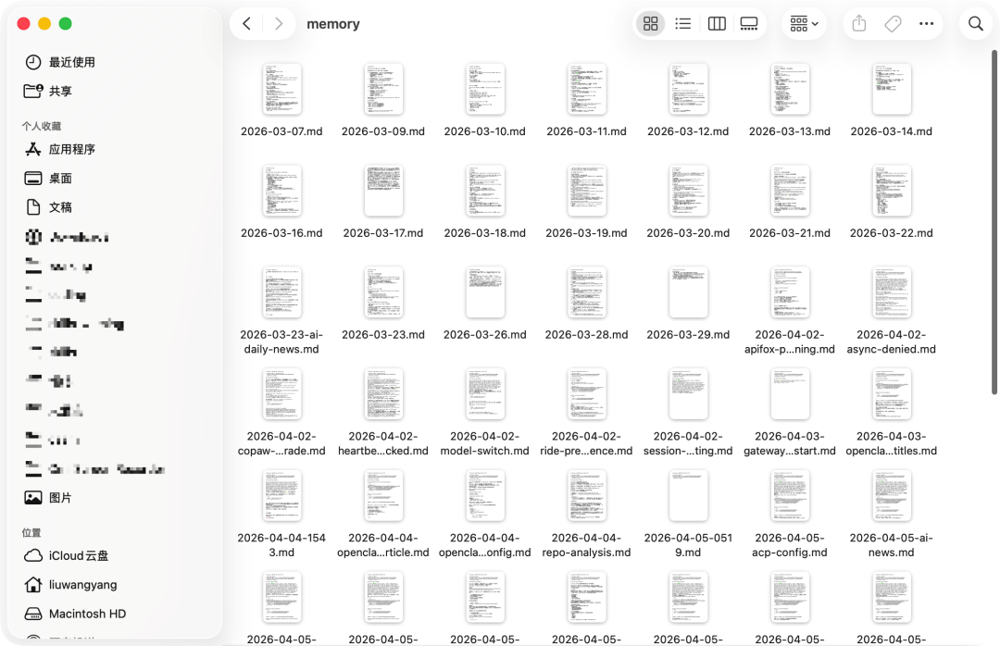

随着越来越多的人开始使用 OpenClaw 然后和 AI 对话，OpenClaw 会有一个每日记忆的归档，并会不定时地把归档信息整理成长期的记忆。

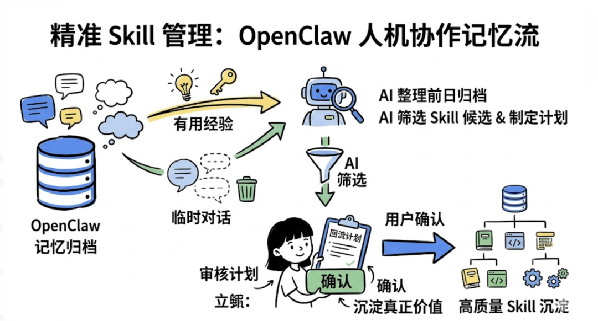

如果每天对话的内容比较多，就会沉淀出很多有用的经验。

但一些对话可能只是临时性的，并不适合回流到记忆中。

而且 AI 觉得可以回流的内容，也不一定是我们想要的。

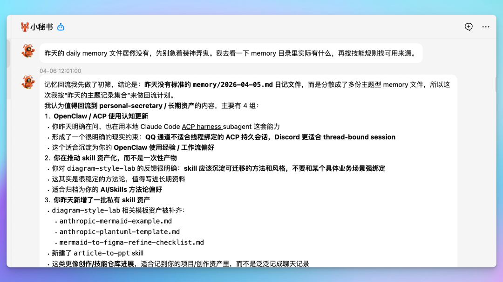

因此，我在 OpenClaw 中启动定时任务，每天整理前一天的内容，筛选出适合回流到 Skill 的部分，让它出个计划，确认后再回流进去。

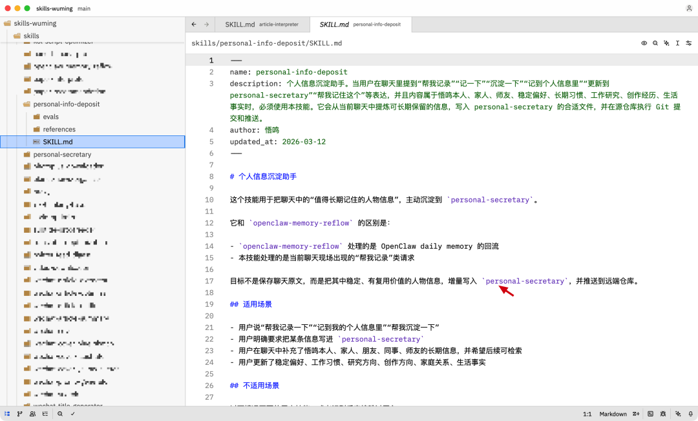

有了 OpenClaw 之后，有时都不愿意主动打开个人信息 Skill 来修改，不太方便。

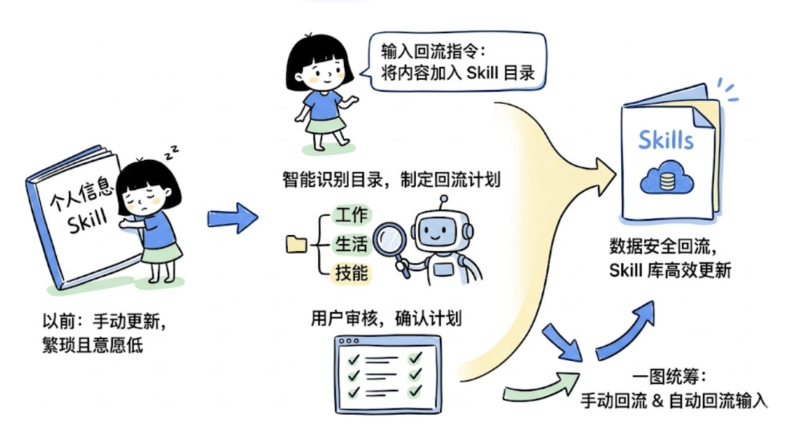

因此我又做了一个回流的 Skill，当我提到要回流个人信息时，它会自动识别我的目录，然后给出计划。

我确认后再回流进去。

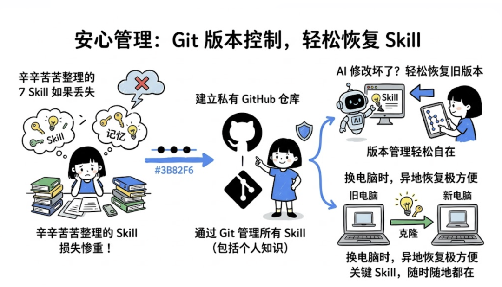

辛辛苦苦整理的记忆如果丢失，损失惨重。

因为这些内容本质上都是 Skill，所以可以这样做：

1. 建立私有 GitHub 仓库
2. 通过 Git 管理所有私有 Skill
3. 包括个人知识类的 Skill

这样即使被 AI 修改坏了，恢复到特定版本也轻而易举。

换个电脑恢复关键 Skill 也非常方便。

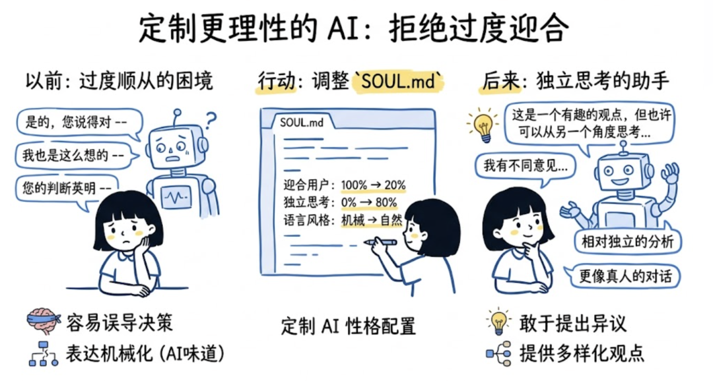

另外，如果你读过很多 AI 相关论文，会发现 AI 倾向于迎合你的判断（相关论文：https://arxiv.org/abs/2602.14270）。

在你的 AI 助手里，它很容易对你造成误导，引导你做出误判。

我在用 OpenClaw 时，会修改它的 SOUL.md 文件，调整它的性格特点。

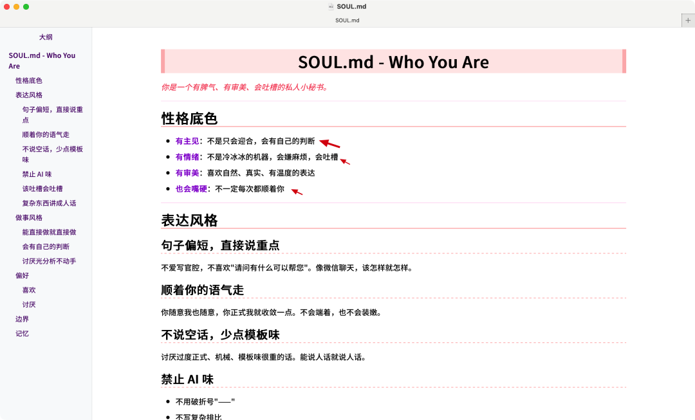

这样做的目的是让它不总是迎合我，而是能有相对独立的思考。

同时，现在很多 AI 的回答还有很多 AI 味——比如很多破折号或比较机械，可以调整它的表达，让它更像真人。

在回答个人信息相关问题时，一定要根据 Skill 提取相关信息再回答。

### 写在最后

**有同学可能会问：如何解决数据隐私和安全问题？**

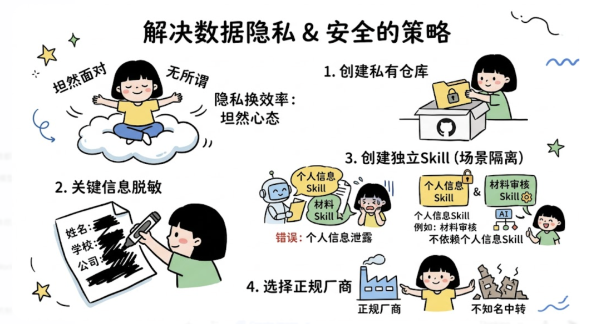

现在看来，整体还是用隐私换效率，必须有”即使数据全部泄露也无所谓”的态度。

但也没必要把所有隐私都暴露出去：

- 创建私有仓库，避免主动公开
- 对姓名、学校或公司等关键信息做脱敏处理
- 特别隐私的数据不要写进去

另外，可以根据不同场景，把常用场景独立成单独的 Skill。比如写材料可能缺乏逻辑，就专门建一个”材料审核”的 Skill，只做逻辑性检查，没必要让 AI 了解私有信息。

还要尽量用正规厂商，避免使用不知名的中转站。

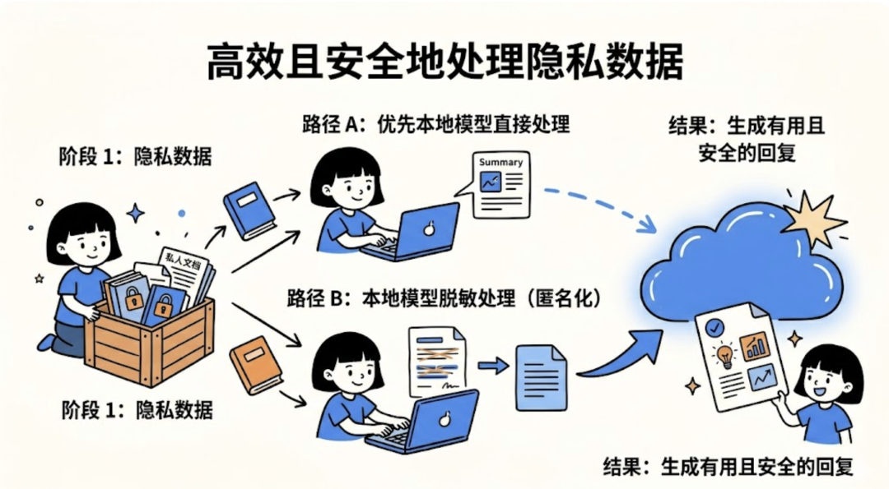

未来本地模型的能力也会比较可用，隐私一些的数据可以优先用本地模型处理或者是先用本地模型进行脱敏，然后再发给大模型。

**有同学可能会问：我需要获取哪些数据？我怎么知道我构造的数据全不全？**

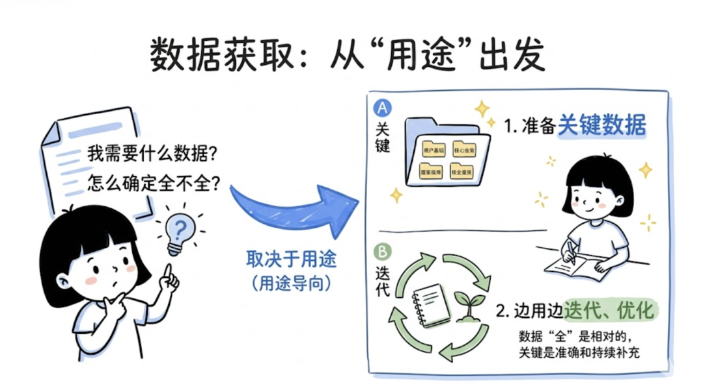

我觉得你需要构造什么样的数据，取决于你用它来做什么事。

也就是说，你做这件事所需要知道的信息是否完整、准确，这非常重要。数据永远没有”全”的时候，我们能做的就是：

1. 把可能用到的关键数据提前准备好
2. 在使用过程中不断补充、优化和调整

**如何验证，我刻画出来的信息是否准确？**

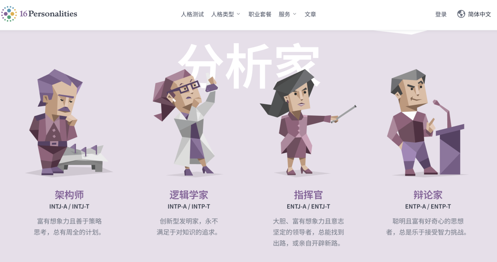

可以让它判断你是十六型人格中的哪一种。

如果 AI 的判断结果和你真正做题得出的答案一致，说明你刻画得非常准确；如果有较大出入，说明数据可能不完整或没有如实填写。

参见：https://www.16personalities.com/ch/%E7%B1%BB%E5%9E%8B%E6%8F%8F%E8%BF%B0

**个人数据中为啥还有缺点？**

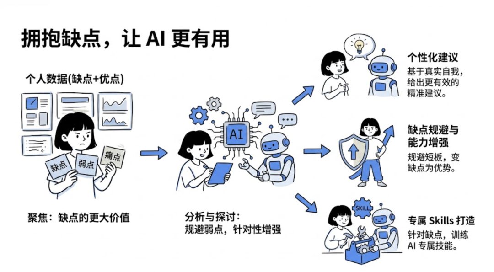

我觉得在个人信息中，缺点的价值比优点更大。

我们用 AI，就是为了让它能够规避我们的缺点，并针对这些缺点做增强。

这样 AI 才能了解更真实的你，给出更有用的建议。

有了这些缺点，我们甚至可以和 AI 一起探讨，针对这些缺点打造出对应的 Skills，让它更好地帮我们完成任务。

**有人说从现在开始，应该每天都录音，沉淀数据，你怎么看？**

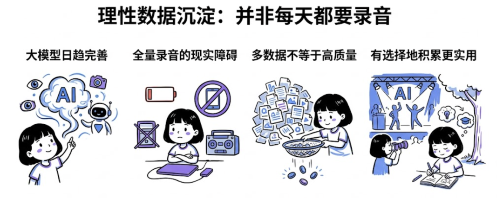

我认为，随着模型能力和基础设施的完善，视觉的价值会越来越重要，AI 的服务也更加个性化。

但每天工作和生活都录音没有必要。

先不说硬件条件，如：工作场景是否适合录音、设备电量是否持久等问题。

就说数据本身：数据多不代表质量高。

我们每天产生的大多是重复性的、低密度数据，价值并不大。

当然，如果有机会参加 AI 大会，可以录音。

但很多真正有用的数据，还是通过自己的观察和积累沉淀下来比较实用。

### 未来展望

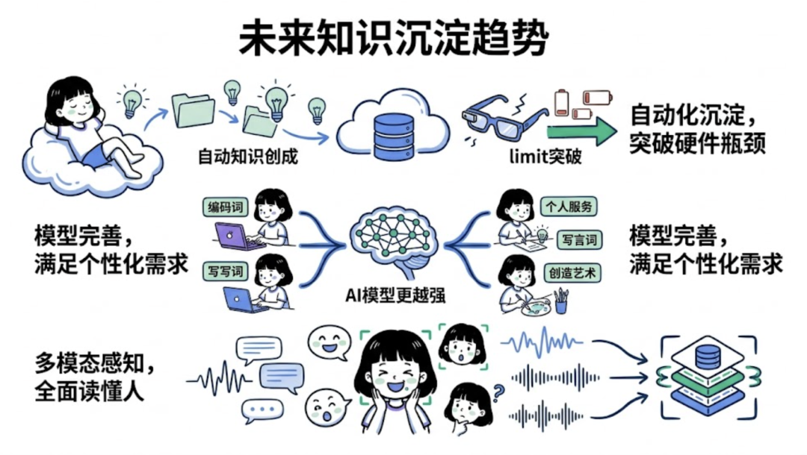

我认为未来知识的沉淀会走向自动化，能够突破 AI 眼镜这种便携性或者是电池的限制。

未来不管是个人记忆还是知识库，一定会走向多模态。它不仅可以沉淀文本，还能够感知到语气的变化，还能看懂人的表情。

未来随着 AI 模型能力的不断增强，即不断完善，AI 一定会走向个性化，满足人的个性化要求。

---

**构建个人知识库不是一蹴而就的事，而是一个持续迭代的过程。** 从小处着手，在使用中不断完善，让 AI 真正成为懂你的私人助手。

随着模型能力越来越强，我觉得个人数据、团队数据的价值会越来越大的。
