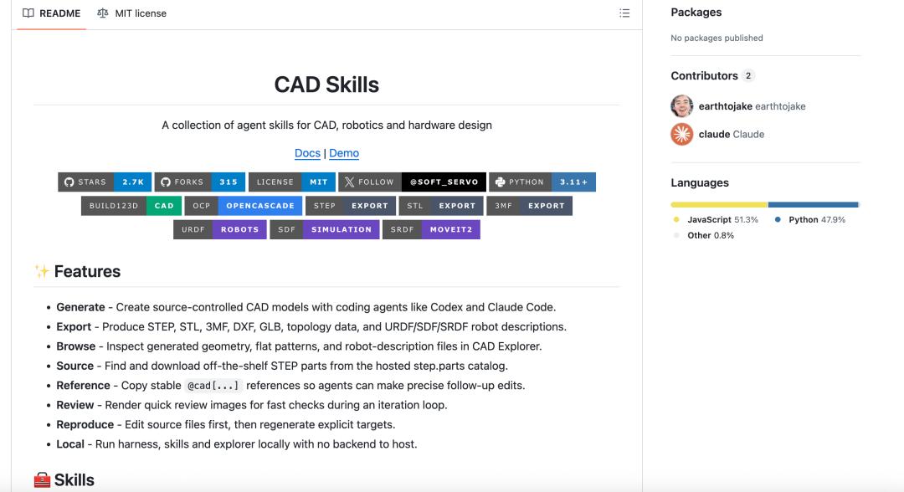

> 📎 来源: [小龙开发者](https://mp.weixin.qq.com/s?__biz=MzY4OTE4MDg2Nw==&mid=2247484143&idx=1&sn=96d321dcc2bbab770c0bfb43fc727e79&chksm=f2b76767b0bcaf6281d8ea10d34858a82af927df7a86aeceb979f51383582bfcb0295470d77b&mpshare=1&scene=1&srcid=0517tA9GXRzNA1syuLM1qHBF&sharer_shareinfo=e8f642b23c5fdfb4dc46d3921b6996da&sharer_shareinfo_first=e8f642b23c5fdfb4dc46d3921b6996da) | 时间: 2026-05-17 23:56

---

产品经理发来一条消息："这个支架稍微改一下，底座加宽一点，四个安装孔往后挪5mm，厚度再加个2mm——能搞定吧？"

你盯着这几行字，脑子里的画面是这样的：开CAD、改草图、重新拉伸、调整孔位、查尺寸表、导出、发回去。来回几轮之后，文件名已经变成了 

```
V7_改_再改_最终版_ok.SLDPRT
```

。

然后你刷到了这个开源项目：**text-to-cad**。GitHub上线不到一天，**2500多个Star**。

看完之后我的感受就一句话：以后沟通成本可能要降好几个数量级。



**它不是在"画图"，是在"写"几何**

很多人第一反应是：这又是一个AI画个概念图骗人的工具吧？不是的，差很远。

text-to-cad的底层根本不是图像生成，而是**代码生成**。你输入一段中文或英文描述，AI在背后生成的是**build123d的Python代码**，这段代码再调用OpenCASCADE几何内核执行，最终输出真实的三维几何模型。

换句话说，它生成的不是"一张看起来像CAD图的图片"，而是**真正可以导出STEP、STL、DXF格式的工程文件**，可以直接扔进SolidWorks或者发给3D打印厂家。

你描述

→

AI写代码

→

代码执行

→

三维模型

**那个@cad[]，才是最有意思的地方**

光是"描述一下就能出图"，这个功能厉害归厉害，但还不够让我觉得它有颠覆性。真正打动我的，是它的**@cad[] 引用机制**。

传统的AI生图，你改一个地方，等于整体重新生成，根本不知道哪里变了、为什么变了。text-to-cad完全不同：AI在生成每个零件和特征的时候，会自动给它分配一个"句柄"，比如 

```
@cad[flange]
```

、

```
@cad[support_leg]
```

。

你之后想改某个部分，直接说"把@cad[flange]的孔径从8mm改成10mm"，AI只动那一块，其他部分纹丝不动。**每一次修改都是可追溯的对话记录，相当于你的版本管理日志。**

想想以前做协作改图有多痛苦？"V1\_最终版"、"V2\_修改后"、"V3\_老板说再改"……以后这些可能都变成一段对话历史就够了。

**从画图到直接发工厂，中间只差一步**

更狠的还在后面。text-to-cad内置了**SendCutSend预检**功能：你的模型生成完之后，系统会自动检查材料厚度、最小特征尺寸、倒角半径是否符合实际加工标准，可以直接对接在线制造商下单。

也就是说，从你用嘴巴描述一个零件，到这个零件可以被真实加工出来，中间不需要打开任何一款传统CAD软件。作者自己实测：描述一个"带四根支撑柱的离心叶轮，底部有安装法兰"，从敲字到拿到可导出的模型文件，**耗时约90秒**。

90s

离心叶轮从描述到模型

2500+

单日GitHub新增Star

6种

支持导出格式

**这件事有多大？看看学术界在干什么**

text-to-cad这个开源项目只是冰山一角。学术界在这个方向的投入，远比你想象的密集。

NeurIPS 2025上有个叫**CAD-Coder**的论文，把同类方法的几何误差直接压低了**78%**——相比Text2CAD（平均Chamfer Distance 29.29），CAD-Coder降到了6.54，同时代码无效率仅1.45%，全面压过GPT-4o的直接提示效果。

还有个叫**ToolCAD**的方案，用7B参数量的开源模型，经过专门训练之后，多零件任务成功率达到64%，在很多测试里**与GPT-4o持平甚至反超**。

| **项目** | **技术路线** | **几何误差（Chamfer↓）** | **特色** |
| --- | --- | --- | --- |
| **CAD-Coder** | CadQuery代码生成 | **6.54（最优）** | RL强化学习训练 |
| **NURBGen** | NURBS直接生成 | 几何保真度最高 | 人类偏好评分64.1% |
| **ToolCAD** | FreeCAD工具调用 | 多步任务成功率64% | 7B开源模型追平GPT-4o |
| **text-to-cad** | build123d代码生成 | 工程可用 | 含@cad引用+制造预检 |

**那它现在能替代SolidWorks吗？**

说句实话，**现在还不行，但方向是对的。**

🎯 两种情形判断：

如果

你的工作主要是**原型验证、概念设计、简单零件**——那 text-to-cad 现在就值得认真玩一玩，90秒出模型这件事已经能改变你的工作节奏了。

如果

你做的是**复杂曲面、大型装配体、精密公差管理**——传统CAD软件还得是主力，但可以把 text-to-cad 当"草图神器"用，先用自然语言打出结构框架，再进精细雕琢。

更值得关注的长期信号是：这个领域的进化速度远超预期。CAD-Coder比上一代方法好了78%，ToolCAD用7B模型追平了百亿参数的闭源模型——这条技术曲线，跟两三年前的大语言模型何其相似。

你有没有想过，五年前谁会相信"跟AI聊天能写代码"？现在，**"跟AI说话能画工程图"这件事，离落地可能比大多数人想的要近得多。**

**你要做的，只是习惯"用嘴建模"**

技术本身没那么神秘——AI写Python，Python执行，模型出来了。但这背后有一个习惯的转变：**你需要学会用精确语言描述几何**。

"做个零件"这句话是没用的。"做一个直径80mm、高30mm的圆柱，顶面有四个均匀分布的M6螺纹孔，孔中心距离圆心60mm"，这才是能让AI干活的指令。

这个能力，其实你本来就该有——只是以前你习惯把它藏在鼠标点击里，没意识到自己在用。以后，它会变成你工作效率的核心竞争力之一。

文章末尾留一个问题：**如果你是设计xx零件的人，你会主动给第一个几何体加@cad句柄吗？**欢迎留言告诉我——说不定讨论本身，就是新的工作流起点。
