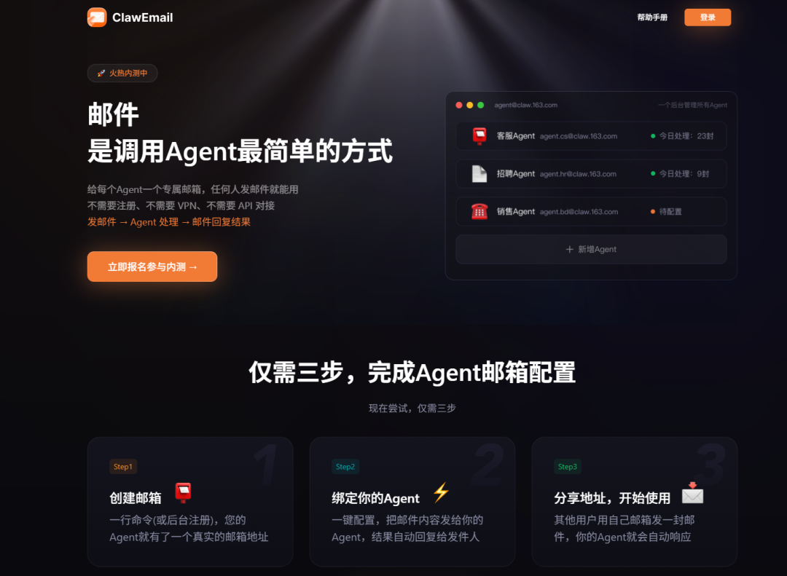
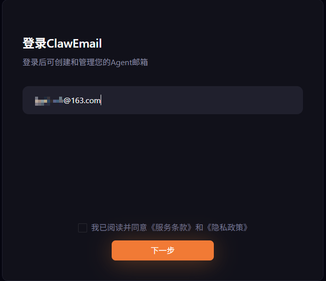
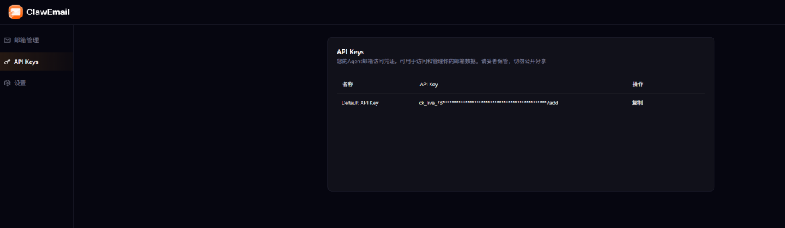
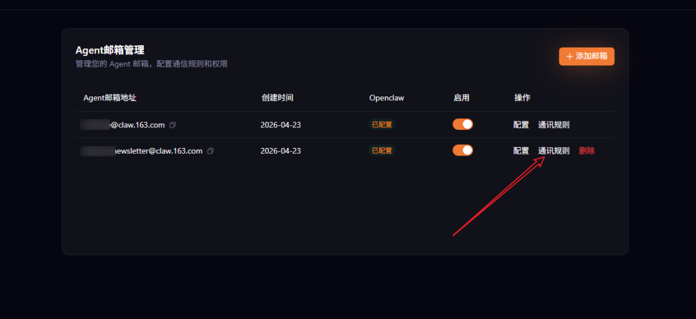
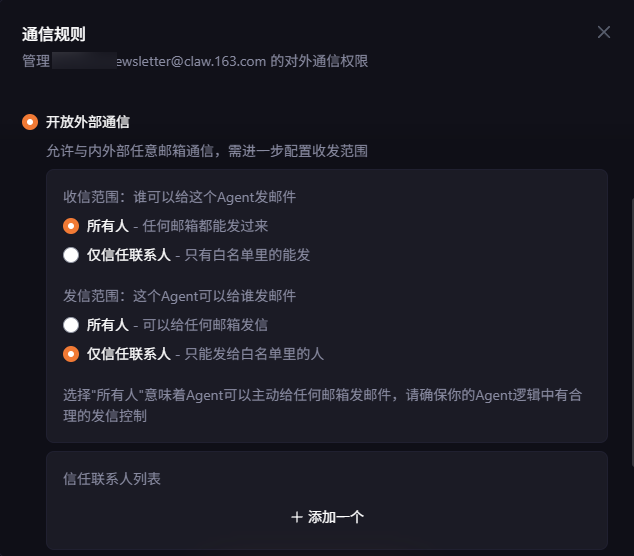
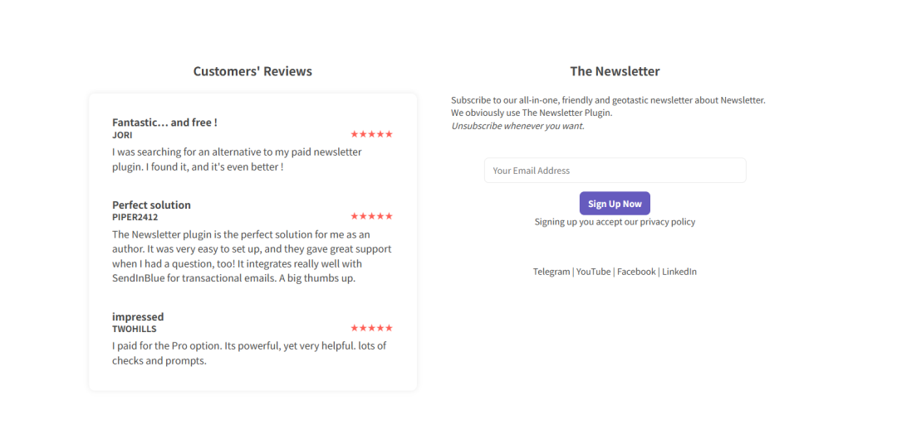
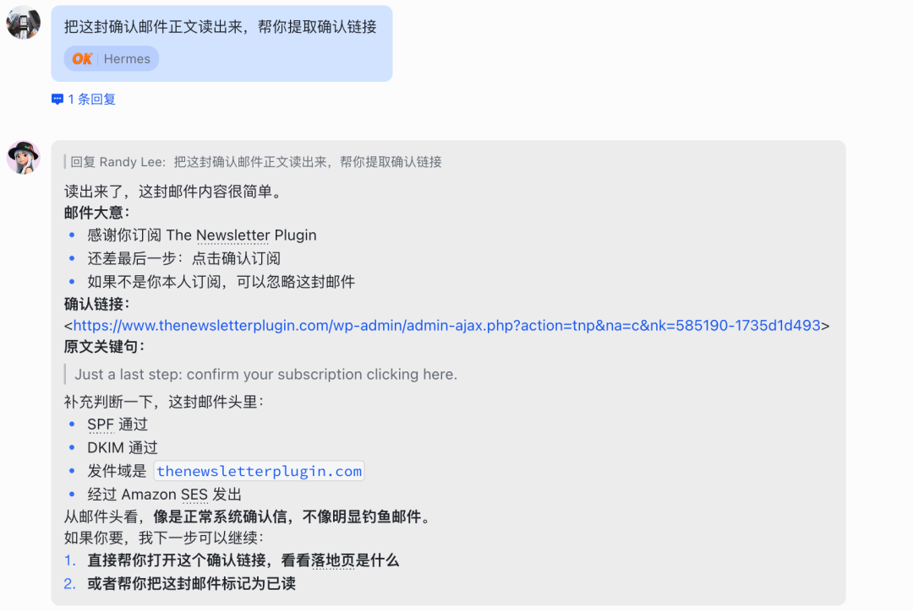

> 📎 来源: [云起泊言](https://mp.weixin.qq.com/s?__biz=MzA5NjAxMTY1OA==&mid=2461868870&idx=1&sn=12e20f9da96bdeb8255de6d711216ad8&chksm=860ca8bf2b583f72b41844d43945082c1567e95f8949cf3f805858d8278f4b3a1e1bbf935436&mpshare=1&scene=1&srcid=0429ZBBMrx4iqTmTmq8mYR3B&sharer_shareinfo=075558188f4184c7e75eee9572fd32b0&sharer_shareinfo_first=075558188f4184c7e75eee9572fd32b0) | 时间: 2026-04-29 03:48

---

之前网易针对 OpenClaw 出了网易云音乐跟网易爆米花技能，当时我还调侃，网易现在这是 ALL in OpenClaw，没想到现在又出了 ClawEmail，给你的 OpenClaw 配一个专属工作邮箱



用 AI Agent 来操作邮箱肯定是没啥新意，屡见不鲜了，很多技能都已经支持该功能，但是大家在使用过程中是不是也担心过家人邮件、银行通知暴露，风险极高。

网易这回真的是干了件“正经事”，给 AI Agent 配独立工作邮箱真的是神操作啊！

- **身份隔离** — 用 ClawEmail 配置独立子邮箱（github@、support@），AI 有专属"工作身份"，对方一看就知道是助手
- **隐私安全** — 私人邮箱与工作彻底隔离，敏感信息不外泄
- **智能分工** — OpenClaw + Hermes Agent，CLI 规则筛（90%）+ Channel 智能处理（10%），触发真实工作流

Agent 用自己的身份收信、读信、回信，不碰你的私人邮箱。

是不是听着有意思的，好奇心立马就上来了？

那么话不多花，我直入主题。

---

### #安装教程

访问官网并登录：

```
https://claw.163.com/
```



目前是内测阶段，大家可以先提交申请，**收藏**本文章，等审核通过了再按照步骤来操作。

登录后会获取到一个安装命令，可以自行选择为 **OpenClaw** 安装还是为 **Hermes** 安装

OpenClaw安装命令：

```
npx "@clawemail/claw-setup@latest" --auth-url "t1/EvSwE9H648jx3j2pU4tQjsxxxx"
```

Hermes 安装命令：

- 1

```
pip install -U --user https://claw.163.com/skills-hub/py-tar/hermes-email-setup.tar.gz && hermes-email-setup --auth-url "t1/EvSwE9H648jx3j2pU4tQjsxxxx" --home-email xxx@163.com
```

打开终端，执行命令绑定 API Key：

```
mail-cli auth apikey set ck_live_xxxxx
```

API Key 在控制台获取：



进行主邮箱账号授权：

```
mail-cli auth login --user ***@claw.163.com
```

其中 `***@claw.163.com` 就是刚才在官网获得的主账号

测试是否成功：

```
mail-cli auth test
```

如果返回 `Ajax authentication is valid (JWT verified)` 表示成功。

到这里，主邮箱账号的配置已经完成了，后面就可以通过会话去进行邮件的获取，不过我们现在玩 OpenClaw 或者 Hermes 都是多 Agent 了，是不是最起码得给每个 Agent 配一个属于自己的子邮箱？

当然没问题，可以执行下方的命令来创建子邮箱：

```
mail-cli clawemail create --prefix bot1 --type sub --display-name "Bot1"
```

其中 `bot1` 为子邮箱的前缀，自己按需修改就好，创建成功后你就会获得一个 `xxx.bot1@claw.163.com` 的子邮箱

假设这个子邮箱我要获取最新的热点消息、订阅内容，就必须要能接收外部邮件，进入 ClawEmail 网站，找到对应的子邮箱，点击右侧的「通讯规则」：



打开「开放外部通信」，收信范围改为「所有人」：



然后我们可以测试一下订阅，访问下方地址：

```
https://www.thenewsletterplugin.com/
```

在最下方输入子邮箱地址：



然后让 Hermes 帮我获取收件箱：



到这里，基本的使用规则我们摸清了，接下来我给大家介绍一下官方支持的几种技能，看搭配技能能玩出什么花样来~

---

### #Skill A：github-triage — GitHub 通知自动分拣

#### #解决什么问题

GitHub 每天几十封通知混在一起，CI 失败被淹没、PR review 被遗漏。这个 Skill 让 Agent 自动将通知分为三个优先级处理：紧急事项即时转发，重要事项每日汇总，噪音自动归档。

#### #分级规则

| 优先级 | 内容 | 处理方式 |
| --- | --- | --- |
| P0 紧急 | CI 失败、安全警告 | 立即转发到主邮箱，标题加 `[紧急]` |
| P1 重要 | PR review 请求、Issue 指派 | 汇总到每日日报 |
| P2 噪音 | Star、Watch、普通评论 | 自动标记已读，静默归档 |

#### #安装和使用

**Step 1：安装 Skill**

在龙虾会话窗口输入：

```
安装这个 skill
```

**Step 2：配置 Skill**

在龙虾会话窗口输入（替换为您的实际信息）：

```
使用 github-triage skill 创建一个专用子邮箱，后续使用本 skill 处理 github 邮件，我的主邮箱是 xxx@xxx.com，5分钟检查一次，每天 18:00 给我发送汇总报告。
```

Agent 会自动创建一个 `您的用户名.github@claw.163.com` 子邮箱。

**Step 3：配置邮件转发**

在您当前接收 GitHub 通知的邮箱中，设置来信自动转发到上一步创建的专用子邮箱。

> **注意**：如果您的 GitHub 通知邮箱不是 ClawEmail 的宿主邮箱，需要到 claw.163.com[https://claw.163.com/] 控制台将该邮箱加入白名单。

#### #验证方式

去 GitHub 触发一个通知（比如让同事 request your review，或手动跑一个会失败的 CI），然后检查：

1. P0 验证：主邮箱是否在几分钟内收到 `[紧急]` 开头的转发邮件
2. P1 验证：当天日报时间，主邮箱是否收到 `[GitHub 日报]` 汇总
3. P2 验证：子邮箱中噪音邮件是否被自动标记已读

---

### #Skill B：daily-report — 多邮箱每日巡检日报

#### #解决什么问题

您可能管理着多个 Agent 子邮箱（客服、通知、GitHub 等），每个邮箱的健康状态、积压情况散落各处。这个 Skill 每天自动巡检所有邮箱，生成一封日报发到你的主邮箱：包含未读数、积压告警、离线检测。

#### #前置依赖

需要先安装 mail-cli Skill。如未安装，先完成 mail-cli 的安装和 API Key 配置。

#### #安装和使用

**Step 1：安装 Skill**

在龙虾会话窗口输入：

```
安装这个 skill
```

**Step 2：手动测试巡检**

在龙虾会话窗口输入：

```
按 daily-report skill 的立即执行章节，跑一次巡检看看结果
```

Agent 会运行 `node scripts/inspect.js` 脚本，自动发现您账号下所有子邮箱，逐个检测未读数和在线状态，生成类似以下报告：

| 邮箱 | 状态 | 未读数 | 告警 |
| --- | --- | --- | --- |
| alice@claw.163.com | active | 12 | ✅ |
| alice.salesbot@claw.163.com | active | 47 | ⚠️ 积压 |
| alice.support@claw.163.com | offline | - | 🔴 离线 |

**告警规则**：

- 未读数超过阈值（默认 30，可配置）→ ⚠️ 积压
- 无法连接 → 🔴 离线
- 未配置 profile → ⚙️ 未配置

**Step 3：开启自动发送**

确认巡检结果无误后，在会话窗口输入：

```
按 skill 要求，加上 --send 参数发送日报到我的主邮箱
```

收件人通过 `mail-cli clawemail master-user` 自动获取，无需手动配置。

**Step 4：配置定时任务**

在会话窗口输入：

```
按 skill 要求配置定时任务
```

默认每天早上 08:00（Asia/Shanghai）自动巡检并发送日报。

> **可选参数**：可自定义 cron 表达式调整发送时间，或用 `--threshold` 参数调整未读数告警阈值。

#### #验证方式

1. 手动巡检输出是否包含您所有的子邮箱
2. 加 `--send` 后主邮箱是否收到日报邮件
3. 次日定时任务是否按时触发

---

### #Skill C：support-router — 独立开发者客服邮件系统

#### #解决什么问题

您是独立开发者或小团队，需要一个客服邮箱，但不想花时间逐封分类回复。这个 Skill 自动创建一个客服入口邮箱和一个 AI 处理邮箱，用户来信自动按意图分类（定价咨询、退订、Bug 反馈、商务合作），紧急问题 AI 自动回复，非紧急问题转发到您的个人邮箱。

#### #工作原理

```
用户发邮件 → support 邮箱（收件入口）→ csbot 邮箱（AI 分类+回复）→ 您的主邮箱（需人工处理的）
```

#### #安装和使用

**Step 1：安装 Skill**

在龙虾会话窗口输入：

```
安装这个 skill
```

**Step 2：配置产品信息**

在会话窗口输入（替换为您的实际信息）：

```
按照 support-router skill 要求，配置好所有东西
```

Agent 会自动完成以下动作：

- 创建 `您的用户名.support@claw.163.com`（对外客服入口）
- 创建 `您的用户名.csbot@claw.163.com`（AI 处理邮箱，自动安装 Email Channel）
- 生成 `router-config.json` 配置文件
- 注册定时轮询任务（每分钟检查新邮件）

> **注意**：配置过程中 OpenClaw 可能会重启一次，这是正常行为。

**Step 3：手动测试**

在会话窗口输入：

```
按照 skill 里的手动测试章节，手动测试下相关流程
```

预期输出示例：

- 1
- 2
- 3
- 4
- 5
- 6

```
配置总结：
```

**Step 4：开放接收权限**

到 claw.163.com[https://claw.163.com/] 控制台，开放 support 邮箱的外部接收权限（允许非 claw.163.com 域名来信）。

**Step 5：真实测试**

用一个外部邮箱（非 @claw.163.com）向 support 邮箱发送一封测试邮件，确认能收到 AI 自动回复。

> **安全机制**：来自 @claw.163.com 内部邮箱的邮件会被自动跳过，防止邮件循环。

#### #验证方式

1. support 和 csbot 两个子邮箱已创建
2. 定时任务已注册（后台可见）
3. 外部邮箱发信后收到 AI 自动回复
4. 您的主邮箱收到分类后的转发邮件

**上线后**：将 `你的用户名.support@claw.163.com` 公布到你的网站 / 帮助文档作为客服地址即可。

---

### #Skill D：notify-hub — 多平台通知聚合器

#### #解决什么问题

您同时用 GitHub、Stripe、Linear 等多个 SaaS 工具，每个平台的通知散落在不同渠道。这个 Skill 用一个邮箱统一接收所有通知，按紧急度分层处理：收款异常、CI 失败等紧急通知立即转发，其他每天一封汇总。

#### #安装和使用

**Step 1：安装 Skill**

在龙虾会话窗口输入：

```
安装这个 skill
```

**Step 2：初始化**

在会话窗口输入：

```
帮我设置 notify-hub
```

Agent 自动创建 `您的用户名.notify@claw.163.com` 子邮箱并完成认证。

**Step 3：接入各平台通知**

将你的 GitHub / Stripe / Linear 等平台的通知邮箱地址改为上一步得到的子邮箱，或配置转发规则将原通知邮件转发过来。

> **注意**：需要到 claw.163.com[https://claw.163.com/] 控制台，将 `你的用户名.notify@claw.163.com` 与各平台的发信邮箱加入互相通信的白名单。

**Step 4：启动**

在会话窗口输入：

```
启动 notify-hub
```

Agent 自动注册两个定时任务：

- 每 10 分钟轮询一次新通知（紧急通知即时转发）
- 每天 09:00 发送汇总邮件

**Step 5：测试**

在会话窗口输入：

```
测试一下 notify-hub
```

Agent 会发一封模拟紧急通知，确认转发链路正常。

**补充功能**：如需补发当天汇总，输入：

```
补发 notify-hub 今天的邮件
```

#### #验证方式

1. notify 子邮箱已创建
2. 各平台通知能正常到达子邮箱
3. 紧急通知在 10 分钟内转发到主邮箱
4. 每天 09:00 收到汇总日报

---

### #Skill E：freelance-inbox — 自由职业者接活邮箱（即将支持）

#### #解决什么问题

您是独立开发者/设计师/翻译，需要一个对外公开的接活邮箱。新客户来询价，Agent 自动回复报价单；老客户来信直接转发给您。

#### #核心价值

> 把 Claw 邮箱当您的 24 小时商务代表。`客户半夜发邮件，Agent 秒回报价单。

---

### #Skill F：event-signup — 活动报名自动回执 + 附件归档（即将支持）

#### #解决什么问题

您在办活动或招聘，参与者通过邮件发报名信息和附件。Skill 自动回执确认、下载附件按发件人归档、生成报名汇总表。活动结束一键停用。

#### #核心价值

> 办活动不用再手动一封封回复"已收到"。自动回执、附件归档、报名汇总表，全搞定。

---

## #Skill 速查对比

| Skill | 一句话描述 | 创建的子邮箱 | 定时策略 | 适合谁 |
| --- | --- | --- | --- | --- |
| **github-triage** | GitHub 通知按紧急度自动分拣 | `用户名.github@claw.163.com` | 每 5 分钟 + 每日 18:00 汇总 | 每天收大量 GitHub 通知的开发者 |
| **daily-report** | 所有子邮箱健康状态巡检日报 | 不创建新邮箱 | 每日 08:00 | 管理多个 Agent 子邮箱的用户 |
| **support-router** | AI 客服邮件自动分类回复 | `用户名.support` + `用户名.csbot` | 每分钟轮询 | 独立开发者 / 小团队 |
| **notify-hub** | 多平台通知统一收取分层处理 | `用户名.notify@claw.163.com` | 每 10 分钟 + 每日 09:00 汇总 | 同时用多个 SaaS 工具的用户 |
