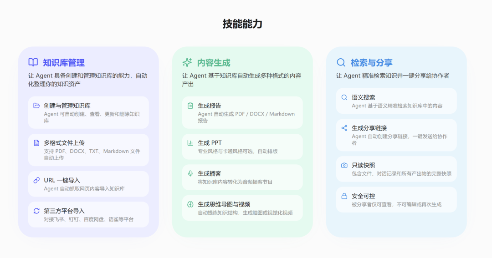
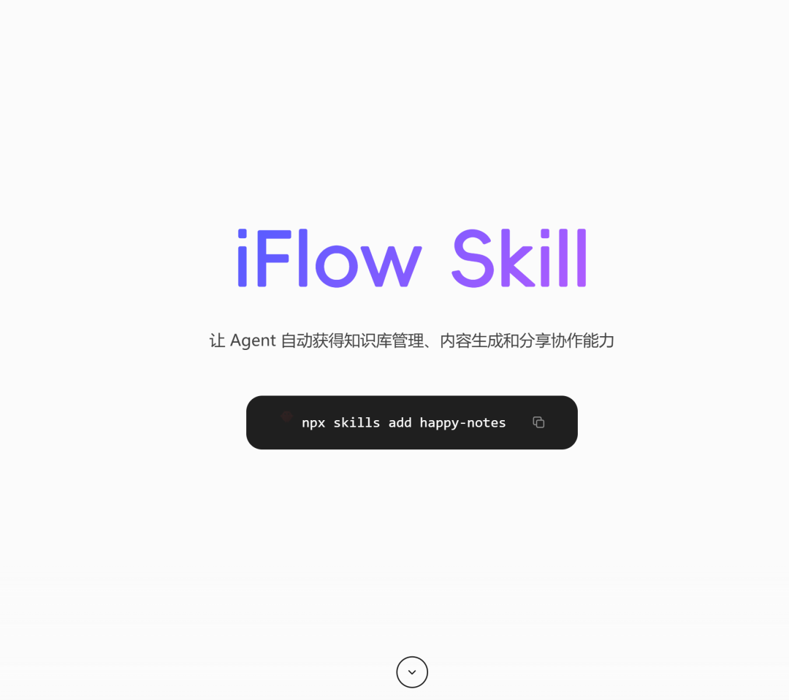
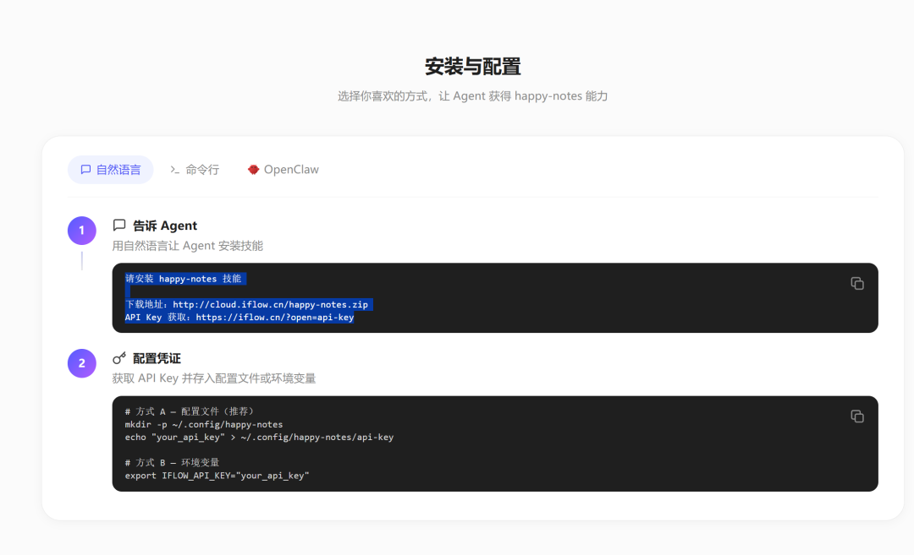
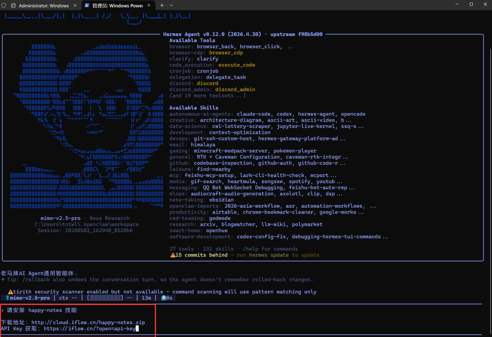
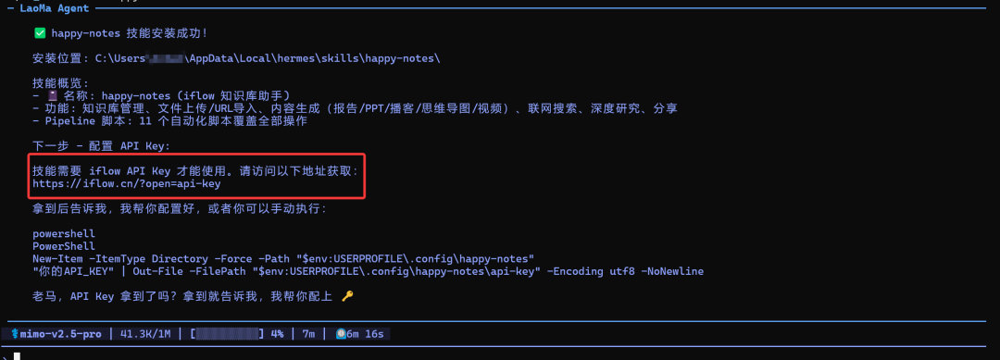
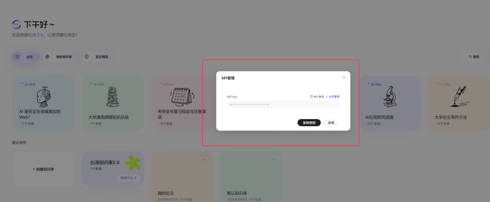
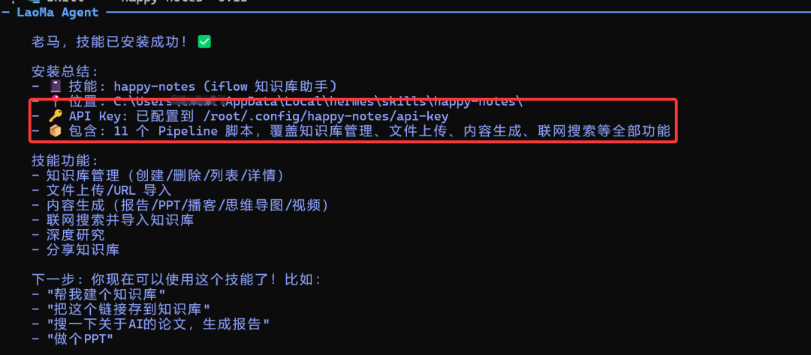
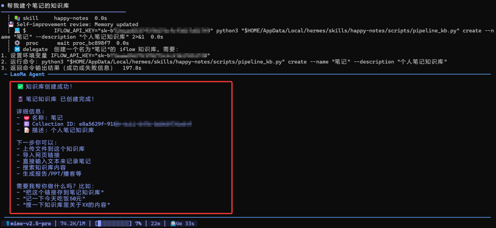
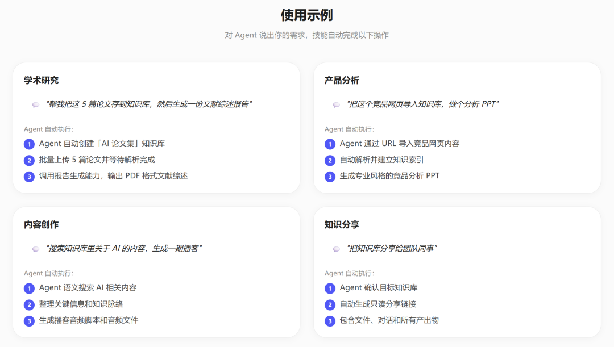
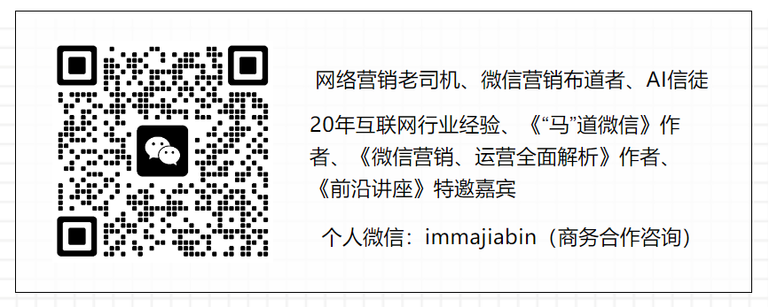

> 📎 来源: [马佳彬](https://mp.weixin.qq.com/s?__biz=MjM5ODAxOTA2Mg==&mid=2649975831&idx=1&sn=1cc28c44e452f9b6b7631d867f826203&chksm=bf4efaba157be25050dffad93e866b8438c30b638a883ee29c6f4a0fe9571ffa5b1cbd7db67d&mpshare=1&scene=1&srcid=0504oPJl8Fn0ApGq9BTV20F7&sharer_shareinfo=ce347a6c68f75ad61d37ac166bcc62db&sharer_shareinfo_first=ce347a6c68f75ad61d37ac166bcc62db) | 时间: 2026-05-04 20:47

---

**马佳彬**

微信改版啦，一定别忘记点击上方蓝色的公众号名称，进入公众号资料页面，在右上角点击“...”设为星标★，更多干货，不再错过！

知识库的搭建，无论对于养小龙虾还是养马来说，非常有必要。老马昨天在直播中也说过，你完全可以把OpenClaw和Hermes Agent的官方文档。

以及github仓库链接，丢给小龙虾和马去定时学习，并且把学习到的内容保存到记忆中。这样一旦发生报错等问题，它们可以从记忆中提取知识。

学会自己去修复自己，甚至于你要查询OpenClaw或者Hermes Agent的某项功能，某个命令啥的，直接问小龙虾跟马就行了。

现在公众号上泛滥的各种AI生成的所谓养虾养马的干货文章，无一例外都是把官方文档，github仓库上的内容，丢给AI去整理编写出来的。

虽然可能存在一些幻觉错误，但总归看起来中规中矩，像那么回事。不过作为知识库的话，查询起来是比你去翻找官方文档和仓库来得便捷。

今天继续给大家推荐一个Skill技能，它是由原Iflow的开发团队心流推出的Happy-Notes。Iflow编程Cli已成过去式，但心流团队依旧在积极研发Agent类产品。

Happy-Notes是一个Agent技能，用户无需学习API或命令行，通过自然语言指令（比如帮我建个知识库，把这几篇论文传上去，做份PDF报告）即可管理知识库。其主要功能包括：

知识库管理：创建、查看、重命名、删除知识库及查看详情。

文件管理：支持上传本地文件、导入网页URL、存入纯文本，以及文件的重命名、删除、批量删除和详情查看。

内容生成：基于知识库内容生成7种产出物，包括PDF报告、Word报告、Markdown报告、PPT（商务/卡通风格）、思维导图、播客和视频。

知识库内搜索：支持按文件名搜索和语义检索内容片段。

联网搜索：可搜索外部网页或学术论文，并自动导入知识库，可选生成报告。

深度研究：通过多轮联网搜索（支持WEB和SCHOLAR来源）自动生成研究报告。

分享功能：生成知识库的只读分享链接，供他人查看文件和产出物。

进度查询：随时查看生成任务的进度状态。

下面老马就为大家实际操作演示一下Happy-Notes技能的安装与使用。如果你也需要小龙虾跟马帮你完成知识库的搭建与管理，那不妨就用起来。

**Happy-Notes的安装与使用**

首先访问Happy-Notes Skill技能的官网：https://iflow.cn/inotebook/skill：

往下滑动网页，定位到安装与配置的内容：

这里推荐大家使用自然语言的方式去安装，命令的话有可能你在接入的机器人对话中无法执行，不如自然语言方便。

老马就以安装在Windows 11系统的Hermes举例，OpenClaw也可以安装的。还有Workbuddy，套壳龙虾之类的都支持，毕竟技能没有太多的要求，只要是AI Agent（智能体）基本都支持。

打开Hermes的终端，全部复制Happy-Notes的自然语言安装文字，输入后回车让马去安装即可：

这个过程需要稍微等待一下，因为要下载技能包及解压，复制到对应目录等流程。等一切操作完毕，就会返回技能安装成功的提示：

安装完Happy-Notes，下一步还需要获取一个API Key，发送过去配置一下。获取的方式也很简单，直接用电脑浏览器访问网址：https://iflow.cn/?open=api-key，就会自动生成API Key了：

复制一下API Key密钥，回到Hermes的终端，再次发送过去，让马自己去配置。同样稍等片刻，当弹出下面提示时，就说明API Key也是配置成功了：

Happy-Notes的整个安装与配置过程就是这么简单，至于如何使用它，其实官方网站上也给我们提供了一些示例，待会老马会贴在末尾。

简单地给大家演示一下，使用Happy-Notes创建一个新的笔记知识库。有了知识库，后面就可以把一些文章链接啥的收藏进去：

如图所示，老马只需要发送一句自然语言，Hermes就会使用Happy-Notes技能去创建一个知识库了。下面截图中的使用示例，大家也可以参考一下：

由于每个人的需求都不同，老马就无法一一照顾演示到了。Happy-Notes

技能的使用还是比较简单的，从知识库到工作流，可以说是一站式解决。

好了，以上就是今天的分享，欢迎关注、点赞、转发一键三连。有任何问题和需求，请在评论区留言，回见！

对了，老马最近刚创建了一个AI学习交流群，有兴趣进群的小伙伴可以添加老马微信号：immajiabin，添加好友时备注：进群（不备注不通过）。

