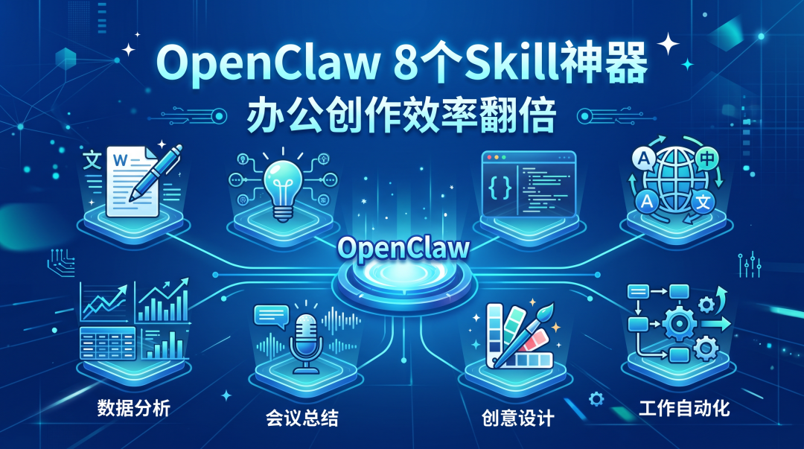
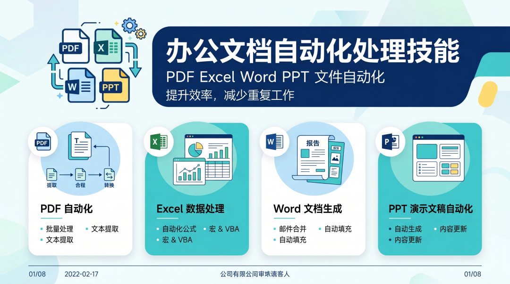
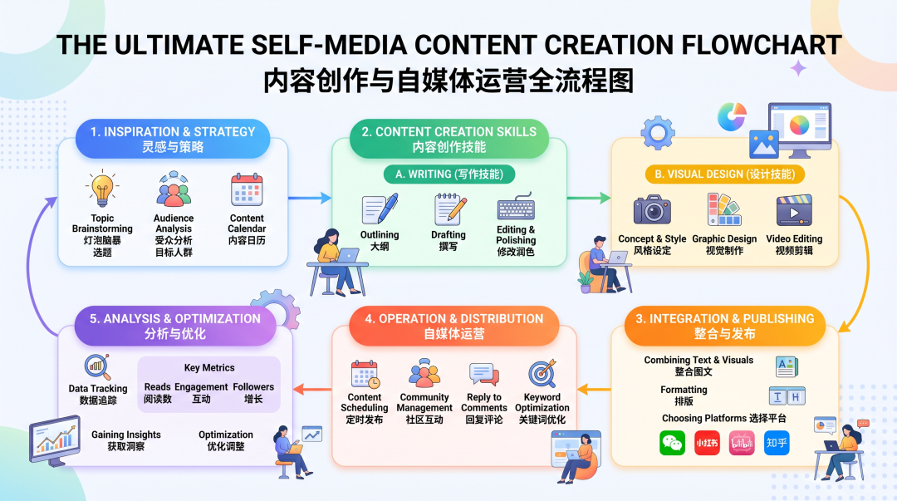
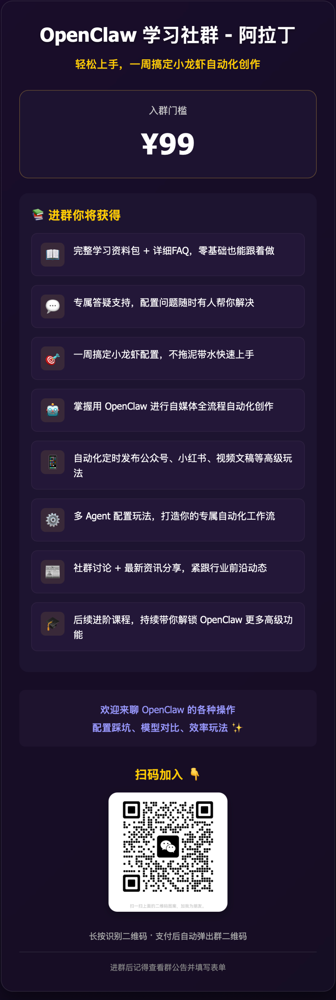
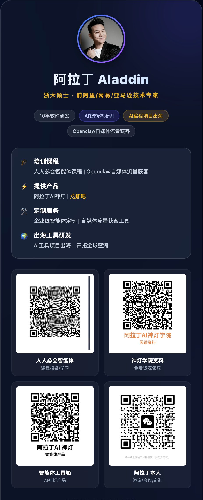

> 📎 来源: [阿拉丁AI神灯](https://mp.weixin.qq.com/s?__biz=MzA5MDEyMjAzMQ==&mid=2453732941&idx=1&sn=b33b9b75329e96df50d0f29bee00f646&chksm=86a3bb49c960594a4f01d856bd4f75db705a3eaa3b3ed4ac4b98d31f196bd1f917d41e02e9bb&mpshare=1&scene=1&srcid=0423HSmGnICquT9iyYr9E8l6&sharer_shareinfo=58ee56ae8013e03931e9be2aaa9654a4&sharer_shareinfo_first=58ee56ae8013e03931e9be2aaa9654a4) | 时间: 2026-04-23 03:55

---

上个月，一个做运营的朋友跟我吐槽。 

他说自己跟风装了 OpenClaw，满怀期待想要体验 AI 带来的效率革命。

 结果用了半个月，除了让它改改文案、写写邮件，别的什么都不会。

 他问我，是不是 OpenClaw 被吹得太神了，其实也就那样。

我没直接回答。 我只是打开他的 Skill 管理页面，给他装了三个 Skill。 

然后让他试试说，帮我把这 5 份合同 PDF 合并成一个，再提取第 3 页的表格数据。 他照做了。 

三十秒后，一份整理好的 Excel 文件出现在他桌面上。 他盯着屏幕，半天说不出话。

从 PDF 处理到 Excel 数据分析，从 Word 文档生成到 PPT 自动制作。 

他越试越兴奋，最后说了一句让我印象很深的话。 原来我之前用的，连 OpenClaw 10% 的能力都没发挥出来。

今天，我精选了 8 个最实用的。 覆盖办公文档处理和内容创作两大场景。 看完直接装，装好就能用。

## 第一部分：打工人的福音，文档处理四件套

职场人的时间，都浪费在哪里了？ 

答案是，各种文档的格式转换和数据搬运。

这些事情没有技术含量，却能吃掉你大半天的时间。 现在，全部交给 AI。

### 1. pdf Skill — 把 PDF 从格式牢笼里解放出来

PDF 这个东西，用的人都懂。 想改几个字，比登天还难。 想提取里面的表格，复制粘贴过来全乱了。 想把几份合同合并成一份，要找各种收费工具。

现在，有了这个 Skill。 你只需要说一句话。 帮我把这 12 份合同 PDF 合并成一份，然后把每份的金额和日期提取出来做成表格。

三十秒，搞定。

它能做什么。 提取文字和表格，不管是原生还是扫描版。 合并、拆分、旋转、调整顺序，想怎么来就怎么来。 加水印、加密、解密，一键完成。 扫描件 OCR 文字识别，直接变成可编辑文本。

**很多人不知道，PDF 最浪费时间的地方，不是阅读，是信息提取。**

### 2. xlsx Skill — 你的专属数据分析助理

Excel 这个东西，有人用了十年，还是只会求和。 公式记不住，数据透视表不会用，图表做出来丑得要死。 现在，这些你都不用会了。

你只需要说。 把这三个月的销售数据整理一下，按地区分组，计算环比增长率，再做一个柱状趋势图。

它来帮你搞定。

能做什么。 读取和编辑任何 Excel 文件。 自动添加公式，自动生成图表，自动清洗脏数据。 乱行、错误表头、重复项，全部自动处理。 CSV、TSV、各种格式互转。

**记住，你的价值是分析数据，不是整理数据。**

### 3. docx Skill — 专业文档，一键生成

我见过太多人，写一份项目汇报要花一整天。 不是内容想不出来，是格式调来调去太费时间。 目录要自动生成，页码要从正文开始算，页眉要奇偶页不同。 这些破事，能搞一下午。

现在，你只需要说。 帮我写一份项目季度汇报，包含背景、进展、风险、下一步计划，风格正式，自动生成目录。

十秒钟，一份排版精良的 Word 文档出现在你桌面上。

能做什么。 创建和编辑专业 Word 文档。 自动生成目录、页眉页脚、页码。 自动插入图片、表格、图表。 查找替换、批注、修订模式，全部支持。

**好的工具，就是把你的注意力从格式拉回到内容。**

### 4. pptx Skill — 从内容到幻灯片，全自动

做 PPT 是很多人的噩梦。 怕逻辑不清晰，怕排版不好看，怕配色太土。 结果花了三天做出来的 PPT，还是被老板打回来重写。

现在，你只需要负责想清楚说什么。 怎么做，交给它。

你只需要说。 帮我把这份产品方案做成 15 页 PPT，风格简洁商务，重点突出数据。

它来帮你搞定。

能做什么。 根据你的内容自动创建完整 PPT。 读取和修改已有 PPT。 提取 PPT 里的文字内容重新组织。 处理模板、备注、评论。

**大多数时候，不是你 PPT 做得不好，是你把太多时间花在了不该你花的地方。**

---

## 第二部分：团队协作的利器，在线文档连接器

现在大家都用在线文档协作了。 但最烦的是什么？ 是本地和在线之间来回切换。

这边刚在本地改完数据，那边要上传到在线文档。 那边刚在在线文档写完，这边要导出成 PDF 发客户。 来来回回，断点太多。

### 5. tencent-docs Skill — 直接操作腾讯文档，不用来回切

这个 Skill，直接打通了 OpenClaw 和腾讯文档。 你不需要打开浏览器，不需要上传下载。 直接在对话框里，就能操作所有腾讯文档。

能做什么。 创建任何类型的在线文档，文档、表格、幻灯片、思维导图、流程图、收集表。 管理整个知识库空间。 读取、搜索任何文档的内容。 编辑智能表格和在线文档。 重命名、移动、删除、复制，全部文件操作。

典型场景。 帮我在腾讯文档创建一个项目进度表，包含任务、负责人、截止日期、状态四列，然后把昨天的会议记录粘贴进去。

一句话，搞定。

**真正的效率提升，不是让你更快地切换工具，是让你不用切换工具。**

---

## 第三部分：内容创作者的神器，三个技能顶一个团队

如果你是做内容的。 如果你是自媒体、设计师、产品经理。 这三个 Skill，直接帮你把生产力翻三倍。

### 6. canvas-design Skill — 你的私人设计师

不会设计没关系。 不懂配色没关系。 不会 PS 没关系。

现在，你只需要说清楚你想要什么感觉。 它直接给你输出成品。

能做什么。 生成公众号封面图，各种风格都能做。 制作活动海报，尺寸、风格、内容你说了算。 创作品牌视觉素材，Logo、图标、宣传图。 任何静态设计作品，都能做。

典型场景。 帮我做一张科技感的公众号封面，主题是 AI 效率工具，蓝色调，简洁大气。

三十秒，一张专业级的封面图就出来了。

**好的内容 deserve 好的封面。以前你需要一个设计师，现在你只需要一句话。**

### 7. content-factory Skill — 内容生产流水线

很多人做内容，死在第一步。 想不出选题，不知道写什么。 好不容易想出一个选题，查资料又要花半天。

这个 Skill，直接帮你把整个内容生产流程自动化。 从选题研究，到资料收集，到大纲生成，到初稿撰写。 一条龙服务。

能做什么。 自动选题研究，帮你发现最近的热点和空白。 批量生成文章初稿，效率直接翻五倍。 品牌内容矩阵管理，多平台内容自动适配。 任何内容相关的工作，它都能帮你打前站。

典型场景。 帮我围绕 AI 效率工具这个主题，生成 5 篇不同角度的文章大纲，每篇包含三个核心观点和两个案例。

五分钟，五个完整的文章大纲就出来了。

**记住，AI 是你的研究员加初稿写手，你是主编。你只需要负责最后注入灵魂。**

### 8. frontend-design Skill — 一句话生成完整网页

这个 Skill，是最让我感到震撼的。 以前，你想要一个像样的网站。 你需要找产品经理梳理需求，找设计师做设计，找前端开发写代码。 三个人，两周时间，几万块钱。

现在，你只需要说清楚你想要什么。 一句话，它直接给你输出可运行的完整代码。

能做什么。 生成任何网页组件和完整页面。 制作落地页、Dashboard、个人主页。 美化现有界面，让你的网站焕然一新。 输出 React、HTML、CSS 代码，复制过去就能用。

典型场景。 帮我做一个个人博客的落地页，风格简约，包含头像、简介、文章列表、订阅按钮，响应式设计。

一分钟，一个完整的网页代码就出来了。

**技术门槛被拉平后，真正的门槛，变成了想象力。**

---

## 第四部分：按身份推荐，直接抄作业

不用纠结装哪个。 

看你是谁，直接对号入座。

**如果你是普通职场人。** 优先装，pdf 加 xlsx 加 docx 加 pptx。 这四个，每天都能用得上。 装完你就会发现，以前要做一天的活，现在半小时就搞定了。

**如果你是内容创作者或自媒体。** 优先装，canvas-design 加 content-factory 加 frontend-design。 这三个，直接帮你把内容生产效率翻三倍。 以前你一个月写四篇文章，现在你一个礼拜就能写四篇。

**如果你是团队协作。** 优先装 tencent-docs。 在线协作的效率提升，谁用谁知道。 再也不用在本地和在线之间来回切换了。

**如果你是全能型选手。** 全部装上。 反正也占不了多少空间。 技多不压身，Skill 多了也不压身。

**选择困难症的终极解决方案，就是全要。**

---

## 第五部分：怎么安装，一句话的事

安装很简单。 不需要找安装包，不需要配置环境。 在 OpenClaw 对话框里直接说。

帮我安装 pdf skill。 安装 canvas-design。

或者在设置里的 Skill 管理页面搜索安装。

就这么简单。 三十秒，你的 OpenClaw 就完成了一次能力升级。

---

## 最后，说几句真心话

我一直在想，AI 时代，真正的效率革命到底是什么。

以前我以为，是 AI 能帮我们做更多的事，现在我明白了，不是。 真正的效率革命，是工具的抽象层级变了。

以前，你操作电脑。 你要告诉它，先点哪里，再点哪里，最后点哪里。 你是操作员。

现在，你指挥 AI。 你只需要告诉它，你想要什么结果。 怎么做，是它的事。 你是指挥官。

今天推荐的这 8 个 Skill。 没有一个是花架子。 每一个，都能直接解决你工作中的一个真实痛点。 每一个，都能实实在在帮你省时间。

**记住，不是 AI 有多厉害，是你用 AI 做了什么事，才决定了 AI 对你的价值。**

最后问你一个问题。 你的 OpenClaw，现在装了几个 Skill。 

它是一个只会聊天的机器人，还是一个能帮你干活的超级助手。

答案，在你手里。

---

