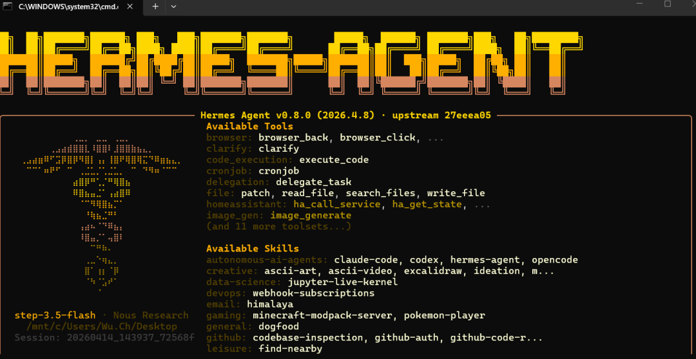
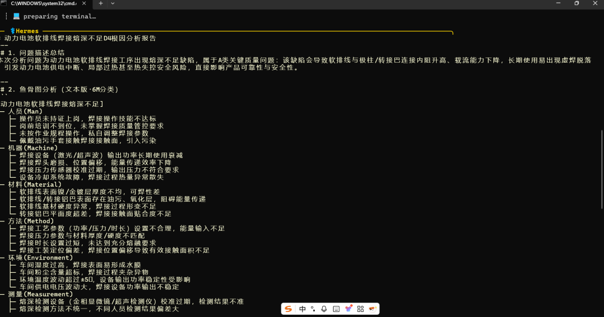
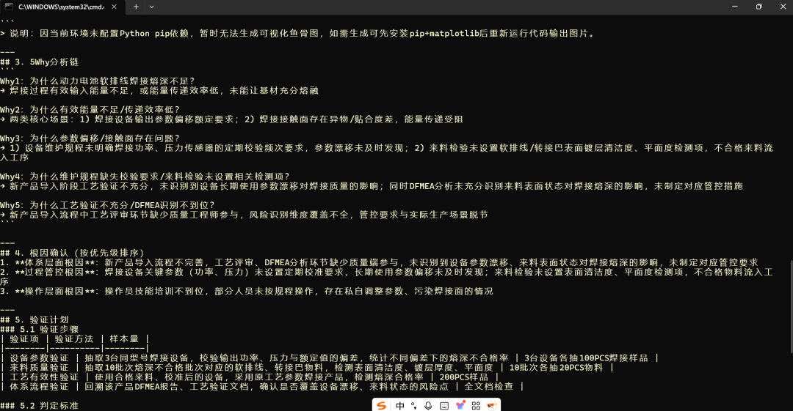

> 📎 来源: [AI智能时代笔记](https://mp.weixin.qq.com/s?__biz=MzkzODkzMzc4NQ==&mid=2247484103&idx=1&sn=4e2180043a7bc4871635abf615083f38&chksm=c3b08e9ae57ed7065936bab975fedb1662f079d23af4544f1cb414e5da1cf06a34c7487ed52b&mpshare=1&scene=1&srcid=0422u3GcgVhXuouheFt7uHqg&sharer_shareinfo=c9b25d49a195f1d235807579dd5ee9a8&sharer_shareinfo_first=c9b25d49a195f1d235807579dd5ee9a8) | 时间: 2026-04-22 01:11

---

自 2025 年末以来，AI Agent 领域经历了从“对话模型”向“执行实体”的范式转移。OpenClaw（俗称“龙虾”）率先打破僵局，而 Hermes Agent 则以“自进化”为核心迅速崛起。以下是两者的深度对比。







## 一、 快速概览：谁是谁？

| 维度 | Hermes Agent (爱马仕) | OpenClaw (龙虾) |
| --- | --- | --- |
| **开发者** | Nous Research | Peter Steinberg (奥地利工程师) |
| **核心定位** | **模块化、自进化**的多智能体运行时 | **网关优先、全渠道**的个人助手平台 |
| **编程语言** | Python (原生，强调算法与逻辑) | TypeScript (90%+, 强调系统连接与并发) |
| **GitHub 战绩** | 64k+ Stars (极速上升) | 350k+ Stars (社区根基深厚) |
| **核心哲学** | 让 Agent 在执行中学习并改进 | 让 Agent 连接一切平台与工具 |

## 二、 核心架构对比：深度执行 vs. 广度连接

### 1. Hermes Agent：Agent-First (智能体优先)

Hermes 的架构核心是一个**同步的“执行-学习-改进”循环**。

- **自进化循环**：每当任务执行成功，它能自动将流程固化为“技能”。
- **单体深挖**：它更像是一个具有极高自主性的个体，能自我反思并优化推理逻辑。
- **多端执行**：支持 Docker、SSH、Daytona 和 Modal 等多种隔离环境，强调安全性。

### 2. OpenClaw：Gateway-First (网关优先)

OpenClaw 围绕中心控制平面(Gateway)构建，是一个典型的长驻服务。

- **消息中枢**：它更像是一个调度台，管理着所有的会话、路由、工具调用和状态。
- **多渠道集成**：原生支持 50+ 平台（Telegram, Discord, 飞书等），适合作为全天候管家。
- **企业级潜力**：分层架构使其更容易在企业私有云中横向扩展。

## 三、 快速安装与部署指南

两者在部署逻辑上存在显著差异：**OpenClaw 追求一键傻瓜式，Hermes 追求环境隔离。**

### 1. OpenClaw：极速上线 (Node.js 环境)

OpenClaw 提供了目前市面上最简单的安装体验：

- **Windows (PowerShell 管理员):**

  ```
  iwr -useb [https://openclaw.ai/install.ps1](https://openclaw.ai/install.ps1) | iex
  ```
- **macOS / Linux:**

  ```
  curl -fsSL [https://openclaw.ai/install.sh](https://openclaw.ai/install.sh) | bash
  ```
- **初始化：** 安装后运行 `openclaw onboard` 即可通过交互界面配置模型（如 DeepSeek、Claude）和通道。

### 2. Hermes Agent：环境优先 (Python 环境)

Hermes Agent 建议在隔离环境运行以确保其自动执行代码时的安全：

- **一键安装脚本 (推荐):**

  ```
  curl-fsSL[https://raw.githubusercontent.com/NousResearch/hermes-agent/main/scripts/install.sh](https://raw.githubusercontent.com/NousResearch/hermes-agent/main/scripts/install.sh) | bash
  ```
- **配置模型：**

  ```
  hermes setup  # 进入初始化向导hermes model  # 配置 API 密钥或自定义端点
  ```
- **Windows 用户注意：** 建议在 **WSL2** 环境下运行，因为其内置的浏览器自动化（Playwright）在 Linux 子系统下表现更稳。

## 四、 记忆系统：这是两者的“分水岭”

- **Hermes Agent (程序化记忆)**：

- 不仅记住对话，还记住“任务成功路径”。
- **调教效率**：通常 1-2 次反馈后，它就能自动生成 `SKILL.md` 并永久掌握该复杂操作。

- **OpenClaw (梦境系统)**：

- 引入了 **“梦境 (Dreaming)”** 离线处理机制，在深夜或空闲时对历史数据进行压缩和关联，解决了长期对话后的“智力衰退”问题。

## 五、 选型指南：你该选哪一个？

| 场景 | 推荐方案 | 理由 |
| --- | --- | --- |
| **极速上手 / 个人管家** | **OpenClaw** | 插件多，能秒接微信/飞书，UI 漂亮。 |
| **深度开发 / 自动化流程** | **Hermes Agent** | 会自进化，生成的技能文件可跨设备复用。 |
| **企业私有化部署** | **OpenClaw** | 网关架构天然支持多用户隔离和权限控制。 |
| **追求本地隐私 / 极客** | **Hermes Agent** | Python 原生，方便修改底层逻辑，隔离性极佳。 |

## 六、 Skills 技能系统：人工编排 vs. 自动生成

技能系统是 Agent 从“只会聊天”到“能干活”的核心。

### 1. OpenClaw：丰富的插件商店 (Marketplace)

OpenClaw 采用的是类似 iPhone App Store 的逻辑：

- **社区驱动**：拥有超过 500+ 预构建技能，涵盖财务、日历、智能家居控制等。
- **结构化定义**：开发者通过定义标准的 JSON Schema 来声明工具，用户只需点击“安装”即可激活。
- **稳定性高**：由于技能由人类编写，逻辑清晰，适合高频、标准化的固定任务。

### 2. Hermes Agent：可移植的自进化技能 (SKILL.md)

Hermes 的技能系统极具前瞻性：

- **动态掌握**：如果 Hermes 通过代码执行解决了一个新问题，它会提示用户：“我已掌握这项新技能，是否保存？”
- **SKILL.md 格式**：它会自动生成一个包含自然语言描述和代码片段的 `.md` 文件。
- **跨设备迁移**：这个 `SKILL.md` 文件是完全可移植的，你可以将其拖入另一个 Hermes 实例的 `skills/` 文件夹，后者将瞬间获得该能力，无需重新训练。

##

## 七、 总结

如果把 **OpenClaw** 比作一部功能全、连接性强的**智能手机**，那么 **Hermes Agent** 就是一个**会自我进化的机器人**。

**2026 年的黄金搭配：** 许多进阶玩家选择使用 `hermes claw migrate` 命令。这允许你将 OpenClaw 的连接能力与 Hermes 的深度推理能力结合。无论你选哪个，Agent 已经从“聊天机器人”进化到了“数字化员工”的新阶段。

免责声明：本文部分内容根据网络信息整理，文章版权归原作者所有，向原作者致敬！转载目的在于传递更多信息、积善利他，如涉及作品内容、版权和其它问题，请跟我们联系删除！   由于公众号平台更改了推送规则，如果不想要错过“汽车行业品质视界”的干货文章   和限时活动，记得读完点一下“在看”，这样每次可以第一时间看到最新文章。

喜欢文章的PDF档及更多知识请加入请加入星球下载（定期更新精益生产、汽车行业质量管理体系、六大工具、数字化转型等知识）。


