> 📎 来源: [林月半子的AI笔记](https://mp.weixin.qq.com/s?__biz=MzU4MjY5NTc4OQ==&mid=2247499059&idx=1&sn=6349615c0cb56c7858de8e20a9a4010d&chksm=fcc0331d285f5019b33ec898915893bb7fb0dbfa6e9049fa8ed8d838e2d0f1944fb6496af10d&mpshare=1&scene=1&srcid=0420Sq7vKjbB9e5waVoZNTnD&sharer_shareinfo=cc84b88697ff2a5174476037665635b4&sharer_shareinfo_first=cc84b88697ff2a5174476037665635b4) | 时间: 2026-04-20 20:40

---

关注 「**林月半子的AI笔记**」，设为「**星标**」

我是林月半子，帮你用AI和自动化工具，「**提升10倍工作效率****」！**

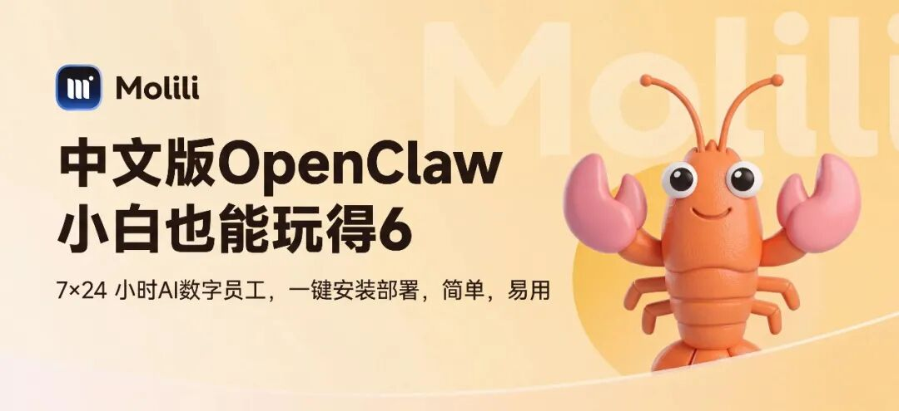

前段时间，一个做运营的朋友在微信上问我：

🙋

我听说 OpenClaw 龙虾很厉害，你能帮我装一下吗？我完全不懂代码。

我当时心里咯噔了一下。

不是因为帮不了她。是因为我知道，真要让她自己装，光是解释清楚这几道坎，她大概率当场放弃——

要有能访问的网络环境，要自己去申请配置模型 API Key，还要搞懂什么是 Skill、怎么装、装哪个……

每一步对技术人来说稀松平常，但对普通用户来说，每一步都是一道墙。

这不是她的问题。是原版 OpenClaw 的使用门槛，本来就不是为普通人设计的。

## 原版龙虾到底有多劝退？

我们先说实话。

OpenClaw 原版非常强大，但它的安装流程，说白了是给技术极客准备的。

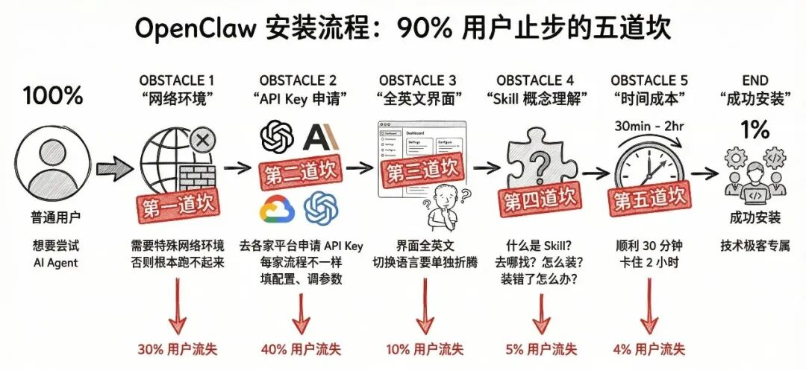

不是普通用户不够努力，是这个工具本来就没打算让普通用户轻松用上。

## 然后我发现了 Molili

当贝出品。我特意查了一下，1 月底 2 月初就上线了。

也就是说，在大多数人还在折腾原版的时候，中文版龙虾其实已经出来了。

所以严格来说，Molili 是目前国内第一个中文版 OpenClaw 龙虾。

装好就是中文。不需要找菜单、不需要切换、不需要任何配置。

我让朋友自己试了一遍，全程她没问任何问题，3 分钟搞定。

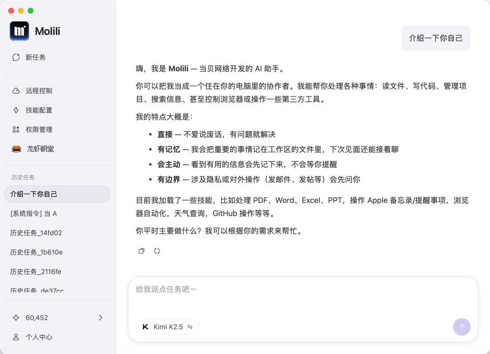

## 安装全流程：跟着走，3 分钟够了

### Step 1：下载安装包

打开 Molili 官网，直接下载对应系统的安装包（Windows / Mac 都有）。

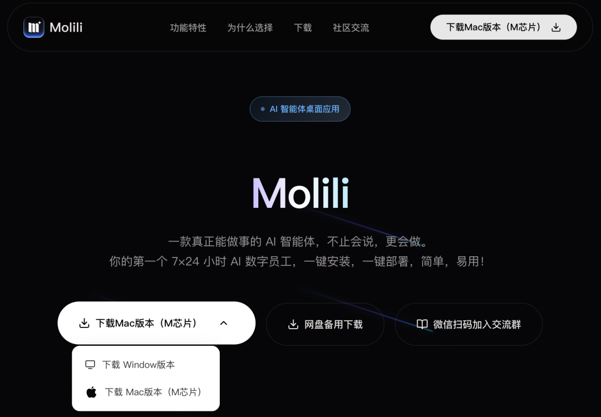

### Step 2：一键安装

双击安装包，一路下一步。

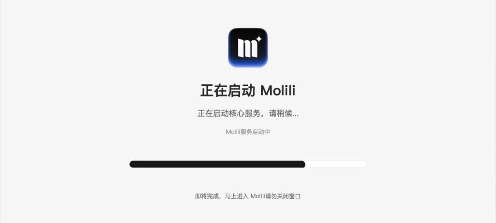

全中文界面，没有任何需要填的配置项。

### Step 3：选择大模型

安装完打开，第一个界面会让你选择使用哪个大模型。

这里我要多说两句。

国产模型这一年进步很快，DeepSeek、通义千问、Kimi、智谱 GLM……在中文场景下的表现已经非常能打，有些任务上甚至比海外模型更贴合国内用户的使用习惯。

问题不是模型能不能用，而是你能不能方便地用上它们。

原版 OpenClaw 要自己去各家平台申请 API Key，配置起来麻烦不说，还得一个个搞清楚哪家的接口怎么填。

Molili 把这些全内置好了，国产御三家 Kimi、MiniMax、智谱 GLM 全部在列，可视化选择，点一下切换，不需要动任何配置。

选完直接用。

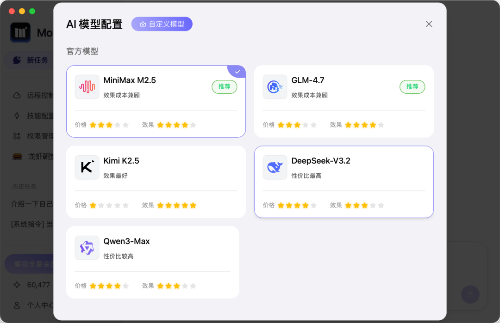

### Step 4：开始使用

完事了。

真的完事了。

这就是所谓的"开箱即用"，不是广告词，是字面意思。

## 装好之后，第一件事：接入微信

装好能聊天，这没什么稀奇。

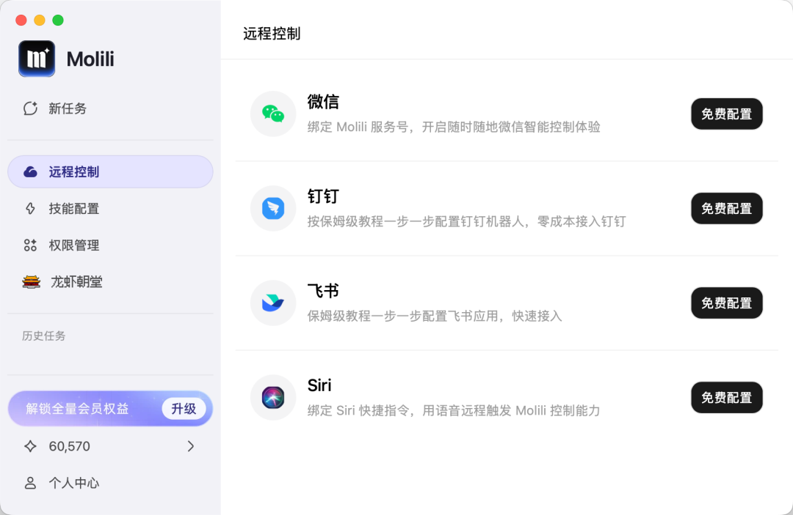

真正让我觉得有意思的，是 Molili 的「远程控制」模块——微信、钉钉、飞书、Siri，四个入口，跟着内置教程一步步走，不需要写任何代码。

我们就以接入微信为例。

配置入口在「远程控制 → 微信」，点进去是保姆级分步教程，绑定 Molili 服务号，按步骤走完就好。整个过程大概 5 分钟。

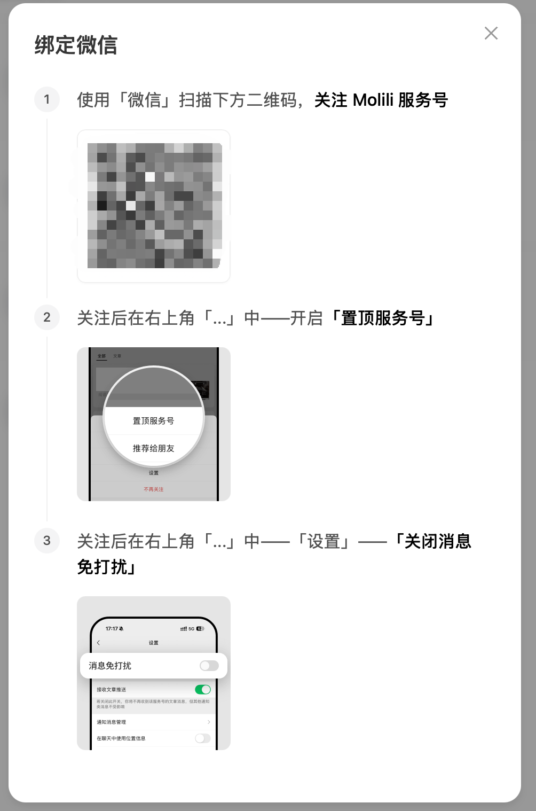

配置完之后，直接在微信对话框里发指令——让它打开浏览器搜索内容、整理信息、执行任务，它会一步步反馈给你它在做什么，做完了告诉你结果。

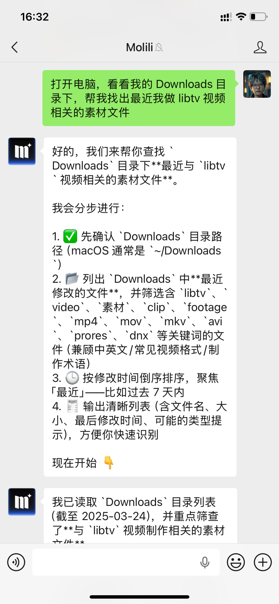

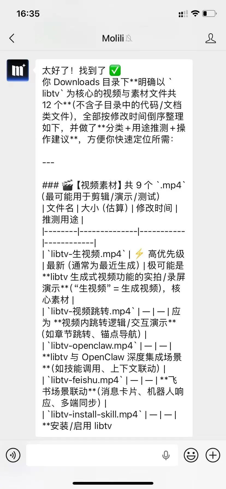

不需要开电脑，不需要打开 App。手机微信发一条消息，AI 帮你在电脑上把事情办好。

这才是「随时随地」的正确打开方式。

钉钉和飞书的接入逻辑类似，职场用户可以直接在熟悉的 IM 软件里唤起 AI，会议记录整理、日报生成、任务跟进。

不需要切换任何窗口，在哪工作就在哪用。

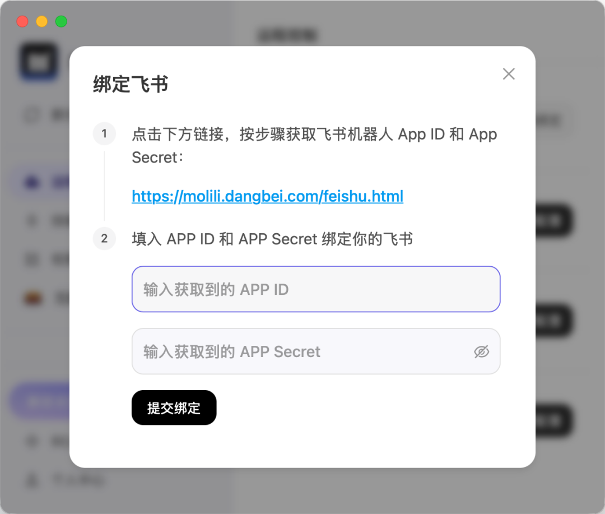

## 不止是工具，背后还有一个技能生态

说句实话，很多人用 AI 工具，用来用去就是在聊天。

装好 Molili 之后，我顺手去查了一下它背后的技能来源，发现他们接入了一个叫 CocoLoop 的技能商店。

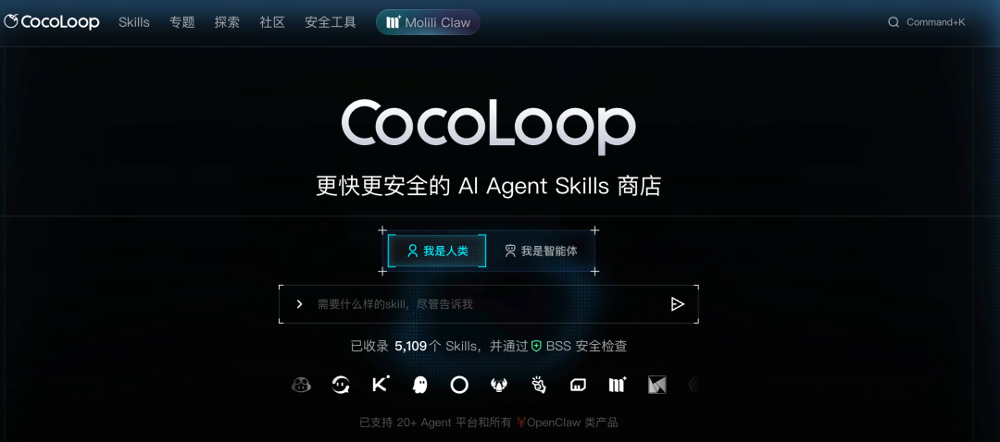

官网显示已收录 5,109 个 Skill，全部通过 BSS 安全检查，支持 20+ Agent 平台和所有 OpenClaw 类产品。

这个发现让我对 Molili 的定位理解有点不一样了。

它不只是一个"好装的龙虾"，更像是一个中文 AI 技能生态的入口。

你可以把 Skill 理解成，给 AI 装上不同的能力包。不是让它更会聊天，而是让它真的能替你干活。

📌

工具解决的是能不能用，生态解决的是能用来干什么。

Molili 两个都在做。

## 顺带说一个细节：权限管理

用过原版 OpenClaw 的人应该知道，安全问题一直是个隐患。

我之前专门写过[一篇文章](https://mp.weixin.qq.com/s?__biz=MzU4MjY5NTc4OQ==&mid=2247499019&idx=1&sn=d7f2375f18f6ba7c21beaea589311d0e&scene=21#wechat_redirect)聊这个——很多新手不懂权限的概念，看到设置项就全部打开，结果把一些高危操作权限也一并放开了，自己完全不知道。

Molili 在这块处理得让我眼前一亮。

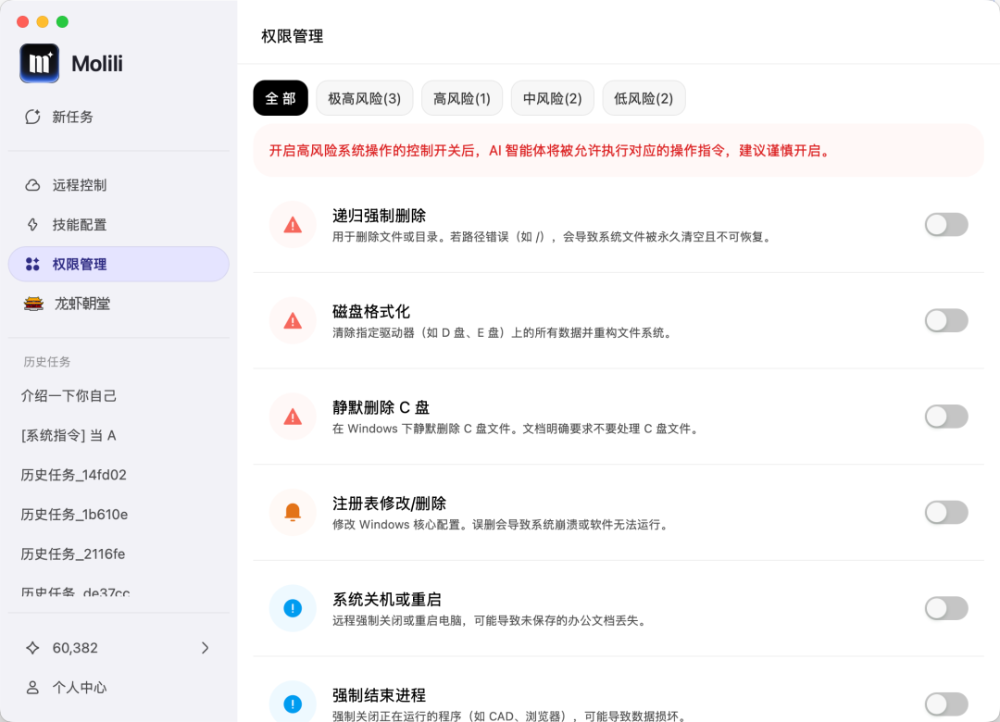

它专门做了一个「权限管理」模块，把所有操作按风险等级分类标注：极高风险、高风险、中风险、低风险，每一项旁边都写清楚这个权限具体会执行什么操作——比如「递归强制删除」会用 rm -rf 删除指定路径下所有文件，「磁盘格式化」会清空并重构驱动器……

高风险操作默认全部关闭，你看得懂再开，看不懂就别碰。

这个设计思路其实很简单：不是让用户变成安全专家，而是让风险在用户面前变得可见。

📌

用 AI Agent 最怕的不是它不够强，而是它太强、你又不知道它在干什么。Molili 这个模块，解决的就是这个问题。

## 说句实话

现在市面上的"龙虾"越来越多了。Kimi 有自己的，腾讯有自己的，网易、MiniMax……大厂几乎都出了。

选哪个？

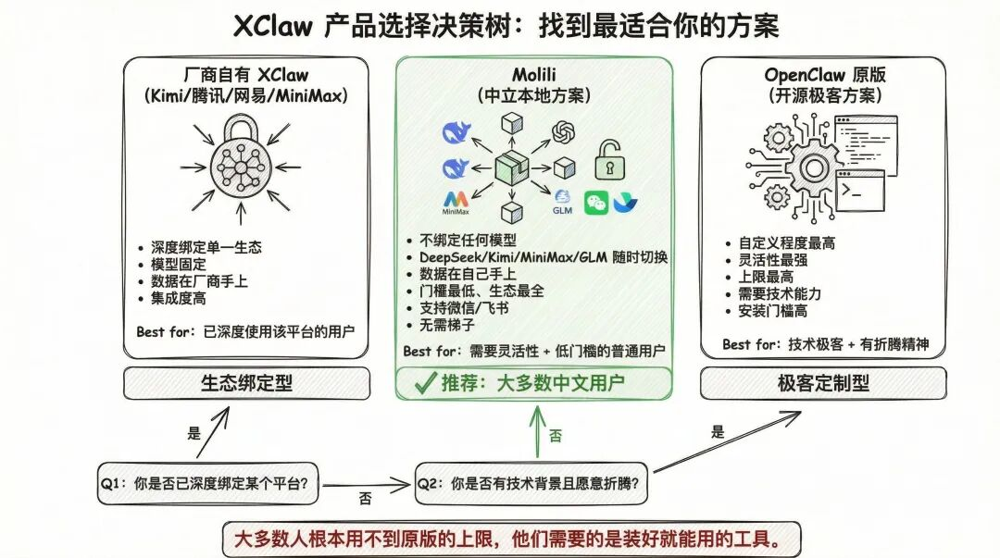

厂商自己的 XClaw，本质上是为了把你留在他们的生态里。

Molili 不一样的地方在于，它不绑定任何一家模型。DeepSeek、Kimi、MiniMax、GLM，想换随时换，数据也在自己手上。

当然，如果你本身就深度绑定某个平台，用它家的 XClaw 也没什么问题。但如果你想要一个中立的、可以自由组合的中文本地龙虾，Molili 目前是我见过门槛最低、生态最全的选择。

玩过原版 OpenClaw 的朋友可能还会问：和原版比，功能上有没有缩水？

有。

原版的自定义程度更高，对技术极客来说灵活性更强。如果你本身就懂部署、有折腾精神，原版的上限更高。

但问题是，大多数人根本用不到那个上限。

他们需要的，是一个装好就能用、不用梯子、能接微信和飞书、能跑国产模型的工具。

Molili 做的，就是这件事。

📌

用原版是因为你能，用厂商 XClaw 是因为你在他们生态里，用 Molili 是因为你想自己说了算。

没有对错，选适合自己的就行。

## 写在最后

我朋友后来告诉我，她用 Molili 配了一个自动整理会议记录的工作流，现在每周能省出将近 4 个小时。

她说："我当时就想用，只是怕麻烦。结果 3 分钟就搞定了，我还以为自己弄错了。"

没弄错。就是这么简单。

好的工具不该有门槛，它只该有用。

你身边有没有一直想用龙虾、但被原版劝退的朋友？

这篇转给他 👆

觉得有用的话，点个赞或者在看，让更多人看到～
