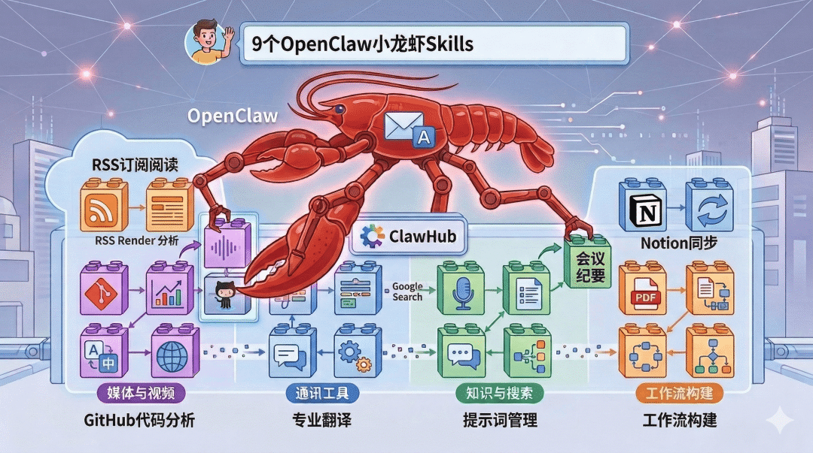

> 📎 来源: [可乐的数据分析之路](https://mp.weixin.qq.com/s?__biz=MzI3NjA5MzA4NQ==&mid=2649576569&idx=1&sn=83aa714397fb507976ac6ab7f66a8ce4&chksm=f2afac8f5861108eaf80b0a2c698b2d8dc05701ededc08996b1260ad6d6bc558a1e9f7fbec77&mpshare=1&scene=1&srcid=0420f1WH73FUigCG1aTAu9nJ&sharer_shareinfo=2813dde7c9fbcf6575feb8dc246cc2b7&sharer_shareinfo_first=2813dde7c9fbcf6575feb8dc246cc2b7) | 时间: 2026-04-20 15:38

---

哈喽大家好，我是可乐！上一篇文章中我们介绍了  OpenClaw小龙虾的Skills，这篇来记录一下我常用的9个Skills。

当我的小龙虾有了这9个技能后，效率有了大大的提升，可以实打实的感受到AI动起来干活了。



下面列一下这9个Skills，有需要的话可以做一个参考。在ClawHub中搜索名字选择下载量大的Skills即可。

```
1. RSS Reader（RSS订阅阅读）
```

如果你平时需要关注很多网站、博客或者行业资讯，这个技能会非常方便。它可以自动抓取RSS源并总结最新内容，让AI每天帮你生成信息简报。

适合用户：

行业研究、信息跟踪、自媒体作者

```
2. Email Assistant（邮件助手）
```

这个技能可以帮助AI读取邮件内容、自动总结邮件重点，甚至可以帮你生成回复草稿。

适合场景：

商务沟通、客户邮件处理、日常办公

```
3. Notion Sync（Notion同步） 
```

如果你使用Notion做知识管理，这个技能可以让OpenClaw直接读取或更新Notion内容。

适合场景：

知识库管理、项目记录、AI辅助写作

```
4. GitHub Analyzer（GitHub代码分析）
```

这个技能可以读取GitHub仓库并分析代码结构，例如总结项目功能、解释代码逻辑等。

适合用户：

开发者、技术研究人员

```
5. Meeting Summary（会议纪要）
```

如果你经常开会，这个技能可以把会议记录自动整理成结构化纪要，包括行动项和重点结论。

适合场景：

团队会议、项目讨论、工作复盘

```
6. PDF Extractor（PDF信息提取）
```

虽然File技能也能读取PDF，但这个技能专门优化了  PDF结构提取 ，例如表格、章节标题等。

适合场景：

学术论文、行业报告、政策文件分析

```
7. Translation Pro（专业翻译）
```

这个技能在普通翻译基础上增加了专业术语识别 ，非常适合技术文档或商业文档翻译。

适合场景：

技术资料、跨语言沟通、国际项目

```
8. Prompt Library（提示词管理）
```

如果你经常使用AI工具，这个技能可以帮助你管理和分类各种提示词模板。

适合用户：

AI重度用户、内容创作者、AI开发者

```
9. Workflow Builder（工作流构建）
```

这个技能可以把多个Skills串联成自动化流程，例如：

抓取新闻 → 总结 → 自媒体平台文章

这个技能可以连续的执行，使用这个需要根据自己的使用场景来构建好流程。

适合场景：

内容生产、自动化办公、AI流程管理

---

Skills用的好可以极大的提升小龙虾的工作的效率，会让你的小龙虾用起来智能程度很高，就像一个真正的私人助理，随时可以响应你分配的任务。

今天的文章就到这里了，后续会继续分享小龙虾相关的内容，如果有问题，可以随时交流。

加我微信（请备注目的），咨询任何AI问题


