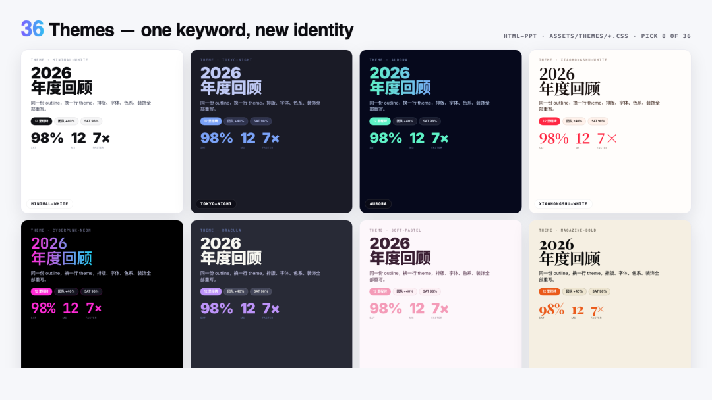
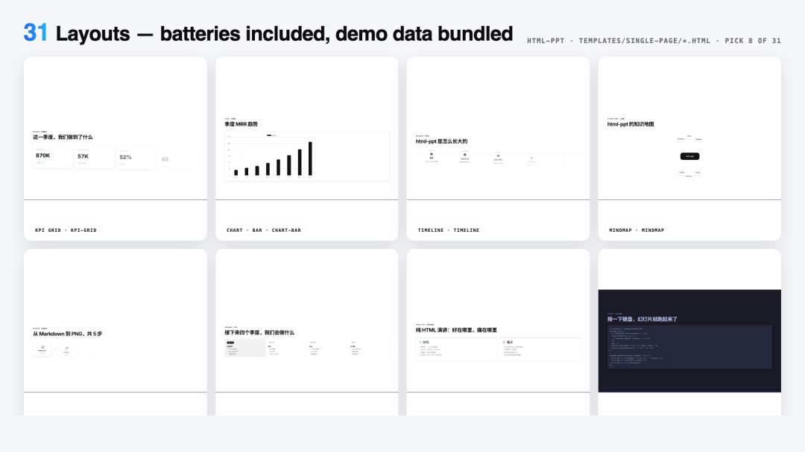
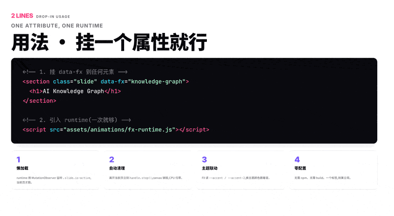
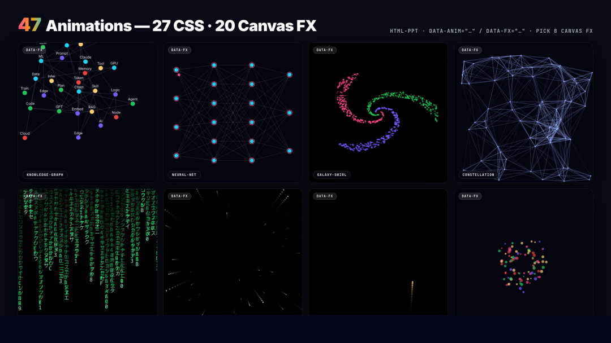
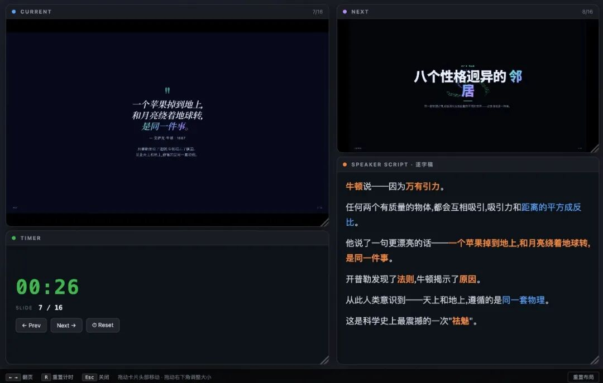

> 📎 来源: [物联网星球](https://mp.weixin.qq.com/s?__biz=MzkzMDQ0MjE3Mg==&mid=2247501922&idx=1&sn=ffa496bbf921d0877824c4bf8750ae45&chksm=c3c029ea03cdb77883933b8e5592ac84531a2424815f9d99bdc8126e4bbc21f89675761a4ce4&mpshare=1&scene=1&srcid=0507AMfgOFfcm1cSsFLKBTji&sharer_shareinfo=e247cb65d1e66075f589f4f03d7be4f3&sharer_shareinfo_first=e247cb65d1e66075f589f4f03d7be4f3) | 时间: 2026-05-07 21:26

---

**36 套主题、15 套完整模板、31 种页面布局、47 个动效——**

**还有一个让全场闭嘴的演讲者模式。**

```
html-ppt-skill
```

。

它不是"帮你生成一个 PPT 文件"，它是**帮你做一个真正的 HTML 演示文稿**——36 套设计师主题随意切换，47 种动效（27 个 CSS + 20 个 Canvas FX），15 套完整 deck 模板直接套用，最骚的是那个**演讲者模式**，按一个 

```
S
```

 键，整套演讲工具就弹出来了。


开源项目，MIT 协议，零构建，纯静态 HTML/CSS/JS。

---

## 一句话总结

> **html-ppt-skill 是一款专业级的 Agent Skill，让 AI 用自然语言做出真正能上台讲的 HTML 演示文稿。**

它本质上是给 AI 用的 PPT 工作台——AI 理解了你的需求之后，直接生成一套完整的 HTML 文件。换主题？改一行 

```

```

 就够了。想加动效？指定一个名字就行。想导出 PNG？一条脚本命令搞定。

---

## 🎨 36 套主题

这是让我最意外的部分。



36 套主题，不是 36 种颜色，而是 36 套完整的 **CSS Design Token 系统**——字体、间距、渐变、阴影、圆角，全部统一规划。

选几个我印象深的：

| 主题名称 | 风格 |
| --- | --- |
| ``` cyberpunk-neon ``` | 赛博朋克霓虹，荧光色+暗底 |
| ``` glassmorphism ``` | 毛玻璃质感，半透明卡片 |
| ``` neo-brutalism ``` | 新丑萌，粗黑边框高对比 |
| ``` editorial-serif ``` | 杂志编辑风，高端大气 |
| ``` xhs-white-editorial ``` | 小红书白底杂志风 |
| ``` blueprint ``` | 蓝图风，线条+网格 |
| ``` vaporwave ``` | 蒸汽波，粉色+渐变 |
| ``` corporate-clean ``` | 企业商务，干净克制 |
| ``` magazine-bold ``` | 大胆杂志风 |

每个主题都是一个单独的 CSS 文件。在 HTML 里只需要换一行：

```
<link rel="stylesheet" href="assets/themes/cyberpunk-neon.css"
```

整份 deck 瞬间换皮，所有排版、配色、字体全部重排，**不需要重新生成任何内容**。

这一点，做过企业模板的人都知道有多值钱。

---

## 📑 15 套完整 Deck 模板

光有好主题不够，你还需要一个合理的页面结构。



项目内置了 15 套完整的多页 deck 模板，每个都是一个自包含的文件夹，包含完整的封面、目录、内容页、结尾：

**提炼款（从真实作品提炼）：**

- 小红书白底杂志风 (

  ```
  xhs-white-editorial
  ```

  )
- 暗底力导向知识图谱 (

  ```
  graphify-dark-graph
  ```

  )
- 蓝图/架构图风 (

  ```
  knowledge-arch-blueprint
  ```

  )
- 终端赛博朋克风 (

  ```
  hermes-cyber-terminal
  ```

  )
- 紫色渐变卡片 (

  ```
  obsidian-claude-gradient
  ```

  )
- 红/琥珀警示风 (

  ```
  testing-safety-alert
  ```

  )
- 柔和马卡龙图文 (

  ```
  xhs-pastel-card
  ```

  )
- 极简方向键导航 (

  ```
  dir-key-nav-minimal
  ```

  )

**场景款：**

- 投资人 Pitch Deck (

  ```
  pitch-deck
  ```

  )
- 产品发布会 (

  ```
  product-launch
  ```

  )
- 技术分享 (

  ```
  tech-sharing
  ```

  )
- 周报模板 (

  ```
  weekly-report
  ```

  )
- 小红书图文 9 页 3:4 (

  ```
  xhs-post
  ```

  )
- 教学模块 (

  ```
  course-module
  ```

  )
- **演讲者模式完整模板** (

  ```
  presenter-mode-reveal
  ```

  ) ✨

每一套模板都是 scoped CSS——多个模板同时加载也不会互相污染。

---

## 🧩 31 种单页布局

每个 deck 里的每一页，都从这 31 种布局里挑选：



> cover · toc · section-divider · bullets · two-column · three-column · big-quote · stat-highlight · kpi-grid · table · code · diff · terminal · flow-diagram · timeline · roadmap · mindmap · comparison · pros-cons · todo-checklist · gantt · image-hero · image-grid · chart-bar · chart-line · chart-pie · chart-radar · arch-diagram · process-steps · cta · thanks

每种布局都带真实的示例数据，拖进去就能看到效果。

---

## ✨ 47 个动效

**27 个 CSS 动画**，轻量、方向性淡入：

```
rise-in
```

、

```
zoom-pop
```

、

```
blur-in
```

、

```
glitch-in
```

、

```
typewriter
```

（打字机）、

```
neon-glow
```

（霓虹光晕）、

```
shimmer-sweep
```

（流光）、

```
gradient-flow
```

、

```
stagger-list
```

、

```
counter-up
```

（数字滚动）、

```
path-draw
```

、

```
card-flip-3d
```

、

```
cube-rotate-3d
```

……

**20 个 Canvas FX**，电影级效果：

```
particle-burst
```

（粒子爆发）、

```
confetti-cannon
```

（彩带礼炮）、

```
firework
```

（烟花）、

```
starfield
```

（星空）、

```
matrix-rain
```

（代码雨）、

```
knowledge-graph
```

（力导向知识图谱）、

```
neural-net
```

（神经网络脉冲）、

```
constellation
```

（星座连线）、

```
galaxy-swirl
```

（星系漩涡）……



每个 FX 都是手写 Canvas 模块，进入 slide 时由 

```
fx-runtime.js
```

 自动初始化，你只需要在 HTML 里写：

```
<div class="slide" data-fx="particle-burst"
```

---

## 🎤 演讲者模式

这是整个项目最让我惊喜的功能。



**在任何 deck 里按 

```
S
```

 键**，弹出一个独立的演讲者窗口，包含 4 个可拖拽、可调整大小的磁吸卡片：

- 📺 当前页预览
- ⏭️ 下一页预览
- 📝 逐字稿
- ⏱️ 计时器

两个窗口通过 

```
BroadcastChannel
```

 双向同步翻页——**零白屏、零闪烁**。

### 为什么预览是像素级完美的？

因为每个预览卡片是一个 

```

```

，加载的是**同一份 deck HTML 文件**，只是 URL 多了 

```
?preview=N
```

 参数。runtime 检测到这个参数后，只渲染第 N 页并隐藏所有 chrome——所以预览使用**和观众视图完全相同的 CSS、主题、字体**，颜色和排版保证 100% 一致。

### 逐字稿三原则

作者还给了一套逐字稿撰写规范，说实话，这是我见过最接地气的：

> 1. 1. **提示信号，不是讲稿** — 关键词加粗，过渡句独立成段
> 2. 2. **每页 150–300 字** — 约 2–3 分钟/页的节奏
> 3. 3. **用口语，不用书面语** — "所以" 不是 "因此"，"这个" 不是 "该"

模板 

```
presenter-mode-reveal
```

 每一页都带完整示例逐字稿，直接照着写就行。

---

## 🚀 一行命令安装

```
npx skills add https://github.com/lewislulu/html-ppt-skill
```

装好后，对 AI 说人话就行：

> "做一份 8 页的技术分享 slides，用 cyberpunk 主题"
> "把这段 outline 变成投资人 pitch deck"
> "做一个小红书图文，9 张，白底柔和风"
> "做一份带演讲者模式的产品分享，逐字稿也要"

支持 Claude Code / Codex / Cursor / OpenClaw 等所有 AgentSkill 兼容的 AI 工具。

---

## 赛博吴同学

36 套经过设计系统规划的主题，让你不用在"配色灾难"和"毫无特色"之间二选一。15 套完整模板让你站在真实的结构上。47 种动效让每一页都有呼吸感。演讲者模式让上台讲这件事真正被工具支持，而不是每次靠念 PPT 撑着。

开源、免费、MIT 协议。

值得你花 5 分钟装上试试。

---

**项目地址：** https://github.com/lewislulu/html-ppt-skill

## End

---

**往期推荐**

[产品推荐｜ThingsKit 物联网平台，2.0版本，项目交付首选IoT平台，支持源代码与镜像包交付](https://mp.weixin.qq.com/s?__biz=MzkzMDQ0MjE3Mg==&mid=2247501039&idx=1&sn=cf0d3543e6045a3c6525bcdc52acebbc&scene=21#wechat_redirect)

[Node-RED：开源的物联网与工业4.0的视觉化编排规则引擎，大厂都在用！](https://mp.weixin.qq.com/s?__biz=MzkzMDQ0MjE3Mg==&mid=2247501023&idx=1&sn=8ef2e509a04149b81cd534495d1e731b&scene=21#wechat_redirect)

[15k Star丨一个超漂亮的数据可视化大屏开源项目（MIT协议），IoT数据大屏应用首选](https://mp.weixin.qq.com/s?__biz=MzkzMDQ0MjE3Mg==&mid=2247500697&idx=1&sn=8d4a66a4996b4c10afd80ad0005dfa1d&scene=21&poc_token=HNATb2mjitylB4u0UbT6t9O5HXkFcKVhZiJ7YSww&token=1738189348&lang=zh_CN#wechat_redirect)

---

****

**关注「物联网星球、赛博吴同学」**

每日分享物联网、AI干货 | 开源项目 | 实战教程 | 实用工具
