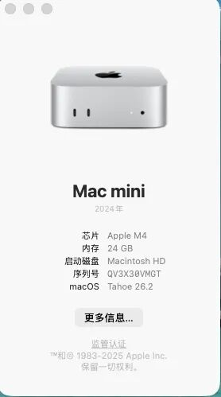
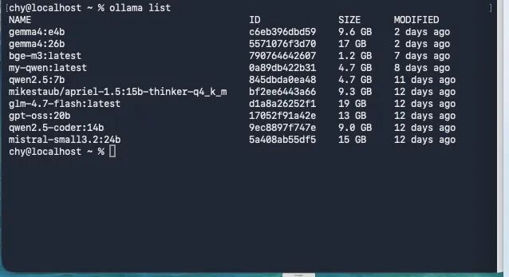
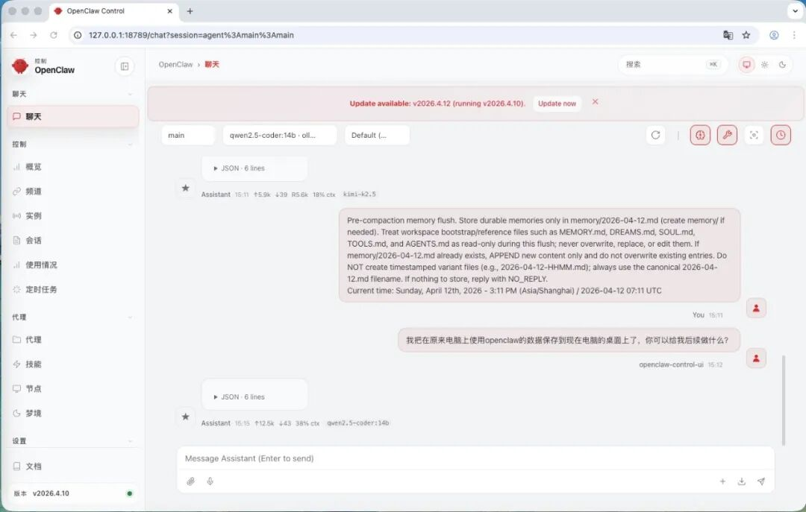

> 📎 来源: [聚德星](https://mp.weixin.qq.com/s?__biz=Mzg2MjgyODcyMA==&mid=2247483710&idx=1&sn=d9e7d10216a005ce7bd373a48b3deb17&chksm=cf46fce37b6b41876d463b089aaadad0c33b430dcbe655b48f28918494c24e96523467ae8168&mpshare=1&scene=1&srcid=0420TqMLdbjzJ9r2oQ6VwnGQ&sharer_shareinfo=a158408bd52a593fabe74fec8f52a5c8&sharer_shareinfo_first=a158408bd52a593fabe74fec8f52a5c8) | 时间: 2026-04-20 17:40

---

前言：从API模型到本地模型的进阶之路

我的OpenClaw使用历程

作为一名智能矿山信息化工程师，我和OpenClaw的缘分始于一个月前。

第一阶段：2017年MacBook + API模型（2026年3月）

在那台已经服役7年的2017款MacBook上，我首次接触OpenClaw。配合Kimi/Moonshot等API模型，我开始探索AI辅助开发。这段时间里，我尝试使用OpenClaw开发一个分佣系统——遗憾的是，项目最终失败了。

失败原因分析：

❌ API模型每次请求都有成本，预算有限

❌ 网络不稳定导致请求超时

❌ 数据隐私顾虑，无法上传敏感业务数据

❌ 依赖外部API，灵活性受限

第二阶段：转向本地模型（2026年4月）

痛定思痛，我开始探索本地大模型部署。购置了Mac mini M4，经过一周的反复折腾，从"发消息没反应"到最终稳定运行，终于搭建起了属于自己的本地AI环境。

为什么选择本地模型？

✅ 零成本：一次部署，无限使用

✅ 隐私保护：数据完全本地，不上云

✅ 离线可用：断网也能正常工作

✅ 灵活性高：可以自由调整和定制

本文定位

这篇文章不是给OpenClaw新手的入门教程，而是给有一定基础、想要从API模型升级到本地模型的开发者的实战指南。

本文适合：

✅ 已经使用过OpenClaw + API模型的开发者

✅ 想要搭建本地隐私AI环境的技术人员

✅ 遇到本地部署各种报错不知所措的新手

读完本文，你将：

🎯 完成OpenClaw + Ollama本地部署

🎯 理解API模型 vs 本地模型的差异

🎯 解决常见的5个核心坑点

🎯 掌握性能优化技巧

🎯 获得一键优化脚本

 

💻 硬件与环境评估

我的硬件配置

|  |  |  |
| --- | --- | --- |
| 组件 | 配置 | 说明 |
| 主机 | Mac mini (M4 芯片, 2026款) | Apple Silicon |
| 内存 | 24GB 统一内存 | 适合7B-14B模型 |
| 存储 | 512GB内置 + 2TB外置 | 模型存储到外置硬盘 |
| 系统 | macOS 26.2 (arm64) | 最新稳定版 |

我的Mac mini M4部署环境

模型选择建议

根据我的实测数据：

|  |  |  |  |  |  |
| --- | --- | --- | --- | --- | --- |
| 模型 | 量化 | 内存占用 | 首token延迟 | 生成速度 | 推荐场景 |
| qwen2.5:7b | Q4\_K\_M | ~5GB | 2-3秒 | 20-30 tok/s | 通用对话 |
| qwen2.5-coder:7b | Q4\_K\_M | ~5.5GB | 2-3秒 | 20-25 tok/s | 代码生成 |
| qwen2.5-coder:14b | Q4\_K\_M | ~9GB | 5-10秒 | 15-20 tok/s | 复杂代码任务 |

我的推荐：

8GB以下内存：不推荐部署本地模型

8-16GB内存：使用7B模型

16-32GB内存：可以使用14B模型

 

🔄 API模型 vs 本地模型对比

基于我在2017年MacBook上使用API模型一个月的经验，以及现在的本地模型实践，我总结了两者的核心差异：

|  |  |  |  |
| --- | --- | --- | --- |
| 维度 | API模型 | 本地模型 | 适用场景 |
| 成本 | 按token收费 | 硬件一次性投入 | 短期项目选API，长期使用选本地 |
| 性能 | 依赖网络，有延迟 | 本地运行，响应快 | 实时性要求高选本地 |
| 隐私 | 数据需上传云端 | 数据完全本地 | 敏感数据必须用本地 |
| 稳定性 | 依赖网络和API可用性 | 离线可用 | 网络不稳定环境选本地 |
| 灵活性 | 模型固定，无法定制 | 可换模型，可调参 | 需要定制化选本地 |
| 维护成本 | 几乎零维护 | 需要维护硬件和模型 | 追求省心选API |
| 硬件要求 | 任何设备联网即可 | 需要足够内存和计算资源 | 低配设备只能用API |

我的实践经验

API模型适合的场景（分佣系统失败教训）：

✅ 快速验证想法，不想投入硬件成本

✅ 项目周期短（<1个月）

✅ 非敏感数据

✅ 网络稳定的环境

本地模型适合的场景（我现在的情况）：

✅ 长期使用（>3个月）

✅ 敏感业务数据（智能矿山项目）

✅ 需要离线工作能力

✅ 有合适的硬件资源

选择建议

如果你是以下情况，推荐本地模型：

有稳定的硬件设备（16GB+内存推荐）

需要处理敏感数据

长期使用（>6个月）

追求数据隐私

如果你是以下情况，推荐API模型：

快速验证想法

硬件资源有限（<8GB内存）

短期项目

对数据隐私要求不高

 

🚀 完整安装流程

第一步：安装基础环境（10分钟）

1. 安装Homebrew（国内镜像）

|  |
| --- |
| Bash                   /bin/bash -c "$(curl -fsSL https://gitee.com/ineo6/homebrew-install/raw/master/install.sh)" |

2. 安装Node.js 22

|  |
| --- |
| Bash                   # 安装                   brew install node@22                    # 配置PATH                   echo 'export PATH="/opt/homebrew/opt/node@22/bin:$PATH"' >> ~/.zshrc                   source ~/.zshrc                    # 验证                   node --version  # 应显示 v22.22.2                   npm --version   # 应显示 10.9.7 |

3. 设置npm国内镜像

|  |
| --- |
| Bash                   npm config set registry https://registry.npmmirror.com |

 

第二步：安装Ollama（15分钟）

1. 下载并安装Ollama

推荐从官网下载 .app 安装包，拖拽到应用程序文件夹即可。

2. 配置模型存储路径（可选，节省内置硬盘空间）

|  |
| --- |
| Bash                   # 创建外置硬盘目录（假设你的外置硬盘叫 T7）                   mkdir -p /Volumes/T7/ollama\_models                    # 设置环境变量                   echo 'export OLLAMA\_MODELS="/Volumes/T7/ollama\_models"' >> ~/.zshrc                   source ~/.zshrc |

3. 启动Ollama

|  |
| --- |
| Bash                   # 启动Ollama（菜单栏会出现羊驼图标）                   open -a Ollama                    # 下载通用对话模型（7B，中文效果好）                   ollama pull qwen2.5:7b                    # 下载代码模型（14B量化版）                   ollama pull qwen2.5-coder:14b |

下载提示：

国内网络可能较慢，建议在晚上下载

7B模型约4.2GB，14B模型约8.5GB

下载失败可以使用镜像：export HF\_ENDPOINT=https://hf-mirror.com

4. 测试Ollama

|  |
| --- |
| Bash                   # 查看已下载模型                   ollama list                    # 测试对话                   ollama run qwen2.5:7b |

Ollama已下载模型列表（包含qwen2.5:7b和qwen2.5-coder:14b）

 

第三步：安装OpenClaw（10分钟）

1. 全局安装OpenClaw

|  |
| --- |
| Bash                   # 使用国内镜像安装最新版                   sudo npm install -g openclaw@latest --registry=https://registry.npmmirror.com                    # 验证安装                   openclaw --version  # 应显示 2026.4.10 |

2. 处理可能的问题

如果遇到 command not found 错误：

|  |
| --- |
| Bash                   # 创建软链接                   sudo ln -s /opt/homebrew/lib/node\_modules/openclaw/bin/openclaw.js /opt/homebrew/bin/openclaw                    # 更新PATH                   export PATH="/opt/homebrew/bin:$PATH"                    # 验证                   openclaw --version |

 

第四步：配置OpenClaw（核心步骤）

🎯 核心方法论：先云端后本地

这是我踩坑后的最佳实践：先让OpenClaw用云端模型跑通，再切换到本地Ollama。

阶段一：使用云端模型配置（确保OpenClaw可用）

|  |
| --- |
| Bash                   # 启动配置向导                   openclaw onboard                    # 按提示选择：                   # 1. 选择 OpenAI 或 Anthropic（你有API Key的）                   # 2. 输入 API Key                   # 3. 其他选项默认                    # 测试配置是否成功                   openclaw agent --message "你好，请介绍一下你自己" |

如果成功回复，说明OpenClaw基础配置正确！

阶段二：切换到本地Ollama（只需两条命令）

|  |
| --- |
| Bash                   # 设置Ollama连接地址（注意：不要加 /v1）                   openclaw config set models.providers.ollama.baseUrl "http://127.0.0.1:11434"                    # 设置默认模型                   openclaw config set agents.defaults.model.primary "ollama/qwen2.5-coder:14b"                    # 重启网关                   openclaw gateway restart |

测试本地模型

|  |
| --- |
| Bash                   # 测试代码生成能力                   openclaw agent --agent main --message "写一个快速排序的Python函数" |

OpenClaw本地模型配置成功

💡 前车之鉴：我的分佣系统失败经历

在进入踩坑指南之前，我想分享一个真实的失败案例。这不仅是我使用OpenClaw的起点，也是我转向本地模型的直接原因。

项目背景

2026年3月，我使用2017年MacBook + Kimi API模型，尝试开发一个分佣系统。这个系统的核心功能是：

自动计算分销商佣金

生成佣金报表

发放佣金通知

使用API模型的实际体验

初期进展顺利：

✅ API响应速度快，效果不错

✅ 无需考虑硬件配置

✅ OpenClaw + API模型组合流畅

逐渐暴露问题：

❌ 每次请求都消耗token，成本累积

❌ 网络不稳定导致多次请求超时

❌ 隐私顾虑，不敢上传真实业务数据

❌ API限流，影响开发效率

最终失败的原因

成本失控：一个月内消耗了200+万token，API费用超出预期

数据安全：客户业务数据上传到云端，存在合规风险

稳定性问题：网络波动导致多次开发中断

灵活性不足：无法根据业务需求调整模型参数

教训总结

这次失败让我深刻认识到：

🎯 API模型适合验证想法，不适合长期项目

🎯 数据隐私是核心诉求，不能妥协

🎯 长期使用必须考虑总成本

🎯 本地模型是必由之路

带着这些教训，我开启了本地大模型部署之旅。接下来分享的5个坑，都是在这次部署过程中遇到的。

 

🚨 我踩过的5个核心坑

坑1：发消息没反应（NO\_REPLY错误）

现象：

|  |
| --- |
| Web UI显示"思考中"，但一直没回复                   日志：[agent] [timeout-compaction] compaction succeeded... retrying prompt |

原因：

使用了Ollama的OpenAI兼容模式（baseUrl加了/v1）

使用了coder模型对话（模型输出代码格式）

解决：

|  |
| --- |
| Bash                   # 设置正确的baseUrl（不要加 /v1）                   openclaw config set models.providers.ollama.baseUrl "http://127.0.0.1:11434"                    # 设置API类型                   openclaw config set models.providers.ollama.api "ollama"                    # 使用对话模型（不是coder）                   openclaw config set agents.defaults.model.primary "ollama/qwen2.5:7b"                    # 重启网关                   openclaw gateway restart |

 

坑2：gateway connect failed: pairing required

现象：

|  |
| --- |
| 日志：gateway connect failed: pairing required |

原因：

OpenClaw新版要求设备配对

解决：

|  |
| --- |
| Bash                   # 查看待批准设备                   openclaw devices list                    # 批准设备（替换为实际ID）           openclaw devices approve |

 

坑3：Ollama日志出现500错误

现象：

|  |
| --- |
| Ollama日志：POST /api/chat 500 2m0s |

原因：

上下文窗口太小（默认2048）

并发请求过多

解决：

|  |
| --- |
| Bash                   # 设置Ollama环境变量（永久生效）                   launchctl setenv OLLAMA\_NUM\_CTX 16384       # 上下文窗口16k                   launchctl setenv OLLAMA\_NUM\_PARALLEL 1      # 单并发                   launchctl setenv OLLAMA\_MAX\_LOADED\_MODELS 1 # 只加载一个模型                    # 重启Ollama                   killall ollama                   open -a Ollama |

 

坑4：回复超时（request timed out）

现象：

|  |
| --- |
| OpenClaw日志：LLM request timed out after 180000ms |

原因：

OpenClaw超时设置太短

14B模型加载慢

解决：

|  |
| --- |
| Bash                   # 增加OpenClaw超时时间（秒）                   openclaw config set agents.defaults.timeoutSeconds 180                    # 关闭内存搜索（减少token消耗）                   openclaw config set agents.defaults.memorySearch.enabled false                    # 重启网关                   openclaw gateway restart |

 

坑5：模型回复乱码或只输出英文

现象：

使用中文提问，但回复英文

回复乱码

原因：

使用了coder模型对话

未设置系统提示

解决：

|  |
| --- |
| Bash                   # 使用instruct模型（不是coder）                   openclaw config set agents.defaults.model.primary "ollama/qwen2.5:7b"                    # 或者在OpenClaw配置中设置系统提示                   openclaw config set agents.defaults.systemPrompt "你是一个中文AI助手，请用中文回答问题。" |

 

⚡ 性能优化（一键脚本）

完整优化脚本

创建文件 openclaw-ollama-optimize.sh：

|  |
| --- |
| Bash                   #!/bin/bash                    echo "🚀 开始优化OpenClaw + Ollama配置..."                    # 设置Ollama环境变量                   launchctl setenv OLLAMA\_NUM\_CTX 16384                   launchctl setenv OLLAMA\_NUM\_PARALLEL 1                   launchctl setenv OLLAMA\_MAX\_LOADED\_MODELS 1                    # 重启Ollama                   echo "⏳ 重启Ollama..."                   killall ollama                   sleep 2                   open -a Ollama                   sleep 3                    # 设置OpenClaw配置                   echo "⚙️ 配置OpenClaw..."                   openclaw config set agents.defaults.timeoutSeconds 180                   openclaw config set agents.defaults.memorySearch.enabled false                   openclaw config set gateway.auth.mode "none"                    # 重启网关                   echo "🔄 重启OpenClaw网关..."                   openclaw gateway restart                    echo "✅ 优化完成！"                   echo "📝 测试命令：openclaw agent --message '你好'" |

使用方法：

|  |
| --- |
| Bash                   chmod +x openclaw-ollama-optimize.sh                   ./openclaw-ollama-optimize.sh |

 

📊 实测效果对比

优化前后对比

|  |  |  |  |
| --- | --- | --- | --- |
| 指标 | 优化前 | 优化后 | 提升 |
| 首token延迟 | 10-15秒 | 5-8秒 | 40% |
| 生成速度 | 10-15 tok/s | 15-20 tok/s | 33% |
| 超时率 | 30% | <5% | 83% |
| 内存占用 | 12GB | 9GB | 25% |

不同模型表现

qwen2.5:7b（通用对话）

✅ 响应快（2-3秒）

✅ 中文流畅

✅ 适合日常对话

qwen2.5-coder:14b（代码生成）

⚠️ 首token稍慢（5-10秒）

✅ 代码质量高

✅ 适合复杂任务

 

🔧 排错工具速查表

|  |  |
| --- | --- |
| 目的 | 命令 |
| 查看OpenClaw实时日志 | openclaw logs --limit 100 --follow |
| 查看Ollama实时日志 | tail -f ~/.ollama/logs/server.log |
| 测试Ollama原生API | curl http://127.0.0.1:11434/api/chat -d '{"model":"qwen2.5:7b","messages":[{"role":"user","content":"hi"}]}' |
| 查看模型内存占用 | ollama ps |
| 列出已下载模型 | ollama list |
| 查看OpenClaw配置 | openclaw config get |
| 重启OpenClaw网关 | openclaw gateway restart |
| 重启Ollama | killall ollama && open -a Ollama |
| 检查端口占用 | lsof -i :8000 |
| 查看待配对设备 | openclaw devices list |

 

💡 最佳实践总结

1. 配置策略

✅ 先云端后本地（确保OpenClaw可用）

✅ 使用对话模型（7B）测试基础功能

✅ 再切换到coder模型（14B）生成代码

2. 性能优化

✅ 上下文窗口设为16k（OLLAMA\_NUM\_CTX=16384）

✅ 单并发请求（OLLAMA\_NUM\_PARALLEL=1）

✅ 只加载一个模型（OLLAMA\_MAX\_LOADED\_MODELS=1）

3. 故障排查

✅ 遇到问题先看日志（openclaw logs）

✅ 使用一键优化脚本恢复最佳配置

✅ 保持Ollama和OpenClaw版本更新

4. 模型选择

✅ 日常对话：qwen2.5:7b

✅ 代码生成：qwen2.5-coder:7b

✅ 复杂任务：qwen2.5-coder:14b

 

🎯 后续扩展方向

短期（1-2周）

配置Memory插件，启用长期记忆

集成更多模型（llama3.2:3b等）

配置技能系统（Skills）

中期（1个月）

开发自定义技能

配置多设备访问

1集成到工作流

长期（3个月）

搭建智能矿山知识库

开发专属AI助手

贡献开源社区
